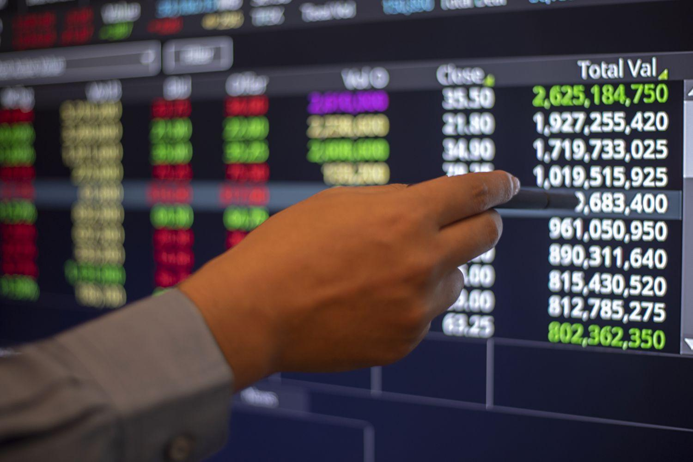

Stock market trading is a complex system where securities such as stocks are bought and sold, providing companies with access to capital and investors with a stake in the economic world. As technology has advanced, the stock market has seen a significant transformation with the growth of algorithmic trading. This form of trading uses computer algorithms to execute transactions at high speeds and volumes, which has become an essential part of modern financial markets. Algorithmic trading now accounts for a substantial portion of trading volumes, leveraging speed and precision to capitalize on market movements.

In this fast-paced trading environment, understanding specific regulations is crucial for traders and investors. One set of regulations pertains to short selling, a strategy where investors sell borrowed securities with the intention of buying them back at a lower price. Short exempt stock market trading regulations are specific rules that allow certain trades to bypass standard short selling restrictions. These exemptions can be critical for maintaining market liquidity and allowing legitimate hedging strategies. However, they also pose unique challenges and opportunities for market participants.

For traders and investors, understanding short exempt regulations is vital as they navigate the complexities of the stock market. These regulations can influence trading strategies, risk management practices, and compliance obligations. A thorough comprehension is essential not only for optimizing trading outcomes but also for avoiding regulatory penalties.

This article aims to provide a comprehensive overview of short exempt stock market trading regulations. Readers can expect to learn about the fundamentals of short selling, the historical context of short exemptions, and the regulatory landscape shaped by key bodies such as the Securities and Exchange Commission (SEC) and the Financial Industry Regulatory Authority (FINRA). In addition, the article will explore the intersection of algorithmic trading with short exempt regulations, highlighting the challenges and opportunities presented by this dynamic.

The relationship between regulation and algorithmic trading is pivotal. As algorithms evolve, regulatory frameworks must adapt to ensure fair and transparent markets. Traders must stay informed about these changes to maintain compliance and leverage algorithmic strategies effectively.

## Table of Contents

## Understanding Short Exemptions in Stock Market Trading

Short selling is a trading strategy where an investor borrows shares and sells them on the open market, intending to buy them back later at a lower price. The primary goal of short selling is to profit from a decline in the price of the stock. This practice plays a critical role in the stock market by providing liquidity, enabling price discovery, and allowing investors to hedge against downside risk.

The 'short exempt' status refers to specific conditions under which a trade is exempted from the standard rules governing short sales. Historically, short exempt status was used to permit certain trades that are not subject to regulatory restrictions applicable to typical short selling activities. One key historical development was the Securities and Exchange Commission's (SEC) introduction of Regulation SHO in 2005, which aimed to curb abusive short selling and improve market fairness. Regulation SHO introduced the "locate" and "close-out" requirements to regulate short sales stringently. Short exempt status, however, allows trades to bypass some of these restrictions under predefined circumstances.

Short exemptions are generally granted when there are justifiable reasons for doing so, such as facilitating market [liquidity](/wiki/liquidity-risk-premium) or stability. For instance, during a market downturn, exemptions might be allowed to enable market makers to execute trades without being constrained by the regulatory restrictions on short selling. Similarly, exemptions might be granted in instances where a trade is necessary to maintain an orderly market or to provide a hedge for a derivative product.

The implications of short exempt status for traders can be significant. One of the key advantages is the ability to execute trades that might otherwise be restricted, thereby maintaining or enhancing market liquidity. This status can also enable market participants to engage in more sophisticated hedging strategies, which might be critical during volatile market conditions. Essentially, the short exempt status can provide traders with more flexibility in implementing their trading strategies, which could potentially lead to more robust risk management and enhanced returns.

Examples of situations where short exempt status might apply include trades by market makers responsible for ensuring liquidity and efficiency in the markets, or transactions related to hedging positions in derivative markets, where corresponding short positions in underlying securities are necessary. Additionally, [arbitrage](/wiki/arbitrage) activities, where traders seek to profit from price discrepancies between different markets or securities, may also qualify for short exempt status, given their role in enhancing price efficiency and market dynamics. 

In summary, understanding the nuances of short selling and short exempt status is essential for market participants, as these concepts play a critical role in shaping trading strategies and market behavior.

## Key Regulations Governing Short Exempt Trading

The U.S. stock market is governed by a comprehensive regulatory framework that includes rules for short exempt trading. Two primary regulatory bodies oversee these activities: the Securities and Exchange Commission (SEC) and the Financial Industry Regulatory Authority (FINRA).

The SEC is a federal agency responsible for enforcing laws against market manipulation. It plays a crucial role in regulating short selling through the implementation of specific rules, such as Regulation SHO. Regulation SHO, adopted in 2005, addresses concerns related to short sales and aims to protect against practices that could contribute to market instability. One key component of Regulation SHO is Rule 201, which sets a restriction on the price at which a security can be sold short once it has experienced a price decline of 10% or more in a single day. However, certain transactions may qualify for a "short exempt" status, exempting them from this restriction.

FINRA, as a self-regulatory organization, administers oversight of brokerage firms and exchange markets. It ensures compliance with both SEC regulations and its own rules, providing additional guidance and enforcement measures for short exempt trading.

Short exempt status represents a critical distinction from standard short selling. This status is granted to certain trades that meet specific regulatory criteria, allowing them to bypass certain constraints imposed on typical short sales. These exemptions include bona-fide market-making activities, certain arbitrage strategies, and executions delivered through options exchanges, among others.

Regulation SHO plays a pivotal role in delineating the circumstances under which short exempt status applies. For instance, it classifies allowable exemptions and ensures transparency by requiring market participants to mark orders that qualify for this status. These distinctions are vital for maintaining fair market conditions while allowing for necessary flexibility in trading activities.

In recent years, modifications to the regulatory framework have been introduced to respond to evolving market dynamics and technological advancements. For example, enhanced reporting requirements have been implemented to provide greater transparency in short selling activities. These changes aim to improve the oversight and enforcement capabilities of the regulatory authorities.

Understanding the regulations that govern short exempt trading is essential for traders and investors. Adherence to these rules not only ensures compliance but also supports market integrity and investor confidence. The nuanced differences between short exempt trading and standard short selling emphasize the importance of staying informed about regulatory developments and adapting strategies accordingly.

## The Impact of Algorithmic Trading on Short Exempt Regulations

Algorithmic trading has become a cornerstone of modern financial markets, leveraging computational power and advanced algorithms to execute trades with speed and precision. This method has significantly transformed trading dynamics, and its integration into short selling strategies has brought about notable changes, particularly concerning short exempt regulations.

### Algorithmic Trading and Short Selling

At its core, [algorithmic trading](/wiki/algorithmic-trading) involves using automated processes to execute trades based on predetermined criteria. These algorithms can monitor market conditions and execute buy and sell orders at speeds unattainable by human traders. In the context of short selling, algorithms are employed to identify opportune moments for shorting stocks, optimizing the timing and execution of trades to maximize potential returns.

### Interaction with Short Exempt Regulations

Short exempt status refers to trades that are exempt from certain restrictions typically applied to short selling, such as the uptick rule, which mandates that a short sale can only be executed at a price higher than the last traded price. Algorithms have the capacity to rapidly assess whether a trade qualifies for a short exempt status by analyzing real-time data such as price movements and market activity.

While algorithmic trading offers the advantage of quickly adapting to market conditions, it also necessitates rigorous compliance with short exempt regulations. The Securities and Exchange Commission (SEC) and the Financial Industry Regulatory Authority (FINRA) impose stringent rules to ensure fair trading practices and maintain market integrity. Algorithms must be programmed to recognize and adhere to these regulatory requirements to avoid penalties.

### Challenges and Opportunities in Algorithmic Short Exempt Trading

A significant challenge in algo trading is ensuring compliance with regulations while maintaining the algorithms' efficiency and speed. Traders must design algorithms that are not only technically competent but also capable of complying with complex regulatory requirements. This involves developing sophisticated software capable of real-time data analysis and adherence to legal standards.

Conversely, the opportunities presented by algorithmic trading in short exempt scenarios are substantial. Algorithms can capitalize on fleeting market anomalies and execute exempt short sales that might otherwise be missed in manual trading, offering traders a competitive edge. Moreover, with the continuous evolution of financial technologies, innovative strategies can be developed to further enhance trading outcomes.

### Case Studies and Examples

A practical example of algorithmic strategies influenced by short exempt status is the use of "market-making" algorithms. Such algorithms continuously provide buy and sell quotes for a security and can obtain short exempt status to maintain liquidity even when prices are declining. These algorithms efficiently manage risks and ensure adequate supply and demand balance, thus strengthening market health.

Additionally, high-frequency trading ([HFT](/wiki/high-frequency-trading-strategies)) firms often employ sophisticated algorithms to utilize short exempt privileges. By executing thousands of transactions within milliseconds, these firms can exploit brief price discrepancies and regulatory loopholes, leading to significant profit margins.

In conclusion, while algorithmic trading introduces complexities in adhering to short exempt regulations, it also unlocks opportunities for enhanced trading strategies and efficiency. As technology continues to evolve, traders must remain informed and adapt their algorithms to navigate the regulatory landscape effectively.

## Compliance Strategies for Traders

Compliance with short exempt regulations is crucial for traders engaging in stock market activities. Adherence to these rules ensures the integrity of trading systems and the protection of all market participants. For traders, particularly those using algorithmic trading strategies, understanding and following these regulations is vital to avoid penalties and maintain competitive advantage.

One of the best practices for ensuring compliance in algorithmic trading involves establishing a robust compliance framework that includes continuous monitoring and regular audits. Traders should integrate compliance checks within their trading algorithms. For example, an algorithm can be programmed to verify whether a trade qualifies for a short exempt status before execution. This pre-trade compliance check can help mitigate the risk of non-compliance.

Several tools and resources are available for traders to monitor compliance with short exempt regulations. These include specialized software that tracks and reports trading activities, which can be integrated into the trading platform. Additionally, regulatory technology (RegTech) solutions offer advanced analytics and reporting features to ensure real-time compliance. Platforms like Bloomberg Terminal and Reuters provide regulatory updates and alerts to help traders stay informed about changes in trading regulations.

Penalties for non-compliance with short exempt regulations can vary, ranging from financial fines to trading suspensions and reputational damage. To avoid these consequences, traders must establish and maintain effective compliance practices. Regular training sessions on regulatory changes and compliance requirements can be beneficial. Also, consulting with legal and compliance experts can provide additional safeguards against inadvertent breaches.

Staying informed about regulatory changes is crucial for ongoing compliance. Traders should subscribe to updates from regulatory bodies such as the Securities and Exchange Commission (SEC) and the Financial Industry Regulatory Authority (FINRA). Engaging in professional forums and networks can also provide insights into the practical implications of regulatory changes, allowing traders to adapt their strategies accordingly.

In summary, to ensure compliance with short exempt stock market trading regulations, traders should integrate compliance mechanisms within their trading algorithms, utilize advanced monitoring tools, keep abreast of regulatory updates, and seek expert advice. By doing so, they can mitigate the risks associated with non-compliance and maintain their position in the competitive market landscape.

## Conclusion

Algorithmic trading and the regulations surrounding short exempt status are pivotal topics in modern stock market dynamics. As our discussion highlights, understanding short exempt regulations is crucial for both traders and investors. These regulations offer certain trades an exemption from standard short selling constraints, thereby impacting trading strategies and market behaviors.

Algorithmic trading has significantly transformed market operations, introducing efficiency and complexity. Algorithms often incorporate short selling strategies, making it vital for traders to comprehend how short exempt rules affect algorithmic implementation. With quickly evolving technologies and regulatory landscapes, traders must remain vigilant and adaptable.

Ongoing education is paramount. Traders should consistently update their knowledge about regulatory changes and leverage available tools for monitoring and compliance. This practice not only minimizes the risk of penalties but also optimizes trading strategies to align with regulatory standards.

As we look to the future, the interplay between algorithmic trading and short exempt regulations is likely to grow. Continuous adaptation and compliance will be essential for traders seeking to maintain a competitive edge. We encourage readers to regularly review their trading strategies, ensuring they meet current regulatory requirements while optimizing for future developments. Embracing this continuous learning and adaptation approach will be vital for success in a dynamically regulated trading environment.

## References & Further Reading

[1]: U.S. Securities and Exchange Commission. ["Regulation SHO."](https://www.sec.gov/investor/pubs/regsho.htm) Final Rule, 2004.

[2]: Financial Industry Regulatory Authority (FINRA). ["Regulatory Notice 07-43: Short Sales."](https://www.finra.org/rules-guidance/notices/07-43) August 2007.

[3]: Gomber, P., Arndt, B., Lutat, M., & Uhle, T. (2011). ["High-Frequency Trading."](https://papers.ssrn.com/sol3/papers.cfm?abstract_id=1858626) In: Algorithmic Trading and DMA, Springer, Berlin, Heidelberg.

[4]: Aldridge, I. (2010). ["High-Frequency Trading: A Practical Guide to Algorithmic Strategies and Trading Systems"](https://www.ahmetbeyefendi.com/wp-content/uploads/2020/07/High-Frequency-Trading-Irene-Aldridge.pdf), 1st edition, Wiley.

[5]: MacKenzie, D. (2015). ["Material Markets: How Economic Agents are Constructed"](https://academic.oup.com/book/52341) Oxford University Press.

[6]: De Prado, M. (2018). ["Advances in Financial Machine Learning."](https://www.amazon.com/Advances-Financial-Machine-Learning-Marcos/dp/1119482089) Wiley.