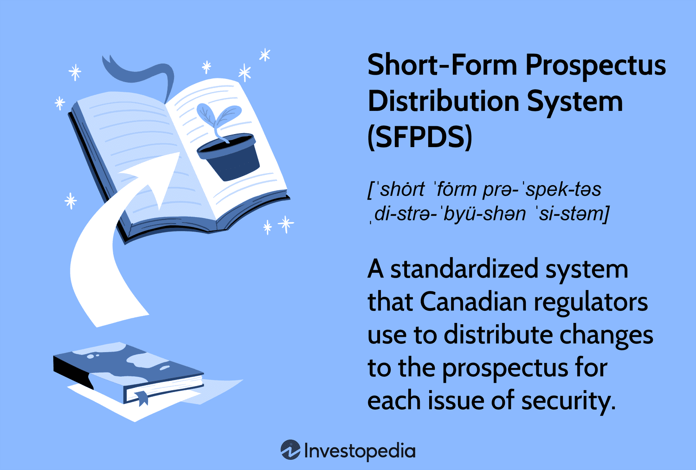

In the world of finance, the distribution of securities is a critical process that often involves complex documentation and regulatory compliance. As capital markets continue to expand globally, the need for efficient and transparent systems becomes paramount. Canada's regulatory environment has recognized this necessity, leading to the development of the Short-Form Prospectus Distribution System (SFPDS). This system serves as a streamlined method used by Canadian regulators to efficiently modify and distribute prospectuses. It addresses the challenges of frequent updates and diverse regulatory requirements, allowing issuers to communicate material changes in offerings without the cumbersome process of issuing new prospectuses for every adjustment.

The significance of the SFPDS lies in its ability to handle material changes swiftly and cost-effectively. By reducing paperwork and facilitating rapid dissemination of information, it enhances market access for companies and increases their agility in responding to market conditions. This efficiency is particularly relevant in the context of algorithmic trading, where the speed and accuracy of information are crucial for executing trades. The SFPDS ensures that updated data reaches traders swiftly, thereby supporting the automated systems that drive modern financial markets.

Furthermore, the system transforms the landscape of securities offerings by bringing clear advantages to issuers. It aligns with Canadian regulatory standards, providing a legal framework that ensures transparency and investor protection. Issuers benefit from expedited market entries and reduced costs, which are essential for maintaining competitiveness in a dynamic market environment.

Understanding the workings of SFPDS can provide valuable insights for investors and companies alike. For investors, it enhances the clarity and relevance of information available, aiding in informed decision-making. For companies, it provides a strategic advantage in navigating the complex landscape of securities regulation. As financial markets evolve, tools like the SFPDS are vital components in shaping the future of investment offerings, ensuring both regulatory compliance and market efficiency.

## Table of Contents

## What is the Short-Form Prospectus Distribution System (SFPDS)?

The Short-Form Prospectus Distribution System (SFPDS) functions as a uniform platform aimed at streamlining the dissemination of prospectus modifications in the Canadian market. This system is crucial because it communicates any material changes in securities offerings effectively, ensuring transparency and compliance with Canadian securities regulations.

Traditional methods of handling prospectus changes often required issuing entirely new prospectuses, which could be both time-consuming and costly for issuers. SFPDS provides a more efficient alternative by allowing existing prospectuses to be amended rather than completely replaced. This results in a significant reduction in paperwork and administrative processes, allowing companies to enter the market more promptly and reduce legal and administrative expenses.

A critical advantage of the SFPDS is its alignment with existing regulatory standards. It provides a robust legal framework that protects both issuers and investors, ensuring that any disclosed changes are accurate, timely, and meet the standards set forth by regulatory bodies. This framework is particularly beneficial for companies that frequently update their offerings, as it allows them to maintain compliance without undergoing the exhaustive process required by traditional prospectus filing methods.

Ultimately, SFPDS plays a pivotal role in enhancing market efficiency by facilitating quicker dissemination of essential information and reducing the complexity of regulatory compliance. This system not only benefits issuers by expediting market access but also supports investors by delivering consistent and relevant updates about potential investments, thereby fostering confidence and stability in the marketplace.

## The Role of a Prospectus

A prospectus is an essential document in the investment world, functioning as a comprehensive guide for potential investors interested in a security offering. It delivers critical information about the investment, including business objectives, financial data, investment strategies, and associated risks. This detailed disclosure serves not only to inform but also to protect investors by providing a transparent view of the offering, thus allowing them to make well-informed decisions. 

Prospectuses are categorized into different types, typically including preliminary and final versions. A preliminary prospectus, often referred to as a "red herring," is the initial document circulated to gauge investor interest and gather feedback without committing to a specific offer price. It is subject to change after review by regulatory bodies and potential investors. Once finalized, a prospectus is filed and includes firm details of the offering, such as pricing and the number of shares available. 

Under the Short-Form Prospectus Distribution System (SFPDS), a notable adaptation in Canadian securities regulation, the process is further streamlined. Within this framework, a prospectus is issued primarily to address new material changes to the offering. This method ensures only essential updates are communicated, significantly reducing the redundancy found in traditional prospectus issuance methods. By limiting the documentation to key changes, the SFPDS framework facilitates a better understanding for investors, who can focus on the most relevant information without being overwhelmed by excessive detail.

The role of the prospectus in maintaining transparency in the securities market cannot be overstated. Through succinct and clear dissemination of information, it upholds the principles of full and fair disclosure. This transparency is crucial for the integrity and functioning of the securities market, as it aids in preventing misinformation and potential financial misconduct. Under systems like the SFPDS, the efficiency and clarity of prospectus updates are enhanced, ultimately benefiting both issuers and investors by fostering a more dynamic and responsive market environment.

## How SFPDS Enhances Algorithmic Trading

The rapid dissemination of updated prospectus information via the Short-Form Prospectus Distribution System (SFPDS) fundamentally supports the fast-paced world of [algorithmic trading](/wiki/algorithmic-trading). In algorithmic trading, where speed and accuracy of data are crucial, SFPDS provides a robust framework that minimizes delays in information updates, ensuring that traders can access the most current data to inform their trading strategies.

Algorithmic trading systems rely heavily on automated processes to analyze market data, identify trading opportunities, and execute trades. The integration of SFPDS enhances these systems by ensuring that any updates or material changes to securities offerings are promptly communicated, allowing algorithmic trading strategies to be adjusted in real-time. For instance, a change in a company's financial outlook reported through a prospectus update can instantly influence trading algorithms, which may adjust their positions based on this new information.

This seamless flow of updated information results in greater market efficiency. As trading algorithms continuously ingest fresh data insights provided by SFPDS, they can more effectively identify and capitalize on market opportunities. This is particularly important in high-frequency trading environments, where decisions are made in fractions of a second and the latest data is paramount.

Moreover, SFPDS supports agile trading practices by aligning the rapid distribution of prospectus updates with the needs of modern trading technologies. This alignment enhances the symbiotic relationship between technology and finance, allowing for more informed and responsive market interactions. By facilitating a smoother and more reliable flow of information, SFPDS plays a crucial role in the evolving interface between financial markets and technology-driven trading solutions.

## The Impact on Canadian Securities Markets

Canada's securities markets present a unique regulatory environment, as they are controlled by provincial and territorial authorities rather than a single federal entity. This decentralized regulatory framework necessitates mechanisms that can standardize and streamline processes across jurisdictions while ensuring efficiency and compliance. The Short-Form Prospectus Distribution System (SFPDS) emerges as a pivotal instrument in this landscape. 

SFPDS offers a coherent system that plays a crucial role in harmonizing the distribution of prospectuses across Canadian jurisdictions. By providing a standardized method for prospectus updates, it not only reduces administrative burdens but also ensures that modifications are communicated uniformly across provinces and territories. This uniformity is invaluable in enhancing the consistency of investor protection—ensuring that investors receive accurate and timely information, crucial for informed decision-making.

The system encourages regulatory cooperation among Canada's regional authorities, leading to a more stable and predictable investment climate. Through this collaborative approach, market participants benefit from clear and consistent regulatory expectations, which in turn supports market stability and integrity. By facilitating the rapid dissemination of relevant information, the SFPDS contributes to the overall efficiency of Canada's capital markets. 

This efficiency is attractive to both domestic and international investors, making Canadian capital markets more competitive on a global scale. The SFPDS positions Canada as an appealing destination for investment by ensuring a reliable regulatory framework that aligns with international standards while maintaining its unique regional regulatory structure.

Ultimately, the SFPDS strikes a delicate balance between regulatory compliance and market efficiency. By streamlining the prospectus amendment process and fostering inter-jurisdictional regulatory collaboration, it enhances both the protection of investors and the operational fluidity of capital markets. These attributes make the SFPDS a vital component in maintaining Canada's competitive edge in the global financial landscape.

## Conclusion

The Short-Form Prospectus Distribution System (SFPDS) represents a significant advancement in the efficiency of capital markets in Canada. By streamlining the process of updating securities prospectuses, it effectively reduces costs and accelerates market access. This cost-effectiveness and speed are vital in an industry where time-sensitive information can lead to strategic advantages. The integration of SFPDS with algorithmic trading technologies underscores its broader impact on contemporary trading environments. By minimizing information latency, SFPDS enhances the ability of trading algorithms to execute decisions based on the most current data, thus ensuring that traders can capitalize on new opportunities swiftly.

For issuers, SFPDS offers a more manageable route through the complex regulatory landscape, making it easier to comply with legal requirements while focusing on core business operations. For investors, it ensures a consistent flow of accurate and up-to-date information, promoting informed decision-making. As the global financial markets continue to transform with technological advancements and increasingly complex investment vehicles, systems like SFPDS are crucial. They not only support the agility and dynamism of trading practices but also provide a robust framework within which securities offerings can evolve. Understanding and leveraging SFPDS is, therefore, essential for both issuers and investors to effectively navigate the Canadian securities market.

## References & Further Reading

[1]: ["National Instrument 41-101 General Prospectus Requirements"](https://www.bcsc.bc.ca/securities-law/law-and-policy/instruments-and-policies/4-distribution-requirements/current/41-101/) by the Ontario Securities Commission

[2]: MacIntosh, J. G. (2012). ["Securities regulation and the intersection of Canadian and U.S. laws."](https://papers.ssrn.com/sol3/papers.cfm?abstract_id=1166262) Canadian Business Law Journal.

[3]: Fahner, C. (2012). ["Prospectus Regulation and Offering of Securities in Canada."](https://www.nortonrosefulbright.com/en/knowledge/resources-and-tools/capital-markets-union/get-funding/prospectus-regulation) Journal of Financial Regulation.

[4]: ["Algorithmic Trading and DMA: An Introduction to Direct Access Trading Strategies"](https://www.amazon.com/Algorithmic-Trading-DMA-introduction-strategies/dp/0956399207) by Barry Johnson

[5]: Lemke, T. P., & Lins, G. T. (2013). ["Regulation of Investment Companies."](https://lawcat.berkeley.edu/record/1153936) Matthew Bender & Company, Inc.