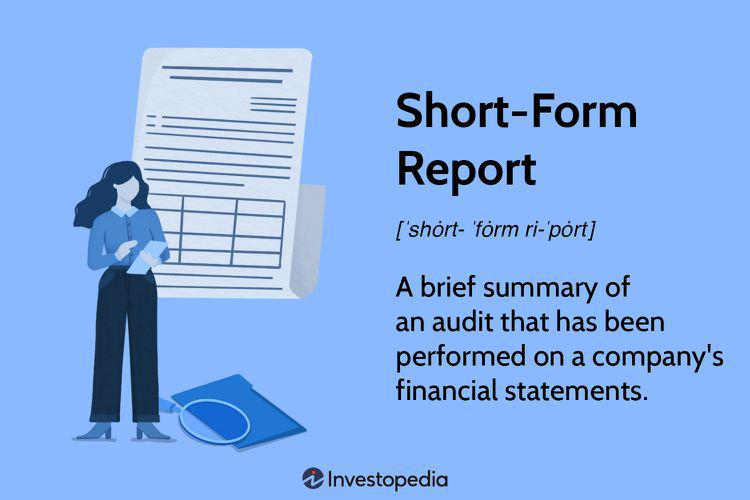

In the rapidly evolving world of finance, the ability to succinctly summarize complex data and provide actionable insights is critical. As financial markets become more intricate, professionals require tools that can distill vast amounts of information into manageable and insightful reports. Document summary techniques play a crucial role in financial reporting, particularly in automated trading environments where swift decision-making is paramount. This involves the transformation of extensive datasets into condensed versions without losing essential details, thereby facilitating a better understanding of financial positions and trends.

Short-form reports are integral within this context, serving as condensed yet comprehensive overviews of financial audits. They provide clear opinions and findings efficiently, making them invaluable for stakeholders who need to make informed decisions quickly. Typically comprising only a few paragraphs, these reports adhere to stringent regulatory standards to ensure accuracy and transparency, maintaining trust in the financial markets.



Moreover, algorithmic trading, often referred to as algo trading, heavily relies on these techniques to interpret large volumes of data in real-time. Algorithms execute trades based on pre-defined criteria and require precise, timely information to function effectively. Document summarization and short-form reporting thus become indispensable tools, enhancing the algorithms' ability to make profitable trading decisions by providing quick access to crucial financial insights.

This article explores key methodologies for document summarization, short-form reporting, and their relevance in the domain of algorithmic trading. As the financial industry continues to innovate, mastering these techniques will be fundamental to leveraging opportunities within the market while mitigating risks associated with high-speed transactions.

## Table of Contents

## Understanding Document Summarization in Finance

Document summarization in finance refers to the process of condensing vast amounts of financial data into succinct and meaningful reports. This is particularly essential in a field where stakeholders must quickly understand complex datasets to make informed decisions. In recent years, technologies like natural language processing (NLP) have revolutionized this task, automating the summarization process and thus enhancing efficiency and accuracy.

NLP technologies enable the analysis and comprehension of human language by machines, making them invaluable in financial summarization. These technologies can process large datasets to identify and extract crucial information, prioritize data points, and generate summaries that offer clear and actionable insights. For example, an NLP algorithm might be tasked with scanning a multitude of financial documents to produce an executive summary that emphasizes critical metrics such as revenue growth, profit margins, or market trends.

Effective summarization not only highlights key insights but also facilitates better decision-making. By focusing on the most pertinent information, financial professionals can assess risks and opportunities with greater precision. This is vital in scenarios such as merger and acquisition evaluations, stock performance analysis, or when conducting comprehensive audits.

Several methodologies support this summarization, including extractive and abstractive approaches. Extractive summarization involves selecting and compiling the most relevant sections directly from the source, while abstractive summarization generates new sentences that capture the essence of the input data. Both methods offer unique advantages and can be chosen based on the specific requirements of the financial context.

In practice, implementing these techniques often involves integrating [machine learning](/wiki/machine-learning) models with existing financial infrastructure. For instance, a Python script might use libraries such as NLTK or spaCy to perform text analysis and extract key phrases or sentiment scores from financial reports:

```python
import spacy

# Load the NLP model
nlp = spacy.load('en_core_web_sm')

# Function to summarize a document
def summarize_text(text):
    doc = nlp(text)
    summarized_info = []
    for sent in doc.sents:
        # Extract key sentences based on criteria, e.g., sentence length
        if len(sent) > 20:
            summarized_info.append(sent.text)
    return ' '.join(summarized_info)

# Example usage
text = "The company's revenue increased by 10% last quarter. However, operating costs rose by 8%. This resulted in a net profit increase of only 2%."
print(summarize_text(text))
```

By utilizing these technologies and strategies, financial entities can significantly enhance the clarity and utility of their reports, ensuring that stakeholders can swiftly and accurately interpret and act upon the presented data.

## The Role of Short-Form Reports

Short-form reports are an essential tool in the audit process, providing an efficient and direct summary of an auditor's opinion on a company’s financial statements. These reports, typically consisting of two concise paragraphs, aim to deliver a clear and succinct overview of the audit’s scope and its findings. This brevity is crucial in the fast-paced world of finance, where stakeholders require quick and accurate insights to make informed decisions.

The effectiveness of short-form reports lies in their adherence to strict standards and guidelines set by regulatory bodies such as the Securities and Exchange Commission (SEC) and the American Institute of Certified Public Accountants (AICPA). These regulations ensure that the reports maintain a high level of accuracy and compliance, safeguarding the integrity and reliability of the information provided. The reports must precisely communicate whether the financial statements comply with generally accepted accounting principles (GAAP) and whether there are any significant discrepancies or issues identified during the audit.

Despite their brevity, short-form reports are invaluable in maintaining transparency and trust within financial markets. By distilling comprehensive audits into clear, concise statements, these reports support investors, regulators, and other stakeholders in gaining a quick yet thorough understanding of a company’s financial health and operations. This clarity is pivotal for building confidence in the reported financial data and, by extension, in the company itself.

Structurally, a short-form audit report comprises a title, an introductory paragraph, and a concluding paragraph. The first paragraph typically identifies the financial statements that were audited and describes the nature of the audit engagement. The concluding paragraph provides the auditor's opinion on the financial statements, affirming whether they are presented fairly in all material respects. This precise communication model ensures that all critical information is conveyed effectively, supporting swift decision-making processes.

The significance of short-form reports extends beyond immediate financial insights. By providing a standardized format for auditors to express their findings, these reports enable a consistent approach to financial reporting across different entities and industries. This consistency helps reduce uncertainties and enhances comparability, contributing to a more stable and predictable financial environment.

In summary, short-form reports are a cornerstone of financial reporting, valued for their ability to convey complex audit results succinctly and accurately. They play a critical role in promoting transparency, ensuring regulatory compliance, and maintaining stakeholder trust, thereby upholding the robustness of financial markets.

## Techniques for Effective Short-Form Reporting

Clarity and brevity are fundamental to effective short-form reporting, particularly in high-impact areas such as finance where decisions are made rapidly and often with significant consequences. The following techniques can enhance the efficiency and quality of short-form reporting by ensuring that reports are not only complete but also easily digestible.

Understanding the audience and the purpose of the report is essential for creating content that is relevant and valuable. This necessitates a clear identification of the stakeholders who will read the report, as well as an understanding of their specific informational needs. For instance, a report intended for financial analysts may focus more on quantitative data, while one meant for senior executives might highlight strategic implications and risks.

Incorporating standardized templates is an effective method for maintaining consistency and reducing the time needed to create reports. These templates serve as a baseline, ensuring that all critical elements such as financial overview, key performance metrics, and audit opinions are consistently presented across different reports. This standardization simplifies the report preparation process and makes it easier for readers to find and compare relevant information.

Leveraging automated tools can further enhance the accuracy and speed of compiling short-form reports. Tools powered by [artificial intelligence](/wiki/ai-artificial-intelligence) and natural language processing can automatically extract pertinent information from large datasets, ensuring that the most important details are encapsulated succinctly. Automation reduces the likelihood of human error, producing reports that are both precise and reliable. For example, Python libraries such as pandas and NumPy can be utilized to analyze and summarize data efficiently, while libraries like spaCy or NLTK can aid in text processing and summarization.

```python
import pandas as pd

# Example of using pandas to summarize financial data
data = pd.read_csv("financial_data.csv")
summary = data.groupby("category").sum()  # Summarizes data by category

summary.to_csv("short_form_summary.csv")  # Export summary to a CSV file
```

These techniques collectively ensure that short-form reports are clear, concise, and useful to their intended audiences, thereby enhancing the decision-making processes in financial environments. By integrating clarity, standardized approaches, and automation tools, financial professionals can produce high-quality reports that effectively support organizational objectives.

## Algorithmic Trading and Reporting Techniques

Algorithmic trading, often referred to as algo trading, utilizes pre-defined rules and sophisticated algorithms to execute trades at high speeds and substantial volumes. This trading methodology capitalizes on the computational capabilities of machines to process vast datasets, identify trading opportunities, and execute trades momentarily—all without human intervention. In such an environment, the importance of concise and accurate data through short-form reports and document summaries cannot be understated.

Short-form reports and document summaries serve as crucial tools in providing the vital insights required by algo traders. These documents distill complex financial data into comprehensible and actionable information. Traders benefit from synthesized data, which can guide decision-making processes and improve trading strategies while reducing the time spent on manual analysis. 

For example, in a typical trading scenario, succinct access to relevant audit opinions can inform traders about a company’s financial health, potentially influencing strategy decisions. The summary documents provide a quick snapshot of financial performance, risk factors, and compliance issues, enabling quicker response times to market changes.

The integration of automated reporting into trading systems not only enhances the efficiency of trading operations but also significantly mitigates the risk of human error. Automation ensures that data is consistently processed following the same criteria and rules, minimizing discrepancies that might arise from manual data handling. Through enhanced automation, small nuances in market data that could be overlooked manually are captured, analyzed, and factored into trading strategies.

Moreover, reporting techniques in [algorithmic trading](/wiki/algorithmic-trading) systems are designed to interact seamlessly with large datasets and complex financial models. This interaction is essential for the continuous provision of real-time insights that traders need. The use of machine learning algorithms within these systems can further refine the capability of analyzing and summarizing data by learning from past patterns and outcomes, thus providing ever more accurate and relevant reporting.

In Python, such automation processes might involve leveraging libraries like `pandas` for data manipulation and `scikit-learn` for applying machine learning models, facilitating the extraction of meaningful insights from data:

```python
import pandas as pd
from sklearn.preprocessing import StandardScaler
from sklearn.decomposition import PCA

# Load financial data
data = pd.read_csv('financial_data.csv')

# Standardize the data
scaler = StandardScaler()
scaled_data = scaler.fit_transform(data)

# Apply PCA for dimensionality reduction
pca = PCA(n_components=2)
pca_result = pca.fit_transform(scaled_data)

print(f'Principal Components: \n{pca_result}')
```

This Python script demonstrates the application of Principal Component Analysis (PCA) to distill financial data into principal components that capture essential variance, which can serve as input for algorithmic trading models. Such methods illustrate how reporting techniques can be integrated effectively within trading algorithms to optimize performance and decision-making.

In summary, algorithmic trading thrives on the speed and precision offered by succinct document summaries and short-form reports. Automation in reporting not only fosters efficient trade execution but also empowers traders with reliable, actionable insights, which ultimately enhances trading outcomes in fast-paced financial markets.

## Challenges and Opportunities

In the landscape of financial reporting, the deployment of automated summaries and short-form reports offers significant advantages. However, these technologies come with their own set of challenges that need careful attention. Ensuring the accuracy and relevance of algorithmically generated summaries and reports is one major hurdle. Automated systems must be meticulously designed to interpret complex financial data accurately, avoiding errors that might lead to misleading conclusions. 

Data security and compliance with regulatory standards are also critical in automated processes. The sensitive nature of financial data necessitates robust security measures to prevent unauthorized access and data breaches. Additionally, compliance with frameworks like the General Data Protection Regulation (GDPR) and standards set by entities such as the Securities and Exchange Commission (SEC) is non-negotiable. Automated systems must be capable of adhering to diverse regulatory requirements, which often vary across regions and industries. 

Despite these challenges, emerging technologies present new opportunities to enhance the precision and utility of financial reporting. Advances in artificial intelligence (AI) and machine learning (ML) hold promise for developing more sophisticated summarization algorithms, capable of identifying the most pertinent information from vast datasets. The ability of AI to learn and adapt can lead to continuous improvements in report quality.

The future of financial reporting lies in the seamless integration of AI and manual oversight. Human intelligence is indispensable in defining and refining the parameters used by AI, ensuring that the automated tools remain relevant and accurate over time. This synergy between AI technologies and human expertise can result in more reliable and insightful financial reports.

In conclusion, while challenges exist, the integration of AI with manual oversight offers a path forward, promising to enhance both the efficacy and reliability of financial reporting techniques. Navigating these challenges effectively will allow stakeholders to leverage automated processes for more informed decision-making.

## Conclusion

As financial markets become increasingly complex, the necessity for concise and clear reporting has become paramount. Document summarization and short-form reports play a crucial role in allowing stakeholders to swiftly comprehend financial positions and audit findings. These tools distill vast amounts of financial data into clear, actionable insights, reducing the time required for decision-making. In algorithmic trading, where the speed and accuracy of information processing can determine the success of trading strategies, the demand for reliable and rapid access to financial insights underscores the importance of efficient reporting techniques. 

Continuous technological advancements promise further enhancements in financial reporting capabilities, empowering more dynamic and responsive data analysis. Technologies such as natural language processing (NLP) and artificial intelligence (AI) are increasingly shaping the future of these innovations, offering more precise and insightful analysis capabilities. Mastering these advanced reporting techniques enables stakeholders to make more informed decisions and potentially improves trading outcomes. As these technologies evolve, they will continue to contribute to more efficient and transparent financial markets, ultimately benefiting all participants.

## References & Further Reading

[1]: Das, S., & Padhy, S. (2012). ["Support Vector Machines for Prediction of Futures Prices in Indian Stock Market."](https://www.semanticscholar.org/paper/Support-Vector-Machines-for-Prediction-of-Futures-Das-Padhy/5dd705f0f2e2bdc64472244f29001f8a2d32fc38) Procedia Technology, 6, 262-273.

[2]: ["Advances in Financial Machine Learning"](https://www.amazon.com/Advances-Financial-Machine-Learning-Marcos/dp/1119482089) by Marcos Lopez de Prado

[3]: ["Introduction to Algorithmic Trading Strategies"](https://onlinelibrary.wiley.com/doi/epdf/10.1002/9781119206033.fmatter) - Coursera course by Dr. Ernest P. Chan

[4]: Ichikawa, R. (2017). ["NLP Techniques for Financial Reporting"](https://www.sciencedirect.com/science/article/pii/S1566253524005335). State Street Global Advisors.

[5]: ["Machine Learning for Algorithmic Trading"](https://github.com/stefan-jansen/machine-learning-for-trading) by Stefan Jansen

[6]: ["Quantitative Trading: How to Build Your Own Algorithmic Trading Business"](https://www.amazon.com/Quantitative-Trading-Build-Algorithmic-Business/dp/1119800064) by Ernest P. Chan