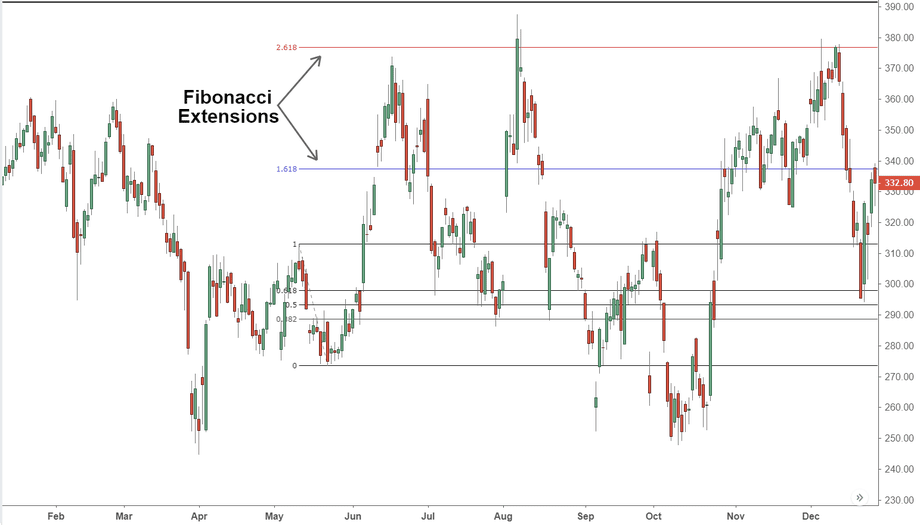

Understanding the intricate world of financial markets is key to developing effective trading strategies. As traders navigate these dynamic environments, they often employ various approaches to capitalize on market movements. Two powerful concepts that stand out in this arena are short interest trading and algorithmic (algo) trading. These strategies have individually offered traders unique advantages, yet their integration presents exciting new opportunities for optimizing trading performance.

Short interest trading refers to the practice of selling borrowed shares with the expectation that the asset's price will decline, allowing them to be repurchased at a lower cost. The difference between the selling price and the repurchase price represents the profit. Short interest data, often expressed as a ratio, provides traders with a valuable gauge of market sentiment. A high short interest ratio suggests bearish sentiment among investors, indicating potential future declines in stock prices, whereas a low ratio may indicate optimism favoring price rises.



Algorithmic trading, on the other hand, involves the use of complex algorithms and cutting-edge technology to automate trading decisions and executions. By leveraging pre-defined sets of rules and extensive data analysis, algorithmic trading systems can process vast amounts of information in milliseconds, allowing traders to execute orders with remarkable efficiency and precision. The ability to backtest strategies on historical data further enhances decision-making processes by validating the effectiveness of trading models.

In this article, we explore the integration of short interest strategies with algorithmic trading, examining their relevance to both individual traders and institutional investors. By engaging with this synergy, traders can harness the combined strengths of both strategies, emerging with a system capable of rapid response to market signals. The potential to automate short interest signals with algorithmic trading processes offers traders the possibility of unprecedented speed and discipline in execution, setting a new standard for strategic optimization in financial markets. This fusion of strategies not only provides insights into emergent market patterns but also represents a frontier pushing the boundaries of modern finance.

## Table of Contents

## Understanding Short Interest in Trading

Short interest in trading refers to the total number of shares of a stock that have been sold short but have not yet been covered or closed out by purchasing back those shares. It is a critical indicator for assessing market sentiment and understanding potential market movements. When traders short a stock, they borrow shares and sell them with the expectation that the stock price will decline, allowing them to buy back the shares at a lower price and profit from the price difference. Therefore, the level of short interest can provide insights into the collective expectations of market participants regarding future stock price movements.

An increase in short interest typically suggests a bearish sentiment, indicating that more traders believe the stock price will decline. Conversely, a decrease in short interest is regarded as a sign of bullish optimism, implying that fewer traders anticipate a price drop. Due to its predictive nature, short interest is often used by traders as a signal for potential market movements or emerging trends. For instance, a rapid increase in short interest might precede a short squeeze, where the stock price rises sharply, forcing short sellers to cover their positions, which can further drive up the price.

Understanding how to calculate and interpret short interest ratios is vital for effective trading. The short interest ratio (SIR), also known as the "days-to-cover" ratio, is a commonly used metric. It is calculated by dividing the total number of shares sold short by the average daily trading [volume](/wiki/volume-trading-strategy) of the stock:

$$
\text{Short Interest Ratio (SIR)} = \frac{\text{Total Shares Short}}{\text{Average Daily Trading Volume}}
$$

A high SIR indicates that it would take a significant number of days for short sellers to cover their positions, assuming the stock's average daily volume remains constant. This ratio can be particularly useful for identifying stocks vulnerable to short squeezes, as a higher ratio means a longer time to cover, potentially amplifying the effect of a price increase.

Traders also consider other factors when analyzing short interest data, such as changes in short interest over time and the context within the broader market environment. By integrating short interest data with other technical and fundamental analyses, traders can enhance their insights into market behavior and better inform their trading decisions.

## The Nature of Algorithmic Trading

Algorithmic trading, often abbreviated as algo trading, involves the use of computer algorithms to automate the process of executing trades based on a predefined set of rules. This advanced form of trading leverages technology to execute orders with a degree of precision and speed that is typically unachievable by human traders. At its core, [algorithmic trading](/wiki/algorithmic-trading) is designed to minimize risks, optimize trading opportunities, and capitalize on market efficiencies.

The principal advantage of algorithmic trading is its capability to process large volumes of data and execute trades in milliseconds. This speed allows traders to respond to market conditions far more rapidly than traditional trading methods permit. Algorithms can analyze vast amounts of historical and current data to identify trading signals, thus facilitating real-time decision-making.

Common algorithmic trading strategies include trend-following, [arbitrage](/wiki/arbitrage), and market-making. Trend-following strategies attempt to capture gains through the analysis of an asset's [momentum](/wiki/momentum) in a particular direction. These strategies typically involve the use of algorithms to identify upward or downward trends, allowing traders to buy or sell accordingly. Arbitrage exploits price discrepancies in the market, such as those seen between different exchanges or asset classes. Market-making involves providing [liquidity](/wiki/liquidity-risk-premium) to the market by simultaneously making buy and sell orders, [earning](/wiki/earning-announcement) a profit through the bid-ask spread.

Beyond the execution of trades, algorithms also play a critical role in eliminating emotional biases inherent in human decision-making. By adhering strictly to computationally determined rules, algorithmic trading systems eliminate the possibility of emotion-driven errors that can occur when judgments are clouded by fear or greed.

Furthermore, algo trading facilitates the rigorous [backtesting](/wiki/backtesting) of strategies against historical data. This process uses past market data to simulate the potential performance of a trading strategy, allowing traders to validate and refine their approaches. Consider the following simple Python code snippet that illustrates the basic concept of backtesting a moving average crossover strategy:

```python
import pandas as pd

# Load historical data
data = pd.read_csv('historical_stock_data.csv')
data['SMA_50'] = data['Close'].rolling(window=50).mean()
data['SMA_200'] = data['Close'].rolling(window=200).mean()

# Identify trading signals
data['Signal'] = 0
data['Signal'][50:] = np.where(data['SMA_50'][50:] > data['SMA_200'][50:], 1, 0)

# Backtest strategy
data['Position'] = data['Signal'].diff()
initial_investment = 10000
data['Portfolio'] = initial_investment * (data['Close'].pct_change() * data['Position'].shift()).cumsum()

# Calculate returns
total_return = data['Portfolio'].iloc[-1]
```

In this example, the strategy buys the asset when the 50-day simple moving average (SMA) crosses above the 200-day SMA, and sells when it crosses below. The strategy's performance is tracked over time, showing how the initial investment evolves.

Algorithmic trading is a transformative force in the financial markets. By leveraging computational power and data analytics, it enables traders to access market opportunities with unparalleled efficiency and precision, thereby redefining the traditional paradigms of trading.

## Combining Short Interest with Algo Trading Strategies

Integrating short interest data with algorithmic trading strategies offers opportunities for optimizing trading strategies by leveraging technology to react swiftly to market changes. Algorithms can be programmed to recognize and respond to variations in short interest data almost instantaneously. This capability enables traders to exploit short squeezes and other anomalies related to short interest efficiently and effectively.

These algorithms are capable of monitoring short interest trends, which reflect the sentiment of market participants regarding bearish or bullish expectations. By incorporating these data, algorithms can autonomously execute trades that capitalize on emerging patterns. For instance, an increase in short interest might indicate a potential future price decrease, while a sudden surge in stock price combined with high short interest could lead to a short squeeze. Algorithms can quickly identify such opportunities and act within milliseconds to optimize trading outcomes.

Backtesting is a key component in refining these strategies, allowing traders to test their algorithms against historical data to evaluate performance and make necessary adjustments. This process helps in identifying the most effective use of short interest data in trading algorithms. Backtesting involves subjecting the algorithm to various market scenarios to assess its robustness and reliability.

Here's an example of a simple Python snippet that could be part of an algorithmic trading strategy, integrating short interest data for backtesting purposes:

```python
import pandas as pd

# Assume 'historical_data' is a DataFrame containing price and short interest data
# Columns: ['date', 'close_price', 'short_interest']

def backtest_strategy(historical_data):
    results = []
    for index, row in historical_data.iterrows():
        # Simple strategy: Buy if short interest increases by more than 5%
        if index > 0:
            prev_short_interest = historical_data.at[index - 1, 'short_interest']
            current_short_interest = row['short_interest']
            if (current_short_interest - prev_short_interest) / prev_short_interest > 0.05:
                results.append((row['date'], 'BUY'))
            else:
                results.append((row['date'], 'HOLD'))
    return results

# Example usage
historical_data = pd.DataFrame({
    'date': ['2023-01-01', '2023-01-02', '2023-01-03'],
    'close_price': [150, 155, 160],
    'short_interest': [1000, 1100, 1050]
})

strategy_results = backtest_strategy(historical_data)
print(strategy_results)
```

In this example, the algorithm checks for increases in short interest and marks opportunities to buy on the assumption that increasing short interest may lead to market reversal conditions like a short squeeze.

The automation of short interest-based strategies can lead to more disciplined execution by eliminating human emotional biases and allowing for faster reaction times. Traders leveraging these integrated strategies can gain a competitive edge in dynamic and swiftly changing financial markets.

## Case Studies and Examples

In recent years, the intertwining of short interest data with algorithmic trading strategies has been exemplified by notable market events involving companies like Tesla and GameStop. These instances provide crucial insights into the dynamics of financial markets and the potential of combining these strategies for enhanced trading outcomes.

### Tesla Case Study

Tesla, Inc. has long been a focal point for traders due to its volatile stock price and high short interest. Historically, Tesla's stock has often exhibited significant price swings, partially driven by its high short interest levels. For algorithmic traders, integrating short interest data allowed them to identify potential short squeeze scenarios, where a rapid increase in stock price could force short sellers to cover their positions, thereby driving prices even higher.

A hypothetical algorithm, for instance, could be designed to trigger buy orders when Tesla's short interest ratio surpasses a certain threshold and the stock's momentum indicators signal upward trends. In Python, using libraries like Pandas and NumPy, such an algorithm might look like this:

```python
import pandas as pd
import numpy as np

# Pseudo code for identifying short squeeze potential
def identify_short_squeeze(stock_data, short_interest_threshold, momentum_threshold):
    for index, row in stock_data.iterrows():
        if row['short_interest_ratio'] > short_interest_threshold and row['momentum'] > momentum_threshold:
            return True
    return False

# Example data
stock_data = pd.DataFrame({
    'short_interest_ratio': [0.25, 0.40, 0.35],
    'momentum': [1.2, 0.9, 1.5]
})

# Identifying potential short squeeze scenarios
short_squeeze_detected = identify_short_squeeze(stock_data, 0.30, 1.0)
print("Short Squeeze Detected:", short_squeeze_detected)
```

Backtesting such a strategy during Tesla's market anomalies showed that it performed well during periods of amplified [volatility](/wiki/volatility-trading-strategies), capitalizing on rapid price increases indicative of short squeezes. However, the strategy underscored the importance of precise entry and [exit](/wiki/exit-strategy) points as market momentum could swiftly reverse.

### GameStop Case Study

The case of GameStop Corp. (GME) in early 2021 offers another compelling example of short interest and algorithmic trading interaction. The quintessential short squeeze saw GameStop's stock price surge by over 1,700% within weeks, largely attributed to a significant social media-driven buying frenzy targeting its extreme short interest positions.

Algorithmic trading systems that monitored social media metrics alongside short interest data could have identified the rally in its earlier stages. A combined analysis of short interest ratios and sentiment analysis scores from platforms like Reddit provided a strategic edge. Here's a simplified approach in Python:

```python
# Pseudo code for integrating social media sentiment with short interest data
def analyze_gme_scenario(stock_data, sentiment_scores, short_interest_threshold):
    for index, row in stock_data.iterrows():
        if row['short_interest_ratio'] > short_interest_threshold and sentiment_scores[index] > 0.7:
            return True
    return False

# Example sentiment scores
sentiment_scores = [0.8, 0.6, 0.9]

# Analyzing GME scenario
gme_opportunity_detected = analyze_gme_scenario(stock_data, sentiment_scores, 0.30)
print("GME Opportunity Detected:", gme_opportunity_detected)
```

This case illustrates the potent synergy between algo trading and short interest analysis, particularly when augmented by auxiliary data points like social sentiment. While the GameStop event highlighted immense profit potentials, it also underscored risks such as heightened volatility and potential regulatory scrutiny.

### Insights from Historical Analysis

Analyzing historical data from these and similar events provides valuable lessons for future strategy development. Key observations include the necessity for robust risk management frameworks and the importance of real-time data integration to adjust strategies dynamically. Furthermore, backtesting these strategies during market anomalies allows traders to refine algorithms for improved resilience and adaptability in unpredictable market environments.

In conclusion, while the integration of short interest strategies with algorithmic trading systems offers substantial opportunities, traders must diligently assess external factors and maintain a vigilant approach to manage inherent risks effectively.

## Challenges and Risks

Integrating short interest with algorithmic trading strategies offers significant opportunities but also poses several challenges and risks that traders must address to ensure effectiveness and sustainability. One of the primary challenges lies in the requirement for high-quality data and robust algorithms, a [factor](/wiki/factor-investing) that can pose significant barriers for retail traders who may not have the resources to access premium data feeds or develop sophisticated algorithms. Accurate and current data are crucial as they form the backbone of any algorithmic strategy, determining the accuracy of trade signals and the overall success of the trading strategy.

Another major concern is the potential outdatedness of short interest data. Short interest reports are typically released with a delay, which can range from several days to weeks. This lag creates a risk of basing trading decisions on stale data, potentially leading to inaccurate assessments of market sentiment and erroneous trading decisions. As a result, traders must consider how to incorporate such time-sensitive data effectively and may need to develop strategies to accommodate or adjust for these inherent delays.

Market volatility presents another significant risk in combining short interest with algorithmic trading. Rapid changes in market conditions can result in unexpected outcomes that algorithms may not be equipped to handle, especially if they are calibrated only for normal market conditions. This emphasizes the need for continuous evaluation and updating of trading strategies to adapt to ever-changing market dynamics. Algorithmic systems must be regularly tested and backtested against historical and real-time data to ensure they remain resilient under various market conditions.

Risk management practices are indispensable to effectively integrate short interest within algorithmic trading. Techniques such as setting stop-loss limits, employing diversification strategies, and using leverage judiciously can help mitigate the potential losses that rapid market changes or unexpected market behavior may trigger. Additionally, traders should implement robust monitoring frameworks to detect anomalies early and take corrective actions swiftly, thereby preserving their capital.

In summary, while the combination of short interest data with algorithmic trading holds great promise for enhancing trading strategies, traders must navigate a landscape filled with data-related challenges, market-induced risks, and the need for dynamic strategy adjustments. By prioritizing data integrity, implementing rigorous risk management, and continuously refining their trading systems, traders can better harness the benefits of this integration.

## Conclusion and Future Outlook

The synergy between short interest and algorithmic trading represents a cutting-edge frontier in finance. This innovative blend enables traders to potentially achieve substantial advantages in rapidly changing markets. As market dynamics continue to evolve, mastering the intricacies of both short interest metrics and algorithmic execution positions traders to better anticipate and react to market conditions.

In the future, the trading landscape is poised to see even greater integration of real-time data processing into algorithmic systems. The ability to process and act on data in real-time is crucial for maximizing the effectiveness of trading strategies that leverage short interest. Such capabilities would allow traders to swiftly identify opportunities and execute trades based on the latest market conditions.

Advancements in [artificial intelligence](/wiki/ai-artificial-intelligence) (AI) and [machine learning](/wiki/machine-learning) are expected to further enhance the sophistication and effectiveness of these trading strategies. By harnessing AI, traders can develop more nuanced algorithms that can learn and adapt to market patterns with minimal human intervention. Machine learning models can analyze vast datasets, recognizing subtle trends and correlations that might elude traditional trading approaches.

For traders and financial institutions, staying informed about these technological advances is essential to remain competitive. As automated trading systems become more prevalent, having expertise in integrating short interest data with sophisticated algorithms could be a decisive factor in achieving market success. By embracing these innovations, traders can enhance their strategy resilience, adaptability, and ultimately their performance in an increasingly automated financial world.

## References & Further Reading

[1]: Bergstra, J., Bardenet, R., Bengio, Y., & Kégl, B. (2011). ["Algorithms for Hyper-Parameter Optimization."](https://papers.nips.cc/paper/4443-algorithms-for-hyper-parameter-optimization) Advances in Neural Information Processing Systems 24.

[2]: ["Advances in Financial Machine Learning"](https://www.amazon.com/Advances-Financial-Machine-Learning-Marcos/dp/1119482089) by Marcos Lopez de Prado

[3]: ["Evidence-Based Technical Analysis: Applying the Scientific Method and Statistical Inference to Trading Signals"](https://www.amazon.com/Evidence-Based-Technical-Analysis-Scientific-Statistical/dp/0470008741) by David Aronson

[4]: ["Machine Learning for Algorithmic Trading"](https://github.com/PacktPublishing/Machine-Learning-for-Algorithmic-Trading-Second-Edition) by Stefan Jansen

[5]: ["Quantitative Trading: How to Build Your Own Algorithmic Trading Business"](https://books.google.com/books/about/Quantitative_Trading.html?id=j70yEAAAQBAJ) by Ernest P. Chan