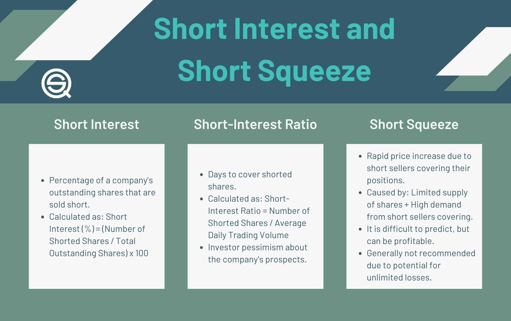

## Table of Contents

## What is short interest?

Short interest is a term used in the stock market to describe the total number of shares of a particular stock that investors have sold short but have not yet covered or closed out. When an investor sells a stock short, they are betting that the price of the stock will go down. They borrow shares from a broker and sell them, hoping to buy them back later at a lower price, return the shares to the broker, and pocket the difference as profit.

Short interest is often used as an indicator of market sentiment towards a stock. A high short interest means that many investors are betting against the stock, which could indicate that they believe the stock's price will fall. On the other hand, a low short interest suggests that fewer investors are betting against the stock, which might mean they are more optimistic about its future performance. This information can be useful for other investors trying to understand market trends and make informed decisions.

## How is short interest calculated?

Short interest is calculated by counting the total number of shares that have been sold short and not yet bought back. This number comes from the reports that brokers and dealers send to stock exchanges. They keep track of how many shares they have lent out for short selling. The stock exchange then adds up all these numbers to find the total short interest for each stock.

This calculation usually happens twice a month. It gives investors an idea of how many people are betting that a stock's price will go down. A high short interest might mean that many people think the stock's price will fall soon. On the other hand, a low short interest might mean that fewer people are betting against the stock, and they might be more hopeful about its future price.

## Why is short interest important for traders?

Short interest is important for traders because it tells them how many people are betting that a stock's price will go down. When a lot of people are shorting a stock, it means they think the price will drop soon. This can be a warning sign for other traders who might want to sell their shares before the price falls. On the other hand, if not many people are shorting a stock, it might mean that most traders are feeling good about the stock's future, and it could be a good time to buy.

Traders also use short interest to find opportunities. If a stock has a very high short interest, it might be at risk of a short squeeze. This happens when the stock's price starts to go up, and the people who shorted the stock have to buy it back to avoid losing more money. This buying can push the price up even more, making the stock's price rise quickly. Traders who see this coming can buy the stock early and make a profit when the price goes up during the short squeeze.

## What does a high short interest indicate?

A high short interest means that a lot of people are betting that a stock's price will go down. When many investors think a stock's price will fall, they borrow shares and sell them, hoping to buy them back later at a lower price. This can be a sign that something might be wrong with the company or that its stock is overvalued. Traders watch high short interest as a warning sign because it might mean the stock's price could drop soon.

On the other hand, a high short interest can also create a chance for a short squeeze. This happens when the stock's price starts to go up instead of down. The people who shorted the stock then have to buy it back quickly to avoid losing more money. This buying can push the price up even more, making it rise fast. Traders who see this coming can buy the stock early and make a profit when the price goes up during the short squeeze.

## How can short interest affect stock prices?

Short interest can affect stock prices in a few ways. When a lot of people are betting that a stock's price will go down by shorting it, it can make other people worried. They might decide to sell their shares too, which can push the stock's price down. This is because more people are selling than buying, and that can lower the price. So, a high short interest can be a warning sign that the stock's price might drop soon.

On the other hand, if the stock's price starts to go up instead, it can cause a short squeeze. This happens when the people who shorted the stock have to buy it back to avoid losing more money. Their buying can make the stock's price go up even more, and it can rise quickly. Traders who see this coming can buy the stock early and make money when the price goes up during the short squeeze. So, short interest can make the stock's price move in big ways, either down or up.

## What is a short squeeze and how is it related to short interest?

A short squeeze happens when a lot of people have bet that a stock's price will go down by shorting it, but then the stock's price starts to go up instead. When this happens, the people who shorted the stock have to buy it back to avoid losing more money. This buying can make the stock's price go up even more, and it can rise really fast. This is called a short squeeze.

Short squeezes are related to short interest because they happen when the short interest is high. High short interest means a lot of people are betting against the stock. If something good happens to the company and the stock's price starts to go up, all those people who shorted it will have to buy it back at the same time. This can cause the stock's price to jump a lot, which is what we call a short squeeze.

## How can traders use short interest data in their strategies?

Traders can use short interest data to figure out what other people think about a stock. If a lot of people are betting that a stock's price will go down, it means the short interest is high. This can be a warning sign for traders. They might decide to sell their shares before the price drops because a lot of people think the stock is not going to do well. On the other hand, if not many people are betting against the stock, it might mean that most traders feel good about it. This can be a sign that it might be a good time to buy the stock.

Another way traders use short interest data is to look for chances to make money from a short squeeze. If a stock has a very high short interest, it might be at risk of a short squeeze. This happens when the stock's price starts to go up, and the people who shorted it have to buy it back to avoid losing more money. This buying can push the price up even more, making it rise quickly. Traders who see this coming can buy the stock early and make a profit when the price goes up during the short squeeze. By watching short interest data, traders can try to find stocks that might be about to have a short squeeze.

## What are the sources of short interest data?

Short interest data comes from the reports that brokers and dealers send to stock exchanges. These reports show how many shares they have lent out for short selling. The stock exchanges then add up all these numbers to find the total short interest for each stock. This data is usually put together twice a month and is made public for everyone to see.

Traders and investors can find short interest data on the websites of stock exchanges like the New York Stock Exchange (NYSE) or the NASDAQ. Financial news websites and some investment research platforms also share this data. By looking at this information, traders can understand how many people are betting that a stock's price will go down and make better decisions about buying or selling stocks.

## How does short interest differ from short volume?

Short interest and short volume are two different things that traders look at when they want to know about short selling. Short interest is the total number of shares that have been sold short but not yet bought back. It's like a snapshot that shows how many people are betting that a stock's price will go down at a certain time. This number is usually reported twice a month by stock exchanges, and it helps traders see if a lot of people are feeling negative about a stock.

Short volume, on the other hand, is the number of shares that were sold short on a specific day. It's more about what's happening right now, not over time like short interest. If you see a high short volume on a particular day, it means a lot of people sold the stock short that day. Traders use short volume to understand daily trends and see if there's a sudden increase in people betting against a stock. Both short interest and short volume are important, but they give different kinds of information about short selling.

## What are the risks associated with trading based on short interest?

Trading based on short interest can be risky. One big risk is that the stock's price might not go down like you expect. If a lot of people are betting against the stock but it starts to go up instead, you could lose money. This can happen because something good happens to the company or because of a short squeeze, where people who shorted the stock have to buy it back quickly, pushing the price up even more.

Another risk is that short interest data is only updated twice a month. This means the information might be a bit old by the time you see it. Things can change fast in the stock market, and what was true two weeks ago might not be true now. So, if you make decisions based on old data, you might not be seeing the whole picture. It's important to be careful and use other information too when you're making trading decisions based on short interest.

## How can short interest be used to identify potential investment opportunities?

Short interest can help traders find good times to buy a stock. If a lot of people are betting that a stock's price will go down, it means the short interest is high. This can be a sign that the stock might be undervalued or that people are too worried about it. If you think the company is doing well and the stock's price is going to go up, buying it when short interest is high could be a good move. You might be able to buy the stock at a lower price and then sell it later for more money.

Another way to use short interest is to look for chances to make money from a short squeeze. When a stock has a very high short interest, it's at risk of a short squeeze. This happens when the stock's price starts to go up, and the people who shorted it have to buy it back to avoid losing more money. This buying can push the price up even more, making it rise quickly. If you can see this coming, you can buy the stock early and make a profit when the price goes up during the short squeeze. By watching short interest data, you can try to find stocks that might be about to have a short squeeze and take advantage of it.

## What advanced metrics can be derived from short interest data for expert analysis?

Short interest data can be used to create advanced metrics like the short interest ratio, also known as days to cover. This metric tells you how many days it would take for all the short sellers to buy back the shares they borrowed if the stock's trading volume stays the same. A high short interest ratio might mean that a lot of people are betting against the stock, which could lead to a short squeeze if the stock's price starts to go up. Traders use this information to see if a stock might be a good buy because of a possible short squeeze.

Another useful metric is the short interest as a percentage of float. This shows how much of the stock's total available shares are being shorted. If this percentage is high, it means a lot of people are betting that the stock's price will go down. This can be a sign that the stock might be overvalued or that something bad might happen to the company. Traders use this metric to see if a stock is at risk of dropping in price or if it might be a good time to buy because of a possible short squeeze.

## What is Short Interest in Trading and How Can It Be Understood?

Short interest in trading refers to the total number of shares of a stock that have been sold short but have not yet been covered or closed out by purchasing back those shares. It is a critical indicator for assessing market sentiment and understanding potential market movements. When traders short a stock, they borrow shares and sell them with the expectation that the stock price will decline, allowing them to buy back the shares at a lower price and profit from the price difference. Therefore, the level of short interest can provide insights into the collective expectations of market participants regarding future stock price movements.

An increase in short interest typically suggests a bearish sentiment, indicating that more traders believe the stock price will decline. Conversely, a decrease in short interest is regarded as a sign of bullish optimism, implying that fewer traders anticipate a price drop. Due to its predictive nature, short interest is often used by traders as a signal for potential market movements or emerging trends. For instance, a rapid increase in short interest might precede a short squeeze, where the stock price rises sharply, forcing short sellers to cover their positions, which can further drive up the price.

Understanding how to calculate and interpret short interest ratios is vital for effective trading. The short interest ratio (SIR), also known as the "days-to-cover" ratio, is a commonly used metric. It is calculated by dividing the total number of shares sold short by the average daily trading [volume](/wiki/volume-trading-strategy) of the stock:

$$
\text{Short Interest Ratio (SIR)} = \frac{\text{Total Shares Short}}{\text{Average Daily Trading Volume}}
$$

A high SIR indicates that it would take a significant number of days for short sellers to cover their positions, assuming the stock's average daily volume remains constant. This ratio can be particularly useful for identifying stocks vulnerable to short squeezes, as a higher ratio means a longer time to cover, potentially amplifying the effect of a price increase.

Traders also consider other factors when analyzing short interest data, such as changes in short interest over time and the context within the broader market environment. By integrating short interest data with other technical and fundamental analyses, traders can enhance their insights into market behavior and better inform their trading decisions.

## References & Further Reading

[1]: Bergstra, J., Bardenet, R., Bengio, Y., & Kégl, B. (2011). ["Algorithms for Hyper-Parameter Optimization."](https://papers.nips.cc/paper/4443-algorithms-for-hyper-parameter-optimization) Advances in Neural Information Processing Systems 24.

[2]: ["Advances in Financial Machine Learning"](https://www.amazon.com/Advances-Financial-Machine-Learning-Marcos/dp/1119482089) by Marcos Lopez de Prado

[3]: ["Evidence-Based Technical Analysis: Applying the Scientific Method and Statistical Inference to Trading Signals"](https://www.amazon.com/Evidence-Based-Technical-Analysis-Scientific-Statistical/dp/0470008741) by David Aronson

[4]: ["Machine Learning for Algorithmic Trading"](https://github.com/PacktPublishing/Machine-Learning-for-Algorithmic-Trading-Second-Edition) by Stefan Jansen

[5]: ["Quantitative Trading: How to Build Your Own Algorithmic Trading Business"](https://books.google.com/books/about/Quantitative_Trading.html?id=j70yEAAAQBAJ) by Ernest P. Chan