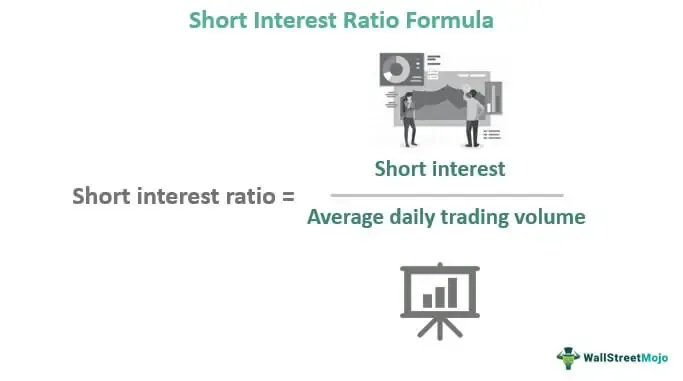

In the rapidly evolving world of finance, understanding investment metrics is essential for making informed decisions. These metrics serve as vital tools for evaluating the financial health and market potential of various stocks, guiding investors through the complexities of market dynamics. This article focuses on key elements such as stock market analysis, short interest ratio, and algorithmic trading, each playing a significant role in shaping modern investment strategies.

Stock market analysis involves the examination of financial data and trends to predict future market behavior. Key indicators, such as earnings reports and economic forecasts, help investors discern patterns and make strategic choices. Understanding these indicators fosters a comprehensive grasp of market movements, enhancing the ability to anticipate and respond to changes.



The short interest ratio, another crucial metric, reveals the level of market pessimism or optimism regarding specific stocks. By calculating the number of shares sold short divided by the average daily trading volume, investors can gauge sentiment and identify potential short squeeze opportunities. This insight aids in aligning investment approaches with prevailing market conditions, optimizing trade timing and improving portfolio management.

Algorithmic trading further refines investment decisions by utilizing computer algorithms to execute trades based on predefined criteria. This method enhances trading efficiency, minimizing human error and emotional biases. As technology continues to advance, algorithmic trading becomes increasingly vital in maintaining a competitive edge in the market.

By examining these facets, investors can gain deeper insights into market dynamics and enhance their investment portfolios. Understanding how stock market analysis, short interest ratio, and algorithmic trading interact enables investors to formulate robust strategies, balancing traditional investment approaches with data-driven technologies. This synthesis of knowledge equips investors to navigate the financial landscape with greater precision and confidence, ensuring informed decision-making and sustained portfolio growth.

## Table of Contents

## Understanding Investment Metrics in Stock Market Analysis

Investment metrics are quantifiable measures used to evaluate the financial health and performance of stocks, thereby offering essential insights for investors. Among these metrics, earnings per share (EPS), price-to-earnings (P/E) ratio, and return on equity (ROE) are pivotal.

**Earnings per Share (EPS):**

EPS is calculated as:

$$
\text{EPS} = \frac{\text{Net Income} - \text{Preferred Dividends}}{\text{Average Outstanding Shares}}
$$

This metric serves as an indicator of a company's profitability on a per-share basis. A higher EPS suggests greater profitability and is often perceived positively by investors, as it reflects a firm's ability to generate profits that can be reinvested or distributed as dividends.

**Price-to-Earnings (P/E) Ratio:**

The P/E ratio is determined by the following formula:

$$
\text{P/E Ratio} = \frac{\text{Market Price per Share}}{\text{Earnings per Share (EPS)}}
$$

This metric assesses a company's valuation by comparing its current share price relative to its earnings. A high P/E ratio might indicate that the stock is overvalued, or investors expect high growth rates in the future. Conversely, a low P/E ratio might suggest undervaluation or potential financial troubles.

**Return on Equity (ROE):**

ROE is calculated as:

$$
\text{ROE} = \frac{\text{Net Income}}{\text{Shareholder's Equity}}
$$

It measures a company's ability to generate profit from its shareholders' investments. A higher ROE denotes more efficient use of equity capital, making it an attractive metric for assessing operational efficiency and management effectiveness.

These metrics collectively provide a comprehensive snapshot of a company's financial standing, facilitating the identification of investment opportunities and potential risks. By analyzing these indicators, investors can better ascertain the attractiveness of a stock and make informed decisions. Furthermore, these metrics empower traders to formulate more resilient strategies in both bullish and bearish markets, adapting to changing financial conditions with greater agility.

## The Role of Short Interest Ratio in Stock Trading

The short interest ratio (SIR) is a critical metric in stock trading, serving as a gauge of market sentiment toward a particular stock. It is calculated by dividing the number of shares sold short by the average daily trading [volume](/wiki/volume-trading-strategy). This can be expressed mathematically as:

$$
\text{SIR} = \frac{\text{Shares Sold Short}}{\text{Average Daily Trading Volume}}
$$

A high SIR indicates that a considerable number of investors are betting against the stock, suggesting market skepticism regarding the company's prospects. This situation often implies that traders expect the stock price to fall, which can lead to increased market caution. A high short interest might precede a short squeeze, where a sudden increase in stock price forces short sellers to cover positions, thus driving the price up further.

Conversely, a low SIR implies less pessimism and suggests that fewer investors are expecting a decline in the stock's value. It reflects a more positive outlook from market participants, potentially leading to stable or rising stock prices.

Understanding the SIR helps traders assess investor sentiment and the potential for short squeeze events. Analyzing SIR data allows investors to align their trading strategies with existing market sentiments, either by taking advantage of the anticipated movements or by hedging against potential risks associated with highly shorted stocks.

Using SIR as part of a broader analysis can provide valuable context for decision-making. However, traders must be cautious. The SIR is typically updated bi-weekly, which means it might not perfectly reflect real-time market dynamics. Integrating SIR insights with other investment metrics and market analysis ensures a more balanced approach, reducing the risk of reliance on a single metric for trading decisions.

## Algorithmic Trading: Revolutionizing Investment Strategies

Algorithmic trading utilizes computer algorithms to facilitate the execution of trades according to specific, predefined criteria. This approach significantly enhances trading efficiency by enabling trades to be conducted at optimal conditions and speeds. By automating the trading process, [algorithmic trading](/wiki/algorithmic-trading) reduces, and in some cases eliminates, human error and emotional bias, making it an attractive option for both institutional and individual traders.

The mechanisms behind algorithmic trading involve sophisticated mathematical models and formulae designed to analyze market data, identify trading opportunities, and determine optimal trade execution times. For instance, these systems may employ moving averages, statistical [arbitrage](/wiki/arbitrage), and mean reversion strategies, which rely on quantitative criteria to signal trades. A common example of a simple algorithm might involve:

```python
import pandas as pd

# Sample trading strategy using moving averages
def moving_average_algorithm(data, short_window=40, long_window=100):
    """
    This function takes stock price data and applies a moving average trading strategy.

    :param data: DataFrame containing stock prices with a DateTime index
    :param short_window: Short-term moving average window
    :param long_window: Long-term moving average window
    :return: DataFrame with signal (buy/sell) based on moving average strategy
    """
    signals = pd.DataFrame(index=data.index)
    signals['price'] = data['price']

    # Create short simple moving average
    signals['short_avg'] = signals['price'].rolling(window=short_window, min_periods=1).mean()

    # Create long simple moving average
    signals['long_avg'] = signals['price'].rolling(window=long_window, min_periods=1).mean()

    # Generate buy/sell signals
    signals['signal'] = 0.0
    signals['signal'][short_window:] = np.where(signals['short_avg'][short_window:] > signals['long_avg'][short_window:], 1.0, 0.0)

    # Calculate the daily positions
    signals['positions'] = signals['signal'].diff()

    return signals
```

The presence of algorithmic trading has led to a paradigm shift in how trading decisions are made and executed. It now accounts for a substantial portion of trading volume in major financial markets globally. This shift underscores the importance of speed, accuracy, and the ability to process vast amounts of market data in real-time, attributes that algorithmic systems excel in when compared to traditional manual methods.

As markets continue to evolve, algorithmic trading is anticipated to increasingly influence how financial markets operate. The advancement in [machine learning](/wiki/machine-learning) and [artificial intelligence](/wiki/ai-artificial-intelligence) further propels this trend, enabling algorithms to learn and adapt to new market conditions autonomously.

By incorporating algorithmic trading, investors can improve their trading strategies and capitalize on technological advancements. However, while algorithmic trading offers numerous benefits, it is also crucial for investors to manage the risks associated with this technology, such as the potential for exacerbating market [volatility](/wiki/volatility-trading-strategies) and the need for monitoring to ensure algorithms function as intended.

## Limitations and Considerations

While investment metrics can offer valuable insights into financial markets, they are not definitive forecasts of future performance. These quantitative measures should be viewed as tools that need to be carefully applied within the broader context of market analysis.

The short interest ratio (SIR) is one such metric that, although informative, comes with its own set of limitations. The SIR measures market sentiment by comparing the number of shares sold short to the average daily trading volume. However, it is updated bi-weekly, meaning that rapid market changes might not be immediately reflected in the SIR. Therefore, while a high SIR might signal potential for short squeezes, it does not necessarily capture real-time market dynamics, making its application in fast-moving markets somewhat constrained.

Algorithmic trading, another key component used in modern investment strategies, offers the benefit of executing trades with high speed and precision. It reduces human errors and emotional biases, but can also introduce risks, particularly if improperly managed. Algorithms can amplify market volatility, as witnessed during flash crashes when rapid, automated selling initiated by trading algorithms exacerbates market declines. Moreover, reliance on historical data and predefined rules implies that algorithms might not be adaptable to unprecedented market conditions.

Due to the inherent limitations of individual metrics and strategies, investors are encouraged to adopt a holistic approach. Combining various investment metrics with a thorough market analysis allows for better-informed decision-making. For example, integrating SIR with profitability measures like earnings per share (EPS) and valuation metrics such as price-to-earnings (P/E) ratio can provide a more comprehensive evaluation of a stock’s potential.

A singular focus on one metric or strategy could lead to suboptimal or misinformed decisions. It is crucial to place these tools within the context of broader economic indicators, market news, and geopolitical events. By doing so, investors are likely to avoid pitfalls associated with over-reliance on singular metrics and can develop more resilient and adaptive investment strategies.

## Conclusion

Investment metrics like the short interest ratio and algorithmic trading are central to stock market analysis, offering investors critical tools to understand and navigate the complexities of financial markets. By mastering these metrics, investors can develop more informed and strategic decisions, aiding in the optimization of their portfolios. The short interest ratio provides insights into market sentiment, indicating potential bearish or bullish trends, while algorithmic trading enhances the precision and efficiency of executing trades.

To leverage these tools effectively, continuous refinement of trading strategies is essential. This includes staying abreast of market dynamics and technological advancements. Market conditions are perpetually changing, necessitating an adaptable approach to investment. Investors who remain informed and responsive to these shifts are more likely to sustain competitive advantages in their trading endeavors.

Additionally, while embracing these advanced metrics and technologies, it is crucial to integrate them with comprehensive market research. Single metrics or isolated strategies can lead to skewed perceptions and misinformed decisions. Therefore, a holistic approach that combines various data points and broader economic indicators will help investors achieve more balanced and accurate analyses.

In sum, the application of metrics like the short interest ratio and algorithmic trading requires not only technical understanding but also a strategic vision that is aligned with an ever-evolving financial landscape. Balancing these sophisticated tools with a nuanced understanding of market fundamentals will ensure more robust and resilient investment strategies.

## References & Further Reading

[1]: ["Stock Market Analysis - An Introduction"](https://medium.com/horizon-hub/stock-market-analysis-understanding-the-basics-b2b9aca82323) by Investopedia

[2]: ["Short Interest Ratio Guide"](https://www.investopedia.com/terms/s/shortinterestratio.asp) by Investopedia

[3]: Ang, A. (2014). ["Asset Management: A Systematic Approach to Factor Investing"](https://archive.org/details/assetmanagements0000anga). Oxford University Press.

[4]: Cartea, Á., Jaimungal, S., & Penalva, J. (2015). ["Algorithmic and High-Frequency Trading"](https://assets.cambridge.org/97811070/91146/frontmatter/9781107091146_frontmatter.pdf). Cambridge University Press.

[5]: Narang, R. K. (2013). ["Inside the Black Box: A Simple Guide to Quantitative and High Frequency Trading"](https://onlinelibrary.wiley.com/doi/book/10.1002/9781118662717). Wiley Trading Series.