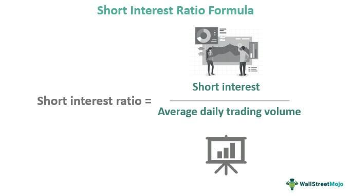

The stock market is a complex arena where various trading strategies and mechanisms interplay, impacting the decisions of individual and institutional investors alike. Among these strategies, short interest stands out as a critical metric, offering insights into market sentiment and potential price movements. Short interest represents the total number of shares sold short but not yet repurchased or covered. It is frequently used as a bearish indicator, suggesting that investors expect a stock's price to decline. However, short interest theory posits that elevated levels of short interest can also signal potential for upward price corrections, especially when short sellers are forced to cover their positions, leading to a short squeeze.

Simultaneously, the advent of algorithmic trading has revolutionized the financial markets. This technological innovation uses computer programs to execute trades automatically based on predefined criteria, prioritizing speed and accuracy while minimizing human errors and emotional biases. Algorithmic trading encompasses various strategies, including trend following, arbitrage, and market making, each leveraging the power of computational efficiency to enhance investment outcomes.



This article aims to explore the intersection of short interest theory and algorithmic trading, assessing how these elements can be combined to unlock new opportunities in stock market investment. By integrating algorithmic processes with the strategic analysis of short interest data, traders can potentially gain an edge, exploiting market inefficiencies and capitalizing on price movements while effectively managing risks. As technology and data analytics continue to evolve, these strategies are expected to grow more sophisticated, offering promising avenues for future research and application in financial markets.

## Table of Contents

## Understanding Short Interest

Short interest is a metric that quantifies the number of shares that have been sold short but remain unsettled. It represents a snapshot of market sentiment, indicating the level of bearish speculation in a stock or the marketplace at large. Traditionally, high short interest is interpreted as a bearish signal, reflecting a prevalent belief among traders that the stock's price will decline. This stems from the mechanics of short selling, where investors sell borrowed shares with the expectation of buying them back at a lower price.

However, short interest theory provides a nuanced perspective. It suggests that significant short interest can paradoxically signal potential price increases. This is due to the phenomenon known as a "short squeeze," where a rise in the stock's price pressures short sellers to cover their positions by buying back shares, thereby driving the price up further.

A critical tool for assessing short interest is the short interest ratio (SIR), also known as the days-to-cover ratio. The SIR is calculated as:

$$
\text{Short Interest Ratio (SIR)} = \frac{\text{Total Short Interest}}{\text{Average Daily Trading Volume}}
$$

This ratio indicates how many days it would take for all short sellers to cover their positions based on the average daily trading [volume](/wiki/volume-trading-strategy). A high SIR usually signals a potential for increased [volatility](/wiki/volatility-trading-strategies), as covering a large volume of short positions can lead to rapid price movements.

Understanding short interest and its implications helps traders gauge potential market movements. While high short interest may initially appear negative, it also holds the possibility for significant upside if circumstances trigger short covering. Thus, monitoring short interest alongside other indicators provides a more comprehensive view of market dynamics and potential opportunities.

## Algorithmic Trading Explained

Algorithmic trading is a sophisticated approach to executing trades using computer algorithms that operate based on predefined criteria. This method has revolutionized the financial markets by leveraging technology to achieve speed and precision in executing trades, thereby considerably reducing the impact of human errors and emotional biases that can influence trading decisions.

A key advantage of [algorithmic trading](/wiki/algorithmic-trading) is its ability to process and analyze vast sets of data swiftly, making rapid decisions that would be impractical for manual traders. Algorithms can react to market conditions in milliseconds, capitalizing on opportunities and mitigating risks with unparalleled efficiency. The reliance on quantitative models also ensures that trades are executed consistently and without the emotional fluctuations that might affect human traders.

Several strategies are prevalent in algorithmic trading:

1. **Trend Following**: This strategy involves algorithms designed to identify and capitalize on market trends. By analyzing historical data and detecting patterns, trend-following algorithms can initiate trades that align with the anticipated direction of asset prices, whether upward or downward. These algorithms might use indicators such as moving averages or momentum oscillators to anticipate future price movements.

2. **Arbitrage**: Arbitrage strategies exploit price discrepancies of the same asset across different markets or in different forms. An arbitrage algorithm rapidly identifies these price differences and executes buy-and-sell orders to profit from the temporary imbalance. For example, if a stock is priced differently on two exchanges, an algorithm can simultaneously buy on the cheaper market and sell on the more expensive one, locking in a risk-free profit.

3. **Market Making**: Algorithms can also serve as market makers, providing liquidity by placing both buy and sell orders on exchanges for specific assets. By continuously updating these orders based on current market conditions, market-making algorithms aim to profit from the spread between the bid and ask prices. This strategy helps maintain market efficiency by narrowing spreads and reducing volatility.

Incorporating mathematical models and statistical analysis is integral to these strategies. Algorithms are often designed using programming languages like Python, which is popular due to its rich library ecosystem for data analysis and [machine learning](/wiki/machine-learning). Here's an example of a simple moving average crossover strategy, a type of trend-following algorithm, implemented in Python:

```python
import pandas as pd

# Load historical stock data
data = pd.read_csv('stock_data.csv')

# Calculate short-term and long-term moving averages
short_window = 40
long_window = 100

data['Short_MA'] = data['Close'].rolling(window=short_window, min_periods=1).mean()
data['Long_MA'] = data['Close'].rolling(window=long_window, min_periods=1).mean()

# Generate trading signals
data['Signal'] = 0
data['Signal'][short_window:] = np.where(data['Short_MA'][short_window:] > data['Long_MA'][short_window:], 1, -1)

# Trading positions based on signals
data['Position'] = data['Signal'].shift()

# Display trading signals
print(data[['Date', 'Close', 'Short_MA', 'Long_MA', 'Signal', 'Position']].tail())
```

In conclusion, algorithmic trading is a mainstay of modern financial markets, offering numerous advantages over traditional methods. It encompasses a range of strategies that can be tailored to specific market conditions and investment goals, with speed and precision as its hallmarks.

## The Intersection of Short Interest and Algo Trading

Combining short interest data with algorithmic trading unlocks opportunities to exploit market inefficiencies. Short interest data, when analyzed systematically, provides insights into market sentiment that can be leveraged through algorithmic trading strategies. Algorithms equipped with advanced data analytics tools can detect short squeezes—an event characterized by an unexpected surge in stock prices due to high short interest. The detection of such anomalies in real time can offer traders significant advantages.

A short squeeze typically occurs when a heavily shorted stock experiences a rapid increase in its price, prompting short sellers to cover their positions by purchasing the stock, thus further driving up the price. Identifying the conditions conducive to a short squeeze involves monitoring the short interest ratio, which is the number of shorted shares divided by the average daily trading volume. A high short interest ratio suggests that a stock is heavily shorted and could be prone to a squeeze. Algorithmic trading systems are designed to monitor this ratio alongside other market indicators to efficiently foresee and react to emerging short squeezes.

Algorithmic trading systems utilize [backtesting](/wiki/backtesting) to refine trading strategies. Backtesting involves testing a trading strategy on historical data to assess its potential effectiveness before implementing it in live trading. This method helps in evaluating the performance and profitability of strategies that combine short interest data with algorithmic trading techniques. Developers employ quantitative analysis to optimize algorithms, ensuring they account for various market conditions and mitigate potential risks.

Consider the following Python example that illustrates the basics of algorithmic trading with short interest data:

```python
import pandas as pd
import numpy as np

# Load historical stock data and short interest data
stock_data = pd.read_csv("historical_stock_price.csv", parse_dates=["Date"], index_col="Date")
short_interest_data = pd.read_csv("short_interest_data.csv", parse_dates=["Date"], index_col="Date")

# Calculate the short interest ratio
short_interest_data['ShortInterestRatio'] = short_interest_data['ShortedShares'] / stock_data['Volume']

def detect_short_squeeze(short_interest_ratio, threshold=0.2):
    return short_interest_ratio > threshold

# Simulate trading strategy
def backtest_strategy(stock_data, short_interest_data, threshold):
    cash = 10000  # Initial cash
    holdings = 0  # Initial holdings
    for date in stock_data.index:
        if detect_short_squeeze(short_interest_data.loc[date, 'ShortInterestRatio'], threshold):
            # If short squeeze condition detected, buy stocks
            cash, holdings = execute_trade(stock_data.loc[date, 'Price'], cash, holdings, buy=True)
        else:
            # Otherwise, clear position
            cash, holdings = execute_trade(stock_data.loc[date, 'Price'], cash, holdings, buy=False)
    return cash + holdings * stock_data.iloc[-1]['Price']

def execute_trade(price, cash, holdings, buy):
    if buy and cash > 0:
        holdings += cash / price
        cash = 0
    elif not buy and holdings > 0:
        cash += holdings * price
        holdings = 0
    return cash, holdings

# Run backtest
final_portfolio_value = backtest_strategy(stock_data, short_interest_data, threshold=0.2)
print(f"Final portfolio value: ${final_portfolio_value:.2f}")
```

This example uses historical data to simulate trades based on short interest ratio thresholds. Backtesting this strategy helps refine the algorithm for live deployment, ensuring it quickly adapts to evolving market conditions. By marrying short interest insights with algorithmic precision, traders can potentially outperform traditional reactive strategies in seizing market opportunities presented by short squeezes and other inefficiencies.

## Case Studies

The 2021 GameStop incident stands as a remarkable example of the influence of short squeezes, fueled in part by social media platforms like Reddit. GameStop, a seemingly struggling retail company, became the center of an intense battle between retail investors and institutional short-sellers. On platforms such as Reddit’s WallStreetBets, individual investors noticed the high short interest in GameStop shares and began buying heavily, driving up the stock price. This led to a short squeeze: short-sellers had to buy back shares at higher prices to cover their positions, exacerbating the demand and further propelling the stock’s price. This event highlighted the potential for social dynamics to influence market mechanics, showcasing how short interest information combined with collective action can lead to significant market upheavals.

Tesla’s stock history provides another insightful case study. For years, Tesla was a highly shorted stock, partly due to skepticism about its valuation and future profitability. Nonetheless, the company’s stock experienced significant upward [momentum](/wiki/momentum), contradicting the bearish sentiment. Traders who closely monitored short interest data could exploit this divergence between market sentiment and stock performance. High short interest in Tesla, followed by substantial price gains, suggests a possible short squeeze effect where negative positions amplified buying activities as shorts covered their positions. Investors who employed algorithmic strategies might have used real-time short interest data to trigger buy signals, capturing gains as others were forced to cover shorts.

Both the GameStop and Tesla scenarios underscore the dual nature of opportunities and risks present in trading strategies that consider short interest. While high short interest can signal potential buying opportunities and ensuing price surges, the associated volatility and unpredictable factors, such as social media influence, introduce significant risks. The unpredictable nature of market reactions, particularly in cases driven by collective behavior from retail traders, necessitates that traders and investors employ comprehensive risk management strategies to protect against rapid market shifts.

## Challenges and Risks

Short interest data is a crucial component for traders leveraging algorithmic strategies. However, it comes with inherent challenges, primarily related to timing delays and accuracy. The reporting of short interest data typically occurs bi-monthly, leading to substantial gaps in information that can impede real-time decision-making. Traders relying on outdated data may misinterpret current market dynamics, leading to suboptimal trading decisions.

The high volatility associated with stocks undergoing significant short interest activity necessitates robust risk management techniques. This volatility can lead to rapid and unpredictable price movements driven by short squeezes or market recalibrations. To mitigate risks, traders should employ advanced risk management methods, such as value-at-risk (VaR) calculations or stress testing their portfolios against extreme scenarios.

Algorithmic traders must remain agile in adapting to continuously changing market conditions. This requires algorithms to be flexible and dynamic, capable of real-time data processing and decision-making. The need for high-speed execution is paramount, as milliseconds can determine the difference between profit and loss in volatile markets. Algorithms must also deal with the continuous influx of data from multiple sources, ensuring data integrity and filtering out noise. Machine learning techniques can aid in refining these strategies, as algorithms learn to distinguish between significant market signals and irrelevant information.

Here is an example of Python code that could be used to perform a basic analysis of short interest data, taking into account timing delays and volatility:

```python
import pandas as pd
import numpy as np

def calculate_volatility(price_data):
    log_returns = np.log(price_data / price_data.shift(1))
    return log_returns.std() * np.sqrt(252)  # Annualizing the daily volatility

def moving_average(prices, window_size):
    return prices.rolling(window=window_size).mean()

def strategy(prices, short_interest):
    # Simple strategy: Buy if the stock price is above its 50-day MA and short interest is high
    ma_50 = moving_average(prices, 50)
    signals = (prices > ma_50) & (short_interest > short_interest.quantile(0.75))
    return signals

# Example usage
prices = pd.Series(...)  # insert price data
short_interest_data = pd.Series(...)  # insert short interest data

volatility = calculate_volatility(prices)
signals = strategy(prices, short_interest_data)

print("Volatility:", volatility)
print("Trading Signals:", signals)
```

In conclusion, while integrating short interest data into algorithmic trading can uncover lucrative opportunities, it also brings challenges that need careful consideration. Traders must account for timing delays, high volatility, and data integrity while designing their strategies to navigate successfully.

## Conclusion

The fusion of short interest theory with algorithmic trading offers innovative ways to navigate the stock market. This synergy allows traders to combine the data-driven insights provided by short interest metrics with the precision and efficiency of algorithmic execution. By utilizing algorithmic strategies to react swiftly to changes in short interest data, traders can potentially capitalize on opportunities such as short squeezes, where rapid price increases occur due to the pressure on short sellers to cover their positions.

Despite the potential benefits, traders must manage risks effectively. The high volatility associated with short interest can lead to significant price swings, necessitating robust risk management techniques. Algorithms must be carefully calibrated to handle such volatility and to respond to market shifts without introducing excessive risk. As part of this, backtesting strategies using historical data can help in assessing the effectiveness and mitigating potential risks of an algorithmic approach.

Ongoing advancements in technology and data analytics are likely to enhance these strategies further. The increasing availability of real-time data and improvements in machine learning algorithms open new avenues for refining and optimizing trading strategies. These advancements could lead to more sophisticated models that not only predict market movements with higher accuracy but also execute trades more efficiently, reinforcing the integration of short interest data with algorithmic trading as a powerful toolset for modern traders.

## References & Further Reading

Desai, H., et al. (2002). An investigation of the informational role of short interest in the Nasdaq market investigates the relationship between short interest and market movements. By analyzing Nasdaq stocks, the study explores how short interest levels can act as predictive indicators for future stock price movements. The research emphasizes the role of short interest as not merely a bearish signal, but as a potential indicator of price volatility and future market behavior. 

Investopedia's article on Understanding the Short Squeeze provides a comprehensive overview of short squeezes, a market phenomenon where heavily shorted stock experiences a rapid price increase. This occurs when short sellers rush to cover their positions, often fueling a self-reinforcing cycle of rising prices. The article outlines the conditions that typically precede a short squeeze and offers insights into identifying potential short squeeze scenarios. It is an essential resource for understanding the mechanics and implications of short squeezes on market equilibrium.

Lopez de Prado, M. (2018). Advances in Financial Machine Learning introduces sophisticated techniques for implementing machine learning algorithms in finance. This resource is invaluable for trading professionals interested in integrating modern data analytics and predictive modeling into their strategies. The book covers advanced topics such as feature importance, backtesting methodology, and the application of machine learning techniques to unstructured financial data, enhancing the ability to develop robust and adaptive trading strategies.

Chan, E. P. (2009). Quantitative Trading: How to Build Your Own Algorithmic Trading Business provides practical guidance on establishing algorithmic trading strategies. Focusing on the nuances of building a trading business from the ground up, it covers essential subjects such as strategy development, backtesting, performance evaluation, and risk management. Readers benefit from Chan's insights into creating systematic trading models and the importance of technological infrastructure in automating trading processes. This publication is well-suited for those looking to develop a structured approach to [quantitative trading](/wiki/quantitative-trading).