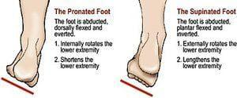

## Table of Contents

## What is a short leg in financial terms?

A short leg in financial terms refers to the part of a trading strategy where an investor sells a security they do not own, with the expectation that its price will fall. This is known as short selling. The investor borrows the security, usually from a broker, and sells it on the market. If the price drops as expected, the investor can buy it back at the lower price, return the borrowed shares, and pocket the difference as profit.

However, short selling comes with risks. If the price of the security rises instead of falling, the investor faces potential losses. Since there is no limit to how high a stock price can go, the losses can be unlimited. Additionally, the investor must eventually return the borrowed shares, which means they need to buy them back at the current market price, no matter how high it has risen. This makes the short leg a high-risk component of trading strategies.

## How does a short leg function within an options strategy?

In an options strategy, a short leg is when you sell an option. This means you give someone else the right to buy or sell a stock at a certain price before a certain date. If you sell a call option, you're betting that the stock price won't go up much. If you sell a put option, you're betting that the stock price won't go down much. You get money upfront for selling the option, which is your potential profit.

But there's risk involved. If the stock price moves a lot against your bet, you could lose money. For example, if you sold a call option and the stock price goes up a lot, the person who bought the option from you can make you sell them the stock at the lower price you agreed on. You'd have to buy the stock at the higher market price and sell it to them at the lower price, losing money. The same thing can happen if you sold a put option and the stock price drops a lot. That's why managing the short leg in an options strategy is important and can be tricky.

## Can you provide a simple example of a short leg in a trade?

Imagine you think the price of a stock called XYZ is going to go down. You decide to sell short 100 shares of XYZ at $50 each. This means you borrow 100 shares from your broker and sell them on the market for $5,000. This is your short leg.

Now, if the price of XYZ drops to $40 per share, you can buy back those 100 shares for $4,000. You return the shares to your broker, and you keep the $1,000 difference as your profit. But if the price goes up to $60 instead, you'd have to buy back the shares for $6,000, losing $1,000. That's the risk of a short leg.

## What are the risks associated with a short leg?

The main risk with a short leg is that the price of the stock could go up instead of down. If that happens, you'll lose money because you have to buy back the stock at a higher price than you sold it for. There's no limit to how high the stock price can go, so your losses can be big. This is different from buying a stock, where the most you can lose is the money you spent on it.

Another risk is that you might get a margin call. This happens if the stock price goes up and your broker wants more money in your account to cover possible losses. If you can't add more money, the broker might close your position, which means buying back the stock at a bad time for you. Also, you're borrowing the stock from someone else, and they could want it back at any time. If that happens, you might have to buy it back when the price is high, which would cost you more money.

## How does a short leg differ from a long leg in options trading?

In options trading, a short leg is when you sell an option. You get money right away, but you're taking on the risk that the stock price might move against you. If you sell a call option and the stock price goes up a lot, the person who bought the option can make you sell them the stock at a lower price than it's worth now. If you sell a put option and the stock price goes down a lot, you might have to buy the stock at a higher price than it's worth now. So, a short leg is risky because you could lose more money than you made from selling the option.

A long leg, on the other hand, is when you buy an option. You pay money upfront for the right to buy or sell a stock at a certain price before a certain date. If you buy a call option and the stock price goes up, you can buy the stock at the lower price you agreed on and sell it at the higher market price, making a profit. If you buy a put option and the stock price goes down, you can sell the stock at the higher price you agreed on, even if it's worth less now. So, a long leg gives you the chance to make money if the stock moves in the direction you expect, but the most you can lose is the money you spent on the option.

## What are the key considerations before implementing a short leg in a portfolio?

Before adding a short leg to your portfolio, it's important to think about how much risk you can handle. Short selling can lead to big losses if the stock price goes up instead of down. You need to be ready to lose more money than you made from the trade. It's also a good idea to have enough money in your account to cover any losses, because if the stock price goes up a lot, your broker might ask for more money or even close your position at a bad time for you.

Another thing to consider is the timing and the reason for short selling. You should have a good reason to believe the stock price will go down, based on research or market news. It's also important to keep an eye on the stock and be ready to act quickly if things don't go as planned. Short selling is not something you should do without a plan, because it can be tricky to manage and can lead to big losses if you're not careful.

## How can a short leg be used to hedge against market movements?

A short leg can be used to hedge against market movements by helping to protect your investments from going down in value. If you own a stock and you're worried it might lose value, you can sell short the same or a similar stock. This way, if the stock price goes down, the money you lose on your owned stock can be made up by the profit you make from the short sale. It's like having insurance against a drop in the stock market.

For example, imagine you own shares in a tech company, and you're worried about a market downturn. You could sell short shares of another tech company that you think will go down if the market falls. If the market does drop, your tech shares might lose value, but the short sale could make you money, balancing out your losses. This strategy can help you manage risk, but it's important to remember that it also comes with its own risks, and it's not a perfect solution.

## What are the tax implications of profits or losses from a short leg?

When you make money from a short leg, you have to pay taxes on that profit. The tax rate depends on how long you held the position. If you held it for less than a year, it's considered a short-term capital gain, and you'll pay your regular income tax rate on it. If you held it for more than a year, it's a long-term capital gain, and you'll pay a lower tax rate, usually between 0% and 20%, depending on your income.

If you lose money on a short leg, you can use that loss to reduce your taxes. You can subtract the loss from any gains you made from other investments during the year. If your losses are more than your gains, you can use up to $3,000 of the extra loss to lower your taxable income. If you still have more losses after that, you can [carry](/wiki/carry-trading) them over to future years to use against future gains or income.

## How do market conditions affect the performance of a short leg?

Market conditions can really change how well a short leg does. If the market is going down, that's good for a short leg because you're betting that the stock price will drop. When it does, you can buy back the stock at a lower price and make money. But if the market is going up, that's bad news for a short leg. The stock price might go up too, and you'll lose money because you have to buy it back at a higher price than you sold it for.

Also, things like news and events can shake up the market and affect a short leg. If there's bad news about a company or the economy, the stock price might drop fast, which is good for your short leg. But if there's good news, the stock price could jump up, and that's bad for your short leg. So, you need to keep an eye on what's happening in the market and be ready to act quickly if things change.

## What advanced strategies involve using multiple short legs?

One advanced strategy that uses multiple short legs is called a short straddle. In this strategy, you sell both a call option and a put option on the same stock with the same expiration date and strike price. You're betting that the stock price will stay pretty close to the strike price. If it does, both options will expire worthless, and you keep the money you got from selling them. But if the stock price moves a lot in either direction, you could lose money on one or both of the options.

Another strategy is called a short strangle. In this one, you sell a call option and a put option on the same stock with the same expiration date, but different strike prices. The call option has a higher strike price, and the put option has a lower one. You're betting that the stock price will stay between these two strike prices. If it does, both options will expire worthless, and you keep the money you got from selling them. But if the stock price moves outside of this range, you could lose money on one or both of the options.

Both of these strategies can make you money if the stock price stays in a certain range, but they're risky because you could lose a lot if the stock price moves a lot in either direction. You need to be careful and have a good understanding of the market and the stock you're trading.

## How can one analyze the effectiveness of a short leg in a trading strategy?

To figure out how well a short leg is working in your trading strategy, you need to look at how it's doing compared to what you hoped it would do. Start by checking if the stock price moved the way you thought it would. If you sold short because you thought the price would go down, and it did, then your short leg was a good move. But you also need to see if the profit you made from the short leg was worth the risk you took. If the stock price didn't move much or went up instead of down, then your short leg didn't work out, and you might have lost money.

Another thing to think about is how the short leg fits into your whole trading plan. If you used the short leg to balance out other parts of your portfolio, like to protect against a drop in the market, then you need to see if it did that job well. For example, if you own stocks that went down in value but your short leg made money, then it helped protect your portfolio. You can also use tools like risk-reward ratios and performance metrics to see if the short leg was worth it. By looking at all these things, you can tell if your short leg was effective and if you should use it again in the future.

## What are the regulatory requirements and compliance issues related to short legs?

When you use a short leg in your trading, you need to follow some rules set by the government and financial groups. One big rule is about how you borrow the stock to sell short. You have to make sure you can borrow the stock before you sell it, and you need to tell your broker about it. Also, some places have rules that say you can't sell short a stock if its price is falling too fast. This is to stop the price from dropping too much too quickly. You also need to report your short sales to the right places, so everyone knows what's going on in the market.

Another thing to think about is the rules that come from your broker. They might have their own rules about short selling, like how much money you need to have in your account or how long you can keep a short position open. If you don't follow these rules, your broker might close your short position without asking you first, which could cost you money. So, it's important to know all the rules and make sure you follow them when you're using a short leg in your trading.

## What are examples of short leg strategies?

In [algorithmic trading](/wiki/algorithmic-trading), understanding and executing options strategies involving short legs is essential for maximizing potential returns. These strategies focus primarily on exploiting the differences in premiums between bought and sold options.

**Bull Call Spread**  
This strategy involves concurrently buying and selling call options on the same underlying asset with different strike prices. A trader purchases a call option at a lower strike price (`K1`) and simultaneously sells a call option at a higher strike price (`K2`). These actions are executed with the same expiration date. The call sold at the higher strike price forms the short leg. The formula for the net premium received is:

$$
P_{\text{net}} = C(K2) - C(K1)
$$

Where $C(K)$ is the premium of the call option at strike price $K$. The aim of the bull call spread is to profit from upward movements in the price of the underlying asset while capping potential losses to the net premium paid. This strategy benefits from limited risk due to the premium received from the short leg.

**Call Condor**  
A call condor involves a more intricate structure that comprises four options. The trader buys calls at two different in-the-money and two different out-of-the-money strike prices. The middle strike prices correspond to the short legs and help generate premiums. The four strike prices are typically equidistant, forming discrete segments of a range. The arrangement might look like this:

1. Buy one call with a strike price $K1$ (in-the-money).
2. Sell two calls at $K2$ and $K3$ (out-of-the-money), forming the short legs.
3. Buy one call with a strike price $K4$ (far out-of-the-money).

The call condor strategy is designed to profit when the price of the underlying asset stays within the range defined by $K2$ and $K3$. Both risk and reward are limited.

Understanding these examples provides a foundation for deploying short leg strategies effectively in algorithmic trading. Through automation, traders can manage complex options portfolios and rapidly execute trades based on real-time market conditions. This strategic approach can lead to enhanced trade management and optimized returns.

## References & Further Reading

[1]: Bergstra, J., Bardenet, R., Bengio, Y., & Kégl, B. (2011). ["Algorithms for Hyper-Parameter Optimization."](https://papers.nips.cc/paper/4443-algorithms-for-hyper-parameter-optimization) Advances in Neural Information Processing Systems 24.

[2]: ["Advances in Financial Machine Learning"](https://www.amazon.com/Advances-Financial-Machine-Learning-Marcos/dp/1119482089) by Marcos Lopez de Prado

[3]: ["Evidence-Based Technical Analysis: Applying the Scientific Method and Statistical Inference to Trading Signals"](https://www.amazon.com/Evidence-Based-Technical-Analysis-Scientific-Statistical/dp/0470008741) by David Aronson

[4]: ["Machine Learning for Algorithmic Trading"](https://github.com/stefan-jansen/machine-learning-for-trading) by Stefan Jansen

[5]: ["Quantitative Trading: How to Build Your Own Algorithmic Trading Business"](https://www.amazon.com/Quantitative-Trading-Build-Algorithmic-Business/dp/1119800064) by Ernest P. Chan