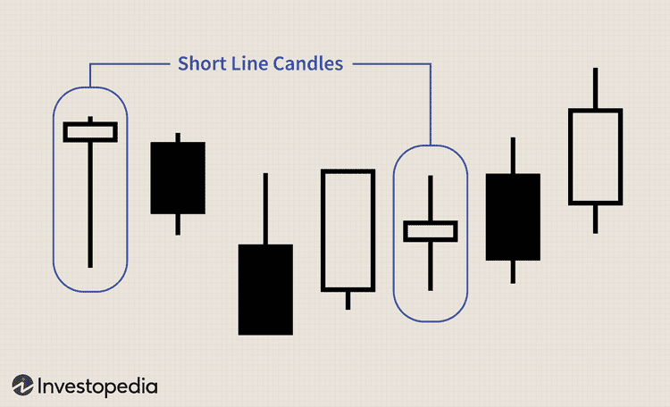

## Table of Contents

## What is a short line candle in technical analysis?

A short line candle in technical analysis is a type of candlestick pattern that appears on a price chart. It is characterized by a small body, which means the difference between the opening and closing prices of the trading period is small. This indicates that there was not much price movement during that time, showing a balance between buyers and sellers.

Short line candles can be important because they often signal a potential change in market direction or a period of consolidation. If a short line candle appears after a long trend, it might suggest that the trend is losing momentum and a reversal could be coming. Traders watch these candles closely to make decisions about entering or exiting trades.

## How does a short line candle differ from other types of candles?

A short line candle is different from other candles because it has a small body. This means the opening and closing prices are close together. Other candles, like long line candles, have bigger bodies because their opening and closing prices are far apart. This shows a lot of price movement during that time. A short line candle shows that there wasn't much change in price, so buyers and sellers were pretty balanced.

Another difference is what short line candles can tell us. When you see a short line candle, it might mean the market is taking a break or getting ready to change direction. For example, if prices have been going up for a while and then you see a short line candle, it might mean the upward trend is getting tired. Other candles, like doji or hammer candles, have special shapes that can tell us different things about the market. A doji has a very small body and long wicks, showing a big fight between buyers and sellers. A hammer has a small body and a long lower wick, often signaling a possible reversal after a downtrend.

## What does a short line candle indicate about market sentiment?

A short line candle shows that the market is not sure what to do next. It means that during the time the candle represents, the price did not move much. This happens when the number of people wanting to buy is about the same as the number of people wanting to sell. So, the market is kind of balanced, and no one side is winning.

When you see a short line candle, it can mean that the market might be getting ready to change direction. If prices have been going up or down for a while and then you see a short line candle, it could be a sign that the trend is getting tired. Traders watch for these candles because they can help decide when to buy or sell.

## Can you explain the formation of a short line candle?

A short line candle forms when the price of something, like a stock, doesn't change much during a certain time. This time could be a day, an hour, or any other period you're looking at on a chart. When the price opens and then closes not far from where it started, you get a small body on the candle. This small body shows that buyers and sellers were pretty even, so the price didn't move a lot.

Seeing a short line candle can tell you that the market might be taking a break or getting ready to switch directions. If prices have been going up or down for a while and then you see a short line candle, it might mean the trend is getting weaker. Traders pay attention to these candles because they can help decide when to buy or sell.

## In what market conditions is a short line candle most commonly observed?

A short line candle is most often seen when the market is not sure what to do next. This happens when the number of people wanting to buy is about the same as the number of people wanting to sell. The price doesn't move much because no one side is winning. This kind of candle can show up in any market, but it's especially common when the market is taking a break.

If you see a short line candle after prices have been going up or down for a while, it might mean the trend is getting tired. For example, if the price has been going up and then you see a short line candle, it could be a sign that the upward trend is losing steam. Traders watch for these candles because they can help decide when to buy or sell.

## How can traders use short line candles to make trading decisions?

Traders use short line candles to help them decide when to buy or sell. If a short line candle shows up after prices have been going up or down for a while, it might mean the trend is getting weak. So, if a trader sees a short line candle after a big upward move, they might think it's a good time to sell because the price might start going down soon. On the other hand, if a short line candle comes after prices have been falling, it could be a sign that the price might start going up again, so the trader might decide to buy.

Short line candles are also useful because they show when the market is not sure what to do next. When the price doesn't move much and you see a short line candle, it means buyers and sellers are pretty even. Traders can use this information to wait for a clearer sign of which way the market will go before making a move. By watching for short line candles, traders can better understand when to take action and when to wait.

## What are the limitations of relying solely on short line candles for analysis?

Relying only on short line candles for analysis can be risky because they don't tell the whole story. A short line candle shows that the price didn't move much during a certain time, but it doesn't say why. There could be many reasons for this, like news events or changes in the market that the candle doesn't show. So, if a trader only looks at short line candles, they might miss important information that could affect their decisions.

Also, short line candles are just one piece of the puzzle. They can give clues about what might happen next, but they're not always right. Other things like bigger trends, other types of candlestick patterns, and tools like moving averages or support and resistance levels can give a fuller picture. Using short line candles alone might lead to wrong guesses about where the market is going, so it's better to use them with other tools to make smarter trading choices.

## How do short line candles interact with other technical indicators?

Short line candles work well with other technical indicators to help traders understand the market better. For example, if a short line candle shows up near a moving average line, it can tell traders that the price might be getting ready to bounce off that line. Moving averages show the average price over a certain time, so if the price is close to it and you see a short line candle, it means the market might be taking a break before moving in the direction of the moving average.

Also, short line candles can be useful when looking at support and resistance levels. These levels are prices where the market often stops moving up or down. If a short line candle appears right at a support or resistance level, it can mean the market is thinking about what to do next. Traders might see this as a sign to wait for more clues before deciding to buy or sell. By using short line candles with other indicators, traders can get a clearer picture of what might happen next in the market.

## Can short line candles be used effectively in different time frames?

Short line candles can be used effectively in different time frames, like minutes, hours, or days. No matter what time frame you're looking at, a short line candle means the same thing: the price didn't move much during that time. So, whether you're trading in a short time frame like a few minutes or a longer one like a whole day, seeing a short line candle can tell you the market is taking a break or getting ready to change direction.

In shorter time frames, like a 5-minute chart, short line candles can help traders see quick changes in the market. If you see a short line candle after prices have been moving up or down fast, it might mean the trend is getting tired and could reverse soon. In longer time frames, like daily charts, short line candles can show bigger trends slowing down. Traders can use this information to decide when to buy or sell, but it's important to look at other indicators too to get a full picture of what's happening in the market.

## What are some common patterns involving short line candles?

Short line candles can be part of different patterns that traders watch for. One common pattern is called a "doji." A doji is a short line candle where the opening and closing prices are very close, making the body very small or even non-existent. When a doji shows up after a big move up or down, it can mean the market is unsure and might be ready to change direction. Traders look for doji candles to help them decide when to buy or sell.

Another pattern is the "spinning top," which is also a type of short line candle. A spinning top has a small body with long upper and lower wicks, showing that the price moved a lot during the time but ended up close to where it started. Seeing a spinning top after a trend can signal that the trend is losing strength and might reverse. Traders use spinning tops to understand the market's mood and make better trading choices.

Short line candles can also appear in "harami" patterns. A harami pattern happens when a small candle (which could be a short line candle) is inside the body of the previous, larger candle. If this small candle is a short line candle, it can mean the market is taking a break and might be getting ready to switch directions. Traders watch for harami patterns to spot potential changes in the market and adjust their trading strategies accordingly.

## How can the color of a short line candle affect its interpretation?

The color of a short line candle can tell you something about what's happening in the market. If the short line candle is green or white, it means the price closed higher than it opened, even if just a little bit. This can show that buyers were slightly stronger than sellers during that time. On the other hand, if the short line candle is red or black, it means the price closed lower than it opened. This tells you that sellers were a bit stronger than buyers.

When you see a green or white short line candle after prices have been going down, it might mean the market is starting to turn around. It's a small sign that buyers are coming back and could push the price up. If you see a red or black short line candle after prices have been going up, it could be a hint that the upward trend is getting weaker and sellers are starting to take over. So, the color helps traders understand if the market might keep going the same way or if it's about to change direction.

## What advanced strategies involve the use of short line candles in algorithmic trading?

In algorithmic trading, short line candles can be used in smart ways to help computers make better trading choices. One way is to use short line candles to spot when the market is getting ready to change direction. The computer can look for patterns like doji or spinning tops, which are types of short line candles, and use them to decide when to buy or sell. For example, if the computer sees a short line candle after prices have been going up or down for a while, it might think the trend is getting weak and it's time to make a trade. The computer can also use other tools like moving averages or support and resistance levels to make sure the short line candle is a good sign before acting.

Another strategy is to use short line candles to help manage risk. If the computer sees a short line candle, it might decide to wait and see what happens next instead of making a big move right away. This can help the computer avoid making trades when the market is unsure. By waiting for more signs, like other types of candles or changes in other indicators, the computer can make safer choices. This way, short line candles help the computer be patient and only make trades when it's more sure about what the market will do next.

## References & Further Reading

[1]: Steenbarger, B. (2002). ["The Psychology of Trading: Tools and Techniques for Minding the Markets."](https://www.amazon.com/Psychology-Trading-Techniques-Minding-Markets/dp/0471267619) Wiley.

[2]: Nison, S. (1991). ["Japanese Candlestick Charting Techniques: A Contemporary Guide to the Ancient Investment Techniques of the Far East."](https://archive.org/details/japanesecandlest0000niso) Prentice Hall Press.

[3]: Murphy, J. J. (1999). ["Technical Analysis of the Financial Markets: A Comprehensive Guide to Trading Methods and Applications."](https://archive.org/details/technicalanalysi0000murp) New York Institute of Finance.

[4]: Chan, E. (2009). ["Quantitative Trading: How to Build Your Own Algorithmic Trading Business."](https://github.com/ftvision/quant_trading_echan_book) John Wiley & Sons.

[5]: Lopez de Prado, M. (2018). ["Advances in Financial Machine Learning."](https://www.amazon.com/Advances-Financial-Machine-Learning-Marcos/dp/1119482089) John Wiley & Sons.

[6]: Eng, W. (1988). ["The Technical Analysis of Stocks, Options, & Futures: Advanced Trading Systems and Techniques."](https://www.amazon.com/Technical-Analysis-Stocks-Options-Futures/dp/1557380031) McGraw-Hill.

[7]: Jansen, S. (2018). ["Machine Learning for Algorithmic Trading."](https://github.com/stefan-jansen/machine-learning-for-trading) Packt Publishing.