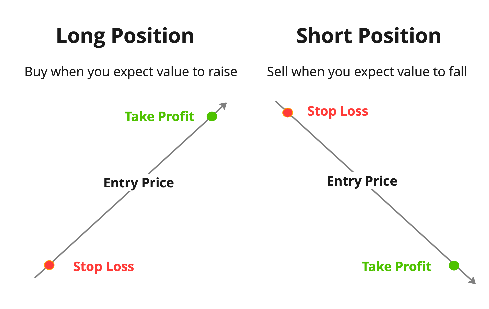

## Table of Contents

## What is a position in financial markets?

A position in financial markets refers to the amount of a security, commodity, or currency that an investor holds. It can be either long or short. A long position means the investor owns the asset and expects its value to go up. A short position means the investor has borrowed and sold the asset, expecting its value to go down so they can buy it back cheaper later.

Positions are important because they show what an investor thinks will happen in the market. If many investors take long positions, it means they believe the market will rise. If many take short positions, it suggests they think the market will fall. By looking at positions, we can get an idea of overall market sentiment.

## What is a short position?

A short position is when someone borrows a stock or other asset and then sells it, hoping the price will go down. They plan to buy it back later at a lower price. This way, they can return the borrowed asset and keep the difference as profit. It's like betting that the value of something will drop.

Taking a short position can be risky. If the price of the asset goes up instead of down, the person who shorted it will lose money. They'll have to buy it back at a higher price than they sold it for. This is why short selling is considered more advanced and is usually done by experienced investors who understand the risks involved.

## What is a long position?

A long position is when you buy a stock or any other asset because you think its price will go up. You own the asset and keep it, hoping to sell it later for more money than you paid. It's like betting that the value of something will increase over time.

Taking a long position is a common way to invest. Many people buy stocks, bonds, or real estate with the expectation that these assets will grow in value. It's generally seen as less risky than short selling because the most you can lose is what you paid for the asset, whereas short selling can lead to unlimited losses if the price keeps going up.

## How does one initiate a short position?

To start a short position, you first need to find a broker who lets you do short selling. Not all brokers allow this. Once you have a broker, you tell them you want to short sell a certain stock. The broker will then borrow that stock from someone else who owns it, like another investor or a big institution. After borrowing the stock, the broker will sell it in the market at the current price. You get the money from this sale, but you also now owe the stock back to the person it was borrowed from.

After you've sold the borrowed stock, you wait for its price to go down. If it does, you can buy the stock back at the lower price. This is called covering your short position. You return the stock to the broker, who gives it back to the person it was borrowed from. The difference between the price you sold it at and the price you bought it back at is your profit. But if the stock price goes up instead, you lose money because you have to buy it back at a higher price to return it.

## How does one initiate a long position?

To start a long position, you simply need to buy a stock or any other asset that you think will go up in value. You can do this through a broker or an online trading platform. You pick the stock you want, decide how many shares to buy, and then place your order. Once you own the stock, you hold onto it, waiting for its price to increase.

If the stock's price does go up, you can sell it for a profit. The difference between what you paid for the stock and what you sell it for is your gain. If the stock's price goes down, you can either hold onto it, hoping it will recover, or sell it at a loss. Starting a long position is easier and less risky than short selling because the most you can lose is the money you spent to buy the stock.

## What are the risks associated with short selling?

Short selling can be risky. The biggest risk is that the stock price might go up instead of down. If this happens, you lose money because you have to buy the stock back at a higher price to return it. There's no limit to how high the price can go, so your losses can be very big. This is different from buying a stock, where the most you can lose is what you paid for it.

Another risk is that the stock might be hard to borrow. If many people want to short sell the same stock, there might not be enough shares available to borrow. This can make it hard to start a short position or force you to pay more to borrow the stock. Also, the person you borrowed the stock from can ask for it back at any time. If you have to return the stock when the price is high, you could lose a lot of money.

Short selling also comes with other risks like fees and interest. You have to pay fees to borrow the stock, and these fees can add up over time. If you hold the short position for a long time, the interest on the borrowed stock can eat into your profits or make your losses even bigger. It's important to understand all these risks before you decide to short sell.

## What are the potential benefits of holding a long position?

Holding a long position can be a good way to make money. When you buy a stock and its price goes up, you can sell it for more than you paid. This difference is your profit. If you believe in a company and think it will do well in the future, holding a long position lets you benefit from its growth. Many people use long positions to save for things like retirement or buying a house because they can grow their money over time.

Another benefit of holding a long position is that it's less risky than short selling. The most you can lose is the money you spent to buy the stock. If the stock price goes down, you can still hold onto it and wait for it to go back up. This gives you more control over your investment. Plus, you can get dividends if the company pays them, which is like getting extra money just for owning the stock.

## How do short and long positions affect market dynamics?

When people take short and long positions, it changes how the market works. A lot of long positions mean many people think the price of a stock will go up. This can make the price go up because more people want to buy the stock. It's like a vote of confidence in the stock or the market. On the other hand, a lot of short positions mean many people think the price will go down. This can push the price down because more people are selling the stock. It's like a vote of no confidence.

Short and long positions can also affect how much people trade. If many people are short selling, it can make the market more active because they need to buy back the stocks they borrowed. This buying and selling can make the market move more. Long positions usually mean people are holding onto stocks for a longer time, which can make the market less active but more stable. Both types of positions show what investors think about the future, and these thoughts can make the market go up or down.

## What are the margin requirements for short selling?

When you want to short sell a stock, you need to put up some money first. This money is called the margin requirement. It's like a deposit to make sure you can pay back what you owe if the stock price goes up. The margin requirement is usually a percentage of the total value of the stocks you want to short sell. For example, if you want to short sell $10,000 worth of stock and the margin requirement is 50%, you need to put up $5,000.

The margin requirement can change depending on the stock and the rules of your broker. Some stocks might have higher margin requirements because they are more risky. If the stock price goes up a lot, you might need to put up more money to keep your short position open. This is called a margin call. If you can't meet the margin call, your broker might close your short position, and you could lose money.

## How can leverage impact short and long positions?

Leverage can make both short and long positions more exciting but also more risky. When you use leverage, you borrow money to buy more stocks than you could with just your own money. If you're taking a long position, this means you can buy more stocks and make more money if the price goes up. But if the price goes down, you lose more money because you borrowed to buy more stocks. It's like using a bigger net to catch more fish, but if you don't catch any, you owe money for the bigger net.

For short selling, leverage works the same way but in reverse. You borrow money to short sell more stocks than you could without it. If the stock price goes down, you make more money because you can buy back the stocks at a lower price and keep the difference. But if the stock price goes up, you lose more money because you have to buy back more stocks at a higher price. Leverage can make your wins bigger, but it can also make your losses bigger, so it's important to be careful.

## What are some advanced strategies involving short and long positions?

One advanced strategy is called a pairs trade. This is when you take a long position in one stock and a short position in another stock from the same industry. The idea is to make money from the difference in how these two stocks do. If you think one stock will do better than the other, you buy the one you think will go up and short sell the one you think will go down. This can help you make money even if the whole market is going down because you're betting on the difference between the two stocks, not on the market going up.

Another strategy is called a short squeeze. This happens when a lot of people are short selling a stock and then something good happens to the company, like better earnings than expected. The stock price goes up fast, and the people who shorted it have to buy it back to cover their positions. This buying pushes the price up even more, which makes the short sellers lose more money. Some investors try to start a short squeeze on purpose by buying a lot of the stock to make the price go up quickly. This can be risky but can also make a lot of money if it works.

A third strategy is hedging. This is when you take a long position in a stock but also take a short position in something else to protect yourself. For example, you might buy a stock you like but also short sell a stock index like the S&P 500. If the market goes down, the short position can help make up for the money you lose on your long position. Hedging can help you keep your money safe, but it can also make your profits smaller because you're paying for the short position.

## How do regulatory environments influence short and long position strategies?

The rules that governments and financial groups make can change how people use short and long positions. For example, some places have rules about how much you can short sell or how you have to report it. These rules can make short selling harder or more expensive. If you can't short sell as much as you want, you might not make as much money from it. Also, some countries have rules that stop short selling during big market drops to keep the market from falling too fast. These rules can make people change their plans and maybe take more long positions instead.

On the other hand, rules can also affect long positions. Some governments have rules about how long you can hold a stock or how much you need to pay to buy it. These rules can make long positions more or less attractive. For example, if there's a tax on buying stocks, it might make people think twice before taking a long position. Also, some places have rules to protect people who buy stocks, like making sure companies tell the truth about their business. These rules can make long positions safer and more popular because people feel more sure about what they're buying.

## References & Further Reading

[1]: ["Advances in Financial Machine Learning"](https://www.amazon.com/Advances-Financial-Machine-Learning-Marcos/dp/1119482089) by Marcos Lopez de Prado

[2]: ["Evidence-Based Technical Analysis: Applying the Scientific Method and Statistical Inference to Trading Signals"](https://www.amazon.com/Evidence-Based-Technical-Analysis-Scientific-Statistical/dp/0470008741) by David Aronson

[3]: ["Machine Learning for Algorithmic Trading"](https://github.com/stefan-jansen/machine-learning-for-trading) by Stefan Jansen

[4]: ["Quantitative Trading: How to Build Your Own Algorithmic Trading Business"](https://www.amazon.com/Quantitative-Trading-Build-Algorithmic-Business/dp/1119800064) by Ernest P. Chan

[5]: Naik, N.Y., & Lee, C.M.C. (1997). ["Market and industry factors in stock returns"](https://link.springer.com/article/10.1007/s10690-010-9137-x)00008-8). Journal of Banking & Finance, 21(7), 1045-1073.

[6]: Menkveld, A.J. (2013). ["High frequency trading and the new market makers"](https://papers.ssrn.com/sol3/papers.cfm?abstract_id=1722924). Management Science, 59(5), 1026-1040.