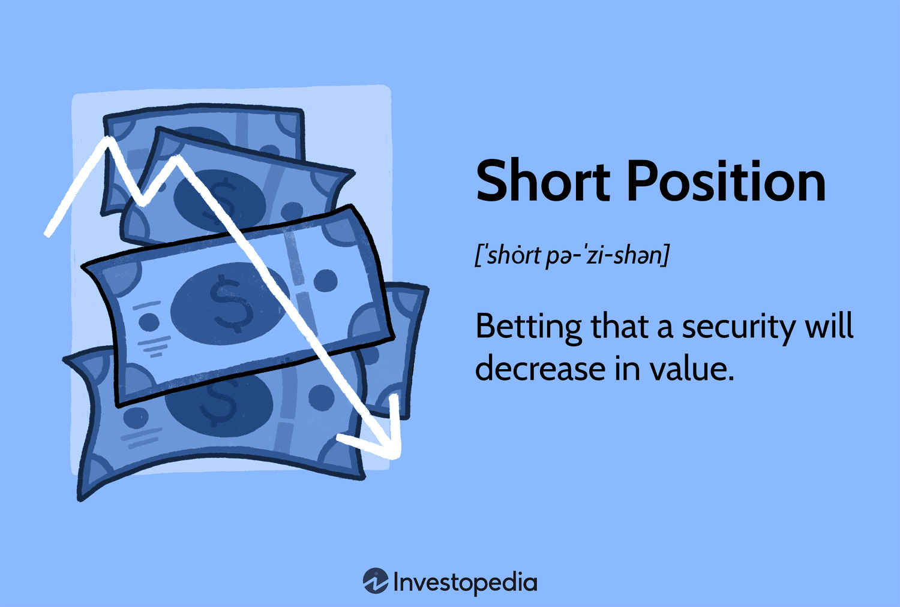

## Table of Contents

## What is a short position in trading?

A short position in trading is when you sell something you don't own, hoping to buy it back later at a lower price. It's like betting that the price of a stock or other asset will go down. You borrow the asset from someone else, sell it at the current price, and then you need to buy it back later to return it to the person you borrowed it from.

If the price does go down, you can buy the asset back cheaper than you sold it, and you make a profit from the difference. But, if the price goes up instead, you lose money because you have to buy it back at a higher price than you sold it. Short selling can be risky because there's no limit to how much the price can go up, so your potential losses can be very big.

## How does a short position differ from a long position?

A short position and a long position are opposite ways to trade. When you take a short position, you are betting that the price of something, like a stock, will go down. You borrow the stock and sell it at the current price. Later, you hope to buy it back at a lower price, return it to the owner, and keep the difference as profit. It's like saying, "I think this will be worth less soon."

On the other hand, a long position is when you buy something hoping its price will go up. You own the stock and wait for its value to increase. When you think the price is high enough, you sell it and make a profit from the difference between what you paid and what you sold it for. It's like saying, "I think this will be worth more soon."

The main difference is the direction you think the price will move. With a short position, you make money if the price falls, but you can lose a lot if it rises. With a long position, you make money if the price rises, and your risk is limited to what you paid for the stock.

## What are the basic steps to initiate a short position?

To start a short position, you first need to find a broker that allows short selling. Not all brokers let you do this, so you might need to open a special type of account called a margin account. Once you have the right account, you look for a stock or asset you think will go down in price. You tell your broker you want to short sell this stock.

Next, your broker will borrow the stock from someone else who owns it. They will then sell this stock at the current market price. The money from the sale goes into your account, but remember, you owe the stock back to the person your broker borrowed it from. Now, you wait for the price to drop. When you think it's low enough, you buy the stock back at the new, lower price. You give the stock back to the person your broker borrowed it from, and the difference between the price you sold it at and the price you bought it back at is your profit.

## What are the risks associated with short selling?

Short selling can be risky because there's no limit to how much you can lose. When you short sell, you're betting the price will go down. If it goes up instead, you have to buy back the stock at a higher price than you sold it for. This means your losses can keep growing as long as the price keeps rising. It's different from buying a stock, where the most you can lose is what you paid for it.

Another risk is that you need to borrow the stock from someone else to sell it. If the owner of the stock wants it back before you're ready to buy it back, you might have to return it at a bad time. This is called a short squeeze. If a lot of people are shorting the same stock and they all have to buy it back at once, the price can shoot up really fast, making everyone's losses even bigger.

Also, short selling can be tricky because you're going against the general trend of the market, which usually goes up over time. If the market or the stock you're shorting goes up unexpectedly because of good news or other reasons, you can lose money quickly. It's important to watch your short positions closely and be ready to act if things start going the wrong way.

## Can you explain the concept of short interest?

Short interest is a way to see how many people are betting that a stock's price will go down. It's like a count of all the shares that have been sold short and haven't been bought back yet. When a lot of people are shorting a stock, it means there's a high short interest. This can tell you that many investors think the stock's price will drop soon.

High short interest can also lead to something called a short squeeze. This happens when the stock's price starts to go up instead of down. People who shorted the stock have to buy it back to avoid bigger losses, which pushes the price up even more. It can create a rush to buy the stock, making the price rise quickly. So, short interest is an important thing to watch because it can give clues about what might happen to a stock's price next.

## What is a short squeeze and how does it affect short positions?

A short squeeze happens when a lot of people have shorted a stock, betting that its price will go down. But then, something unexpected happens, and the stock's price starts to go up instead. When the price goes up, the people who shorted the stock start to worry. They have to buy the stock back to cover their short positions and avoid even bigger losses. This rush to buy the stock pushes its price even higher, which can make the situation worse for the short sellers.

This situation can be really tough for those with short positions. As the price keeps going up, they might have to buy back the stock at a much higher price than they sold it for, leading to big losses. It's like a snowball effect where the more the price goes up, the more they lose, and the more they have to buy back, which keeps pushing the price up. A short squeeze can turn a bad situation into a really bad one for short sellers, and it can happen quickly.

## How do margin requirements impact short selling?

When you want to short sell a stock, you need to use a margin account. This means you're borrowing money from your broker to make the trade. The broker will set a margin requirement, which is the amount of money you need to have in your account to cover potential losses. This requirement can change based on how risky the stock is or how much the stock's price is moving. If the stock's price goes up a lot, your broker might ask for more money in your account to make sure you can cover your losses. This is called a margin call.

Margin requirements can make short selling more complicated. If you don't have enough money in your account to meet the margin call, your broker might force you to close your short position by buying back the stock. This can happen at a bad time, like when the stock's price is high, making your losses even bigger. So, it's important to keep an eye on your account and be ready to add more money if the stock's price moves against you.

## What are some common strategies used in short selling?

One common strategy in short selling is called "shorting against the box." This means you already own the stock, but you think its price will go down soon. So, you short sell the same number of shares you own. This way, you can lock in your profit without selling your original shares right away. It's a way to protect your gains if you think the stock's price might drop before you're ready to sell.

Another strategy is called "pairs trading." Here, you short sell one stock while buying another stock in the same industry. The idea is that you think one stock will do worse than the other. So, you make money from the difference between the two stocks. This can be less risky than just short selling one stock because you're betting on how they perform compared to each other, not just betting that one stock will go down.

A third strategy is "[momentum](/wiki/momentum) trading." With this, you look for stocks that have been going down and short sell them, hoping they'll keep falling. You need to be quick and watch the market closely because momentum can change fast. If the stock starts going up instead, you need to be ready to buy it back and close your short position to avoid big losses.

## How can one identify potential stocks to short?

To find stocks that might be good to short, you can start by looking at stocks that are overvalued. This means their price is higher than what the company is really worth. You can use something called the price-to-earnings ratio, or P/E ratio, to see if a stock is overvalued. If the P/E ratio is much higher than the average for the industry, it might mean the stock's price is too high. Also, you can look at the company's financial reports to see if they're making less money or losing money. If a company's profits are going down, it could be a sign that the stock's price will go down too.

Another way to find stocks to short is by watching the news and market trends. If there's bad news about a company, like a big lawsuit or a problem with their products, it could make the stock's price drop. You can also look at stocks that are part of a trend that's losing popularity. For example, if people are starting to buy less of a certain type of product, the companies that make those products might see their stock prices go down. It's important to do a lot of research and keep an eye on the market to find the best stocks to short.

## What are the tax implications of short selling?

When you make money from short selling, you have to pay taxes on your profits. The tax you pay depends on how long you held the short position. If you held it for less than a year, the profit is taxed as regular income, which can be at a higher rate. If you held it for more than a year, it's considered a long-term capital gain, and the tax rate is usually lower. It's important to keep good records of when you opened and closed your short positions to figure out the right tax rate.

Also, there are some special rules for short selling that can affect your taxes. If you get dividends from the stock you shorted, you have to pay taxes on them, even though you didn't actually own the stock. This can make your tax situation a bit more complicated. It's a good idea to talk to a tax professional to make sure you're doing everything right and taking advantage of any tax strategies that might help you save money.

## How do market conditions influence the success of short positions?

Market conditions can really affect how well a short position does. If the market is going down, it's easier for short sellers to make money because the prices of stocks are falling. This is good for people who shorted the stocks because they can buy them back at a lower price and make a profit. But, if the market is going up, it's harder for short sellers. When everyone else is buying stocks and pushing their prices up, short sellers lose money because they have to buy back the stocks at a higher price than they sold them for.

Sometimes, things like news or big events can change market conditions fast. If there's bad news about a company or the economy, it can make stock prices drop quickly, which is good for short sellers. But if there's good news, like a company doing better than expected or the government helping the economy, stock prices can go up fast. This can cause a short squeeze, where short sellers have to buy back the stocks at higher prices to avoid even bigger losses. So, it's important for short sellers to watch the market closely and be ready to act if conditions change.

## What advanced techniques can be used to manage and optimize short positions?

One advanced technique to manage and optimize short positions is called "stop-loss orders." This means you set a price at which you will automatically buy back the stock if it goes up too much. It helps limit your losses if the stock's price starts to rise. Another technique is "hedging," where you buy something else that will go up in value if the stock you shorted goes up. This can help protect you from big losses. For example, you might buy a call option on the stock you shorted, which gives you the right to buy it at a set price later. If the stock goes up, the call option can help offset your losses from the short position.

Another way to optimize short positions is by using "technical analysis." This means looking at charts and patterns to guess where the stock's price might go next. You can use things like moving averages or support and resistance levels to decide when to open or close your short position. It's like trying to predict the future based on what the stock has done in the past. Also, "[fundamental analysis](/wiki/fundamental-analysis)" can help. This means looking at the company's financial reports and news to see if the stock is overvalued or if there are problems that might make its price go down. By combining these techniques, you can make smarter decisions about when to short a stock and when to buy it back.

## References & Further Reading

[1]: Bergstra, J., Bardenet, R., Bengio, Y., & Kégl, B. (2011). ["Algorithms for Hyper-Parameter Optimization."](https://papers.nips.cc/paper/4443-algorithms-for-hyper-parameter-optimization) Advances in Neural Information Processing Systems 24.

[2]: ["Advances in Financial Machine Learning"](https://www.amazon.com/Advances-Financial-Machine-Learning-Marcos/dp/1119482089) by Marcos Lopez de Prado

[3]: ["Evidence-Based Technical Analysis: Applying the Scientific Method and Statistical Inference to Trading Signals"](https://www.amazon.com/Evidence-Based-Technical-Analysis-Scientific-Statistical/dp/0470008741) by David Aronson

[4]: ["Machine Learning for Algorithmic Trading"](https://github.com/stefan-jansen/machine-learning-for-trading) by Stefan Jansen

[5]: ["Quantitative Trading: How to Build Your Own Algorithmic Trading Business"](https://www.amazon.com/Quantitative-Trading-Build-Algorithmic-Business/dp/1119800064) by Ernest P. Chan