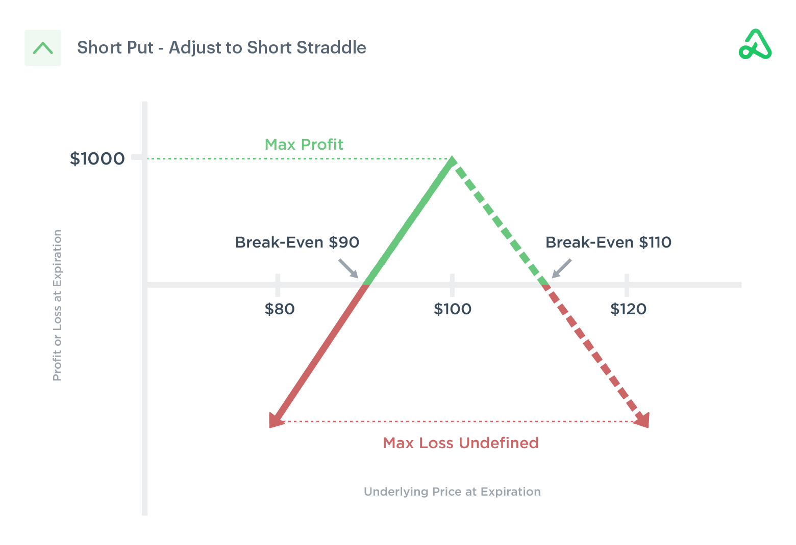

The evolution of trading methodologies in recent years can be largely attributed to the integration of algorithmic solutions and the development of advanced derivatives. Among these innovations, strategies such as hedging with short puts have emerged as significant tools for managing risk in financial markets. This article focuses on the utilization of short put options within the framework of algorithmic trading, highlighting how these strategies enhance trading efficiency and risk management.

Short put options involve a strategy where the trader sells put options, speculating that the price of the underlying asset will stay above the strike price. This approach allows traders to collect premiums, offering a supplementary income stream and a buffer against potential market declines. However, executing such strategies requires not only a good understanding of options and derivatives but also insights into how algorithmic processes can automate trade executions and optimize trading outcomes.



Algorithmic trading plays a pivotal role in implementing hedging strategies, as it minimizes human biases, enhances execution speed, and adapts to real-time market changes. By incorporating algorithms, traders can rely on data-driven decisions to manage their portfolios effectively, allowing for the swift adjustment of positions in response to market fluctuations.

The primary aim here is to provide readers with a comprehensive understanding of how these strategies can be used to mitigate risks while seeking to maximize returns. As the trading landscape continues to advance, the integration of technology and sophisticated derivatives strategies will remain central to achieving trading success in dynamic market conditions.

## Table of Contents

## Understanding Hedging with Short Put Options

Short put options are a fundamental concept within options trading, often employed as a hedging strategy to offset potential losses in a portfolio. This strategy involves the sale of put options, where the seller anticipates that the price of the underlying asset will remain above a specified strike price until the option's expiration. By engaging in this strategy, traders can capitalize on premiums received from the sale, effectively generating income and creating a buffer against possible market declines. However, the intrinsic risk lies in the possibility that the asset price may drop below the strike price, obligating the seller to purchase the asset at a higher cost than its current market value.

### Structure and Functionality

The key components of short put options can be broken down as follows:

1. **Premium Collection**: Upon selling a put option, the trader immediately receives a premium. This premium acts as a form of income and offers a cushion against losses if the market value of the underlying asset decreases.

2. **Obligation and Risk**: The short put seller has a responsibility to buy the underlying asset if the option is exercised and the asset's price falls below the strike price. This scenario can result in significant financial exposure if the market declines considerably.

3. **Potential as a Standalone Strategy**: Traders may use short put options independently, betting solely on stable or rising market conditions to capitalize on premiums without intending to acquire the asset. This approach, while risky, can be profitable in a bullish or stable market.

4. **Integration into Broader Strategies**: Short put options often serve as a component of comprehensive hedging strategies. For example, they can be used in conjunction with long positions to reduce downside risk. By collecting premiums, a trader can mitigate some losses from the long positions if market conditions deteriorate.

### Application of Short Put Options

To illustrate the versatility of short put options in hedging strategies, consider their combination with other positions:

- **Protective Puts**: While holding assets, traders may sell short puts to benefit from premiums, using the income to purchase protective puts, thereby reducing exposure to downside risk.

- **Covered Puts**: This strategy involves coupling a short put with a short stock position, offering a limited-risk method to profit from declining markets.

Using Python, traders can simulate and analyze short put strategies to determine potential outcomes:

```python
import numpy as np

# Parameters
spot_price = 100  # Current price of the underlying asset
strike_price = 95  # Strike price of the put option
premium_received = 3  # Premium received from selling the put option
market_prices = np.linspace(80, 120, num=100)  # Simulating market price range

# Calculate profit/loss
profit_loss = np.where(market_prices < strike_price,
                       premium_received - (strike_price - market_prices),
                       premium_received)

import matplotlib.pyplot as plt

plt.plot(market_prices, profit_loss, label='Short Put Option P/L')
plt.axhline(0, color='black', linewidth=0.5, linestyle='--')
plt.xlabel('Market Price')
plt.ylabel('Profit/Loss')
plt.title('Profit/Loss of a Short Put Option Position')
plt.legend()
plt.grid(True)
plt.show()
```

This code snippet simulates the profit and loss profile of a short put option, providing a visual representation of how the strategy performs as the underlying asset's market price changes. By employing such analytical tools, traders can make informed decisions about the applicability of short puts within their broader hedging strategy.

In conclusion, short put options offer traders a sophisticated means to generate income and manage risk, but they require careful consideration of potential market movements and obligations. When used judiciously, they can serve as vital components of robust trading strategies designed to weather various market conditions.

## The Role of Algorithmic Trading in Hedging

Algorithmic trading employs sophisticated computer algorithms to execute trades and manage intricate hedging strategies, such as short put options, with unparalleled precision. These algorithms are crafted to monitor diverse market conditions in real-time, executing transactions based on predefined criteria that optimize hedging strategies for operational efficiency. A core advantage of [algorithmic trading](/wiki/algorithmic-trading) in hedging is the reduction of human biases, a pivotal [factor](/wiki/factor-investing) that often skews decision-making in manual trading. By relying on algorithms, traders can achieve higher consistency and lower emotional interference, thus enhancing the efficacy of their strategies.

The increased execution speed enabled by algorithmic trading is another substantial benefit, as trades can be performed in milliseconds, far outpacing human capabilities. This speed is crucial in volatile markets where asset prices can change drastically within very short time frames. Through automated execution, traders can capitalize on fleeting opportunities, ensuring that strategies like short put options are deployed at optimal moments for maximum benefit.

Backtesting is an integral part of algorithmic trading, providing traders with the capability to test their hedging strategies against historical data to evaluate performance under various market conditions. This process enables fine-tuning of algorithms, ensuring that they are robust and capable of adapting to different scenarios. Real-time adjustments are also facilitated by algorithms, allowing for immediate responses to market fluctuations. This adaptability enhances the trader’s ability to protect portfolios and manage risks efficiently.

The strength of algorithmic trading lies in its capacity to analyze vast volumes of data rapidly and extract actionable insights, a function that is increasingly reliant on advanced computing power and data analytics. For example, a Python code snippet can be utilized to implement a simple moving average crossover strategy as part of a larger hedging framework:

```python
import pandas as pd

# Assuming 'data' is a DataFrame with stock prices
data['Short_MA'] = data['Close'].rolling(window=50).mean()
data['Long_MA'] = data['Close'].rolling(window=200).mean()

data['Signal'] = 0
data['Signal'][50:] = np.where(data['Short_MA'][50:] > data['Long_MA'][50:], 1, 0)
data['Position'] = data['Signal'].diff()
```

This script computes moving averages over a specified period to generate buy and sell signals, which can be integrated into a broader algorithmic trading strategy. By leveraging such techniques, traders can implement sophisticated hedging strategies that are robust, responsive, and aligned with their risk management objectives. In sum, algorithmic trading amplifies the trader’s ability to deploy successful hedging strategies by harnessing technological capabilities, thereby positioning it as an indispensable tool in modern trading environments.

## Combining Short Put Options with Other Hedging Strategies

Traders seeking to manage risk effectively often enhance the protective capabilities of short put options by integrating them with other hedging strategies. This multifaceted approach can include long positions, call options, and vertical spreads, each of which offers distinct advantages.

A vertical put spread is a straightforward yet effective strategy in this context. It involves purchasing a put option at a higher strike price while simultaneously selling a put option at a lower strike price. This creates a spread that limits the potential loss to the difference between the strike prices minus the net premium received. Although this caps the maximum profit, it significantly reduces the risk associated with holding a naked short put position. By aligning the spread's strike prices with market expectations, traders can capitalize on anticipated market movements while maintaining a safeguard against adverse conditions.

For instance, suppose a trader anticipates a moderate decline or neutral movement in the stock price of a company currently trading at $100. The trader could buy a put with a strike price of $102 and sell another with a strike price of $98. The premium collected from the sold put helps offset the cost of the purchased put, thus establishing a defined-risk scenario. This strategy balances risk and reward more effectively than a singular short put position, as it restricts the maximum possible loss to the width of the spread, adjusted for premiums.

In addition to vertical spreads, incorporating long stock positions alongside short puts can further enhance hedging potential. For example, if a trader currently holds a long position in a stock, selling a short put can provide additional income through premiums while also offering a potential entry point for purchasing more shares if the stock price declines below the strike price. This approach aligns with the trader's bullish outlook, as the short put serves both as a hedge and a tool to acquire more of the asset at a lower cost.

Combining call options with short puts in strategies like the covered call or collar spread presents another opportunity. In a collar spread, a trader might hold the underlying stock, sell a short call at a higher strike, and sell a short put at a lower strike. This configuration limits both downside and upside potential, transforming the strategy into one with reduced [volatility](/wiki/volatility-trading-strategies).

Such combinations allow traders to modulate their risk exposure effectively, adapting to various market conditions. Whether in a bullish, bearish, or neutral market environment, these strategies maximize potential returns while mitigating risks. By skillfully integrating these strategies, traders can protect their portfolios against market fluctuations, ensuring stability and growth.

## Benefits and Risks of Short Put Options in Hedging

Short put options present a unique set of advantages and challenges for traders seeking to hedge their portfolios. By selling put options, traders benefit from receiving premiums upfront, which can be particularly appealing in bearish or neutral market conditions. This premium acts as an income stream and offers a form of financial buffer, especially when the underlying asset remains above the strike price until expiration. This attribute provides traders with the capability to potentially augment their returns, enhancing their overall trading outcomes when markets do not exhibit significant downturns.

However, the benefits of short put options come hand in hand with notable risks. The primary concern is the obligation to purchase the underlying asset at the strike price if its market price drops below that level. In such scenarios, traders may end up acquiring the asset at a price higher than its market value, leading to potential losses. This risk can be substantial, especially in volatile markets where asset prices can fluctuate sharply. The formula for calculating the potential loss upon assignment is as follows:

$$
\text{Potential Loss} = (S - K + P) \times N
$$

Where:
- $S$ is the market price of the asset.
- $K$ is the strike price of the put option.
- $P$ is the premium received for selling the put option.
- $N$ is the number of options contracts.

For traders leveraging short put strategies, understanding the dynamics of risk and reward is crucial. This involves anticipating various market scenarios. For instance, if market conditions improve or remain stable, the trader retains the premium and may refrain from buying the underlying asset. Conversely, in adverse market conditions, the price may fall below the strike, requiring the trader to absorb the asset and potentially incur losses. Implementing stop-loss measures or combining short puts with other hedging strategies, such as purchasing protective puts or engaging in spread strategies, can mitigate these risks.

Ultimately, the efficacy of short put options as a hedging strategy hinges on the trader’s ability to assess market conditions accurately and implement tactical risk management measures. It is essential to factor in market volatility, potential price movements, and strategic hedging combinations to optimize outcomes and navigate the inherent trade-offs between income generation and potential obligations. By maintaining this balance, traders can effectively integrate short put options into their hedging arsenal, deriving the benefits while minimizing exposure to market adversities.

## Conclusion

Hedging trading strategies, especially those involving short put options, are vital for managing risk and boosting profitability during market volatility. Short put options allow traders to earn premiums while offering a contingency against market declines. These strategies can effectively neutralize downside risks by providing a structured approach to handling adverse market movements. 

Algorithmic trading acts as a critical tool, enhancing the precision and efficiency of implementing hedging strategies. Through sophisticated algorithms, traders can automate the execution of short put strategies, ensuring timely and optimized decision-making. These algorithms can monitor varying market conditions, reduce human biases, and facilitate swift adaptation to market changes, providing traders with a robust mechanism for effective risk management.

Understanding the nuances of combining short puts with other hedging strategies empowers traders to enhance portfolio protection. For instance, integrating short puts with vertical spreads or long positions can provide a broader shield against market downturns. Such combinations not only help in securing investments but also offer avenues for generating additional income.

The insights discussed in this article serve to arm traders with the requisite knowledge to refine their hedging strategies, aiming for better risk management and enhanced returns. As advancements in trading technology continue, the efficiency and applicability of these strategies are expected to improve, offering further opportunities for innovation in the global trading landscape. This ongoing evolution in trading methodologies will ensure that traders are well-equipped to navigate the uncertainties of financial markets efficiently.

## References & Further Reading

[1]: Hull, J. C. (2018). ["Options, Futures, and Other Derivatives"](https://www.semanticscholar.org/paper/Options%2C-Futures%2C-and-Other-Derivatives-Hull/89bdee500c8623864fc9eb7a471546aa713acc44) (9th Edition). Pearson.

[2]: Natenberg, S. (1994). ["Option Volatility and Pricing: Advanced Trading Strategies and Techniques"](https://www.amazon.com/Option-Volatility-Pricing-Strategies-Techniques/dp/0071818774) (2nd Edition). McGraw-Hill Education.

[3]: Lopez de Prado, M. (2018). ["Advances in Financial Machine Learning"](https://www.amazon.com/Advances-Financial-Machine-Learning-Marcos/dp/1119482089). Wiley.

[4]: Jarrow, R. A., & Turnbull, S. M. (1996). ["Derivative Securities"](https://archive.org/details/derivativesecuri0000jarr). South-Western College Publishing.

[5]: Chan, E. (2009). ["Quantitative Trading: How to Build Your Own Algorithmic Trading Business"](https://github.com/ftvision/quant_trading_echan_book). Wiley.

[6]: Aronson, D. R. (2007). ["Evidence-Based Technical Analysis: Applying the Scientific Method and Statistical Inference to Trading Signals"](https://onlinelibrary.wiley.com/doi/book/10.1002/9781118268315). Wiley.

[7]: Jansen, S. (2018). ["Machine Learning for Algorithmic Trading: Predictive models to extract signals from market and alternative data for systematic trading strategies with Python"](https://github.com/stefan-jansen/machine-learning-for-trading). Packt Publishing.