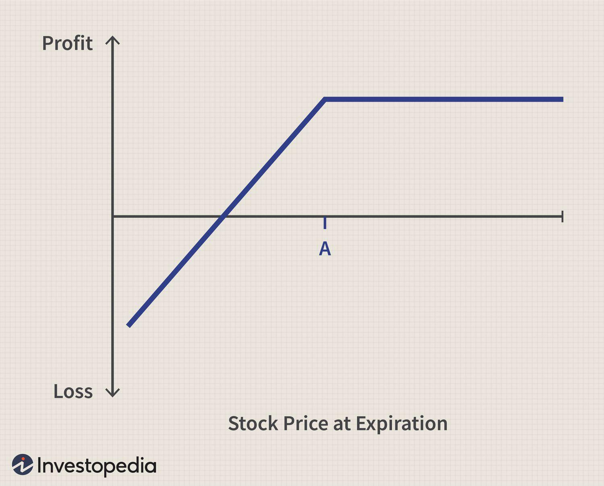

## Table of Contents

## What is a short put option?

A short put option is when you sell someone the right to sell you a stock at a certain price before a specific date. It's like making a promise to buy a stock at a set price if the other person decides to sell it to you. You get money right away for making this promise, which is called the premium.

If the stock price stays above the set price until the option expires, you keep the premium and don't have to buy the stock. But if the stock price drops below the set price, the person might decide to sell it to you, and you'll have to buy it at the higher set price, which could be more than what it's worth in the market. This can lead to a loss, so it's a bit risky.

## How does selling a put option work?

When you sell a put option, you're making a deal with someone else. You agree that they can sell you a certain stock at a specific price before a certain date. In return, they pay you money right away, which is called the premium. This premium is yours to keep no matter what happens next.

If the stock's price stays above the specific price you agreed on until the date passes, the other person probably won't want to sell it to you. They'd lose money if they did. So, you get to keep the premium and don't have to buy the stock. But, if the stock's price drops below the specific price, the other person might choose to sell it to you. You'll have to buy it at the higher price you agreed on, even if it's worth less in the market. This can mean you lose money, so it's a bit risky.

## What are the basic requirements to sell a put option?

To sell a put option, you need to have a brokerage account that allows options trading. Not all accounts do this, so you might need to ask your broker to turn on options trading for your account. You also need to have enough money in your account. This money is called margin, and it's like a safety net for the broker in case you have to buy the stock and it costs more than the premium you got.

Once you have the right account and enough money, you can go ahead and sell the put option. You pick the stock you want to deal with, decide on the price at which you're willing to buy it, and set the date by which the other person has to decide. When someone buys your put option, they pay you the premium right away. If the stock's price stays above your chosen price until the date passes, you keep the premium and don't have to buy the stock. But if the stock's price drops below your price, you might have to buy it at the higher price you set, which could mean you lose money.

## What are the potential benefits of selling a put option?

Selling a put option can give you extra money right away. This money, called the premium, is yours to keep no matter what happens next. If the stock price stays above the price you set, you get to keep this money without having to buy the stock. It's like getting paid for making a promise that you probably won't have to keep.

Another benefit is that you can buy the stock at a lower price if you want it. If the stock price drops below the price you set, you might have to buy it, but you'll be buying it at a price you chose earlier. Plus, you get the premium, which makes the stock even cheaper for you. So, if you were thinking about buying the stock anyway, selling a put option can be a smart way to do it.

## What are the risks associated with short put options?

Selling a put option can be risky. The biggest risk is that you might have to buy the stock at a higher price than it's worth in the market. If the stock price drops a lot below the price you agreed on, you'll lose money when you have to buy it. This can happen if the company does badly or if something unexpected happens in the market.

Another risk is that you need to have enough money in your account. Brokers require you to have a certain amount of money, called margin, to cover the risk of the stock price dropping. If you don't have enough money, you might not be able to sell put options or you might get a margin call, which means you need to add more money to your account quickly.

These risks mean that selling put options isn't for everyone. It's important to understand how much you could lose and to only do it if you're okay with that risk. If you're not careful, you could end up losing more money than you expected.

## How can the risk of a short put be managed?

Managing the risk of a short put involves being careful and having a plan. One way to manage risk is to only sell put options on stocks you know well and believe in. If you think the stock won't drop too much, you're less likely to end up buying it at a bad price. Another way is to set the price at which you're willing to buy the stock carefully. If you set it too high, you're more likely to have to buy the stock if it drops, so setting a lower price can help reduce the risk.

Having enough money in your account is also important. This money, called margin, acts like a safety net for the broker. If the stock price drops a lot, you need to be able to buy it at the price you agreed on. Make sure you have enough money to cover this, and don't sell more put options than you can handle. If you're worried about the stock dropping too much, you can also buy another option that protects you, called a protective put. This costs money but can limit how much you might lose if the stock price falls a lot.

## What is the breakeven point for a short put option?

The breakeven point for a short put option is the price at which you neither make nor lose money. It's the price of the stock when you subtract the premium you received for selling the put option. For example, if you sold a put option with a strike price of $50 and received a premium of $2, your breakeven point would be $48. If the stock price is above $48 when the option expires, you keep the premium and don't have to buy the stock, so you make money. If it's below $48, you might have to buy the stock at $50, which means you lose money.

Understanding the breakeven point helps you know how much the stock price can drop before you start losing money. If you think the stock won't drop below your breakeven point, selling the put option can be a good way to make some extra money. But if the stock does drop below that point, you need to be ready to buy it at the higher price you agreed on, which could mean a loss.

## How does time decay affect a short put position?

Time decay is like a friend to someone who sells a put option. It means that as time goes by, the value of the put option goes down. This is good for the person who sold the option because they want the option to be worth less and less. The closer you get to the date when the option expires, the faster the value drops. So, if the stock price stays above the price you set, you're more likely to keep the money you got for selling the option without having to buy the stock.

But, time decay can also be a bit tricky. If the stock price is close to the price you set and there's still a lot of time left, the option might still be worth a lot. In this case, you might have to wait longer to see if the stock price stays above your set price. If it doesn't, and the stock price drops below your set price, you might have to buy the stock at a higher price than it's worth. So, while time decay can help you, it's important to keep an eye on how the stock is doing as time goes by.

## What is the impact of implied volatility on short put options?

Implied [volatility](/wiki/volatility-trading-strategies) is like a guess about how much a stock's price might move up or down in the future. When you sell a put option, high implied volatility means the option is worth more because people think the stock price could change a lot. This is good for you because you get more money, called the premium, right away. But it's also riskier because if the stock price drops a lot, you might have to buy it at a higher price than it's worth, and the bigger premium won't be enough to cover your loss.

On the other hand, if implied volatility is low, the option is worth less because people think the stock price won't change much. This means you get less money for selling the put option, but it's also less risky. If the stock price stays above the price you set, you keep the smaller premium and don't have to buy the stock. So, implied volatility can affect both how much money you get and how much risk you take when you sell a put option.

## How do margin requirements affect short put strategies?

Margin requirements are like a safety net that your broker puts in place when you sell a put option. They make sure you have enough money in your account to buy the stock if you have to. This means you need to have a certain amount of money, called margin, ready in your account. If you don't have enough, you might not be able to sell the put option, or you might get a margin call, which means you need to add more money to your account quickly.

Having to meet these margin requirements can change how you use short put strategies. You might not be able to sell as many put options as you want because you need to keep enough money in your account. This can limit how much money you can make from selling put options. But it also helps you manage risk by making sure you can handle the worst-case scenario of having to buy the stock at a higher price than it's worth.

## What are some advanced strategies involving short puts?

One advanced strategy with short puts is called a "cash-secured put." This means you have enough money in your account to buy the stock if you have to. You sell a put option and use that money to buy the stock at a lower price if it drops. It's like getting a discount on the stock you want. If the stock price stays above the price you set, you keep the money you got for selling the put option and don't have to buy the stock. This way, you can make some extra money while waiting to buy the stock at a good price.

Another strategy is the "put spread." Here, you sell a put option at one price and buy another put option at a lower price. This limits how much money you can lose if the stock price drops a lot. You get money from selling the first put option, but you have to pay for the second one. The difference between what you get and what you pay is your profit if the stock price stays above the higher price. If it drops below the lower price, your loss is limited because of the second put option you bought. This strategy can help you make money while also managing risk.

A third strategy is the "covered put." This is when you already own the stock and sell a put option against it. If the stock price drops and you have to buy more shares, you already have some shares to cover the cost. This can be a way to make extra money from a stock you already own, but it's more risky because you could end up with more shares at a bad price if the stock drops a lot. It's important to be careful and understand the risks before trying these advanced strategies.

## How can one assess whether a short put option is suitable for their investment goals?

To figure out if selling a put option fits your investment goals, you need to think about what you want to achieve. Are you looking to make some extra money from the premium you get right away? Or are you hoping to buy a stock you like at a lower price? Selling a put option can help with both of these goals, but you need to be okay with the risk of having to buy the stock if its price drops a lot. You should also think about how much money you can afford to lose. If you're not comfortable with the idea of losing money, selling a put option might not be right for you.

Another thing to consider is how much you know about the stock you're thinking about. If you believe the stock won't drop too much below the price you set, selling a put option can be a good way to make some money. But if the stock is risky or you're not sure about it, you might want to stay away from this strategy. Also, make sure you have enough money in your account to cover the margin requirements. This will help you avoid any surprises if the stock price does drop and you have to buy it. By thinking about these things, you can decide if selling a put option is a good fit for what you want to achieve with your investments.

## What are the risks of selling short put options?

Selling short put options entails significant risks primarily due to the potential for considerable losses when the underlying asset's price drops significantly below the strike price. When a trader sells a put, they essentially agree to buy the underlying asset at the strike price if the option is exercised. If the market price falls sharply, the trader might find themselves purchasing the asset at a price much higher than its current market value, resulting in a substantial financial loss.

One of the critical differences between selling puts and buying options is the nature of the risk involved. When purchasing an option, the maximum loss is confined to the initial premium paid. In contrast, the seller of a put option faces exposure that can far exceed the premium received. The formula to represent potential losses can be given by:

$$
\text{Potential Loss} = (\text{Strike Price} - \text{Market Price}) \times \text{Quantity} - \text{Premium Received}
$$

If the market price falls below the strike price, the seller's losses increase as the market price decreases. For example, consider a scenario where a trader sells a put option with a strike price of $50 and receives a premium of $3 per option. If the market price of the asset tumbles to $40, the financial impact would be:

$$
\text{Potential Loss} = (50 - 40) \times 1 - 3 = $7
$$

Thus, the trader stands to lose $7 per option, illustrating why it is essential for traders to adopt strategic risk management practices.

To mitigate these risks, traders utilize various strategies, such as setting stop-loss orders or employing hedging techniques. Additionally, maintaining a buffer of collateral in their brokerage account can help manage potential obligations should they need to purchase the underlying asset. In practice, robust risk management plans are vital, considering the unpredictable nature of the markets and the potential for sudden price shifts. 

By understanding the inherent risks and implementing effective risk control strategies, traders can navigate the complexities of selling short put options more safely.

## What are the algorithmic strategies used in short put trading according to the case studies?

Algorithmic strategies in short put trading have increasingly become critical in optimizing trade execution and risk management. Real-world examples from financial markets reveal how these strategies deploy statistical models and [machine learning](/wiki/machine-learning) to refine decision-making in trading short put options.

One notable implementation involves leveraging predictive models to assess future price movements. These models often utilize historical price data, volatility indices, and macroeconomic indicators to forecast potential market trends. For instance, a predictive model based on a linear regression algorithm might be employed to estimate the likelihood of an underlying asset's price remaining above a certain level, thus minimizing the risk associated with selling short puts. The formula for a basic linear regression model is expressed as:

$$
Y = \beta_0 + \beta_1X_1 + \beta_2X_2 + ... + \beta_nX_n + \epsilon
$$

where $Y$ is the dependent variable (predicted price), $X_1, X_2, ..., X_n$ are independent variables (predictors), $\beta_0, \beta_1, ..., \beta_n$ are coefficients, and $\epsilon$ is the error term.

Another case study illustrates the use of machine learning algorithms, such as decision trees or neural networks, to refine trade entry and [exit](/wiki/exit-strategy) points. These algorithms analyze complex datasets to identify patterns that human traders might miss. For example, a [neural network](/wiki/neural-network) might be trained to recognize changes in volatility patterns and subsequently adjust trading strategies to mitigate potential losses from adverse market movements.

Best practices derived from these implementations include the importance of continuously retraining models with new data to ensure their accuracy and relevance in predicting market behaviors. Successful strategies also emphasize the integration of multiple data sources, including market sentiment analysis from news and social media, to enhance prediction accuracy.

However, a key pitfall in employing algorithmic strategies lies in the overfitting of models to historical data, which can lead to poor performance in live trading conditions. To counter this, practitioners often implement cross-validation techniques and [backtesting](/wiki/backtesting) on out-of-sample data to evaluate the robustness of their models before executing trades.

In summary, algorithmic strategies in short put trading exploit statistical and machine learning models to anticipate market trajectories and make data-driven trading decisions. By examining the successes and limitations of these strategies, traders can better adapt their approaches to harness the computational power of algorithms while managing the inherent risks of short put options.

## References & Further Reading

1. **Options, Futures, and Other Derivatives** by John C. Hull  
   This comprehensive textbook is a staple for those looking to understand the fundamentals and complexities of derivatives, including options. It covers various strategies and detailed explanations on pricing, risk management, and implementation.  

2. **Algorithmic and High-Frequency Trading** by Álvaro Cartea, Sebastian Jaimungal, and José Penalva  
   This book provides an in-depth analysis of [algorithmic trading](/wiki/algorithmic-trading), specifically high-frequency trading. It explores mathematical models, statistical tools, and practical insights necessary for implementing algorithmic strategies, including those pertinent to options trading.  

3. **Option Volatility and Pricing** by Sheldon Natenberg  
   Focusing on the pricing and volatility aspects of options, this book is essential for understanding theoretical concepts and practical trading strategies, including the use of options Greeks and volatility [arbitrage](/wiki/arbitrage).  

4. **Advances in Financial Machine Learning** by Marcos López de Prado  
   This book introduces machine learning tools and techniques that are changing the landscape of trading. It emphasizes the use of algorithms to enhance trading strategies, risk management, and overall financial decision-making processes.  

5. **Risk Management and Financial Institutions** by John C. Hull  
   Another key text by John Hull, this book focuses on the various aspects of managing risk within financial institutions. It provides readers with extensive knowledge on risk measurement and management strategies, including the use of derivatives.  

6. **Python for Finance: Mastering Data-Driven Finance** by Yves Hilpisch  
   This resource is geared towards traders looking to leverage Python for financial analysis and algorithmic trading. It covers the development of trading algorithms, risk management, and the use of libraries for efficient data processing.  

7. **Journal of Financial Markets**  
   This academic journal publishes relevant articles on topics such as market structure, price discovery, trading strategies, and risk management. It offers empirical and theoretical research, beneficial for traders interested in the foundational and current advancements in trading technologies.  

8. **International Journal of Financial Engineering**  
   Providing insights into financial innovation, this journal covers algorithmic trading strategies, computational finance techniques, and options pricing models. It is an excellent resource for those researching new methodologies in financial engineering.  

These resources offer comprehensive coverage on options trading, algorithmic methodologies, and risk management strategies, serving as invaluable guides for traders and financial professionals aiming to enhance their expertise and proficiency in the dynamic field of trading.

