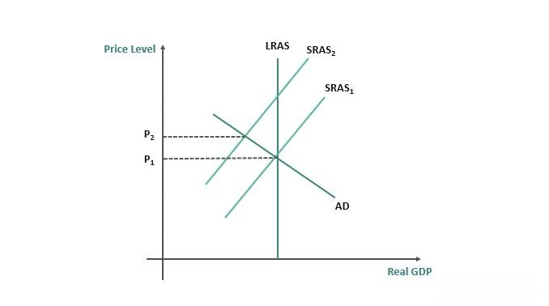

This article examines the interplay between economics and algorithmic trading with an emphasis on short-run economic principles and their applications in trading strategies. The short run in economics is characterized by at least one fixed input, allowing businesses to analyze specific stimuli affecting markets differently than in the long run. This distinction is significant for traders and businesses, providing insights into market behaviors and decision-making processes under the constraints of fixed inputs. 

Algorithmic trading, or algo-trading, involves using computer programs to execute trades based on predetermined criteria. It has become a growing trend in financial markets due to its advantages, including speed, efficiency, and the elimination of emotional biases from trading decisions. In the context of short-run economics, algo-trading offers the potential to enhance trading strategies by reacting swiftly to market changes and capitalizing on short-term opportunities.



The objective of this article is to clarify how short-run economic factors can influence and optimize algorithmic trading strategies. By understanding the implications of fixed inputs and other short-run variables, traders can develop strategies that are both reactive and proactive, allowing them to navigate the complexities of modern financial markets efficiently. As such, this exploration not only addresses the theoretical underpinnings but also provides actionable insights that integrate short-run economic concepts with sophisticated trading algorithms to achieve optimal outcomes.

## Table of Contents

## Understanding the Short Run in Economics

The short run in economics refers to a time period during which at least one input is considered fixed, meaning that it cannot be altered or adjusted. This contrasts with the long run, where all inputs are variable and can be changed according to the needs of production or market conditions. The concept of fixed inputs typically includes factors such as capital, land, or certain contractual labor obligations, which cannot be immediately adapted to shifting economic circumstances. The short run is pivotal for analyzing specific stimuli affecting markets, providing insights distinct from those gained from long-run analysis. This period allows economists and businesses to evaluate how sudden changes—such as price volatility or shifts in consumer demand—impact production processes and market behaviors.

In the context of production and decision-making, the presence of fixed inputs implies that companies must operate with a level of rigidity. For instance, a manufacturing firm may have a fixed amount of machinery (capital) that limits its production capacity in the short run. As a result, firms focus on optimizing their variable inputs, like labor and raw materials, to maximize productivity given the constraints imposed by fixed inputs. This condition often leads businesses to adjust operational strategies, such as altering work shifts or employing short-term contracts with suppliers, to navigate short-run limitations efficiently.

The short run holds significant importance for businesses with high fixed costs. Industries such as manufacturing, airlines, and utilities typically operate with substantial fixed investments in infrastructure, technology, and staff. In these sectors, understanding the dynamics of the short run is crucial for crafting financial strategies that mitigate risks associated with inflexible costs. For example, airlines face substantial fixed costs in aircraft and airport operations; thus, they must meticulously manage variable costs like fuel and crew hours to maintain profitability when demand fluctuates.

Businesses often adopt various tactics to buffer against adverse short-run impacts. These include dynamic pricing models, hedging against commodity price changes, and optimizing inventory levels to balance supply with anticipated demand shifts. As such, comprehending short-run economics equips businesses to better anticipate and react to immediate changes in the market environment, ensuring resilience and operational efficiency while bearing the constraints of fixed inputs.

## Algorithmic Trading Basics

Algorithmic trading, often referred to as algo-trading, involves the use of computer programs to initiate and manage trading based on a sequence of predefined instructions. These instructions can include aspects such as timing, price, and order quantity, and are derived from mathematical models and algorythms. The primary aim of [algorithmic trading](/wiki/algorithmic-trading) is to capitalize on market inefficiencies in an efficient and systematic manner.

One of the key advantages of algorithmic trading is speed. Computer programs can execute trades orders in fractions of a second, considerably faster than any human trader. This speed allows traders to take advantage of even the smallest price discrepancies across different markets, capturing gains before they disappear. Efficiency is another significant benefit; algorithms can process vast amounts of data, analyzing it to make trade decisions without manual input. This process reduces not only the time involved in trading but also the operational costs associated with manual trading. Finally, algo-trading eliminates emotional bias from trading decisions, ensuring that investments are made based on quantitative data and pre-set criteria, rather than human emotions like fear or greed.

Several strategies are commonly employed in algorithmic trading. Trend-following strategies, perhaps the most straightforward, involve the use of moving averages and other technical indicators to identify and exploit consistent market trends. Arbitrage strategies focus on profiting from price differentials in different markets or instruments by simultaneously buying and selling identical assets across different markets. Index fund rebalancing is another strategy, wherein algorithmic trading is used to buy or sell according to the periodic rebalancing of index-related portfolios, ensuring that the trades reflect the real-time composition of the index, thus minimizing tracking errors.

The adoption of algorithmic trading enhances market [liquidity](/wiki/liquidity-risk-premium) and operational efficiency. In the short run, the ability to place orders rapidly and systematically leads to increased liquidity, as a greater number of trades can be completed in less time. This liquidity is beneficial to the markets as it reduces bid-ask spreads and leads to more efficient price discovery. Over the long run, algorithmic trading contributes to overall market efficiency by reducing transaction costs and improving the accuracy of price reflections of stock and commodity values.

In summary, algorithmic trading is a crucial component of modern financial markets. Its advantages in terms of speed, efficiency, and unbiased decision-making, along with its ability to enhance both short-term liquidity and long-term market efficiency, make it an indispensable tool for traders and market makers. Strategies employed such as trend-following, [arbitrage](/wiki/arbitrage), and fund rebalancing highlight the versatility of algorithmic trading in adapting to different market conditions.

## Linking Short Run Economics and Algorithmic Trading

In the context of short-run economics, variables such as market demand, input prices, and fixed costs play significant roles in shaping trading strategies. These elements are critical as they represent the constraints and immediate conditions under which firms and markets operate. For instance, market demand can fluctuate due to seasonal trends or market sentiment, impacting stock prices and trading volumes. Input prices, including commodity costs or interest rates, can vary and affect profit margins. Fixed costs, which remain constant in the short run, determine break-even points and influence investment decisions.

Algorithmic trading, or algo-trading, benefits from the ability to react swiftly to such short-run economic conditions by leveraging real-time data analysis and rapid trade execution. Algorithms can be designed to capture and process massive volumes of market information instantly, identifying patterns or anomalies that prompt trading activities. This functionality is particularly valuable when dealing with short-run economic fluctuations, as it allows traders to respond dynamically to temporary changes in the market environment.

One of the key aspects of algo-trading's adaptability is its capability to analyze short-run variables and adjust strategies in real-time. For example, algorithms can use real-time data feeds to perform regression analysis or [machine learning](/wiki/machine-learning) predictions, customizing trades based on observed short-term market trends or price movements. A fundamental strategy employed is dynamic pricing models, which adjust prices or trading positions continuously based on the latest market data. This approach ensures that trading decisions align with the current economic landscape, optimizing potential returns.

To illustrate, consider a scenario where an algorithm leverages a dynamic pricing model in the stock market. Suppose the algorithm identifies an increase in demand for tech stocks following a favorable quarterly earnings report from a leading tech company. The algo may execute a series of buy orders for tech stocks, capitalizing on the transient opportunity before the market fully adjusts to the news. Conversely, if input costs for raw materials rise due to geopolitical tensions, algorithms might adjust their trading strategies to hedge against potential profit margin declines.

Furthermore, fixed costs in the short run can also dictate trading volumes and risk management strategies. An algorithm can consider these costs when determining optimal trade sizes or when employing risk mitigation strategies, such as stop-loss orders, to prevent significant losses during volatile market conditions.

Overall, the integration of short-run economic principles with algorithmic trading provides a robust framework for optimizing trading strategies. By continually analyzing real-time data and reacting to economic variables, algorithms effectively navigate the challenges presented by short-run economic cycles, capturing fleeting opportunities while maintaining financial stability.

## Examples of Short Run Algorithmic Trading Strategies

Analyzing short-run algorithmic trading strategies requires understanding how these strategies leverage economic principles to respond to immediate market changes. In industries such as airlines and retail, algorithmic trading employs advanced technologies to optimize operations and financial decisions based on short-run economic variables.

In the airline industry, Delta Airlines provides a compelling example of how algorithmic trading intersects with short-run economic decision-making. Delta uses algorithmic trading strategies to manage both flight scheduling and fuel hedging, addressing the dynamic nature of market demand and volatile input costs. These strategies enable Delta to adjust quickly to fluctuations in passenger demand and fuel prices, which are critical in the short run.

For instance, flight scheduling algorithms are designed to maximize operational efficiency by analyzing real-time booking data and adjusting flight frequencies and routes accordingly. This approach allows airlines to allocate resources effectively, balancing fixed and variable costs such as crew and aircraft usage against revenue potential from ticket sales. The formula to determine the optimal number of flights, $Q$, given a set level of fixed costs, $FC$, variable costs per flight, $VC$, and expected revenue per flight, $R$, can be expressed as:

$$

Q = \frac{R - FC}{VC}
$$

This formula helps to determine the number of flights that should be operated to maximize profitability, given fluctuating demand.

In terms of fuel hedging, Delta Airlines utilizes algorithmic models to forecast fuel price movements and secure futures contracts that stabilize fuel costs. This strategy involves hedging a portion of their future fuel consumption to protect against price spikes. By using algorithms that incorporate current and historical price data, Delta can make informed decisions on the timing and [volume](/wiki/volume-trading-strategy) of fuel hedging contracts, thus mitigating the risk of sudden increases in fuel expenses.

The retail sector also harnesses algorithmic trading strategies to adjust inventory levels and pricing models based on short-run market conditions. Retailers analyze customer purchasing patterns and external economic factors using algorithms that process vast amounts of sales data. This analysis informs dynamic pricing strategies, where prices are adjusted in real time to reflect market demand, manage inventory turnover, and optimize revenues. Python programming is frequently employed to create these dynamic models, given its robust data analysis libraries such as Pandas and Numpy.

For instance, a dynamic pricing model might use the following Python code snippet to adjust prices based on current demand levels:

```python
import pandas as pd

def dynamic_pricing(demand, base_price):
    # Adjusts price based on demand level
    price_multiplier = 1 + (demand - 1) * 0.1
    return base_price * price_multiplier

# Example usage
data = {'product': ['A', 'B', 'C'], 'current_demand': [1.1, 0.9, 1.2], 'base_price': [100, 150, 200]}
df = pd.DataFrame(data)
df['dynamic_price'] = df.apply(lambda row: dynamic_pricing(row['current_demand'], row['base_price']), axis=1)

print(df)
```

In this example, the `dynamic_pricing` function calculates new prices by adjusting the base price with a multiplier derived from current demand levels. This simple model illustrates how real-time data is integral to dynamically optimizing pricing strategies.

In conclusion, short-run algorithmic trading strategies capitalize on immediate market conditions, thus enabling industries like airlines and retail to maintain competitive advantage. By leveraging data-driven decisions through algorithmic models, companies can respond effectively to changes in demand and cost variables, ultimately enhancing business profitability and sustainability.

## Benefits and Challenges of Short Run Algo-Trading

Algorithmic trading, particularly in the context of short-run economic scenarios, presents a number of advantages and challenges that traders must navigate to optimize their strategies effectively.

One of the most significant benefits of short-run algorithmic trading is the achievement of optimal trade execution prices. By leveraging computational power, algorithms can analyze vast amounts of market data instantaneously, identifying and capitalizing on marginal price differences across various trading platforms. This ability allows traders to achieve prices that might not be attainable through manual trading approaches.

A critical advantage of algo-trading is its speed and efficiency. Algorithms can execute trades in fractions of a second, minimizing the gap between decision-making and execution. This feature reduces the latency between recognizing a trading opportunity and acting on it, which is crucial in the short timeframes associated with short-run economic fluctuations. Furthermore, by removing human emotions from trading decisions, algo-trading ensures that trades are made based on pre-set criteria rather than psychological biases, which often lead to inconsistent decision-making.

However, the reliance on technology introduces challenges. The dependency on sophisticated software and hardware infrastructure raises the risk of technical failures, which can have significant financial implications. These failures may include software bugs, system crashes, or even cyber-attacks. Additionally, the necessity for real-time data feeds is paramount; delays or inaccuracies in data can impede the effectiveness of trading algorithms, leading to suboptimal decision-making.

Furthermore, short-sighted trading strategies based on short-run economic data can fall victim to pitfalls such as over-optimization. Traders may design their algorithms to perform exceptionally well under specific historical data sets, only to find that these models do not generalize well to new, unseen market conditions. This issue, known as overfitting, can result in substantial losses if not carefully managed. Additionally, adapting to highly volatile market conditions poses a significant challenge. While short-run economic cues often signal temporary market movements, predicting and responding to such fluctuations accurately requires sophisticated models capable of handling rapid changes.

Overall, while short-run algo-trading offers distinct advantages in terms of execution speed, accuracy, and emotion-free decision-making, traders must remain vigilant about its inherent challenges. Ensuring robust technical infrastructure, comprehensive real-time data, and the development of adaptive, generalized models is crucial for overcoming these obstacles and maintaining a competitive edge in dynamic market environments.

## Conclusion: The Future of Short Run Economics in Algo-Trading

The integration of short-run economic principles into algorithmic trading strategies is crucial for developing robust models that can efficiently navigate the complexities of modern financial markets. Short-run economic factors, such as fluctuating market demand, input prices, and temporary supply constraints, exert significant pressure on trading operations and require adaptive strategies for effective mitigation. Understanding these dynamics allows traders to anticipate and react swiftly to changes, optimizing trade execution and maximizing returns within constrained timeframes.

The future direction of algorithmic trading is likely to be characterized by a deeper integration with advanced short-run economic forecasting models. By leveraging big data analytics, machine learning, and [artificial intelligence](/wiki/ai-artificial-intelligence), traders can refine their algorithms to better predict short-term macroeconomic and microeconomic shifts. For instance, real-time data processing and predictive analytics can enable algorithms to recognize and act upon subtle market patterns and economic indicators, enhancing decision-making accuracy.

To thrive in rapidly changing market conditions, continuous adaptation and evolution of trading strategies are essential. Algorithmic trading systems must be designed with flexibility, allowing for constant reevaluation of economic indicators and incorporation of novel data sources. This adaptability ensures that trading algorithms do not become stagnant, instead evolving to accommodate new market realities and emerging economic information efficiently.

In conclusion, the synthesis of short-run economic insights with cutting-edge algorithmic trading methodologies presents an opportunity to enhance both the precision and responsiveness of trading strategies. As financial landscapes evolve, the ability to seamlessly adjust to these dynamics will be a defining characteristic of successful algorithmic trading systems. Embracing innovation and fostering an environment of continual learning and adaptation will be key to capitalizing on transient opportunities and mitigating risks in the volatile financial markets of the future.

## References & Further Reading

[1]: Bergstra, J., Bardenet, R., Bengio, Y., & Kégl, B. (2011). ["Algorithms for Hyper-Parameter Optimization."](https://dl.acm.org/doi/10.5555/2986459.2986743) Advances in Neural Information Processing Systems 24.

[2]: ["Advances in Financial Machine Learning"](https://www.amazon.com/Advances-Financial-Machine-Learning-Marcos/dp/1119482089) by Marcos Lopez de Prado

[3]: ["Evidence-Based Technical Analysis: Applying the Scientific Method and Statistical Inference to Trading Signals"](https://www.amazon.com/Evidence-Based-Technical-Analysis-Scientific-Statistical/dp/0470008741) by David Aronson

[4]: ["Machine Learning for Algorithmic Trading"](https://github.com/PacktPublishing/Machine-Learning-for-Algorithmic-Trading-Second-Edition) by Stefan Jansen

[5]: ["Quantitative Trading: How to Build Your Own Algorithmic Trading Business"](https://www.amazon.com/Quantitative-Trading-Build-Algorithmic-Business/dp/1119800064) by Ernest P. Chan