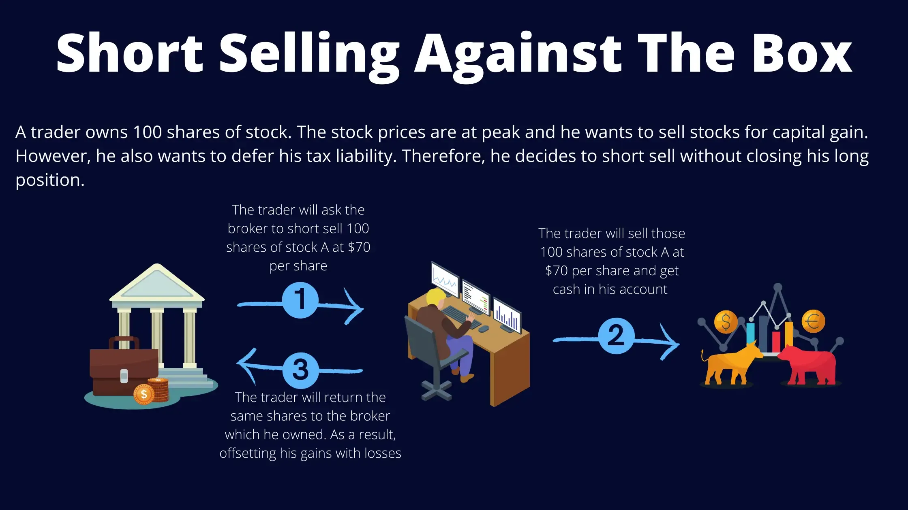

## Table of Contents

## What is a short sale against the box?

A short sale against the box is a strategy that investors use to protect their profits or minimize losses on a stock they already own. When an investor does this, they sell the stock short while still holding onto their original shares. This means they are selling borrowed shares of the same stock they own, creating a "box" where the short sale and the long position offset each other.

The main reason someone might use a short sale against the box is to lock in the current value of their stock without actually selling it. This can be useful if they think the stock price might drop in the future but they are not ready to sell their shares yet. By doing this, they can avoid realizing a capital gain or loss until a more favorable time, which can have tax advantages. However, changes in tax laws have made this strategy less common than it used to be.

## How does a short sale against the box differ from a regular short sale?

A short sale against the box is different from a regular short sale because it involves owning the stock you are shorting. In a regular short sale, you borrow shares from someone else and sell them, hoping to buy them back later at a lower price to make a profit. But in a short sale against the box, you already own the shares you are selling short. This means you are selling borrowed shares of the same stock you already have in your portfolio.

The main purpose of a short sale against the box is to lock in the current value of your stock without selling it. This can be useful if you think the stock price might go down, but you want to keep your shares for now. It helps you avoid realizing a profit or loss right away, which can be good for tax reasons. On the other hand, a regular short sale is used to bet that a stock's price will fall, without any need to own the stock beforehand.

## What are the primary reasons an investor might use a short sale against the box?

One main reason an investor might use a short sale against the box is to lock in the current value of their stock without actually selling it. Imagine you own a stock and you think its price might go down soon. By doing a short sale against the box, you can protect the profit you have made so far. You do this by selling borrowed shares of the same stock you already own. This way, if the price drops, you won't lose money on the shares you shorted.

Another reason is to delay realizing a capital gain or loss for tax purposes. If you sell your stock now, you might have to pay taxes on your profit right away. But if you do a short sale against the box, you can wait until a better time to sell your original shares and report the gain or loss. This can help you manage your taxes better. However, changes in tax laws have made this strategy less common because the tax benefits are not as big as they used to be.

## Can you explain the process of executing a short sale against the box?

When an investor wants to do a short sale against the box, they start by finding a broker who can help them borrow the shares they need. The investor already owns some shares of the stock, but they want to sell more shares without selling their own. So, they borrow the same number of shares from someone else, usually through their broker. Once they have the borrowed shares, they sell them on the market at the current price. This creates a short position because they have sold shares they don't actually own.

Now, the investor has two positions in the stock: a long position from the shares they originally owned and a short position from the shares they borrowed and sold. This is called being "against the box" because the two positions balance each other out. If the stock price goes down, the loss on the long position is offset by the gain on the short position, and vice versa if the price goes up. The investor can hold this position until they decide it's a good time to close it. To close the short sale, they buy back the same number of shares they sold and return them to the person they borrowed them from. This way, they can keep their original shares and decide when to sell them later.

## What are the tax implications of using a short sale against the box?

Using a short sale against the box can have some tax benefits, but these have changed over time. Before 1997, this strategy was popular because it let investors delay paying taxes on their gains. They could lock in their profits without selling their stock right away. This meant they could wait until a year when their tax rate might be lower or when they had losses to offset the gains.

However, in 1997, the tax laws changed. Now, if you do a short sale against the box, it's treated as if you sold your original shares. This means you have to report any gains or losses right away, just like if you had sold your stock normally. So, the tax benefits are not as big as they used to be, and this strategy is not used as often anymore.

## How has the Tax Cuts and Jobs Act affected the use of short sales against the box?

The Tax Cuts and Jobs Act, which was passed in 2017, made some changes that affect how people use short sales against the box. Before this law, people could use this strategy to delay paying taxes on their stock gains. They would do a short sale against the box to lock in their profits without selling their stock right away. This was helpful because they could wait for a better time to sell their stock and pay taxes.

However, the Tax Cuts and Jobs Act changed things. Now, if you do a short sale against the box, it's treated like you sold your original shares. This means you have to report any gains or losses right away, just like if you had sold your stock normally. Because of this change, the tax benefits of doing a short sale against the box are not as good as they used to be, so fewer people use this strategy now.

## What are the risks associated with a short sale against the box?

One risk of doing a short sale against the box is that the stock price could go up a lot. If this happens, you might lose money on the shares you shorted. Even though you still own your original shares, the cost of buying back the shares you borrowed and sold short could be higher than what you got when you sold them. This means you could end up losing money overall.

Another risk is that the broker might not be able to find shares for you to borrow. If you can't borrow the shares, you won't be able to do the short sale against the box. Also, if the stock pays dividends, you'll have to pay those dividends on the shares you borrowed. This can add to your costs and affect your profits.

Lastly, changes in tax laws can affect the strategy. Before 1997 and the Tax Cuts and Jobs Act of 2017, this was a good way to delay paying taxes on gains. But now, if you do a short sale against the box, it's like you sold your original shares right away. This means you have to pay taxes on any gains sooner than you might want to, which can make the strategy less useful.

## How can an investor close out a short sale against the box?

To close out a short sale against the box, an investor needs to buy back the shares they borrowed and sold. They do this by buying the same number of shares they sold short at the current market price. Once they have these shares, they return them to the person or broker they borrowed them from. This action closes the short position and ends the short sale against the box.

After closing the short sale, the investor still owns their original shares. They can decide to keep these shares or sell them whenever they want. By closing the short sale, the investor removes the risk of the short position and can then manage their original shares as they see fit, without the offsetting short position.

## What are the regulatory considerations one should be aware of when using this strategy?

When using a short sale against the box, it's important to know about the rules set by the government and financial regulators. One key thing to watch out for is the tax rules. Since the Tax Cuts and Jobs Act in 2017, if you do a short sale against the box, it's treated like you sold your original shares right away. This means you have to pay taxes on any gains sooner than you might want to. It's a good idea to talk to a tax advisor to understand how this might affect you.

Another thing to keep in mind is the rules about borrowing shares. You need to make sure your broker can find shares for you to borrow. If they can't, you won't be able to do the short sale against the box. Also, if the stock pays dividends, you'll have to pay those dividends on the shares you borrowed. This can add to your costs. It's important to follow all the rules set by the Securities and Exchange Commission (SEC) and your broker to make sure you're doing everything right.

## Can you discuss any historical examples where short sale against the box was notably used?

One famous example where a short sale against the box was used is by Warren Buffett. Back in the 1980s, Buffett used this strategy with his shares in The Washington Post Company. He wanted to lock in the gains he had made on his investment without selling the stock right away. By doing a short sale against the box, he could protect his profits and wait for a better time to sell his shares. This move helped him manage his taxes better and keep his investment in the company.

Another example comes from the early 2000s, when many investors used short sales against the box to hedge their positions in technology stocks. During the dot-com bubble, stock prices were very high and many people thought they might crash. Investors who owned these stocks used short sales against the box to protect their profits. They could hold onto their shares while betting that the price would go down. This strategy was popular until tax law changes in 1997 and later in 2017 made it less attractive.

## How does a short sale against the box fit into broader hedging strategies?

A short sale against the box is a type of hedging strategy that investors use to protect their profits or minimize losses on a stock they already own. Hedging is like buying insurance for your investments. It helps you reduce the risk of losing money if the stock price goes down. With a short sale against the box, you sell borrowed shares of the same stock you own. This way, if the stock price drops, the loss on your original shares is balanced out by the gain on the shares you sold short. It's a way to lock in your current profit without selling your stock.

This strategy fits into broader hedging strategies because it's one of many tools investors can use to manage risk. Other common hedging strategies include buying put options, which give you the right to sell your stock at a set price, or using futures contracts to bet on future price movements. Each of these methods has its own pros and cons. A short sale against the box is unique because it lets you keep your original shares while still protecting against a price drop. However, changes in tax laws have made this less popular over time, so investors might choose other hedging methods depending on their goals and the current market conditions.

## What advanced techniques can be used to optimize a short sale against the box?

To optimize a short sale against the box, investors can use timing strategies. They might watch the market closely to choose the best time to do the short sale. For example, if they think the stock price will drop soon, they could do the short sale just before that happens. This way, they can lock in a higher profit. They might also look at the stock's historical price patterns to predict when it might go down. Another technique is to use stop-loss orders. These are orders that automatically close the short position if the stock price goes up too much. This can help limit losses if the stock price rises unexpectedly.

Another advanced technique is to use options along with the short sale against the box. Investors can buy put options, which give them the right to sell the stock at a set price. This can add an extra layer of protection if the stock price falls more than expected. They might also consider using call options, which give them the right to buy the stock at a set price. This can be useful if they want to keep the short sale open but are worried about a big price increase. By combining these options with the short sale, investors can create a more flexible and effective hedging strategy.

## References & Further Reading

[1]: Bergstra, J., Bardenet, R., Bengio, Y., & Kégl, B. (2011). ["Algorithms for Hyper-Parameter Optimization."](https://dl.acm.org/doi/10.5555/2986459.2986743) Advances in Neural Information Processing Systems 24.

[2]: ["Advances in Financial Machine Learning"](https://www.amazon.com/Advances-Financial-Machine-Learning-Marcos/dp/1119482089) by Marcos Lopez de Prado

[3]: ["Evidence-Based Technical Analysis: Applying the Scientific Method and Statistical Inference to Trading Signals"](https://www.amazon.com/Evidence-Based-Technical-Analysis-Scientific-Statistical/dp/0470008741) by David Aronson

[4]: ["Machine Learning for Algorithmic Trading"](https://github.com/stefan-jansen/machine-learning-for-trading) by Stefan Jansen

[5]: ["Quantitative Trading: How to Build Your Own Algorithmic Trading Business"](https://github.com/LucindaYa/quant-resources/blob/master/Quantitative%20Trading%20How%20to%20Build%20Your%20Own%20Algorithmic%20Trading%20Business.pdf) by Ernest P. Chan