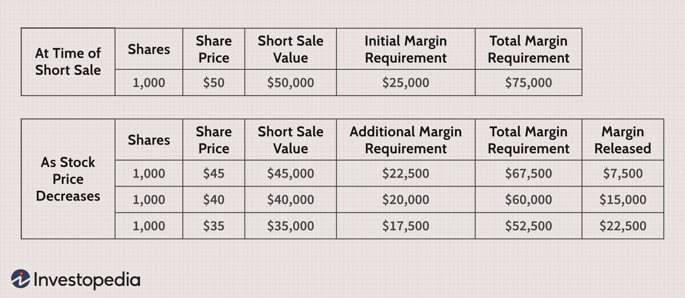

Short selling is a trading strategy where an investor borrows shares and sells them in anticipation of a price decline. Later, the investor seeks to repurchase these shares at a lower price to return them to the lender, profiting from the difference. This technique has gained popularity due to its potential for profit even in bearish markets, serving as a tool for hedging or speculative investments.

Algorithmic trading, defined as the use of complex algorithms to automate trading decisions and executions, has emerged as a powerful tool in short selling. By leveraging computational power, algorithmic trading allows for rapid execution of trades based on pre-set criteria, thereby maximizing efficiency and minimizing human error. In the context of short selling, algorithms can optimize entry and exit points, manage large volumes of data, and execute orders with precision, all while monitoring market conditions continuously.

Understanding margin requirements and investment risks is critical for traders engaged in short selling. Margin requirements represent the amount of equity an investor must hold in their account as collateral when initiating a short sale. These requirements protect brokers by ensuring funds are available to cover potential losses if the shorted stock price rises. Misjudging or failing to meet these requirements can lead to forced liquidations and significant financial consequences. Investment risks in short sales are substantial, with the potential for unlimited losses should the stock price surge unexpectedly.

The objective of this article is to provide insights into the complexities of short selling, focusing on margin requirements, associated risks, and the implementation of algorithmic trading strategies. By exploring these dimensions, the article aims to equip traders with enhanced understanding and practical tools for navigating the challenges of short selling.

The forthcoming sections will cover margin requirements and how they impact trading decisions, the risks inherent in short selling, the role of algorithmic trading in executing short sale strategies, and how traders can effectively balance these factors for successful investments.

## Table of Contents

## Understanding Margin Requirements in Short Selling

Margin requirements in short selling are crucial components that a trader must understand before engaging in such activities. Margin requirements refer to the amount of collateral a trader must deposit with a broker to cover potential losses when initiating a short sale. These requirements are established to mitigate the risks associated with short selling, especially given its speculative nature. 

### Determination of Margin Requirements by Brokers

Brokers determine margin requirements based on several factors, including market [volatility](/wiki/volatility-trading-strategies), the [liquidity](/wiki/liquidity-risk-premium) of the stock being shorted, and regulatory guidelines. The Financial Industry Regulatory Authority (FINRA) and other regulatory bodies often set minimum margin requirements, but brokers may impose stricter conditions to safeguard their interests. Typically, when a trader wishes to short a stock, the broker requires the trader to maintain an initial margin, which is a percentage of the market value of the shorted securities.

### Initial Margin and Maintenance Margin

In the context of short selling, the initial margin is the minimum equity amount a trader must maintain in their account when opening a short position. This is usually expressed as a percentage of the market value of the securities to be shorted. For instance, if the initial margin requirement is 50%, and a trader wants to short $20,000 worth of stock, the trader must have at least $10,000 in their margin account.

The maintenance margin is the minimum balance that must be maintained once the short position is established. If the equity in the trader’s margin account falls below this level, the broker will issue a margin call, requiring the trader to deposit more funds or securities to bring the account balance back to the required level. Failure to meet this margin call may force the broker to liquidate part or all of the trader’s position to cover potential losses.

### Impact of Margin Requirements on Trading Decisions

Margin requirements can significantly influence a trader's decision to engage in short selling. High initial and maintenance margin requirements may deter some traders due to the substantial up-front capital needed. Furthermore, these requirements can limit the leverage that traders can employ, potentially reducing the profitability of short selling strategies for individual investors with limited capital.

### Consequences of Failing to Meet Margin Requirements

Failure to meet margin requirements can have severe consequences for traders. When a trader does not maintain the required margin, the broker can initiate a margin call, demanding additional funds. If the trader does not fulfill this demand, the broker has the authority to liquidate the trader's positions to recoup losses. This liquidation can occur at an inopportune time, potentially locking in significant losses. In extreme cases, a trader may even face legal action from the broker if the liabilities exceed the account's value.

In summary, understanding margin requirements in short selling is imperative for risk management and capital allocation. These requirements ensure that traders have sufficient collateral to cover potential losses, which can safeguard both the trader and the broker from the adverse financial impacts of a failed short sale.

## Exploring Investment Risks in Short Sales

Short selling presents various investment risks that traders must understand before engaging in such strategies. These risks primarily include market risk, liquidity risk, the potential for unlimited losses, the phenomenon of short squeezes, and regulatory and reputational risks.

### Market Risk and Liquidity Risk

Market risk refers to the possibility of an investor experiencing losses due to factors that affect the overall performance of financial markets. In the context of short selling, market risk can lead to substantial financial loss if the stock's price increases rather than decreases, contradicting the trader's initial bet.

Liquidity risk is another significant concern, referring to the difficulty of exiting a position without impacting the price of the asset. For short sellers, this risk can be exacerbated if there is a limited supply of shares to buy back in the market, complicating the closure of their short position.

### Unlimited Losses

One of the defining dangers of short selling is the potential for unlimited losses. While the maximum gain is capped (as a stock's price can only drop to zero), the losses are theoretically boundless since a stock's price can rise indefinitely. If a trader sells short at a price $P_0$ and the stock price rises to $P$, the loss per share is given by:

$$
\text{Loss per share} = P - P_0
$$

If the stock's price continues to rise, the losses continue to accumulate without limit, necessitating a vigilant risk management strategy.

### Impact of Short Squeezes

A short squeeze occurs when a heavily shorted stock's price begins to rise, forcing short sellers to buy back shares to cover their positions, which only propels the price higher. Historically notable short squeezes, such as the dramatic case of GameStop in early 2021, have resulted in significant losses for traders caught in the squeeze. During such events, the rapid escalation in stock prices can create an urgent need to cover positions, leading to panic and further impelling prices upward.

### Regulatory and Reputational Risks

In addition to financial risks, short sellers face regulatory and reputational challenges. Regulatory bodies frequently scrutinize short selling activities, and changes in regulations, such as bans on short selling during periods of market instability, can impact strategies and lead to losses. Moreover, short selling carries a reputational risk, as it may be viewed negatively by companies and the public, potentially leading to backlash against traders or firms perceived to be engaging in predatory practices.

### Mitigation Strategies

To minimize these risks, traders can employ several strategies:

1. **Risk Management Tools**: Implement stop-loss orders to cap potential losses by automatically buying back shares if the price reaches a predetermined level.

2. **Diversification**: Avoid allocating too much capital to any single short position to mitigate the impact of an adverse price movement.

3. **Leverage Analysis**: Use position sizing techniques to ensure that leverage is kept within manageable levels to avoid margin calls, which can occur if market movements erode the margin.

4. **Thorough Research**: Conduct comprehensive analyses of companies and market conditions to identify those with overvalued stocks and a strong likelihood of future price declines.

5. **Regulatory Compliance**: Stay informed about regulatory shifts and ensure all short selling activities adhere to current laws and guidelines to protect against potential penalties.

Understanding and mitigating the risks associated with short selling requires a blend of strategic execution, rigorous research, and an awareness of market dynamics. Traders who successfully navigate these challenges can use short selling as a powerful tool in their investment arsenal.

## The Role of Algorithmic Trading in Short Sale Strategies

Algorithmic trading, often referred to as algo trading, involves the use of computer programs to execute trades based on pre-defined criteria. In the context of short selling, [algorithmic trading](/wiki/algorithmic-trading) automates the process of borrowing and selling securities with the intention of buying them back at a lower price. This automation can lead to increased efficiency and reduced human error in making rapid trading decisions.

The primary advantage of using algorithms for short sales is the speed at which trades can be executed. Algorithms can scan multiple markets simultaneously, recognizing opportunities and executing trades in milliseconds, much faster than a human trader could. This speed is crucial in short selling, where prices can move quickly, and the ability to execute orders promptly can significantly impact profitability. Additionally, algorithms can optimize order execution by minimizing slippage, which is the difference between the expected price of a trade and the actual price.

Several popular algorithmic trading strategies are employed in short selling. One such strategy is statistical [arbitrage](/wiki/arbitrage), which involves the identification of price discrepancies of correlated securities across markets, allowing traders to short overvalued securities while longing those that are undervalued. Another common strategy is mean reversion, which assumes that a stock’s price will eventually revert back to its average, enabling traders to short stocks when prices are perceived to be exceptionally high based on historical trends. Momentum-based strategies also play a role, where traders short sell securities on a downward trend after significant price movements, capitalizing on continued shifts in that direction.

Despite these advantages, algorithmic trading in short sales is not without its challenges and risks. One significant risk is the reliance on historical data and patterns, which might not always predict future movements, especially in volatile markets. Additionally, the complexity of algorithms can lead to unforeseen errors or issues if not properly tested and monitored. The phenomenon known as "overfitting" is a challenge in which an algorithm is too tightly tuned to historical data, reducing its effectiveness in real-time trading. Furthermore, market conditions can change rapidly due to unforeseen events, which might not be incorporated into algorithmic models in time.

Examples of successful algorithmic-driven short sale strategies often involve a sophisticated understanding of the market and robust risk management protocols. For instance, the “quant [hedge fund](/wiki/hedge-fund-trading-strategies)” Renaissance Technologies is renowned for its use of complex algorithms to make profitable trades, including short sales. Its Medallion Fund has demonstrated consistent success despite the inherent risks, largely due to its ability to adapt its models as necessary and its comprehensive historical data analysis.

In conclusion, algorithmic trading has become an integral component of short sale strategies, offering enhanced speed and efficiency, and enabling sophisticated strategies such as [statistical arbitrage](/wiki/statistical-arbitrage) and mean reversion. However, traders must be cautious of potential pitfalls, like overfitting and model reliability in volatile markets. By understanding these challenges and learning from successful case studies, traders can better navigate the complexities of short selling using algorithmic strategies.

## Balancing Margin Requirements, Risks, and Algo Trading

Balancing margin requirements, investment risks, and algorithmic trading is crucial for traders seeking to optimize their strategies in short selling. This process requires a comprehensive understanding of each component's role and how they interact.

Margin requirements are a crucial [factor](/wiki/factor-investing) in short selling, dictating the amount of capital a trader needs to borrow to initiate and maintain a short position. Brokers set these requirements based on initial margin and maintenance margin levels. Algorithmic trading can serve as a powerful tool for optimizing the use of margin by implementing precise, data-driven strategies that enhance the efficiency and speed of trade executions. Algorithms can analyze vast datasets and execute trades based on sophisticated criteria, allowing traders to better manage their capital and maintain compliance with margin requirements.

Investment risks in short selling, such as market, liquidity, and counterparty risks, necessitate vigilant management, which algorithmic trading can support. By leveraging statistical and [machine learning](/wiki/machine-learning) models, algorithms can predict potential stock movements, assess market conditions, and optimize entry and [exit](/wiki/exit-strategy) points. This strategy minimizes exposure to adverse price movements, thus effectively managing risks.

For traders looking to navigate the complexities of short selling with algorithmic trading, practical tips include:

1. **Backtesting and Simulation**: Prior to deploying an algorithm in live markets, backtest its performance using historical data to identify potential weaknesses and improve strategy reliability. Simulation can further refine algorithms by mimicking real-market conditions without financial risk.

2. **Diverse Data Utilization**: Employ a diverse range of data inputs, such as alternative data sources, economic indicators, and sentiment analysis, to inform algorithmic decisions, enhancing predictive accuracy and risk management.

3. **Risk Management Protocols**: Implement robust risk management protocols within algorithms, including stop-loss and position-sizing rules, to prevent excessive losses and optimize the risk-return profile.

4. **Regular Monitoring and Adjustment**: Continuously monitor algorithm performance in real-time and be prepared to make necessary adjustments in response to changing market conditions or errors in execution.

Tools and resources to assist traders include trading platforms like MetaTrader, which provide integrated algorithmic trading functionalities and real-time monitoring of margin levels. Additionally, platforms such as QuantConnect and Alpaca offer API access and simulation environments for developing algorithmic strategies.

The dynamic nature of financial markets necessitates ongoing education and adaptability. Traders must stay informed about market trends, technological advancements, and regulatory changes. Participating in webinars, forums, and financial courses can offer valuable insights and foster continuous learning. By maintaining a proactive attitude towards education and technology adoption, traders can navigate the intricacies of short selling effectively and sustainably.

## Conclusion

In summary, this article has explored the intricate dynamics of margin requirements, investment risks, and algorithmic trading within the context of short selling. Understanding margin requirements is crucial, as they dictate the funds needed to initiate and maintain a short position, affecting both the strategy and potential outcomes for traders. Risks associated with short selling, such as the possibility of unlimited losses, market volatility, and regulatory challenges, require traders to adopt a prudent approach and employ effective risk management strategies.

Algorithmic trading enhances short selling strategies by offering speed, efficiency, and sophisticated data analysis, enabling traders to execute short sales with precision. However, it is accompanied by its own set of challenges, including algorithmic errors and the need for constant monitoring and adjustments.

For traders engaged in short selling, an appreciation of these elements is essential for success. Continuous research and strategy enhancement can aid in adapting to the ever-evolving trading environment. Therefore, traders should evaluate their current practices, integrating insights from this article into their processes.

As a call to action, traders are encouraged to review their trading methodologies, focusing on optimizing their use of margin, managing associated risks, and leveraging algorithmic technologies effectively. For further exploration, resources such as textbooks on financial derivatives, online courses on algorithmic trading, and industry reports on market dynamics offer valuable information for those seeking to deepen their understanding of short selling strategies.

## References & Further Reading

[1]: ["Advances in Financial Machine Learning"](https://www.amazon.com/Advances-Financial-Machine-Learning-Marcos/dp/1119482089) by Marcos Lopez de Prado.

[2]: ["Quantitative Trading: How to Build Your Own Algorithmic Trading Business"](https://www.amazon.com/Quantitative-Trading-Build-Algorithmic-Business/dp/1119800064) by Ernest P. Chan.

[3]: ["Evidence-Based Technical Analysis: Applying the Scientific Method and Statistical Inference to Trading Signals"](https://www.amazon.com/Evidence-Based-Technical-Analysis-Scientific-Statistical/dp/0470008741) by David Aronson.

[4]: ["Machine Learning for Algorithmic Trading"](https://github.com/stefan-jansen/machine-learning-for-trading) by Stefan Jansen.

[5]: Ren, J., & Malcolm, W. (2014). ["Algorithmic Trading and Information."](https://www.cambridge.org/core/journals/journal-of-financial-and-quantitative-analysis/article/abs/algorithmic-trading-and-market-quality-international-evidence/4B96E916E3E13AFF1DF9B5FCC188F4E0) The Econometrics Journal, 17(3), 292-315.