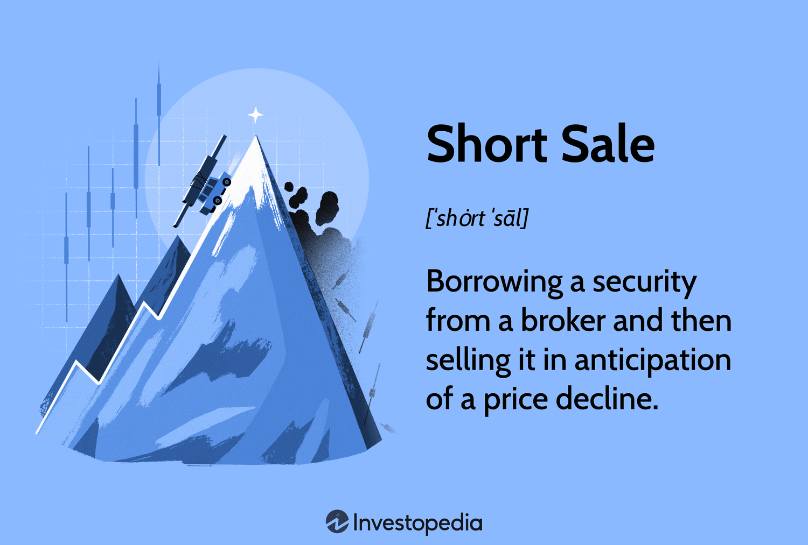

## Table of Contents

## What is a short sale in the context of trading?

A short sale in trading is when someone borrows a stock or other asset and sells it, hoping to buy it back later at a lower price. This is done because the person believes the price of the asset will go down. They make money if the price does drop, because they can buy the asset back cheaper than they sold it for, and return it to the person they borrowed it from.

However, short selling can be risky. If the price of the asset goes up instead of down, the person who short sold it will lose money. They will have to buy it back at a higher price to return it, which means they lose the difference between the price they sold it for and the higher price they had to pay to buy it back. This is why short selling is considered a more advanced trading strategy.

## How does the process of initiating a short sale work?

When someone wants to start a short sale, they first need to find a broker who can lend them the stock or asset they want to sell. The broker will usually have stocks that other people own but aren't using right now. The person doing the short sale will borrow these stocks from the broker and then sell them on the market at the current price. This is the first step in the short sale process.

After selling the borrowed stocks, the person waits for the price of the stock to go down. If it does, they can buy the same number of stocks back at the lower price. They then return these stocks to the broker they borrowed from. The difference between the price they sold the stocks for and the lower price they bought them back at is their profit. If the stock price goes up instead, they will lose money because they have to buy the stocks back at a higher price to return them.

## What are the potential benefits of executing a short sale?

One big benefit of doing a short sale is that it lets you make money even when stock prices are going down. If you think a stock is going to lose value, you can use a short sale to make money from that drop. This is different from buying stocks, where you only make money if the stock price goes up. So, short selling gives you another way to make money in the stock market, no matter which way the market is moving.

Another benefit is that short selling can help balance the market. When a lot of people think a stock is overvalued and start short selling it, it can push the stock price down to a more realistic level. This can prevent stocks from getting too expensive and can help keep the market fair. By short selling, traders can help make sure that stock prices reflect what the company is really worth.

## Can you provide a basic example of a short sale transaction?

Imagine you think the price of XYZ stock, which is currently at $50, is going to go down. You go to your broker and borrow 100 shares of XYZ stock. You then sell those 100 shares on the market for $50 each, which gives you $5,000. This is the start of your short sale.

A few weeks later, the price of XYZ stock drops to $40 per share, just like you thought it would. You decide it's time to close your short sale. You use the $5,000 you got from selling the shares to buy back 100 shares of XYZ stock, but now you only have to pay $40 per share, which costs you $4,000. You return the 100 shares to your broker, and you keep the difference. In this case, you made a profit of $1,000 ($5,000 - $4,000).

## What are the key risks associated with short selling?

Short selling can be risky. The biggest risk is that the stock price might go up instead of down. If that happens, you will lose money. You have to buy the stock back at a higher price to return it to the broker. The more the price goes up, the more money you lose. This can be a big problem because there's no limit to how high a stock price can go, so your losses could be very large.

Another risk is something called a short squeeze. This happens when a lot of people are short selling a stock and the price starts to go up. People who shorted the stock start to panic and buy it back to cut their losses. This buying pushes the price up even more, causing more short sellers to buy back, which pushes the price up even higher. It can turn into a cycle that causes the stock price to skyrocket, leading to big losses for short sellers.

There's also the risk of borrowing costs. When you borrow a stock to short sell, you usually have to pay a fee to the broker. If you have to keep the short position open for a long time because the stock price isn't going down, these fees can add up. This can eat into your profits or make your losses even bigger if the stock price doesn't go down like you expected.

## How do short sellers cover their positions and what are the implications?

Short sellers cover their positions by buying back the stock they borrowed and sold. They do this when the stock price goes down, so they can buy it back cheaper than they sold it for. When they buy the stock back, they return it to the broker they borrowed it from. If the price went down like they thought it would, they make money because they can keep the difference between the price they sold the stock for and the lower price they bought it back at.

However, if the stock price goes up instead of down, covering the position means they lose money. They have to buy the stock back at a higher price than they sold it for, and the difference is their loss. This can be a big problem because there's no limit to how high a stock price can go, so their losses could be very large. Also, they might have to pay fees to the broker for borrowing the stock, which can make their losses even bigger if they have to keep the short position open for a long time.

## What is the role of margin requirements in short selling?

When you do a short sale, you need to have money in your account to cover the risk of the stock going up. This is called a margin requirement. It's like a safety net for the broker. They want to make sure you can pay them back if the stock price goes up a lot. The margin requirement is usually a percentage of the value of the stock you're shorting. So, if you want to short sell a stock, you need to have enough money in your account to meet this requirement.

If the stock price goes up and your losses get too big, your broker might ask you to put more money into your account. This is called a margin call. If you can't add more money, the broker might close your short position by buying the stock back for you. This can happen at a bad time, like when the stock price is high, which means you could lose a lot of money. So, margin requirements are important because they help manage the risks of short selling, but they can also make things more complicated and risky.

## How do margin requirements affect the risk of short selling?

Margin requirements make short selling riskier because you need to have money in your account to cover possible losses. If the stock price goes up, you lose money. If your losses get too big, your broker might ask you for more money. This is called a margin call. If you can't give them more money, they might close your short position by buying the stock back for you. This can happen when the stock price is high, so you could lose a lot of money.

Also, margin requirements can make things more complicated. You need to keep an eye on your account to make sure you have enough money to meet the margin requirements. If the stock price moves a lot, you might need to add more money quickly. This can be stressful and can make short selling even riskier. So, while margin requirements help manage the risks of short selling, they also add to the challenges and potential losses.

## What are some advanced strategies that involve short selling?

One advanced strategy that uses short selling is called a short squeeze play. This is when a trader looks for stocks that a lot of other people are short selling. The trader buys the stock, hoping that the price will go up. If it does, the short sellers might panic and start buying the stock back to cut their losses. This can make the stock price go up even more, which is good for the trader who bought the stock. It's a risky strategy because it depends on other people's actions, but it can be very profitable if it works.

Another strategy is called pairs trading. This involves short selling one stock while buying another stock in the same industry. The idea is that if something bad happens to the industry, both stocks will go down, but the stock you short sold will go down more than the one you bought. This can help you make money even if the market is going down. It's a way to balance the risk of short selling because you're also holding a stock that might go up. This strategy needs a lot of research and understanding of how different stocks in the same industry move compared to each other.

## How does short selling impact the broader market and other investors?

Short selling can affect the whole stock market and other people who invest. When a lot of people start short selling a stock, it can push the price down. This is because they are selling the stock, and more selling means lower prices. If the price goes down a lot, it can make other investors worried. They might start selling their stocks too, which can make the price drop even more. This can lead to a big drop in the stock's value, which can affect the whole market if it happens to a lot of stocks.

On the other hand, short selling can also help keep the market fair. When people short sell, they are betting that a stock's price is too high. If they are right, their selling can push the price down to a more realistic level. This can stop stocks from getting too expensive and can help make sure that stock prices show what the company is really worth. So, short selling can be good for the market because it helps balance things out and can stop stock prices from getting out of control.

## What are the regulatory considerations and restrictions on short selling?

Governments and financial regulators have rules about short selling to make sure it's done fairly and doesn't hurt the market. One common rule is that you have to find the stock to borrow before you can short sell it. This is called the "locate" rule. It's to stop people from short selling stocks they can't actually borrow, which could lead to big problems. Another rule is that you have to report your short sales to the regulators. This helps them keep an eye on what's going on in the market and make sure no one is doing anything wrong.

Sometimes, regulators might put special restrictions on short selling during times when the market is very unstable. For example, they might ban short selling on certain stocks or all stocks for a while. This is to stop the market from falling too fast and to give it time to calm down. These rules can change a lot, so it's important for people who want to short sell to keep up with the latest rules and make sure they are following them.

## How can an investor assess whether a stock is a good candidate for short selling?

To figure out if a stock is good for short selling, you need to look at a few things. First, see if the stock's price is too high compared to what the company is really worth. This can happen if people are too excited about the company and are not looking at the real numbers. You can check the company's financial reports to see if they are making money, growing, and if their stock price makes sense. If the stock price is much higher than what the company's earnings and growth suggest it should be, it might be a good candidate for short selling.

Also, pay attention to what's happening in the news and the market. If there are problems with the company, like bad news or a scandal, the stock price might go down. Look for signs that the stock is going to lose value soon. For example, if the company is losing customers, having trouble making money, or if there are new laws that could hurt the business, these are all signs that the stock might be a good short sell. By looking at these things carefully, you can decide if a stock is likely to go down in price, making it a good choice for short selling.

## What are the investment risks involved in short sales?

Short selling presents various investment risks that traders must understand before engaging in such strategies. These risks primarily include market risk, [liquidity](/wiki/liquidity-risk-premium) risk, the potential for unlimited losses, the phenomenon of short squeezes, and regulatory and reputational risks.

### Market Risk and Liquidity Risk

Market risk refers to the possibility of an investor experiencing losses due to factors that affect the overall performance of financial markets. In the context of short selling, market risk can lead to substantial financial loss if the stock's price increases rather than decreases, contradicting the trader's initial bet.

Liquidity risk is another significant concern, referring to the difficulty of exiting a position without impacting the price of the asset. For short sellers, this risk can be exacerbated if there is a limited supply of shares to buy back in the market, complicating the closure of their short position.

### Unlimited Losses

One of the defining dangers of short selling is the potential for unlimited losses. While the maximum gain is capped (as a stock's price can only drop to zero), the losses are theoretically boundless since a stock's price can rise indefinitely. If a trader sells short at a price $P_0$ and the stock price rises to $P$, the loss per share is given by:

$$
\text{Loss per share} = P - P_0
$$

If the stock's price continues to rise, the losses continue to accumulate without limit, necessitating a vigilant risk management strategy.

### Impact of Short Squeezes

A short squeeze occurs when a heavily shorted stock's price begins to rise, forcing short sellers to buy back shares to cover their positions, which only propels the price higher. Historically notable short squeezes, such as the dramatic case of GameStop in early 2021, have resulted in significant losses for traders caught in the squeeze. During such events, the rapid escalation in stock prices can create an urgent need to cover positions, leading to panic and further impelling prices upward.

### Regulatory and Reputational Risks

In addition to financial risks, short sellers face regulatory and reputational challenges. Regulatory bodies frequently scrutinize short selling activities, and changes in regulations, such as bans on short selling during periods of market instability, can impact strategies and lead to losses. Moreover, short selling carries a reputational risk, as it may be viewed negatively by companies and the public, potentially leading to backlash against traders or firms perceived to be engaging in predatory practices.

### Mitigation Strategies

To minimize these risks, traders can employ several strategies:

1. **Risk Management Tools**: Implement stop-loss orders to cap potential losses by automatically buying back shares if the price reaches a predetermined level.

2. **Diversification**: Avoid allocating too much capital to any single short position to mitigate the impact of an adverse price movement.

3. **Leverage Analysis**: Use position sizing techniques to ensure that leverage is kept within manageable levels to avoid margin calls, which can occur if market movements erode the margin.

4. **Thorough Research**: Conduct comprehensive analyses of companies and market conditions to identify those with overvalued stocks and a strong likelihood of future price declines.

5. **Regulatory Compliance**: Stay informed about regulatory shifts and ensure all short selling activities adhere to current laws and guidelines to protect against potential penalties.

Understanding and mitigating the risks associated with short selling requires a blend of strategic execution, rigorous research, and an awareness of market dynamics. Traders who successfully navigate these challenges can use short selling as a powerful tool in their investment arsenal.

## References & Further Reading

[1]: ["Advances in Financial Machine Learning"](https://www.amazon.com/Advances-Financial-Machine-Learning-Marcos/dp/1119482089) by Marcos Lopez de Prado.

[2]: ["Quantitative Trading: How to Build Your Own Algorithmic Trading Business"](https://www.amazon.com/Quantitative-Trading-Build-Algorithmic-Business/dp/1119800064) by Ernest P. Chan.

[3]: ["Evidence-Based Technical Analysis: Applying the Scientific Method and Statistical Inference to Trading Signals"](https://www.amazon.com/Evidence-Based-Technical-Analysis-Scientific-Statistical/dp/0470008741) by David Aronson.

[4]: ["Machine Learning for Algorithmic Trading"](https://github.com/stefan-jansen/machine-learning-for-trading) by Stefan Jansen.

[5]: Ren, J., & Malcolm, W. (2014). ["Algorithmic Trading and Information."](https://www.cambridge.org/core/journals/journal-of-financial-and-quantitative-analysis/article/abs/algorithmic-trading-and-market-quality-international-evidence/4B96E916E3E13AFF1DF9B5FCC188F4E0) The Econometrics Journal, 17(3), 292-315.