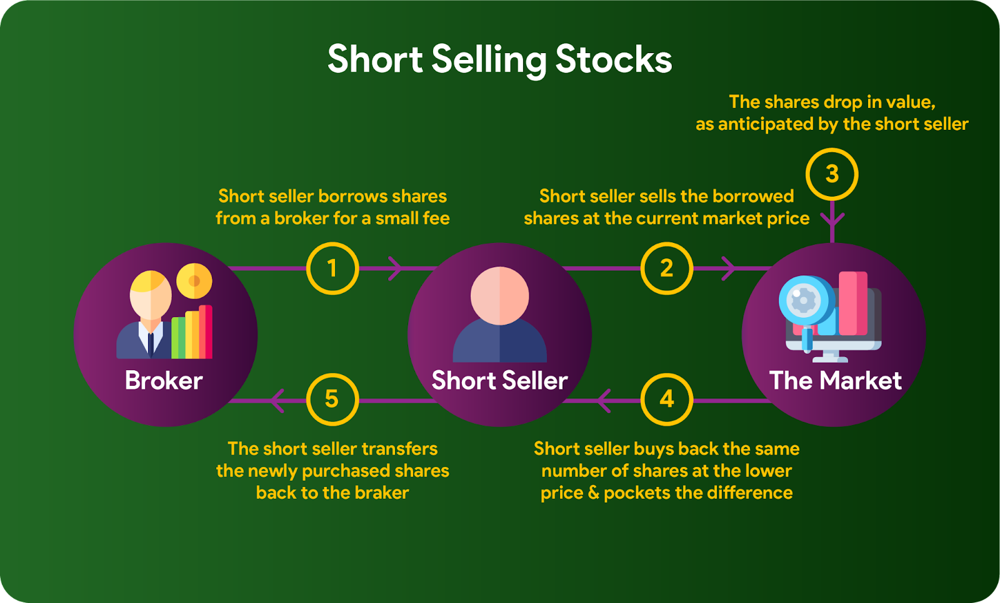

In the world of investing, a variety of strategies are adopted to enhance returns and mitigate risks. Among the spectrum of techniques, short selling and algorithmic trading, often referred to as algo trading, emerge as significant choices. Each of these strategies carries its own set of advantages and disadvantages, catering to a diverse array of investor preferences and risk appetites.

Short selling is a practice that involves selling borrowed stocks with the intention of repurchasing them at a lower price, thus profiting from the expected decline in stock value. On the other hand, algorithmic trading employs predefined rules and computer algorithms to execute trades, aiming to optimize trading conditions and eliminate emotional biases.

This article is designed to provide insights into the benefits and drawbacks of short selling and algo trading, offering valuable information to aid investors in making informed decisions. It is imperative for investors to gain a comprehensive understanding of these strategies before applying them to ensure alignment with their financial goals and risk tolerance. Through exploration of these investment methods, this article seeks to equip readers with the knowledge necessary to navigate the complexities of modern financial markets.

## Table of Contents

## What is Short Selling?

Short selling is a trading strategy primarily used for speculation and hedging, where investors aim to profit from a decline in a stock's price. The process involves borrowing shares from a broker and selling them on the open market, with the intention of buying them back later at a lower price and returning them to the lender. The difference between the selling price and the repurchase price represents the investor's profit or loss.

This strategy is typically employed when an investor anticipates that a particular stock will decrease in value. By selling borrowed shares at the current higher market price and repurchasing them after a price drop, the investor can realize a profit. However, should the stock price rise instead of fall, the investor will incur a loss, as they must purchase the shares at a higher price to return them to the lender.

A simple mathematical representation of the potential profit ($P$) in short selling is given by:

$$
P = (S_{\text{sell}} - S_{\text{buy}}) \times Q
$$

where:
- $S_{\text{sell}}$ is the price at which the stock was initially sold,
- $S_{\text{buy}}$ is the price at which the stock is repurchased,
- $Q$ is the quantity of shares sold.

Short selling carries the potential for high returns, particularly in bearish markets, but also entails significant risk due to its inherent market exposure. Unlike typical long investments where the maximum loss is limited to the total investment, short selling can result in theoretically unlimited losses, as a stock's price can rise indefinitely. As such, a thorough understanding of its mechanics and associated risks is crucial for investors considering this strategy.

## Pros of Short Selling

Short selling is an investment strategy that offers several advantages for investors looking to capitalize on market downturns. One of the primary benefits is the potential for high profits. By accurately predicting a decline in a stock's price, investors can achieve substantial returns. This is because short selling allows them to sell borrowed shares at current market prices and repurchase them at lower prices once the stock's value decreases. The profit from this strategy is essentially the difference between the initial sale price and the subsequent repurchase price minus any associated costs.

Short selling also serves as a useful hedging tool. By incorporating short positions within a broader investment portfolio, investors can offset potential losses from long positions in adverse market conditions. This dual approach can balance the portfolio's overall risk by providing gains from short positions when long-held stocks underperform. Hedging through short selling ensures that the portfolio is less sensitive to market [volatility](/wiki/volatility-trading-strategies) and downturns.

Additionally, short selling tends to perform well in bear markets. As the overall market or specific sectors experience declines, the opportunities for profits from short selling increase substantially. In these environments, the demand for securities that benefit from falling prices rises, positioning short sellers advantageously. Historical data suggests that bear markets often generate conditions favorable for short-selling strategies as declines can be more sharp and extended.

Moreover, leverage opportunities enhance the appeal of short selling. When engaging in margin trading, investors can borrow funds to increase their position sizes, thereby amplifying potential returns. While this capability introduces additional risks, it enables investors to magnify profits beyond their initial capital, assuming they can accurately predict price movements. Nonetheless, the use of leverage should always be approached with caution and a thorough understanding of its implications.

## Cons of Short Selling

Short selling presents several notable disadvantages that investors must weigh carefully. One of the most significant risks involved is the potential for unlimited losses. Unlike purchasing stocks, where losses are capped at the initial investment, short selling theoretically involves an infinite loss scenario. This occurs because a stock's price can rise indefinitely, while the gain from short selling is restricted to the stock declining to zero.

To engage in short selling, an investor must have a margin account. This requirement itself imposes additional costs and risks. Maintaining a margin account involves adhering to specific financial thresholds and regulations, which can present barriers for some investors. Moreover, margin accounts come with costs like interest charges on borrowed funds, exacerbating potential financial losses. Additionally, investors may face borrowing fees for the stocks they short, as well as the obligation to pay dividends if the stock pays them while being shorted.

The costs associated with short selling can be presented simply as:

$$
\text{Total Costs} = \text{Margin Interest} + \text{Borrowing Fees} + \text{Dividend Payments}
$$

Accurate market timing is another critical [factor](/wiki/factor-investing) and is inherently challenging. Short sellers need to correctly predict not only the direction of the stock price movement but also its timing. Market dynamics are influenced by a multitude of unpredictable variables, including macroeconomic factors, market sentiment, and geopolitical events. Misjudging any of these can result in substantial financial drawbacks.

Investors considering short selling should therefore be particularly informed about these risks and weigh them against potential rewards. Adopting this strategy without a comprehensive understanding of market mechanics and associated financial implications could lead to unfavorable investment outcomes.

## What is Algorithmic Trading?

Algorithmic trading, commonly known as algo trading, uses computer algorithms to execute trade orders in financial markets. These algorithms are pre-programmed with specific criteria based on various market variables such as price, timing, and [volume](/wiki/volume-trading-strategy). The objective of algo trading is to enhance trading efficiency by minimizing the impact of human emotions, optimizing conditions, and ensuring consistent trade execution.

A typical [algorithmic trading](/wiki/algorithmic-trading) system monitors market conditions and executes trades when predetermined conditions are met, aiming for precision and speed in transactions. Using mathematical models and statistical analysis, these algorithms determine the optimal points for buying and selling assets, often within milliseconds. For instance, an algorithm might be programmed to buy a stock when its 50-day moving average exceeds its 200-day moving average.

Algorithmic trading is prevalent across multiple financial markets, including stocks, foreign exchange ([forex](/wiki/forex-system)), and commodities. In the stock market, it accounts for a significant portion of total trading volume, offering the benefit of rapid execution, which is crucial in the fast-paced environment of financial markets. In forex trading, algorithms can take advantage of small price changes across vast currency portfolios, executing trades in global markets 24 hours a day. Similarly, in the commodities market, algo trading facilitates the swift and efficient handling of large volumes, which is advantageous given the market's size and volatility.

Moreover, the automation provided by algorithmic trading allows for high-frequency trading ([HFT](/wiki/high-frequency-trading-strategies)), where thousands of orders can be executed within seconds, benefiting from even minor fluctuations in price. HFT is a subset of algo trading characterized by short holding periods and high turnover rates, making speed and automated decision-making critical.

Implementing algorithmic trading requires technical knowledge and robust infrastructure, as it involves designing and [backtesting](/wiki/backtesting) algorithms on historical data to ensure their validity before live deployment. Despite its advantages, this trading method necessitates a comprehensive understanding to manage risks associated with automated trading systems effectively.

## Pros of Algorithmic Trading

Algorithmic trading, often abbreviated as algo trading, presents several advantages to investors and traders seeking to optimize their trading strategies through automation and technology. One of the primary benefits is the increased speed of trade execution. Unlike manual trading, where human reaction times can introduce delays, algorithmic trading utilizes computer algorithms capable of executing orders within microseconds. This ability to act almost instantaneously ensures that traders can capitalize on fleeting market opportunities and price discrepancies, potentially leading to improved trading outcomes.

Moreover, algo trading enhances accuracy, as it minimizes the errors that can occur during manual trading. Manual trading is susceptible to human errors such as incorrect order entry or timing mistakes. In contrast, algorithmic trading systems follow predefined instructions precisely, ensuring that trades are executed as intended without deviation. This precision contributes to a more consistent trading performance, free from the errors associated with human intervention.

The reduction in trading costs is another significant advantage of algorithmic trading. Efficiency in trade execution means that transactions can be carried out at lower costs. By optimizing the timing and execution of trades, algorithmic systems can reduce the bid-ask spreads and transaction costs, allowing traders to execute more trades without incurring excess expenses. This cost efficiency is particularly beneficial for high-frequency trading strategies that rely on executing a large number of trades in a short amount of time.

Furthermore, algorithmic trading minimizes the influence of human emotions in trading decisions. Emotional reactions, such as fear or greed, can lead to irrational decision-making and inconsistent trading outcomes. By automating trading decisions, algo trading ensures that actions are based on logic and data rather than emotional impulses. This removal of emotional bias leads to more consistent and disciplined trading strategies, which can enhance the overall effectiveness of the trading approach.

In summary, algorithmic trading offers considerable advantages, including rapid execution speed, improved accuracy, cost efficiency, and the removal of emotional biases, making it a powerful tool for traders looking to gain a competitive edge in various financial markets.

## Cons of Algorithmic Trading

Algorithmic trading, while offering numerous advantages, has several drawbacks that warrant careful consideration. One significant issue is the dependency on technology. Algorithmic trading systems are deeply reliant on computer hardware, software, and internet connectivity, meaning any technical failure, such as a server crash or network issue, can lead to substantial disruptions in trading activities. These interruptions can result in missed opportunities or unintended trades, which could impact investment returns. 

Another disadvantage is the reduction in human oversight. Algorithms operate based on predefined rules and historical data but lack the capacity to adapt to sudden market changes or nuances that a human trader might recognize. This limitation can result in poor decision-making during unexpected market events, leading to potential losses. Moreover, the lack of human intuition and experience in interpreting market changes can be a significant disadvantage in dynamic trading environments.

Algorithmic trading also requires a high level of technical expertise for development and implementation. Creating effective trading algorithms involves advanced programming skills and a strong understanding of quantitative analysis. This requirement can be a barrier for traders without a technical background, limiting their ability to leverage algorithmic trading effectively. Moreover, maintaining and updating algorithms to adapt to changing market conditions requires ongoing technical vigilance and expertise.

There is also a risk of over-optimization when designing trading algorithms. This occurs when algorithms are excessively fine-tuned to fit historical data, making them less adaptable to future market conditions. In statistical terms, this can be seen as an overfitting problem, where a model performs well on historical data but fails to generalize to new data. This risk underscores the importance of testing algorithms in various market conditions and ensuring they are robust enough to handle unforeseen events.

In conclusion, while algorithmic trading presents numerous benefits, its cons, such as technology dependency, loss of human oversight, requirement for technical expertise, and the risk of over-optimization, pose significant challenges. Understanding and mitigating these risks is essential for investors considering algorithmic trading as part of their strategy.

## Conclusion

Both short selling and algorithmic trading present distinct advantages and challenges, each resonating with different types of investors. Short selling can be attractive for investors looking to capitalize on declining markets, offering the potential for significant returns. However, it also carries an inherent high risk, primarily due to the possibility of unlimited losses if stock prices rise unexpectedly. This strategy calls for investors who are not only willing to accept substantial risk but are also adept at market analysis and timing.

On the other hand, algorithmic trading leverages technology to execute trades with precision and speed, reducing the likelihood of errors induced by human emotions. This automation enables quick responses to market conditions and optimized trade execution, potentially lowering transaction costs. However, algo trading demands a certain level of technical proficiency and an understanding of algorithmic logic. The reliance on technology poses risks such as system failures, emphasizing the need for robust technical infrastructure and oversight.

For investors considering these strategies, it is imperative to evaluate their risk tolerance, market understanding, and financial goals. Short selling might suit those who thrive in volatile markets and are comfortable with high stakes, whereas algo trading appeals to those who prioritize speed, accuracy, and consistency, backed by technological capabilities.

Making an informed decision between these strategies requires careful assessment of individual investment objectives and the ability to manage associated risks. By aligning strategy choices with personal investment criteria, investors can effectively harness these methods to enhance their investment outcomes, potentially yielding desirable financial returns while adhering to their risk management frameworks.

## References & Further Reading

[1]: ["Short Selling: Strategies, Risks, and Rewards"](https://www.amazon.com/Short-Selling-Strategies-Risks-Rewards/dp/0471660205) by Frank J. Fabozzi

[2]: ["Algorithmic Trading: Winning Strategies and Their Rationale"](https://www.wiley.com/en-us/Algorithmic+Trading%3A+Winning+Strategies+and+Their+Rationale-p-9781118460146) by Ernie Chan

[3]: ["Flash Boys: A Wall Street Revolt"](https://en.wikipedia.org/wiki/Flash_Boys) by Michael Lewis

[4]: Angel, J. J., Harris, L. E., & Spatt, C. S. (2015). ["Equity Trading in the 21st Century: An Update."](https://papers.ssrn.com/sol3/papers.cfm?abstract_id=1584026) The Quarterly Journal of Finance

[5]: Jones, C. M., & Lamont, O. A. (2002). ["Short-sale constraints and stock returns."](https://www.sciencedirect.com/science/article/pii/S0304405X02002246) Journal of Financial Economics