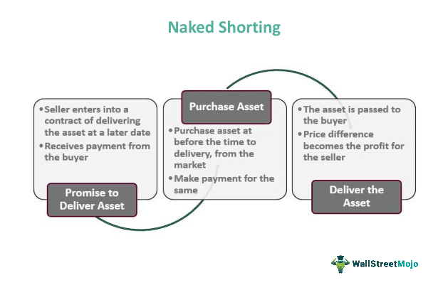

## Table of Contents

## What is short selling?

Short selling is when someone borrows a stock, sells it, and then buys it back later to return it. They do this because they think the price of the stock will go down. If the price does go down, they can buy the stock back for less than they sold it for and make a profit. But if the price goes up, they lose money because they have to buy it back at a higher price.

This can be risky because there's no limit to how much the stock price can go up. If it keeps going up, the person who short sold could lose a lot of money. Short selling is also controversial because some people think it can harm companies by driving down their stock prices. But others believe it helps keep the market balanced by allowing people to bet against overvalued stocks.

## Why would someone engage in short selling?

Someone might engage in short selling because they believe a stock's price is going to drop. They think the company is not doing well or that its stock is overvalued. By borrowing the stock and selling it at the current high price, they hope to buy it back later at a lower price. This way, they can return the borrowed stock and keep the difference as profit. It's like betting against the company, hoping to make money from its falling stock price.

However, short selling can be risky. If the stock price goes up instead of down, the person who short sold could lose a lot of money. There's no limit to how high the price can go, so their potential losses could be huge. Despite the risk, some people engage in short selling because they see it as a way to make money from stocks they believe are overvalued. It can also help balance the market by allowing people to bet against stocks that might be overpriced.

## How does the process of short selling work?

Short selling happens when someone thinks a stock's price will go down. They borrow the stock from someone else, like a broker, and then sell it right away at the current price. This is called "selling short." The goal is to buy the stock back later at a lower price so they can return it to the person they borrowed it from and keep the difference as profit.

Here's how it works in simple steps: First, they borrow the stock and sell it. Then, they wait for the price to drop. When it does, they buy the stock back at the lower price. Finally, they give the stock back to the person they borrowed it from. If the price did go down like they thought, they make money. But if the price goes up instead, they lose money because they have to buy it back at a higher price than they sold it for.

## What are the risks associated with short selling?

Short selling can be very risky. The biggest risk is that the stock price might go up instead of down. If that happens, the person who short sold has to buy the stock back at a higher price than they sold it for. This means they lose money. There's no limit to how high the stock price can go, so their losses could be huge. It's like betting against the stock, and if you're wrong, you could lose a lot.

Another risk is that the stock might be hard to borrow. If a lot of people want to short sell the same stock, there might not be enough shares available to borrow. This can make it hard to start or keep a short position. Also, the person who lent the stock might want it back before the short seller is ready to return it. This is called a "short squeeze," and it can force the short seller to buy the stock back quickly, even if the price is high.

Lastly, short selling can be emotionally stressful. Watching a stock price go up when you're betting on it to go down can be nerve-wracking. It's not just about the money; it's also about the pressure of being wrong. Short selling is not for everyone because it takes a strong stomach to handle the ups and downs of the stock market.

## What are the potential benefits of short selling?

Short selling can help investors make money when they think a stock's price will go down. If they're right, they can buy the stock back at a lower price than they sold it for, and keep the difference as profit. This can be a good way to earn money from stocks that are overvalued or from companies that are not doing well. It's like betting against the stock, and if the bet pays off, the investor can make a lot of money.

Short selling can also help the stock market work better. It lets people bet against stocks that might be too expensive, which can help keep prices more honest. When people short sell, it can put pressure on companies to do better or fix problems. This can make the market more balanced because it's not just about buying stocks that are going up; it's also about selling stocks that might be going down.

## Can you explain the concept of a short squeeze?

A short squeeze happens when a lot of people have short sold a stock, betting that its price will go down. But then something unexpected happens, and the stock price starts to go up instead. When this happens, the people who short sold the stock start to panic. They have to buy the stock back to return it to the person they borrowed it from. But because so many people are trying to buy the stock at the same time, the price keeps going up even more.

This can turn into a cycle where the rising price forces more short sellers to buy back the stock, pushing the price even higher. It's like a snowball effect. A short squeeze can make the stock price go up very quickly, and it can be very bad for the people who short sold the stock. They might lose a lot of money because they have to buy the stock back at a much higher price than they sold it for.

## What are the regulatory requirements for short selling?

There are rules that people have to follow when they want to short sell stocks. These rules are made by groups like the Securities and Exchange Commission (SEC) in the United States. One important rule is that you have to tell your broker that you're short selling. This is called marking the sale as a short sale. Another rule is that you can't short sell a stock if it's going to make the price go down too much. This is called the uptick rule, which means you can only short sell if the last price change was up.

There are also rules about how long you can keep the stock you borrowed. You have to return it to the person you borrowed it from after a certain time. And if a lot of people are short selling the same stock, the rules might say that you have to wait longer before you can borrow more of that stock. These rules are there to make sure that short selling is done fairly and doesn't hurt the stock market too much.

## How does short selling impact the market?

Short selling can have a big effect on the stock market. When a lot of people short sell a stock, it can make the price go down. This happens because they're selling the stock, and more selling means the price usually goes down. Short selling can also make the market more honest. If a stock is too expensive, short sellers can help bring the price down to what it should be. This can be good for the market because it stops stocks from being too overvalued.

But short selling can also cause problems. If too many people short sell at the same time, it can make the market go crazy. This can lead to something called a short squeeze, where the price goes up a lot because short sellers have to buy the stock back. This can be bad for the short sellers and can make the market unstable. So, short selling can help keep the market balanced, but it can also make things more risky and unpredictable.

## What are some famous examples of short selling?

One famous example of short selling is what happened with the company Enron in the early 2000s. Enron was a big energy company that was doing very well, but some people thought it was hiding problems. A few investors, like Jim Chanos, thought Enron's stock was too expensive and that the company was not as good as it seemed. They started short selling Enron's stock. When Enron's problems came out and the company went bankrupt, the stock price fell a lot. The short sellers made a lot of money because they bet the price would go down, and it did.

Another example is the short selling of Volkswagen stock in 2008. A lot of people thought Volkswagen was overvalued and started short selling its stock. But then Porsche, another car company, said it owned a lot more Volkswagen stock than people thought. This made the price of Volkswagen's stock go up a lot because there weren't many shares left to buy. This caused a big short squeeze, where short sellers had to buy back the stock at a much higher price. Many of them lost a lot of money because they couldn't buy the stock back at a low price like they thought they could.

## How can an investor manage the risks of short selling?

An investor can manage the risks of short selling by doing a lot of research first. They need to understand the company they're betting against and make sure they have good reasons to think the stock price will go down. They should also keep an eye on the news and any changes in the company or the market that could affect the stock price. By staying informed, they can make better decisions about when to start and stop short selling.

Another way to manage risk is by setting limits on how much they're willing to lose. This is called a stop-loss order. If the stock price starts going up instead of down, the stop-loss order will automatically buy the stock back at a certain price, so the investor doesn't lose too much money. It's also a good idea to not put all their money into one short sale. By spreading their money across different stocks, they can lower the risk of losing everything if one short sale goes wrong.

## What are the differences between short selling stocks and other assets?

Short selling stocks and short selling other assets like commodities or currencies work in similar ways, but there are some differences. When you short sell a stock, you're betting that the price of a company's shares will go down. You borrow the stock, sell it, and hope to buy it back later at a lower price. With other assets like commodities, you're betting on the price of things like gold or oil going down. You might use futures contracts or other financial tools to do this. The main difference is that stocks represent ownership in a company, while commodities are physical goods.

Another difference is how easy it is to borrow the asset. Stocks are usually easier to borrow because there are a lot of shares available through brokers. Commodities and currencies might be harder to borrow, and you might need to use different financial tools to short sell them. Also, the rules and regulations for short selling can be different for stocks compared to other assets. For example, there might be more rules about short selling stocks to stop the market from getting too unstable.

## How does short selling fit into broader investment strategies?

Short selling can be part of a bigger plan for investing. Some people use it to balance out their other investments. For example, if someone thinks the whole market or a certain industry will go down, they might short sell some stocks to make money if that happens. This can help protect their other investments that might lose value if the market goes down. It's like a way to bet against the market, which can be useful if someone wants to make money no matter if the market goes up or down.

Short selling can also be used to find good deals. If someone thinks a stock is too expensive, they might short sell it and then buy it back later when the price is lower. This can be a way to buy stocks at a better price. But short selling is risky, so it's usually used by people who know a lot about the market and are willing to take big risks. It's not for everyone, but it can be a powerful tool for those who use it right.

## What is Short Selling and How Does it Work?

Short selling is a financial strategy employed by investors who anticipate a decline in the price of a particular stock or security. The essence of short selling involves borrowing shares from a broker and selling them on the open market at the prevailing price, with the aim of buying them back later at a lower price. The difference between the higher selling price and the lower purchase price constitutes the profit, assuming the investor's predictions materialize as expected.

This strategy is notably high-risk, as it depends on accurately predicting market trends and stock movements. Instead of profiting from a stock's appreciating value, short sellers gain from its depreciation, a reversal of the conventional investing objective. Hence, it requires meticulous market analysis and informed predictions regarding potential downturns in stock value. The inherent risk lies in the fact that stock prices can, theoretically, rise indefinitely, leading to unlimited potential losses for the short seller.

Engaging in short selling involves several key steps. Initially, the investor contacts a brokerage firm to borrow shares, which are usually held by other investors. The brokerage houses facilitate the borrowing process and may charge a lending fee for their services. Subsequently, the short seller sells these borrowed shares in the market at the current market price. Over time, if the stock's price falls as anticipated, the short seller can then purchase the shares at the reduced price. The final step is to return the bought shares to the lender. The profit from short selling is calculated as:

$$
\text{Profit} = (\text{Initial Selling Price} - \text{Repurchase Price}) \times \text{Number of Shares} - \text{Transaction Costs}
$$

Transaction costs include brokerage fees and interest paid on the borrowed shares. An investor considering short selling must also maintain a margin account with the broker, which involves placing a margin deposit as collateral for the borrowings. This requirement ensures that the broker is protected against potential losses if the market moves against the investor’s bet.

Due to the potential for significant loss, where a poor market move can result in a short squeeze, short selling should be approached with a robust risk management strategy. A short squeeze occurs when a heavily shorted stock's price starts rising, forcing short sellers to buy back shares at higher prices to cover their positions, which in turn drives the price even higher. Thus, short selling, while potentially lucrative, demands caution and strategic execution.

## References & Further Reading

For further insights, consult works like "Advances in Financial Machine Learning" by Marcos Lopez de Prado, which investigates into [machine learning](/wiki/machine-learning) techniques applied to financial markets, helping traders to develop algorithms that can process massive amounts of data for decision-making. This book covers advanced topics such as [backtesting](/wiki/backtesting), feature importance, and strategies for dealing with market microstructure noise, offering valuable guidance for algorithmic traders looking to refine their approaches.

"Quantitative Trading" by Ernest P. Chan offers foundational knowledge for developing algorithmic strategies. The book is a practical guide to creating your quantitative strategies, covering essential topics such as strategy creation, trading infrastructure, backtesting, and implementation. It employs a hands-on approach, providing examples and Python code snippets that facilitate a deeper understanding of quantitative trading systems.

Exploring case studies and continuous learning are pivotal for thriving in today's financial landscape. Engaging with detailed analyses of historical market events, such as the 2021 GameStop short squeeze, can provide meaningful insights into the behavior of both human and algorithmic traders in high-stress situations. Continuous education through online courses, such as those offered by platforms like Coursera or edX in financial markets, algorithm development, and risk management, will help investors stay informed. Additionally, staying updated with the latest research published in financial journals and participating in webinars hosted by financial analysts and economists will contribute to maintaining a competitive edge in the financial markets.

