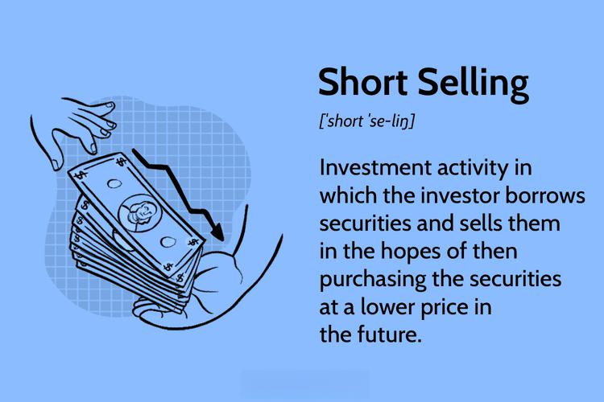

Investment strategies are inherently complex and multidimensional, encapsulating a variety of asset classes and techniques. Among these, bonds, short selling, and algorithmic trading stand out for their distinctive properties and their inherent risks. Each of these strategies brings something unique to the table, and understanding them is crucial for investors striving to diversify their portfolios and manage risk effectively.

Bonds serve as a cornerstone in many portfolios, offering relatively stable returns compared to the more volatile stock markets. They are debt securities issued by governments or corporations, representing loans made by investors to the issuer. As a part of a well-rounded investment approach, they provide a platform for various strategies, including yield curve strategies, where an investor seeks to capitalize on shifts in interest rate expectations, or credit spread strategies, focusing on the differences in yield between different issuers. Mastery of bond investment requires a thorough understanding of the associated risks such as credit risk, interest rate risk, and inflation risk.

Short selling in bond markets adds another layer of complexity. Unlike the common practice of short selling stocks, short selling bonds involves unique challenges, primarily due to the need to borrow the bonds to sell them, which incurs interest obligations on the borrowed securities. Despite these hurdles, short selling offers the potential to profit from anticipated decreases in bond prices, although it demands a sophisticated understanding of market dynamics. Investors may alternatively use inverse bond exchange-traded funds (ETFs) to achieve similar goals without the direct complexities of short selling. However, these instruments bring their own set of challenges, such as higher expenses and the necessity for meticulous market analysis.

Algorithmic trading represents a technological evolution in investing. By utilizing computer algorithms, traders can automatically execute decisions based on predetermined criteria such as timing, price, or volume. In the context of bond markets, algorithmic trading is praised for its ability to swiftly process large datasets and execute orders at high speed, optimizing for risk-adjusted returns. Yet, the success of automated trading heavily relies on continuous monitoring and adjustment of strategies in response to the ever-changing market conditions, underscoring the importance of robust risk management protocols.

In conclusion, for investors aiming to enhance their portfolios, understanding these strategies' nuances and risks is paramount. The synergy of bonds, short selling, and algorithmic trading offers tools to navigate market fluctuations and achieve diverse financial goals. By integrating these approaches, investors can potentially improve their investment returns while managing the inherent risks.

## Table of Contents

## Understanding Bonds and Investment Strategies

Bonds, as fundamental financial instruments, are debt securities issued by governmental entities or corporations with the primary objective of raising capital. They play a critical role in the global financial markets because of their capacity to generate relatively stable returns compared to equities. The perceived stability of bonds stems from their structure, where issuers are contractually obligated to repay the principal amount along with periodic interest payments, also known as coupon payments, over a specified period.

Investors employ various bond trading strategies to optimize their returns and align with specific investment goals. These strategies generally include:

1. **Yield Curve Strategies**: This involves exploiting shifts in the yield curve, which is a graphical representation of interest rates across different bond maturities. There are three primary strategies concerning the yield curve:
   - **Bullet Strategy**: Concentrates bond investments around a single maturity point, betting on a particular segment of the curve experiencing favorable yield shifts.
   - **Barbell Strategy**: Allocates investments between short-term and long-term maturities, balancing the risks of interest rate fluctuations across different segments of the yield curve.
   - **Ladder Strategy**: Spreads investments evenly across various maturities, aiming for diversification and reducing reinvestment risk.

2. **Duration Strategies**: Duration measures the sensitivity of a bond's price to interest rate changes and is commonly used to manage interest rate risk. Strategies focused on duration involve adjusting the portfolio's average duration to either protect against or benefit from expected movements in interest rates. A portfolio manager may increase duration in anticipation of declining rates or decrease it in a rising rate environment.

3. **Credit Spread Strategies**: This approach focuses on the difference in yield between bonds with different credit qualities. Investors attempt to take advantage of perceived mispricing in bonds' credit spreads. For instance, if the spread between high-yield (junk) bonds and investment-grade bonds narrows, a strategy might involve buying high-yield bonds anticipating further spread tightening.

Understanding and mitigating risks inherent in bond investments is crucial for developing a robust investment strategy. The primary risks are:

- **Credit Risk**: The possibility that a bond issuer may default on its obligations, leading to potential losses for the bondholder. Credit risk is often assessed through credit ratings provided by agencies like Moody's, S&P Global, and Fitch Ratings.

- **Interest Rate Risk**: The risk that changes in interest rates will affect bond prices inversely. As interest rates rise, existing bond prices typically fall, and vice versa. This risk is particularly significant for long-duration bonds.

- **Inflation Risk**: The danger that rising inflation will erode the purchasing power of a bond's future cash flows. Inflation-indexed bonds, such as Treasury Inflation-Protected Securities (TIPS) in the United States, are specifically designed to mitigate this risk.

Investors must carefully analyze these factors to create bond investment strategies that achieve desired outcomes while managing the various risks associated with such investments. This nuanced approach enables investors to capitalize on bonds' unique characteristics, tailoring their portfolio to meet specific return requirements and risk tolerances.

## Short Selling in Bond Markets

Short selling is a sophisticated investment strategy that involves selling securities not currently owned by the investor, with the intention of repurchasing them at a lower price in the future. In the context of bond markets, short selling can be particularly complex due to the specific mechanics and risks associated with bonds.

Short selling bonds typically requires an investor to borrow the bonds, sell them in the market, and later repurchase them to return to the lender. This process is inherently more complex than short selling stocks for several reasons. One primary complexity is the interest obligation on borrowed bonds. When an investor borrows bonds to short sell, they must pay interest to the lender, which can affect the profitability of the trade. The interest rates in the bond market—often influenced by central banks—can fluctuate, adding another layer of risk for those engaging in short selling.

Additionally, the bond market is less transparent and less liquid than the equity market. Bonds are traded over-the-counter (OTC), meaning that finding a willing lender or buyer can be more difficult and costly. These transactions often require relationships with brokers and other market participants who facilitate the borrowing and selling of bonds.

An alternative approach to short selling bonds directly is to utilize inverse bond exchange-traded funds (ETFs). Inverse bond ETFs are designed to move inversely to the performance of bond indices. For example, if a particular bond index falls by 1%, an inverse bond [ETF](/wiki/etf-trading-strategies) should rise by approximately 1%, before expenses. These ETFs allow investors to profit from falling bond prices without engaging in the intricate process of borrowing and short selling bonds. However, they come with their own set of challenges. Inverse bond ETFs typically have higher expense ratios compared to traditional ETFs due to the complexity of achieving inverse returns. Additionally, they require investors to possess a keen understanding of market conditions and timing to effectively utilize them as a part of their investment strategy.

Despite these complexities, short selling bonds and utilizing inverse bond ETFs can be beneficial strategic tools for investors who anticipate a downturn in bond prices. Effective use of these strategies requires careful analysis of interest rates, economic indicators, and market trends. Understanding the mechanics and risks associated with each method is essential for investors aiming to capitalize on declining bond prices while managing potential downsides.

## Algorithmic Trading in Bond Markets

Algorithmic trading involves the use of computer algorithms to make trading decisions based on predefined criteria such as timing, price, or [volume](/wiki/volume-trading-strategy). In bond markets, this practice has gained significant attention due to its ability to manage extensive datasets and execute trades rapidly and efficiently. 

The integration of [algorithmic trading](/wiki/algorithmic-trading) in bond markets is driven by the need for optimization of risk-adjusted returns. Bonds, as financial instruments, offer unique challenges, including varied pricing structures, credit ratings, and [interest rate](/wiki/interest-rate-trading-strategies) sensitivity, which algorithms can process more effectively than traditional methods. By employing quantitative models, algorithms can scan through vast data points, identify trends, and execute trades faster than human traders, thereby increasing market [liquidity](/wiki/liquidity-risk-premium) and efficiency.

A key advantage of algorithmic trading is its capacity to reduce transaction costs by minimizing human errors and leveraging favorable market conditions swiftly. For example, algorithms can be designed to optimize bond portfolios by dynamically adjusting duration and credit exposure in response to fluctuations in interest rates or economic outlooks, thus improving the Sharpe ratio, which measures risk-adjusted returns.

However, the implementation of algorithmic trading in bond markets comes with its own set of challenges. The primary concern is the constant need for monitoring and real-time adjustments to account for evolving market conditions. Market [volatility](/wiki/volatility-trading-strategies), regulatory changes, and unexpected economic events can impact the effectiveness of algorithmic models, necessitating continuous updates and recalibration. This dynamic environment requires sophisticated risk management frameworks to ensure that strategies remain robust and adaptive.

Moreover, the reliance on algorithmic trading underscores the importance of high-quality data and advanced analytics infrastructure. Inaccurate data inputs or delays in data processing can lead to suboptimal trading decisions. Thus, ensuring data integrity and developing fail-safe protocols are critical components for successful algorithmic trading in bond markets.

Overall, algorithmic trading offers significant potential for enhancing trading operations in bond markets. By streamlining transaction processes and improving decision-making speed, algorithms enable traders to capitalise on market opportunities more effectively, provided they are supported by ongoing monitoring and adaptation strategies.

## Combining Strategies: Diversification and Risk Management

Combining various investment strategies, such as bond investments, short selling, and algorithmic trading, offers a robust approach to managing financial portfolios through diversification and risk management. Each strategy contributes unique benefits and risks, allowing investors to tailor their investment approaches according to their risk tolerance and financial goals.

Bonds represent a crucial component of a diversified investment portfolio. They typically exhibit low correlation with stocks, which can lead to reduced overall portfolio volatility. This characteristic makes bonds a stabilizing asset, providing a counterbalance to the higher volatility often associated with equity investments. For instance, during periods of economic uncertainty, when stock markets might experience significant fluctuations, bonds often perform more consistently, helping to maintain portfolio value.

Short selling, when executed alongside traditional bond investments, can serve as a hedging mechanism. It allows investors to potentially profit from declining bond prices, thus offsetting losses in other areas of their portfolios. This strategy requires sophisticated market insights and timing, given the complexities involved in borrowing and selling bonds. However, it can be an effective tool for investors seeking to capitalize on market downturns or credit events affecting specific issuers.

Algorithmic trading introduces efficiency into the investment process by employing algorithms to execute trades based on pre-defined criteria. In combining this with bond investments, investors can enhance their ability to respond swiftly to market dynamics, optimizing transaction costs and capturing short-lived market opportunities. Algorithmic systems can process vast amounts of market data, facilitating more informed decision-making that aligns with an investor's risk-return profile.

The integration of diverse strategies supports the primary goal of achieving consistent returns while managing risks effectively. For example, consider a portfolio where bonds (B), stocks (S), and short selling strategies (SS) are combined to optimize returns (R). The expected return $E(R)$ of the portfolio could be calculated using:

$$
E(R) = w_B \cdot E(B) + w_S \cdot E(S) + w_{SS} \cdot E(SS)
$$

where $w_B$, $w_S$, and $w_{SS}$ represent the weights of bonds, stocks, and short selling in the portfolio, respectively. Each component contributes to the portfolio's risk-return characteristics, allowing investors to fine-tune their allocation to suit market conditions and personal investment principles.

Through these methods, investors can construct portfolios that are not only diversified across asset classes but also across strategic approaches. This comprehensive diversification helps mitigate the impact of adverse market movements associated with any single strategy, thus smoothing returns over time and enhancing the potential for long-term financial growth.

## Conclusion

The multifaceted world of bonds, short selling, and algorithmic trading provides investors with a wide range of tools to achieve diverse financial goals. These strategies, while complex, offer various pathways to potentially enhance investment returns. Bonds serve as a relatively stable investment option, helping to balance the intrinsic volatility of stocks and other risk-heavy assets. By short selling bonds, investors can profit from declining bond prices, albeit with additional complexities and risks that require careful management. 

Algorithmic trading has introduced a new dimension to financial markets, using sophisticated algorithms to execute trades more efficiently. Such automated systems can process vast amounts of data rapidly, optimizing for parameters like risk-adjusted returns. However, this technology demands a thorough understanding to respond to evolving market conditions effectively. Monitoring and adjusting algorithms is essential to mitigate the risks inherent in automated trading, ensuring these systems function as intended.

Understanding the nuances and risks associated with each of these strategies is essential for investors looking to leverage them effectively. Diversification remains a powerful risk management tool, often achieved by integrating bonds with stocks, employing short selling tactics, or utilizing algorithmic trading. This strategic amalgamation can reduce overall portfolio volatility, providing a measure of stability while pursuing higher returns. 

Incorporating these investment strategies into a diversified portfolio equips investors to better navigate market fluctuations. Through careful analysis and application of these approaches, investors stand to improve their ability to achieve consistent returns, adapt to change, and capitalize on market opportunities.

## References & Further Reading

[1]: ["The Bond Book: Everything Investors Need to Know About Treasuries, Municipals, GNMAs, Corporates, Zeros, Bond Funds, Money Market Funds, and More"](https://www.amazon.com/Bond-Book-Third-Everything-Treasuries/dp/007166470X) by Annette Thau

[2]: ["Fixed Income Analysis"](https://en.wikipedia.org/wiki/Fixed_income_analysis) by Barbara S. Petitt

[3]: ["Advances in Financial Machine Learning"](https://www.amazon.com/Advances-Financial-Machine-Learning-Marcos/dp/1119482089) by Marcos Lopez de Prado

[4]: ["Quantitative Trading: How to Build Your Own Algorithmic Trading Business"](https://www.amazon.com/Quantitative-Trading-Build-Algorithmic-Business/dp/1119800064) by Ernest P. Chan

[5]: ["Short Selling: Strategies, Risks, and Rewards"](https://www.amazon.com/Short-Selling-Strategies-Risks-Rewards/dp/0471660205) by Frank J. Fabozzi

[6]: ["Machine Learning for Algorithmic Trading"](https://github.com/stefan-jansen/machine-learning-for-trading) by Stefan Jansen