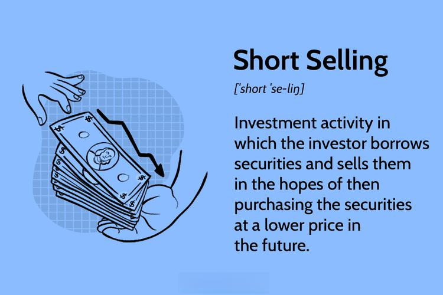

## Table of Contents

## What is short selling?

Short selling is when someone borrows a stock or another asset and sells it, hoping to buy it back later at a lower price. This is done because the person believes the price of the asset will go down. They make a profit if they can buy it back cheaper than they sold it for. For example, if someone borrows and sells a stock for $100, and later buys it back for $80, they make a $20 profit after returning the stock.

However, short selling can be risky. If the price of the asset goes up instead of down, the person who short sold will lose money. They have to buy the asset back at a higher price than they sold it for. For instance, if the stock they sold for $100 goes up to $120, they lose $20 when they buy it back. Short selling is often used by experienced investors who are willing to take on more risk for the chance of higher rewards.

## How does short selling work?

Short selling works by borrowing a stock or another asset from someone else, usually a broker, and then selling it right away. The person who does this believes the price of the stock will go down. So, they sell the stock at its current high price, hoping to buy it back later when it's cheaper. For example, if someone borrows and sells a stock for $50, they keep the $50. If the price drops to $40, they can buy the stock back for $40, return it to the broker, and keep the $10 difference as profit.

But short selling can be risky. If the price of the stock goes up instead of down, the person who short sold will lose money. They'll have to buy the stock back at a higher price than they sold it for. For instance, if the stock they sold for $50 goes up to $60, they lose $10 when they buy it back. This is why short selling is usually done by people who know a lot about the stock market and are okay with taking big risks for the chance of big rewards.

## What is company float?

Company float, often just called "float," is the total number of a company's shares that are available for the public to buy and sell on the stock market. This number does not include shares that are owned by company insiders, like executives or big investors, who might not want to sell them right away. So, the float is really just the part of the company that regular people can trade.

The size of the float can affect how the stock's price moves. If a company has a small float, meaning fewer shares are available to trade, the stock price can go up and down a lot because there are fewer shares to go around. On the other hand, if a company has a big float, with lots of shares available, the stock price might not change as much because there are more shares to buy and sell. This is why investors pay attention to the float when they are thinking about buying or selling a stock.

## Why is company float important for short selling?

Company float is important for short selling because it shows how many shares are available to borrow and sell. When someone wants to short sell a stock, they need to borrow shares first. If the float is small, there are fewer shares to borrow, which can make it harder to short sell. A small float can also mean that the stock price can move a lot because there are fewer shares to trade. This can be good for short sellers if the price goes down, but it can also be risky if the price goes up.

On the other hand, if the float is big, there are more shares available to borrow and sell. This can make it easier to short sell because more shares are available. But, a big float can also mean that the stock price might not move as much, which can make it harder for short sellers to make a big profit. So, when thinking about short selling, it's important to look at the company's float to understand how easy or hard it might be and how much the stock price might change.

## What are the risks associated with short selling?

Short selling can be risky. One big risk is that the stock price might go up instead of down. If this happens, the person who short sold has to buy the stock back at a higher price than they sold it for. This means they lose money. For example, if someone sells a stock for $50 and it goes up to $60, they lose $10 when they buy it back. This risk can be really big if the stock price goes up a lot.

Another risk is that short selling can be hard to do. To short sell, you need to borrow the stock first. If not many shares are available to borrow, it can be tough to short sell. This is more likely to happen with stocks that have a small float. Also, there might be fees to borrow the stock, and these fees can add up and eat into any profits. So, short selling can be tricky and expensive, and it's not for everyone.

## How can short selling affect a company's stock price?

Short selling can make a company's stock price go down. When a lot of people short sell a stock, it means they are selling it and hoping to buy it back cheaper later. All this selling can push the stock price down because there are more people wanting to sell than to buy. If the price keeps going down, it can make other people nervous, and they might start selling their shares too, making the price drop even more.

But short selling can also make the stock price go up if things don't go as the short sellers planned. If the stock price starts to go up instead of down, the short sellers have to buy the stock back at a higher price. This buying can push the stock price up because there are more people wanting to buy than to sell. If a lot of short sellers have to buy back at the same time, it can cause a big jump in the stock price, which is called a short squeeze.

## What is a short squeeze and how does it relate to company float?

A short squeeze happens when a lot of people who short sold a stock have to buy it back quickly because the price is going up instead of down. When short sellers see the price going up, they rush to buy the stock to cut their losses. This rush to buy can make the stock price go up even more because there are more people wanting to buy than to sell. This can be bad for the short sellers because they lose more money as the price keeps going up.

The company float is important for short squeezes because it shows how many shares are available to trade. If a company has a small float, there are fewer shares to buy and sell. When a short squeeze happens with a small float, the price can go up a lot because there are not many shares to go around. On the other hand, if a company has a big float, there are more shares available, so a short squeeze might not push the price up as much. So, the size of the float can make a big difference in how strong a short squeeze can be.

## What are the regulatory considerations for short selling?

Short selling has rules that people need to follow. Different countries have their own rules, but many of them want to make sure short selling is done fairly and doesn't hurt the stock market. For example, in the United States, the Securities and Exchange Commission (SEC) has rules that say you have to tell them if you short sell a lot of a certain stock. This helps them keep an eye on the market and stop any bad behavior. Another rule is that you can't short sell a stock and then buy it back right away to make the price go down on purpose. This is called a "short and distort" scheme, and it's against the rules.

Some countries also have rules about how long you can keep a short position open. For example, in Europe, there's a rule that says you have to close your short position if it gets too big. This is to stop people from short selling too much and causing the stock price to drop a lot. Also, during times when the market is really shaky, some countries might put a ban on short selling to calm things down. These rules are there to make sure short selling is done in a way that's fair and doesn't hurt the market or other investors.

## How do investors locate shares to short sell?

When investors want to short sell a stock, they need to find shares to borrow first. They usually do this by talking to their broker. The broker can look through their own inventory or check with other big investors to see if they have shares they can lend out. Sometimes, the broker might use a stock loan platform to find shares from other places. This can take some time, so investors need to be patient and keep in touch with their broker to make sure they can get the shares they need.

Once the shares are found, the investor and the lender agree on how long the shares can be borrowed and what fees need to be paid. These fees can change depending on how hard it is to find the shares. If a stock is really popular and not many shares are available, the fees can be higher. After everything is agreed on, the investor can then sell the borrowed shares and start their short selling plan.

## What are the differences between short selling and put options?

Short selling and put options are both ways to make money if you think a stock's price will go down, but they work differently. Short selling is when you borrow a stock and sell it right away, hoping to buy it back later at a lower price. If the price does go down, you buy it back cheaper, return the stock to the person you borrowed it from, and keep the difference as profit. But if the price goes up, you lose money because you have to buy it back at a higher price.

Put options, on the other hand, give you the right, but not the obligation, to sell a stock at a certain price before a certain date. You buy a put option if you think the stock's price will go down. If it does, you can sell the stock at the higher price you set in the option and make a profit. If the stock's price stays the same or goes up, you just let the option expire and you only lose the money you paid for the option. So, put options can be less risky than short selling because you know the most you can lose upfront.

## How does the availability of float influence short interest?

The availability of a company's float, which is the number of shares that the public can trade, can affect how many people want to short sell that stock. If a company has a small float, it means there are not many shares to borrow and sell. When there are fewer shares to go around, it can be harder for people to short sell because they might not be able to find shares to borrow. This can make the short interest, which is the total number of shares that have been short sold, lower because fewer people can do it.

On the other hand, if a company has a big float, there are more shares available to borrow and sell. This can make it easier for people to short sell because there are more shares to go around. When it's easier to short sell, more people might do it, which can make the short interest higher. So, the size of the float can have a big impact on how many people are short selling a stock.

## What advanced strategies can be used to manage short positions in relation to float?

When managing short positions, one advanced strategy is to pay close attention to the company's float. If the float is small, it means there are not many shares to borrow and sell. This can make it harder to short sell, but it can also mean that if the stock price starts to go down, it might go down a lot because there are fewer shares to trade. So, if you think the stock price will go down, you might want to short sell it when the float is small, but you also need to be careful because it can be hard to find shares to borrow.

Another strategy is to watch for signs of a short squeeze. If the float is small and a lot of people are short selling, the stock price can go up a lot if it starts to move in the other direction. To manage this risk, you might want to set a stop-loss order, which is a way to tell your broker to buy the stock back if the price goes up too much. This can help limit your losses if the stock price goes up instead of down. Also, keeping an eye on the short interest, which is how many shares have been short sold, can give you clues about how likely a short squeeze is and help you decide when to close your short position.

## References & Further Reading

[1]: [SEC Initial Public Offering Filings](https://www.sec.gov/resources-small-businesses/going-public) - U.S. Securities and Exchange Commission

[2]: [Short Selling: Finding Unborrowable Stocks in NASDAQ](https://www.nasdaq.com/articles/a-deep-dive-into-how-short-selling-really-works) - Nasdaq

[3]: "Flash Boys: A Wall Street Revolt" by Michael Lewis - A book discussing high-frequency trading and its impact on financial markets.

[4]: [The Impact of High-Frequency Trading on Stock Market Liquidity Measures](https://papers.ssrn.com/sol3/papers.cfm?abstract_id=2278428) - Board of Governors of the Federal Reserve System

[5]: "The Intelligent Investor" by Benjamin Graham - Although primarily about value investing, this book provides insights into various market strategies, including those relevant to short selling.

[6]: [Understanding Algorithmic Trading Strategies](https://www.investopedia.com/articles/active-trading/101014/basics-algorithmic-trading-concepts-and-examples.asp) - Investopedia article on different algorithmic trading strategies.

[7]: ["Dark Pools: The Rise of the Machine Traders and the Rigging of the U.S. Stock Market"](https://www.amazon.com/Dark-Pools-Machine-Traders-Rigging/dp/0307887189) by Scott Patterson