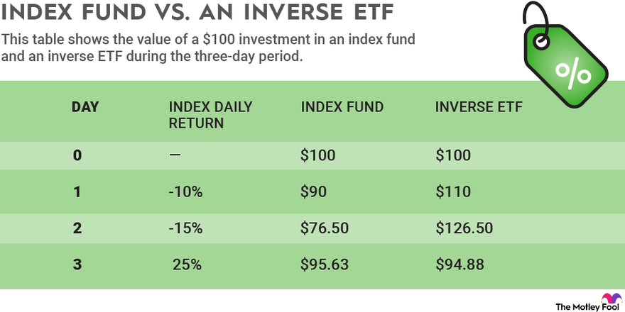

## Table of Contents

## What is short selling and how does it work?

Short selling is when someone borrows a stock, sells it, and hopes to buy it back later at a lower price. This is done because the person believes the price of the stock will go down. If the price does go down, they can buy the stock back cheaper than they sold it, return the borrowed stock, and keep the difference as profit.

However, short selling can be risky. If the stock price goes up instead of down, the person who short sold will lose money. They will have to buy the stock back at a higher price to return it, which means they lose the difference between the price they sold it for and the higher price they had to pay to buy it back. It's like betting that something will decrease in value, which can be tricky and lead to big losses if the bet is wrong.

## What are ETFs and how do they differ from index funds?

ETFs, or Exchange-Traded Funds, are a type of investment that holds a collection of stocks, bonds, or other assets. They are like a basket where you can buy and sell shares throughout the day on a stock exchange, just like you would with individual stocks. This means you can see the price change and trade them whenever the market is open. ETFs often try to mimic the performance of a specific index, like the S&P 500, but they can also focus on certain sectors, like technology or healthcare.

Index funds are similar to ETFs because they also aim to match the performance of a particular index. The main difference is that index funds are usually mutual funds, which means you can only buy or sell them at the end of the trading day at the net asset value price. They are not traded on an exchange like ETFs. Also, index funds often have lower costs and are more straightforward to invest in, making them a popular choice for people who want a simple, long-term investment.

## Can you short sell ETFs, and if so, how?

Yes, you can short sell ETFs, just like you can with individual stocks. To do this, you need to borrow the ETF shares from someone else, usually through a broker. Once you have borrowed the shares, you sell them on the market at the current price. Your hope is that the price of the ETF will go down. If it does, you can buy the ETF shares back at a lower price, return them to the person you borrowed them from, and keep the difference as your profit.

However, short selling ETFs can be risky. If the price of the ETF goes up instead of down, you will lose money. You'll have to buy the shares back at a higher price to return them, which means you'll lose the difference between the price you sold them for and the higher price you had to pay to buy them back. It's like betting that the ETF will decrease in value, which can be tricky and lead to big losses if you're wrong.

## Is it possible to short sell index funds, and what are the challenges?

Short selling index funds is not as straightforward as short selling stocks or ETFs. Index funds are mutual funds, and you can't directly borrow and sell shares of a mutual fund like you can with stocks or ETFs. To short sell an index fund, you would need to find a way to short the underlying index or use financial instruments like inverse ETFs or options that track the index. This makes the process more complicated and less direct than short selling stocks or ETFs.

The challenges of short selling index funds are significant. First, because you can't directly short a mutual fund, you need to use other methods which can be more expensive and involve more risk. Second, the costs associated with these alternative methods, like fees for inverse ETFs or options, can eat into your potential profits. Finally, since index funds are designed to track the market, shorting them means betting against the overall market, which can be risky and lead to big losses if the market goes up instead of down.

## What are the risks associated with short selling ETFs?

Short selling ETFs can be risky. One big risk is that if the price of the ETF goes up instead of down, you lose money. When you short sell, you borrow the ETF and sell it, hoping to buy it back cheaper later. If the price goes up, you have to buy it back at a higher price to return it, and that means you lose money on the difference. This can lead to big losses if the ETF's price rises a lot.

Another risk is that short selling involves borrowing, and you might have to return the ETF before you want to. If many people are short selling the same ETF, and the price starts to go up, there can be a "short squeeze." This happens when everyone tries to buy back the ETF at the same time to limit their losses, which pushes the price up even more. It can be hard to get out of the short position without losing a lot of money.

Lastly, there are costs involved in short selling. You might have to pay fees to borrow the ETF, and these fees can add up over time. If the ETF doesn't drop in price quickly enough, these costs can eat into any potential profits you might make. So, short selling ETFs is not just about guessing the price right; it's also about managing costs and timing.

## What are the risks involved in short selling index funds?

Short selling index funds is tricky because you can't just borrow and sell them like stocks or ETFs. Instead, you have to use other ways, like inverse ETFs or options, to bet against the index the fund tracks. This makes things more complicated and can cost more money. If you're not careful, these extra costs can eat into any money you might make from short selling.

Another big risk is that if the market goes up instead of down, you lose money. When you short sell, you're betting that the price will drop. If it goes up, you have to buy back the index at a higher price to return it, and that means you lose the difference. Since index funds follow the market, shorting them means betting against the whole market, which can be really risky and lead to big losses if you're wrong.

## How does the liquidity of ETFs affect short selling?

The liquidity of ETFs can really affect how easy or hard it is to short sell them. Liquidity means how easily you can buy or sell something without changing its price too much. If an ETF is very liquid, it means lots of people are buying and selling it, so it's easier to find someone to borrow the ETF from when you want to short sell it. You can also sell the borrowed ETF and later buy it back to return it without worrying too much about the price moving a lot.

But if an ETF is not very liquid, it can be harder to short sell. It might be tough to find someone willing to lend you the ETF, and when you try to sell it, you might not get a good price because not many people are trading it. Also, when you want to buy it back to return it, the price might have changed a lot because there aren't many buyers or sellers. This can make short selling riskier and more expensive, especially if the ETF's price moves a lot in the wrong direction while you're waiting to buy it back.

## How does the structure of index funds impact their short selling?

The structure of index funds makes it hard to short sell them directly. Index funds are mutual funds, which means you can't just borrow their shares like you can with stocks or ETFs. Instead, if you want to bet against an index fund, you have to use other ways, like inverse ETFs or options that track the same index. This makes things more complicated and can cost more money. You have to pay extra fees and deal with more steps, which can make it harder to make a profit from short selling.

Another problem is that index funds follow the overall market. When you short sell an index fund, you're betting that the whole market will go down. This can be really risky because if the market goes up instead, you lose money. You have to buy back the index at a higher price to return it, and that means you lose the difference. So, the structure of index funds, being mutual funds that track the market, makes short selling them more challenging and riskier than short selling stocks or ETFs.

## What are the regulatory considerations for short selling ETFs?

When you short sell ETFs, you need to follow certain rules set by regulators. In the United States, the Securities and Exchange Commission (SEC) and the Financial Industry Regulatory Authority (FINRA) keep an eye on short selling to make sure it's done fairly and openly. They have rules like the "uptick rule," which says you can only short sell a stock or ETF if its price has gone up a little bit since the last trade. This rule helps stop the price from falling too fast. You also have to report your short sales to the regulators, so they can see what's going on in the market.

Another important rule is about how you borrow the ETF shares. You need to make sure you can actually borrow the shares before you short sell them. If you can't borrow them, you might be breaking the rules. Also, some ETFs might have extra rules or restrictions set by the people who manage them, so you need to check those too. All these rules are there to keep the market fair and to make sure everyone plays by the same rules when short selling ETFs.

## What regulatory issues should be considered when short selling index funds?

When you want to short sell index funds, you need to know about the rules set by regulators. In the U.S., the Securities and Exchange Commission (SEC) and the Financial Industry Regulatory Authority (FINRA) make sure short selling is done fairly. They have rules like the "uptick rule," which means you can only short sell if the price has gone up a bit since the last trade. This helps stop the price from dropping too quickly. You also need to report your short sales to the regulators so they can keep an eye on the market.

But, short selling index funds directly is hard because they are mutual funds. You can't just borrow and sell them like stocks or ETFs. Instead, you have to use other ways, like inverse ETFs or options, to bet against the index the fund follows. This makes things more complicated and can cost more money. You need to make sure you follow the rules for these other ways of short selling, too. All these rules are there to keep the market fair and to make sure everyone plays by the same rules when short selling index funds.

## How do market conditions influence the decision to short sell ETFs versus index funds?

Market conditions play a big role in deciding whether to short sell ETFs or index funds. If the market is going down, you might think about short selling ETFs because they are easier to borrow and sell than index funds. ETFs trade like stocks, so you can see their price change and trade them anytime during the day. This can be helpful if you want to get in and out of your short position quickly based on what's happening in the market. But, if the market is very volatile, meaning prices are moving up and down a lot, short selling ETFs can be riskier because the price might go up suddenly, causing you to lose money.

On the other hand, short selling index funds is trickier because you can't directly borrow and sell them. You have to use other ways, like inverse ETFs or options, to bet against the market. This makes things more complicated and can cost more money. If you think the whole market is going to go down, you might choose to use these other ways to short sell index funds. But, because index funds follow the market, betting against them means you're betting against everything, which can be really risky if the market goes up instead. So, market conditions can help you decide whether to short sell ETFs, which is simpler but riskier in volatile markets, or to use more complex methods to short sell index funds, which might be safer but harder to do.

## What advanced strategies can be employed when short selling ETFs and index funds?

When short selling ETFs, one advanced strategy is to use options. You can buy put options on an ETF, which gives you the right to sell the ETF at a certain price in the future. This can limit your risk because you know the most you can lose is the money you paid for the option. Another strategy is to use inverse ETFs, which go up when the market goes down. This way, you don't have to borrow the ETF and can still make money if the market falls. You can also use a strategy called pairs trading, where you short sell one ETF and buy another that you think will do better. This can help you make money from the difference in their performance.

For index funds, since you can't directly short sell them, you have to use more complicated strategies. One way is to use inverse ETFs or inverse index ETFs, which go up when the index goes down. This lets you bet against the market without directly short selling the index fund. Another strategy is to use options on the index itself, like S&P 500 options. This can give you a way to profit if the market goes down, but it's more complex and might cost more. You can also try to use futures contracts, which are agreements to buy or sell the index at a future date. This can be a way to short the market, but it's risky and needs a lot of knowledge about how futures work.

## References & Further Reading

[1]: Arnott, R. D., Hsu, J. C., & Moore, P. (2005). ["Fundamental Indexation."](https://papers.ssrn.com/sol3/papers.cfm?abstract_id=604842) Financial Analysts Journal.

[2]: Lo, A. W., & MacKinlay, A. C. (1999). ["A Non-Random Walk Down Wall Street."](https://www.jstor.org/stable/j.ctt7tccx) Princeton University Press.

[3]: ["Advances in Financial Machine Learning"](https://www.amazon.com/Advances-Financial-Machine-Learning-Marcos/dp/1119482089) by Marcos Lopez de Prado

[4]: Ramaswamy, K., & Tuckman, B. (1999). ["A Primer on Derivatives and Risk Management."](https://www.researchgate.net/publication/335176254_THE_TUCKMAN'S_MODEL_IMPLEMENTATION_EFFECT_AND_ANALYSIS_THE_NEW_DEVELOPMENT_OF_JONES_LSI_MODEL_ON_A_SMALL_GROUP) McGraw-Hill Education.

[5]: Khandani, A. E., & Lo, A. W. (2007). ["What Happened To The Quants In August 2007?"](https://web.mit.edu/Alo/www/Papers/august07.pdf) The Journal of Investment Management.