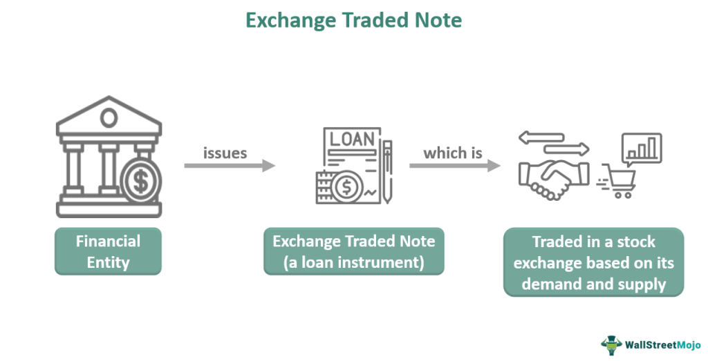

Exchange-Traded Funds (ETFs) are investment vehicles that have gained substantial popularity due to their flexibility and the broad market exposure they offer. An ETF is essentially a collection of securities, such as stocks or bonds, that is traded on stock exchanges much like a single stock. The growing attractiveness of ETFs can be attributed to their benefits which include diversification, liquidity, and cost-effectiveness, making them an appealing option for a wide range of investors.

Short selling is an investment strategy where an investor borrows a security and sells it on the open market with the intention of repurchasing it at a lower price. In the context of ETFs, short selling underscores the dynamic nature of the market. Investors may opt to short sell ETFs as a tactic to profit from anticipated declines in market segments or indices, reflecting the flexible strategies that can be pursued within the ETF market.



Algorithmic trading uses complex algorithms to execute trades at speeds and frequencies that are impossible for human traders. This method has revolutionized modern investment strategies by enhancing decision-making processes through data analysis and real-time market forecasting. Algorithmic trading systems are programmed to follow a specific set of instructions and encompass a wide range of strategies, including market making, arbitrage, and trend following.

As the financial markets evolve, the interaction between ETFs, short selling, and algorithmic trading presents a sophisticated landscape for investors. The interplay among these elements fosters a dynamic trading environment wherein investors leverage algorithmic tools to capitalize on market movements and diversify their investment strategies. Understanding these components is crucial for those looking to navigate and succeed in today’s complex financial markets. This introduction sets the stage for a more comprehensive exploration of the mechanisms and strategies involved in trading ETFs, employing short selling, and utilizing algorithmic trading.

## Table of Contents

## Understanding ETFs: A Brief Overview

Exchange-traded funds (ETFs) are investment vehicles that combine the features of stocks and mutual funds. Structured to track specific indices, commodity prices, or other asset classes, ETFs offer investors a way to gain exposure to a diversified portfolio through a single publicly traded share. The foundational structure of an ETF comprises a collection of securities that mirror the composition and performance of a selected benchmark or index. The shares of ETFs are bought and sold on stock exchanges, similar to individual stocks.

One of the primary benefits of investing in ETFs is diversification. ETFs typically hold a wide range of securities, reducing the risk associated with individual stock investments. For instance, by purchasing shares in an ETF that tracks the S&P 500 Index, investors gain exposure to 500 of the largest companies in the United States, thus mitigating the impact of volatility in a single stock. Additionally, ETFs are noted for their liquidity. They can be traded at any time during market hours at market prices, providing investors with the flexibility to enter and [exit](/wiki/exit-strategy) positions with ease.

Several ETFs have gained prominence due to their size and the influence they wield across global markets. Examples include the SPDR S&P 500 [ETF](/wiki/etf-trading-strategies) (SPY), which tracks the S&P 500 Index, and the iShares MSCI Emerging Markets ETF (EEM), which provides exposure to emerging market equities. These ETFs not only reflect market trends but also significantly impact the pricing and performance of underlying assets due to their large trading volumes.

ETFs offer a convenient alternative to mutual funds for several reasons. Investors can buy and sell ETF shares throughout the trading day, unlike mutual funds, which are typically priced only at the end of the trading day. Furthermore, ETFs generally have lower expense ratios compared to actively managed mutual funds, making them a cost-effective option for investors. Transparency is another advantage, as most ETFs disclose their holdings on a daily basis, allowing investors to be acutely aware of the assets within their portfolios. Overall, these attributes make ETFs a flexible and efficient tool for modern investors aiming to diversify their portfolios while maintaining ease of trade execution.

## The Mechanics of Short Selling ETFs

Short selling is a trading strategy where an investor sells an asset they do not own, with the intention of buying it back later at a lower price. This approach anticipates a decline in the asset's price, allowing the seller to profit from the difference between the sell price and the buy price, minus any costs incurred. When applied to exchange-traded funds (ETFs), short selling follows the same principle but involves betting against the performance of a basket of securities rather than a single stock.

The primary risk associated with short selling ETFs is the potential for unlimited losses. Unlike a long position, where the maximum loss is the initial investment, short sellers face potentially infinite losses if the ETF's price rises instead of falls. On the reward side, successful short selling can lead to significant returns, particularly in bearish markets where ETF prices are declining.

One scenario where short selling ETFs might be viable is during market downturns or economic recessions. For instance, if an investor anticipates a sector-specific decline, such as in the energy or technology sector, they might short sell ETFs focused on that sector. Another potential strategy involves using ETF short selling as a hedge against other long positions, thereby managing risk across a broader portfolio.

Market sentiment and timing are two crucial factors for successful short selling. An investor must accurately gauge market trends and timing to execute a profitable short position. For example, during periods of market pessimism or heightened [volatility](/wiki/volatility-trading-strategies), short selling may be more applicable as security prices tend to drop. Conversely, in bull markets where prices are generally rising, short selling carries heightened risk due to the possibility of price increases.

Investors must stay informed and leverage market indicators, economic forecasts, and comprehensive analyses when considering short selling ETFs. The ability to interpret market sentiment, coupled with precise timing, can significantly affect the outcome of a short sell position.

## Algorithmic Trading in the ETF Market

Algorithmic trading involves the use of computer algorithms to execute trades based on predefined criteria, facilitating quick and efficient transactions. In the financial markets, these algorithms analyze vast amounts of data to identify trading opportunities and predict market trends, enabling investors to make informed decisions with minimal human intervention. 

When applied to the ETF market, [algorithmic trading](/wiki/algorithmic-trading) offers unique advantages. Algorithms can identify short selling opportunities by analyzing patterns, trends, and anomalies in ETF price movements. For example, an algorithm might detect an overvaluation in an ETF based on historical price trends, leading to a potential short selling opportunity. Algorithmic strategies like mean reversion, [momentum](/wiki/momentum)-based trading, and statistical [arbitrage](/wiki/arbitrage) are common approaches used to identify such opportunities.

The benefits of algorithmic trading in the ETF space are notable. Speed and efficiency are paramount, as algorithms can process and execute trades within milliseconds. This rapid response capability is particularly advantageous in a fast-paced market environment, where manual trading could lead to missed opportunities. Algorithms also allow for high-frequency trading, enabling numerous small trades that can accumulate substantial returns.

Despite these advantages, algorithmic trading in the ETF market presents several challenges and limitations. One primary concern is the risk of malfunctions or errors within the algorithms, potentially leading to significant financial losses. These systems require constant monitoring and updating to adapt to dynamic market conditions. Additionally, the success of algorithmic trading is highly dependent on the quality and accuracy of the underlying data. Any inaccuracies or delays in data feed can result in suboptimal trading decisions.

Moreover, the competitive nature of financial markets means that proprietary algorithms can quickly lose their edge as more market participants adopt similar strategies. This necessitates continuous innovation and refinement of algorithms to maintain a competitive advantage. Regulatory scrutiny can also pose a challenge, as market regulators often impose restrictions on high-frequency and algorithmic trading to mitigate risk and ensure market stability.

In conclusion, while algorithmic trading offers significant advantages in terms of speed, efficiency, and the ability to exploit short selling opportunities within the ETF market, it also requires careful management to overcome its inherent challenges.

## Pros and Cons: ETFs Short Selling with Algo Trading

Combining short selling strategies with algorithmic trading in the context of exchange-traded funds (ETFs) presents a compelling hybrid approach for investors seeking to maximize returns through market inefficiencies. The synergy of these two strategies offers several advantages but also introduces notable risks that require meticulous management and strategic foresight.

### Advantages of Algorithmic Short Selling in ETFs

1. **Speed and Efficiency**: Algorithms operate at high speeds, executing trades in milliseconds, which is crucial in short selling where timing can significantly impact profitability. This efficiency allows algorithms to capitalize on brief market inefficiencies that human traders might miss.

2. **Data-Driven Decisions**: Algorithmic trading systems are built to process vast amounts of data in real-time, identifying patterns and trends that inform short selling strategies. This data-centric approach enhances decision-making, reducing reliance on intuition or emotion.

3. **Scalability**: Algorithmic systems can manage multiple trades across various markets simultaneously. This scalability is beneficial for ETFs, which may encompass a wide array of securities, allowing for diversified short selling strategies.

4. **Reduction of Human Error**: By automating the trading process, algorithms mitigate human error, ensuring consistent execution according to predefined criteria.

### Potential Downsides and Risks

1. **Market Volatility**: Algorithmic short selling in ETFs is sensitive to market volatility. Rapid and unexpected fluctuations can lead to significant losses, particularly if the algorithm is not designed to adapt quickly to market changes.

2. **Model Risk**: The efficacy of algorithmic strategies largely depends on the underlying models. Incorrect assumptions or statistical errors in the models can lead to unfavorable outcomes.

3. **Technological Failures**: Algorithmic trading is dependent on technology, which subjects it to risks such as system outages, bugs, or cyberattacks that can disrupt trading activities.

4. **Regulatory Risks**: Increasing scrutiny and evolving regulations in financial markets may impact algorithmic trading strategies, potentially restraining certain activities or imposing new compliance costs.

### Mitigating Risks

1. **Robust Risk Management Frameworks**: Implement comprehensive risk management systems, including stop-loss orders and real-time monitoring, to limit potential losses.

2. **Continuous Model Evaluation**: Regularly backtest and refine algorithmic models to accommodate new data and evolving market conditions, ensuring they remain robust and effective.

3. **Diversification**: Use diversification strategies within ETF short selling to spread risk across different sectors or asset classes, reducing the impact of a single adverse event.

4. **Regulatory Compliance**: Stay informed about regulatory changes and ensure that all algorithmic activities comply with current rules to avoid legal repercussions.

### Successful Cases of Algorithmic Short Selling

Various hedge funds and proprietary trading firms have successfully employed algorithmic short selling strategies within the ETF market. For instance, firms have utilized [statistical arbitrage](/wiki/statistical-arbitrage)—a strategy that involves short selling overvalued ETFs while simultaneously buying undervalued ones. By leveraging algorithms to identify these disparities, they capitalize on the convergence of prices for profit.

Additionally, market-neutral strategies, which involve balancing short and long positions through algorithms to exploit temporary price disparities, have demonstrated success in minimizing market risk while generating alpha. These strategies rely heavily on sophisticated algorithms to quickly adjust positions based on real-time market movements.

In conclusion, while the combination of algorithmic trading and short selling in the ETF market offers substantial opportunities, it necessitates careful navigation of inherent risks. Successful implementation hinges on technologically advanced systems, robust risk management, and adherence to evolving market regulations.

## Key Considerations for Investors

When considering the use of algorithmic trading for short selling ETFs, investors must evaluate multiple key factors to navigate this complex process effectively. Understanding these factors is essential to optimize strategies and minimize inherent risks.

### Factors to Consider

**1. Comprehensive Risk Management Strategies:**

Investors must establish robust risk management frameworks to safeguard against potential losses. This involves setting stop-loss orders to limit downside, using position sizing to manage exposure, and diversifying across different ETFs and trading strategies. Monitoring market volatility is crucial, as higher volatility can increase both the potential for profit and the risk of significant losses. Implementing tools such as Value at Risk (VaR) or Conditional Value at Risk (CVaR) can help quantify potential risks in the portfolio.

**2. Selection of Algorithmic Trading Platforms:**

Choosing the right algorithmic trading platform or software is pivotal for executing successful strategies. Investors should seek platforms that offer:
- A user-friendly interface for ease of strategy implementation.
- Advanced backtesting capabilities to evaluate algorithms against historical data.
- High-speed execution to capitalize on fleeting market opportunities.
- Robust security features to protect sensitive financial information.
- Comprehensive analytics tools for real-time monitoring and strategy optimization.

Platforms like MetaTrader 5, [Interactive Brokers](/wiki/interactive-brokers-api)' Trader Workstation (TWS), and QuantConnect are popular choices for algorithmic trading due to their extensive features tailored for both beginners and experienced traders.

**3. Staying Updated with Market Trends and Data:**

Continuous monitoring of market trends and economic indicators is vital for maintaining an edge when short selling ETFs. This includes tracking geopolitical developments, macroeconomic data releases, and corporate earnings reports that can influence ETF prices. Investors need to keep abreast of sector-specific news, especially for sector-focused ETFs, as these can be more sensitive to industry changes.

Utilizing financial news aggregators, subscribing to market analysis services, and leveraging data analytics tools can enhance an investor’s ability to respond promptly to market shifts. Combine these insights with algorithmic models to adjust strategies dynamically and optimize returns.

### Conclusion

Investors venturing into ETF short selling with algorithmic trading must balance technical acumen with strategic foresight. By diligently addressing risk management, platform selection, and market awareness, investors can enhance their ability to execute sophisticated trades while mitigating potential pitfalls. The fusion of technological advancement and strategic insight ensures that short selling ETFs with algorithmic support becomes a viable and constructive component of a modern investment portfolio.

## The Future of ETFs, Short Selling, and Algo Trading

The ETF market is undergoing significant transformations, influenced by technological advancements and shifting regulatory landscapes. As ETFs continue gaining traction among investors, short selling and algorithmic trading are adapting to accommodate these changes.

Emerging trends in the ETF market indicate an expansion in the variety and specificity of ETFs, including thematic and [ESG](/wiki/esg-investing) (environmental, social, and governance) ETFs. These innovations could increase the attractiveness of short selling, enabling investors to exploit perceived overvaluations or inefficiencies linked to niche market areas. For instance, as specific ETFs grow in popularity, their [liquidity](/wiki/liquidity-risk-premium) may increase, potentially lowering the risks associated with short selling. On the other hand, the diversification inherent in these funds can make profitable short selling more challenging, as the basket of securities can buffer against individual stock volatility.

Advancements in algorithmic trading technology are reshaping how ETFs are bought, sold, and shorted. With more sophisticated [machine learning](/wiki/machine-learning) models and faster computational capabilities, algorithms can now process vast datasets to uncover complex patterns and predict market movements with higher precision. For example, algorithms can implement strategies involving statistical arbitrage or pairs trading, where ETFs are paired against their underlying assets or similar funds to identify mispricing. Python, a prevalent programming language in finance, offers libraries like NumPy and pandas, which facilitate complex financial modeling and analysis:

```python
import numpy as np
import pandas as pd

# Example: Calculate the moving average of an ETF's price
prices = pd.Series([100, 102, 101, 104, 107])
moving_average = prices.rolling(window=2).mean()
print(moving_average)
```

In terms of regulation, increased scrutiny on short selling practices and algorithmic trading could result in tighter compliance requirements. Regulatory bodies are increasingly focused on ensuring market stability and transparency, which may lead to new rules that impact how ETFs are traded and shorted. These changes could include transaction reporting obligations, limitations on levered and inverse ETFs, and enhanced scrutiny of algorithmic trading systems to mitigate systemic risk.

The future interplay between ETFs, short selling, and algorithmic trading presents both opportunities and challenges. Technological advancements might streamline trading operations and enhance strategy execution, yet they also introduce complexities that require robust risk management frameworks. Investors will likely need to adapt to a more regulated environment while leveraging cutting-edge technology to maintain a competitive edge. The convergence of these elements suggests a dynamic landscape where ongoing innovation shapes the evolution of financial trading strategies.

## Conclusion

ETFs, short selling, and algorithmic trading collectively form a significant triad within modern financial markets, each contributing to the complexity and dynamism of investment strategies. ETFs, celebrated for their diversification and liquidity, have become pivotal financial instruments, offering investors exposure to various sectors and indices with efficiency and ease. The possibility of short selling ETFs adds another layer, allowing investors to profit from declines in ETF prices, though it entails additional risks and requires careful consideration of market sentiments and timing.

Algorithmic trading has revolutionized the investment landscape by enabling rapid, data-driven decisions, which are crucial for identifying opportunities like short selling in volatile markets. The integration of these elements creates opportunities for strategic developments in investment tactics, marked by enhanced precision and the ability to handle vast datasets quickly.

Understanding these concepts is essential for modern investors. It allows market participants to leverage their benefits while navigating the inherent risks involved. Investors are encouraged to conduct thorough research and stay abreast with continuous learning. This is particularly crucial as financial markets and trading technologies evolve rapidly.

Looking ahead, the landscape of ETFs, short selling, and algorithmic trading will continue to transform with technological advancements and changing regulatory frameworks. Investors who adapt and innovate within this shifting environment may find increased opportunities for success. The evolution of these financial trading strategies highlights a promising yet ever-challenging frontier for finance professionals and investors alike.

## References & Further Reading

[1]: Bergstra, J., Bardenet, R., Bengio, Y., & Kégl, B. (2011). ["Algorithms for Hyper-Parameter Optimization."](https://papers.nips.cc/paper/4443-algorithms-for-hyper-parameter-optimization) Advances in Neural Information Processing Systems 24.

[2]: ["Advances in Financial Machine Learning"](https://www.amazon.com/Advances-Financial-Machine-Learning-Marcos/dp/1119482089) by Marcos Lopez de Prado

[3]: ["Evidence-Based Technical Analysis: Applying the Scientific Method and Statistical Inference to Trading Signals"](https://www.amazon.com/Evidence-Based-Technical-Analysis-Scientific-Statistical/dp/0470008741) by David Aronson

[4]: ["Machine Learning for Algorithmic Trading"](https://github.com/stefan-jansen/machine-learning-for-trading) by Stefan Jansen

[5]: ["Quantitative Trading: How to Build Your Own Algorithmic Trading Business"](https://www.amazon.com/Quantitative-Trading-Build-Algorithmic-Business/dp/1119800064) by Ernest P. Chan