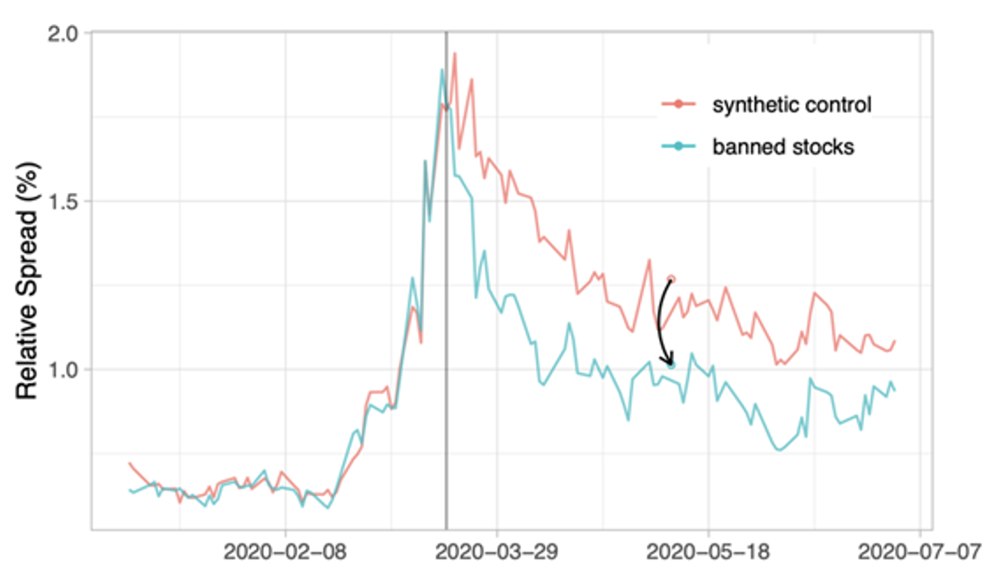

## Table of Contents

## What is short selling?

Short selling is when someone borrows a stock or other asset and sells it, hoping to buy it back later at a lower price. They aim to make a profit from the difference between the selling price and the lower buying price. For example, if you short sell a stock at $50 and it drops to $40, you can buy it back at $40, return the borrowed stock, and keep the $10 difference as profit.

However, short selling can be risky. If the price of the stock goes up instead of down, the short seller will lose money. There's no limit to how high a stock price can go, so the potential losses can be much larger than the potential gains. Also, the short seller has to pay fees to borrow the stock, which adds to the cost. Despite these risks, some investors use short selling as a way to bet against stocks they think will decrease in value.

## Why do investors engage in short selling?

Investors engage in short selling mainly because they believe a stock's price will go down. They want to make money from this drop in price. When they think a company is doing badly or will face problems, they borrow the stock, sell it at the current price, and plan to buy it back later at a lower price. The difference between the selling price and the buying price is their profit.

However, short selling is not without risks. If the stock price goes up instead of down, the investor loses money. The potential losses can be much bigger than the potential gains because there's no limit to how high a stock price can go. Despite these risks, some investors use short selling as a way to make money when they think the market or a specific stock is overvalued or headed for trouble.

## What are the risks associated with short selling?

Short selling can be risky. The biggest risk is that the stock price might go up instead of down. If this happens, the person who short sold the stock will lose money. There's no limit to how high a stock price can go, so the losses can be much bigger than the gains. For example, if you short sell a stock at $50 and it goes up to $100, you'll lose $50 per share when you buy it back to return it.

Another risk is the cost of borrowing the stock. When you short sell, you have to pay fees to borrow the stock from someone else. These fees can add up and eat into your profits or make your losses even bigger. Also, if a lot of people want to short sell the same stock, it can be hard to find enough shares to borrow, which can make the borrowing fees go up even more.

Lastly, short selling can be risky because of something called a short squeeze. This happens when a lot of people have short sold a stock and the price starts to go up. As the price rises, short sellers start to panic and buy back the stock to cut their losses. This buying can push the price up even more, causing more short sellers to buy back, and the price can go up very quickly. This can lead to big losses for short sellers who are caught in the squeeze.

## What is a short selling ban?

A short selling ban is when a government or a financial authority stops people from short selling stocks. They do this because they think short selling can make stock prices go down too fast and hurt the market. For example, during a big economic crisis, a country might put a ban on short selling to try to keep the stock market from crashing.

These bans are usually temporary and only last for a short time. They can apply to all stocks or just some specific ones. The idea is to stop people from betting against the market and to give the market a chance to calm down. But, some people think these bans don't really help and can even make things worse by stopping the market from working the way it should.

## Why might a government implement a short selling ban?

A government might implement a short selling ban because they think it can stop the stock market from falling too fast. When a lot of people short sell, it can push stock prices down quickly. This can be really bad during a financial crisis when the market is already struggling. By banning short selling, the government hopes to calm the market and give people more confidence.

However, not everyone agrees that short selling bans are a good idea. Some people think that these bans can actually make things worse by stopping the market from working properly. They argue that short selling helps to show the real value of stocks and can stop prices from getting too high. Even though short selling bans are usually only temporary, they can still cause a lot of debate about whether they really help or not.

## Can you provide historical examples of short selling bans?

During the 2008 financial crisis, many countries put short selling bans in place. The United States banned short selling of financial stocks in September 2008. They did this because they thought it would help stop the stock market from falling so fast. Other countries like the United Kingdom, Australia, and Germany also banned short selling during this time. These bans were meant to help calm the markets and stop people from betting against the banks and other big financial companies.

Another example happened in 2020 during the COVID-19 pandemic. In March 2020, South Korea banned short selling of stocks until the end of the year. They did this because they were worried about the stock market falling too much because of the economic problems caused by the virus. This ban was meant to help keep the market stable and give people more confidence in the economy.

## How do short selling bans impact the stock market?

Short selling bans can have a big effect on the stock market. When a government bans short selling, it stops people from betting that stock prices will go down. This can make the market seem more stable because it stops prices from falling too fast. People might feel more confident and keep buying stocks, which can help keep the market from crashing. But, these bans are usually only for a short time, so they might not fix the bigger problems in the market.

On the other hand, short selling bans can also cause problems. Some people think that short selling helps show the real value of stocks. When short selling is banned, it can hide the true problems in the market. This might make prices go up for a while, but it doesn't solve the real issues. When the ban ends, the market might fall again if the problems are still there. So, while short selling bans can help in the short term, they might not be good for the market in the long run.

## What are the arguments for and against short selling bans?

People who support short selling bans say they can help stop the stock market from falling too fast. When a lot of people short sell, it can make stock prices go down quickly, which can be really bad during a financial crisis. By banning short selling, the government hopes to calm the market and give people more confidence. This can help stop a big crash and protect the economy. During tough times, like the 2008 financial crisis or the 2020 COVID-19 pandemic, these bans were used to try to keep the market stable.

On the other hand, people who are against short selling bans think they can make things worse. They say that short selling helps show the real value of stocks. When short selling is banned, it can hide the true problems in the market and make prices go up for a while, but it doesn't fix the real issues. When the ban ends, the market might fall again if the problems are still there. So, while short selling bans can help in the short term, they might not be good for the market in the long run because they stop the market from working the way it should.

## How are short selling bans enforced?

When a government decides to ban short selling, they usually tell the stock exchanges and the companies that help people buy and sell stocks. These groups then make sure that no one can short sell the stocks that are banned. They watch the market closely to make sure everyone follows the rules. If someone tries to short sell during a ban, they can get in big trouble and might have to pay a lot of money in fines.

Short selling bans can be hard to enforce because some people might try to find ways around the rules. For example, they might use different kinds of financial products to bet against a stock without actually short selling it. The government and the stock exchanges have to keep a close eye on the market and be ready to stop these kinds of tricks. If they find someone breaking the rules, they can take away their right to trade or even take them to court.

## What are the potential unintended consequences of short selling bans?

Short selling bans can lead to some problems that people might not expect. When short selling is banned, it can hide the real problems in the market. This means that stock prices might go up for a while, but they don't show the true value of the companies. This can make people think the market is doing better than it really is. When the ban ends, the market might fall again if the problems are still there. So, while the ban might help in the short term, it can make things worse in the long run.

Another problem is that short selling bans can make the market less fair. Some people might find ways to bet against stocks without actually short selling them. This can give them an advantage over other people who follow the rules. Also, when short selling is banned, it can make the market less able to work properly. Short selling helps to keep stock prices at the right level by showing when they are too high. Without it, prices might go up too much and then crash when the ban is lifted.

## How do short selling bans affect different types of market participants?

Short selling bans can affect different people in the market in different ways. For people who usually short sell, like some investors and hedge funds, a ban means they can't use their normal way of making money. They might lose out on chances to make profits if they think a stock's price will go down. This can be really frustrating for them and might make them look for other ways to bet against stocks, which can be riskier or more complicated.

For regular people who buy stocks, a short selling ban might make them feel better about the market in the short term. When short selling is banned, it can stop stock prices from falling too fast, which can give people more confidence to keep buying stocks. But, if the ban hides real problems in the market, these people might end up buying stocks that are not worth as much as they think. When the ban ends, they could see the stock prices drop and lose money.

## What are the current regulations and trends regarding short selling bans globally?

Right now, short selling bans are not happening in many places, but some countries still use them when they think the market is in big trouble. For example, during the 2020 COVID-19 crisis, South Korea banned short selling for a while to try to keep their stock market stable. Other countries like the United States and the United Kingdom have used short selling bans in the past, especially during the 2008 financial crisis. These bans are usually only for a short time and are meant to help calm the market when things are really bad.

There is a lot of talk about whether short selling bans are a good idea. Some people think they can help stop the market from crashing too fast, but others say they can make things worse by hiding real problems. Right now, many countries are trying to find a balance between letting the market work on its own and stepping in to help when things get really bad. This means that while short selling bans might not be happening a lot right now, they could be used again if there's another big crisis.

## References & Further Reading

[1]: Brunnermeier, M. K., & Pedersen, L. H. (2005). ["Predatory Trading."](https://onlinelibrary.wiley.com/doi/abs/10.1111/j.1540-6261.2005.00781.x) National Bureau of Economic Research.

[2]: Zuckerman, G. (2010). ["The Greatest Trade Ever: The Behind-the-Scenes Story of How John Paulson Defied Wall Street and Made Financial History."](https://www.amazon.com/Greatest-Trade-Ever-Behind-Scenes/dp/0385529945) Broadway Books.

[3]: Aldridge, I. (2013). ["High-Frequency Trading: A Practical Guide to Algorithmic Strategies and Trading Systems."](https://books.google.com/books/about/High_Frequency_Trading.html?id=8QpIsVUMhmEC) Wiley Trading.

[4]: Gomber, P., Arndt, B., Lutat, M., & Uhle, T. (2011). ["High-Frequency Trading."](https://papers.ssrn.com/sol3/papers.cfm?abstract_id=1858626) In Algorithmic Trading: Issues and Challenges in Practice.

[5]: Jones, C. M. (2013). ["What Do We Know About High-Frequency Trading?"](https://papers.ssrn.com/sol3/papers.cfm?abstract_id=2236201) Columbia Business School Research Paper No. 13-11.