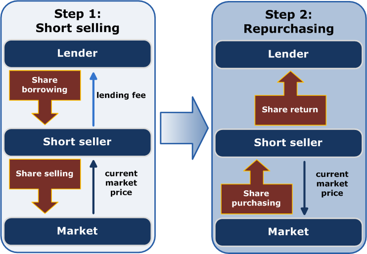

## Table of Contents

## What is short selling?

Short selling is when someone borrows a stock, sells it, and then buys it back later to return it. They do this because they think the price of the stock will go down. If the price does go down, they can buy the stock back for less than they sold it for, and they make a profit from the difference.

However, short selling can be risky. If the price of the stock goes up instead of down, the person who shorted the stock will lose money. They will have to buy the stock back at a higher price than they sold it for, which means they have to pay more to return the borrowed stock. This can lead to big losses if the stock price rises a lot.

## Why do investors engage in short selling?

Investors engage in short selling because they believe they can make money when a stock's price goes down. They borrow shares of a stock they think will drop in value, sell those shares at the current price, and then buy them back later at a lower price to return to the lender. The difference between the selling price and the buying price is their profit. This can be a way to make money in a falling market, which is different from the usual way of buying low and selling high.

However, short selling is not just about making money. It can also be used to hedge, or protect, other investments. If an investor owns a lot of stocks in one industry and thinks that industry might have problems, they might short sell stocks in that industry to balance out potential losses. This way, if the industry does poorly and the stocks go down, the gains from short selling can help offset the losses from their other investments.

## How does the short selling process work?

Short selling starts when an investor borrows shares of a stock from a broker or another investor. They believe the price of the stock will go down soon. Once they have the borrowed shares, they sell them at the current market price. For example, if they borrow and sell 100 shares at $50 each, they get $5,000.

Next, the investor waits for the stock price to drop. If it does, they buy back the same number of shares at the lower price. If the price drops to $40 per share, they can buy back the 100 shares for $4,000. They return these shares to the lender and keep the difference as profit. In this case, they make $1,000 ($5,000 - $4,000).

But if the stock price goes up instead, the investor loses money. If the price rises to $60 per share, they have to buy back the 100 shares for $6,000. After returning the shares, they lose $1,000 ($5,000 - $6,000). This is why short selling can be risky, but it can also be profitable if the investor's prediction about the stock price is correct.

## What are the risks associated with short selling?

Short selling can be risky because if the stock price goes up instead of down, the person who shorted the stock can lose a lot of money. When you short sell, you borrow shares and sell them, hoping to buy them back cheaper later. But if the price goes up, you have to buy back the shares at a higher price to return them. This means you lose money on the difference. There's no limit to how high a stock price can go, so your losses could be very big.

Another risk is something called a short squeeze. This happens when a lot of people have shorted the same stock, and the price starts to go up. Those who shorted the stock get nervous and start buying back the shares to limit their losses. This buying can push the price up even more, causing more short sellers to buy back shares, which makes the price go up even further. It can turn into a cycle that forces short sellers to cover their positions at much higher prices than they expected.

Also, there are costs and fees involved in short selling. You have to pay interest on the borrowed shares, and there might be other fees from your broker. If the stock pays dividends, you have to pay those dividends to the person you borrowed the shares from. All these extra costs can eat into your profits or make your losses even bigger if the trade doesn't go your way.

## What is a short squeeze and how does it affect short sellers?

A short squeeze happens when a lot of people have shorted the same stock, and the price of the stock starts to go up. When this happens, the short sellers get worried because they might lose money if the price keeps going up. To avoid losing more money, they start buying back the shares they borrowed and sold. This buying can push the price of the stock even higher.

As more short sellers try to buy back the shares to limit their losses, it can create a cycle where the price keeps going up. This forces even more short sellers to buy back the shares at much higher prices than they expected. A short squeeze can be very bad for short sellers because it can lead to big losses if they have to buy back the shares at a much higher price than they sold them for.

## What are the regulatory requirements for short selling?

Short selling is controlled by rules to make sure it's done fairly and openly. In the United States, the Securities and Exchange Commission (SEC) sets the rules. One important rule is that short sellers have to find and borrow the shares before they sell them. They also have to tell their broker that they are short selling. This helps keep track of short selling and stops people from selling shares they don't have.

Another rule is called the uptick rule. It says that short sellers can only sell a stock if the last price it traded at was higher than the price before that. This rule tries to stop short selling from making a stock's price fall too fast. Also, short sellers have to report their short positions to the Financial Industry Regulatory Authority (FINRA) if they are big enough. This helps regulators watch for any problems in the market.

## How does short selling impact the overall market?

Short selling can affect the overall market in different ways. When a lot of people short sell a stock, it can make the stock's price go down. This happens because there are more people selling the stock than buying it. If the price keeps going down, it can make other people worried and they might start selling their shares too. This can lead to a bigger drop in the stock's price and can even affect the whole market if it happens to a lot of stocks at the same time.

On the other hand, short selling can also help the market work better. It can make the prices of stocks more accurate because short sellers do a lot of research to find stocks that they think are overpriced. When they short sell these stocks, it can help the price go down to a more fair level. Also, short selling can add more trading to the market, which can make it easier for people to buy and sell stocks. This can make the market more active and help it run smoothly.

## What is the difference between naked short selling and covered short selling?

Naked short selling is when someone sells a stock short without first borrowing the shares or making sure they can borrow them. This means they are selling shares they don't have and might not be able to get. It's risky and can be illegal because it can lead to problems in the market, like making the stock's price go down a lot. In some places, naked short selling is against the rules because it can cause big problems.

Covered short selling is different because the person short selling makes sure they can borrow the shares before they sell them. They have to find the shares to borrow and then sell them. This way, they know they can return the shares later. Covered short selling is the usual way to short sell and it follows the rules that help keep the market fair and stable.

## Can you explain the concept of short interest and its implications?

Short interest is a way to measure how many people are betting that a stock's price will go down. It tells us the total number of shares that have been sold short but not yet bought back. When a lot of people are shorting a stock, it means they think the stock is going to lose value. This information can be useful for investors because it gives them an idea of what other people think about the stock's future.

If the short interest is high, it can mean that a lot of people are worried about the stock. This can make the stock's price more likely to go down because there are more people trying to sell it than buy it. But it can also lead to a short squeeze, where the price goes up fast if the people who shorted the stock have to buy it back quickly. So, short interest can give investors clues about what might happen to a stock's price, but it's not a sure thing because the market can change in unexpected ways.

## How do short selling strategies vary across different asset classes?

Short selling strategies can be different depending on what kind of asset you are dealing with. For stocks, short sellers often look for companies that they think are overvalued or have problems that will make their stock price go down. They might use a lot of research and analysis to find these stocks. In the stock market, short sellers can also use options and other financial tools to make their strategies more complex and try to make more money.

For other assets like commodities or currencies, short selling can work a bit differently. In the commodities market, like oil or gold, short sellers might bet that the price of the commodity will go down because of things like too much supply or less demand. In the currency market, short sellers might think that one country's money will lose value compared to another country's money. They use different tools and strategies, like futures contracts, to short sell these assets. Each asset class has its own rules and ways of doing things, so short sellers need to understand these differences to be successful.

## What are some famous examples of short selling in history?

One famous example of short selling is when George Soros shorted the British pound in 1992. He thought the pound was too strong and would have to be devalued. He borrowed a lot of pounds and sold them, betting that he could buy them back cheaper later. When the British government couldn't keep the pound's value up, Soros made a huge profit. People say he made over a billion dollars from this trade, and it's known as "Black Wednesday."

Another well-known case is the short selling of Enron stock before the company went bankrupt in 2001. Some investors, like Jim Chanos, saw that Enron was hiding big problems and its stock was overpriced. They shorted Enron's stock, betting that its price would go down. When Enron's problems came out and the company collapsed, the stock price fell a lot. The short sellers made a lot of money because they were right about Enron's troubles.

## How can advanced analytics and data be used to enhance short selling strategies?

Advanced analytics and data can help short sellers make better guesses about which stocks will go down in price. They can use big data to look at a lot of information about a company, like how much money it's making, what people are saying about it online, and even what's happening in the world that might affect it. By using computers to find patterns and trends in this data, short sellers can spot problems or overvalued stocks faster than just looking at the news or company reports. This can give them an edge in deciding which stocks to short sell.

Also, short sellers can use [machine learning](/wiki/machine-learning) to make their strategies better over time. Machine learning can learn from past short selling trades and figure out what worked and what didn't. This can help short sellers adjust their plans to be more successful in the future. By using all this data and technology, short sellers can make smarter choices and maybe make more money from their trades.

## References & Further Reading

[1]: Asquith, P., & Meulbroek, L. (1995). ["An Empirical Investigation of Short Interest."](https://www.nber.org/system/files/working_papers/w10434/w10434.pdf) Journal of Financial Economics, 29(1), 3-29.

[2]: Kirkpatrick, C. D., & Dahlquist, J. R. (2010). ["Technical Analysis: The Complete Resource for Financial Market Technicians."](https://ptgmedia.pearsoncmg.com/images/9780134137049/samplepages/9780134137049.pdf) FT Press.

[3]: Aldridge, I. (2013). ["High-Frequency Trading: A Practical Guide to Algorithmic Strategies and Trading Systems."](https://www.amazon.com/High-Frequency-Trading-Practical-Algorithmic-Strategies/dp/1118343506) Wiley.

[4]: Chordia, T., Roll, R., & Subrahmanyam, A. (2005). ["Evidence on the Speed of Convergence to Market Efficiency."](https://www.anderson.ucla.edu/documents/areas/fac/finance/17-01.pdf) Journal of Financial Economics, 76(2), 271-292.

[5]: Hasbrouck, J. (2018). ["Empirical Market Microstructure: The Institutions, Economics, and Econometrics of Securities Trading."](https://academic.oup.com/book/52241) Oxford University Press.