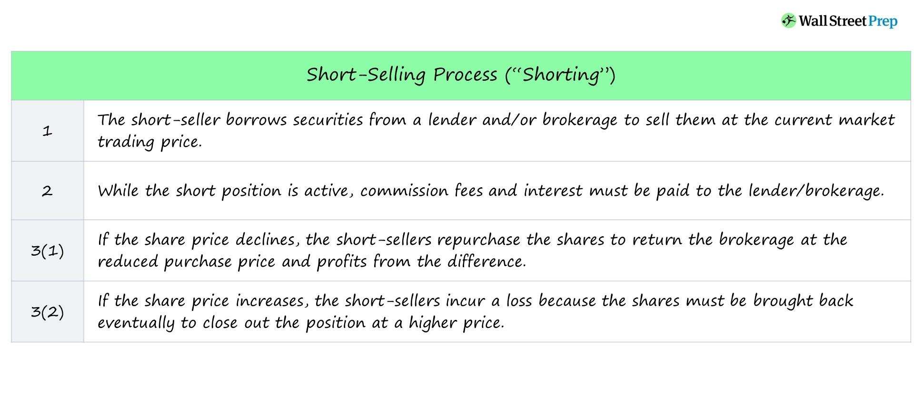

## Table of Contents

## What is short selling and how does it work?

Short selling is when someone borrows a stock or another asset and sells it, hoping to buy it back later at a lower price. The goal is to make money from the difference between the selling price and the lower buying price. For example, if you borrow a stock worth $50, sell it, and then the price drops to $40, you can buy it back at $40, return the stock, and keep the $10 difference as profit.

However, short selling can be risky. If the price of the stock goes up instead of down, you could lose money. Using the same example, if the stock price rises to $60, you would have to buy it back at $60, losing $10. Also, there can be extra costs like fees for borrowing the stock and interest. Short selling is often used by experienced investors who think a stock's price will fall, but it's not something for everyone because of the risks involved.

## What are the basic requirements to start short selling?

To start short selling, you need a margin account with a brokerage firm. This is different from a regular account because it lets you borrow money or stocks. You'll need to meet the firm's requirements, which usually include having enough money in your account as a safety net. This is called the minimum margin requirement, and it can be a certain amount of money or a percentage of the value of the stocks you want to short sell.

Once you have a margin account set up, you need to find a stock that you think will go down in price. You'll then borrow the stock from your broker and sell it at the current market price. Later, you'll need to buy the stock back to return it to the broker. If the price has dropped, you make a profit from the difference. But remember, if the price goes up, you'll lose money. So, it's important to keep an eye on the stock and be ready to act quickly.

## How do you locate and borrow shares for short selling?

To locate shares for short selling, you first need to work with your broker. Brokers have systems that can help find stocks that are available to borrow. You tell your broker which stock you want to short sell, and they check if they can borrow those shares from other clients or from other places. If they can find the shares, they will let you know, and you can go ahead with the short sale.

Once the shares are located, your broker will borrow them for you. This means they take the shares from someone else's account and put them in your account temporarily. You then sell these borrowed shares at the current market price. Remember, you have to return these shares later, so you need to buy them back. If the price has gone down, you make money. If it has gone up, you lose money. It's important to keep in touch with your broker because the availability of shares can change, and you need to make sure you can borrow them when you want to short sell.

## What are the risks involved in short selling?

Short selling can be risky. One big risk is that the stock price might go up instead of down. If this happens, you lose money because you have to buy back the stock at a higher price than you sold it for. This can lead to big losses, especially if the price goes up a lot. Another risk is that you might not be able to find the stock to borrow. If the stock is hard to borrow, it can be expensive or even impossible to short sell.

There are also costs involved in short selling. You might have to pay fees to borrow the stock, and there can be interest charges too. These costs can add up and eat into any profits you make. Also, if the stock pays dividends, you have to pay those dividends to the person you borrowed the stock from. This can make short selling even more expensive.

Lastly, short selling can be stressful because you need to watch the stock closely. If the price starts to go up, you might need to act quickly to limit your losses. This can be hard to do, especially if the market is moving fast. So, short selling is not for everyone and should be done carefully.

## How do you calculate potential profits and losses from short selling?

To calculate potential profits from short selling, you first need to know the price at which you sold the borrowed stock and the price at which you later buy it back. If you sold the stock at $50 and then bought it back at $40, you make a profit of $10 per share. You subtract the lower buy-back price from the higher selling price. Remember to also subtract any fees or interest you had to pay for borrowing the stock. So, if you paid $1 in fees, your profit per share would be $9.

Calculating potential losses works the same way, but in reverse. If you sold the stock at $50 and then had to buy it back at $60, you lose $10 per share. You subtract the higher buy-back price from the lower selling price. Again, you need to add any fees or interest you paid. So, if you paid $1 in fees, your loss per share would be $11. It's important to keep an eye on the stock price and be ready to buy it back if it starts to go up, to limit your losses.

## What are the common strategies used in short selling?

One common strategy in short selling is called "shorting against the box." This is when you already own some shares of a stock, and you short sell the same amount of shares. You do this to lock in a profit if you think the stock price might go down. It's like a safety net because you are protected from losing money if the price drops. But remember, you still have to pay any fees or interest for borrowing the shares.

Another strategy is "pairs trading." This is when you short sell one stock and buy another stock at the same time. You pick two stocks that usually move in opposite ways. For example, if one goes up, the other goes down. By doing this, you can make money no matter which way the market goes. It's a way to balance out the risk because the gains from one stock can cover the losses from the other.

A third strategy is "momentum trading." This is when you short sell a stock that you think is about to drop in price quickly. You watch for signs that the stock is losing value fast, like bad news about the company. If you time it right, you can make a quick profit. But it's risky because the stock could suddenly go back up, and you could lose money if you don't act fast enough.

## How does short selling impact the market and other investors?

Short selling can affect the market and other investors in several ways. When people short sell a stock, it can increase the number of shares available in the market. This can lead to more selling pressure, which might push the stock price down. If a lot of people are short selling the same stock, it can make the price drop even more. This can hurt other investors who own the stock because their shares are now worth less. Sometimes, short selling can even cause a panic, making more people want to sell their shares, which can lead to a big drop in the stock price.

On the other hand, short selling can also help the market by making it more efficient. When short sellers think a stock is overvalued, they can help correct the price by selling the stock. This can stop the stock from being priced too high. Short selling can also bring more information to the market because short sellers often do a lot of research. This can help other investors make better decisions. So, while short selling can be risky and cause some problems, it can also play an important role in keeping the market fair and balanced.

## What are the regulatory and legal considerations for short selling?

Short selling is regulated by rules that aim to keep the market fair and prevent bad behavior. In the United States, the Securities and Exchange Commission (SEC) sets rules for short selling. One important rule is the "uptick rule," which says you can only short sell a stock if the last price it traded at was higher than the one before it. This rule is meant to stop short sellers from pushing the price down too quickly. There are also rules about how you report your short sales and how you handle the stocks you borrow. Breaking these rules can lead to fines or other punishments.

Another key part of short selling is the need to borrow the shares you want to sell. You have to find someone who owns the stock and is willing to lend it to you. This is called a "locate" requirement, and it's there to make sure you can actually get the shares to short sell. If you can't find shares to borrow, you can't short sell. There are also rules about how long you can keep the borrowed shares. If the owner of the shares wants them back, you have to return them, which might mean buying them back at a higher price than you wanted. All these rules are in place to make sure short selling is done in a way that's fair and doesn't harm the market.

## How do you manage and monitor a short selling position?

Managing and monitoring a short selling position means keeping a close eye on the stock you've short sold. You need to watch the price every day because if it starts going up, you might lose money. You can use tools like stock alerts or apps that send you messages when the price changes a lot. It's also a good idea to set a "stop-loss" order. This is a rule you set with your broker that says, "If the price goes up to this point, buy the stock back to stop my losses." This can help limit how much money you could lose.

Besides watching the price, you should also keep up with news about the company whose stock you shorted. Bad news can make the stock price go down, which is good for you, but good news can make it go up, which is bad. Sometimes, you might need to buy the stock back quickly if the price is going up too fast. It's also important to remember any fees or interest you have to pay for borrowing the stock. These costs can add up, so you need to think about them when deciding when to buy the stock back.

## What are the advanced techniques for short selling?

One advanced technique for short selling is called "short squeezes." This happens when a lot of people have short sold a stock, and then the price starts to go up. The short sellers get worried and start buying the stock back to limit their losses. This buying can push the price up even more, making more short sellers buy back, and the price can go up really fast. It's like a snowball effect. To use this technique, you need to be ready to act quickly and have a good plan for when to buy the stock back.

Another technique is "put options." Instead of short selling the stock directly, you can buy a put option. A put option gives you the right to sell a stock at a certain price in the future. If the stock price goes down, you can make money by selling it at the higher price you set in the option. This can be less risky than short selling because the most you can lose is the money you paid for the option. But it's still important to watch the stock price and be ready to act if things change.

## How can short selling be used as part of a broader investment strategy?

Short selling can be a part of a bigger plan for investing. It's like a tool that can help you make money when you think a stock's price will go down. You can use it to balance out your other investments. For example, if you own a lot of stocks and the market goes down, short selling can help you make money even when your other stocks are losing value. This way, you can protect your money and maybe even make some extra cash.

Another way to use short selling in your investment plan is to use it with other strategies like buying stocks or options. You can short sell a stock you think will go down and at the same time buy a stock you think will go up. This is called "pairs trading." It can help you make money no matter which way the market goes. But remember, short selling can be risky, so it's important to do your homework and be ready to act quickly if things don't go as planned.

## What are the ethical considerations and controversies surrounding short selling?

Short selling can stir up a lot of debate about what's right and wrong in the world of investing. Some people think it's not fair because short sellers make money when a company's stock price goes down. They say it's like betting against the company, and it can hurt the people who own the stock or work for the company. Critics also worry that short sellers might spread bad news or rumors to make the stock price fall on purpose, which can be harmful to the company and its employees.

On the other hand, supporters of short selling argue that it's a good thing for the market. They say it helps keep stock prices honest by pointing out when a company might be overvalued. Short sellers often do a lot of research, and their actions can bring important information to light. This can help everyone in the market make better choices. While there are rules to stop bad behavior, the debate about the ethics of short selling continues because it can have big effects on companies and investors.

## References & Further Reading

[1]: Bergstra, J., Bardenet, R., Bengio, Y., & Kégl, B. (2011). ["Algorithms for Hyper-Parameter Optimization."](https://dl.acm.org/doi/10.5555/2986459.2986743) Advances in Neural Information Processing Systems 24.

[2]: ["Advances in Financial Machine Learning"](https://www.amazon.com/Advances-Financial-Machine-Learning-Marcos/dp/1119482089) by Marcos Lopez de Prado

[3]: ["Evidence-Based Technical Analysis: Applying the Scientific Method and Statistical Inference to Trading Signals"](https://www.amazon.com/Evidence-Based-Technical-Analysis-Scientific-Statistical/dp/0470008741) by David Aronson

[4]: ["Machine Learning for Algorithmic Trading"](https://github.com/stefan-jansen/machine-learning-for-trading) by Stefan Jansen

[5]: ["Quantitative Trading: How to Build Your Own Algorithmic Trading Business"](https://github.com/LucindaYa/quant-resources/blob/master/Quantitative%20Trading%20How%20to%20Build%20Your%20Own%20Algorithmic%20Trading%20Business.pdf) by Ernest P. Chan