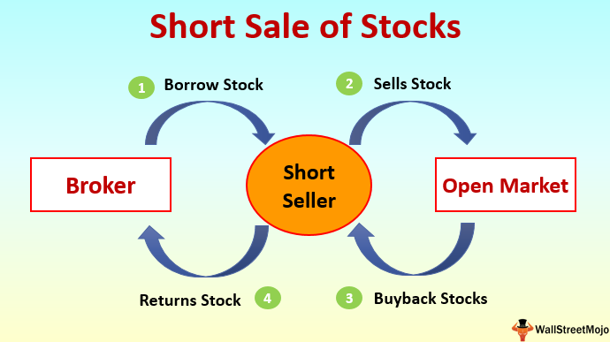

In the ever-evolving financial markets, investment strategies are paramount for investors aiming to maximize returns and manage risks. The stock market, a dynamic platform for trading ownership in corporations, presents a variety of strategies that cater to different types of investors and market conditions. Among these strategies are short selling and algorithmic trading, each characterized by unique attributes and distinct potential for profit.

Short selling is a strategy that speculates on the decline in the price of a stock or other securities. It involves borrowing shares from a broker and selling them at the prevailing market price, with the expectation of buying them back later at a reduced price. If the market behaves as anticipated and prices fall, the short seller profits from the difference between the selling price and the buying price, after returning the shares to the lender. However, short selling is inherently high-risk, especially if the stock prices rise unexpectedly, which can lead to substantial losses.



On the other hand, algorithmic trading, often called algo-trading, leverages advancements in technology to execute trades based on predetermined criteria. This strategy employs complex algorithms to scrutinize market data, identify opportunities, and perform trades with remarkable precision and speed. Algorithimic trading strategies can range from simple moving averages to intricate machine learning models and sophisticated arbitrage techniques, offering advantages such as efficient trade execution and the removal of emotional biases. Despite these benefits, algorithmic trading necessitates a profound understanding of both coding and financial markets, alongside rigorous backtesting and continuous optimization of strategies.

Whether you are a seasoned investor or a novice, grasping the intricacies of these strategies can be crucial for achieving financial success. Understanding how each strategy functions, the potential benefits they offer, and the risks they entail is essential for making informed investment decisions. As we explore short selling and algorithmic trading in this article, we aim to provide comprehensive insights into how these strategies can be effectively deployed in the stock market.

## Table of Contents

## Understanding Short Selling

Short selling is a sophisticated investment strategy that involves speculating on the decline of a stock or other securities. The process begins with the investor borrowing shares from a broker, a transaction that typically involves securities that are believed to be overvalued or expected to decrease in price. Once the shares are borrowed, the investor sells them at the prevailing market price, thereby securing immediate funds.

The core intention of short selling is to later repurchase the shares at a lower price, which allows the investor to return them to the lender. The difference between the selling price and the repurchase price, after accounting for any associated costs like borrowing fees and interest, constitutes the profit. For example, if an investor borrows a stock currently priced at $50, sells it, and later buys it back at $40, the profit before costs would be $10 per share.

Despite its profit potential, short selling is fraught with significant risk. Primarily, the risk stems from the theoretically unlimited nature of possible losses. Unlike traditional stock investments where the loss is capped to the initial investment, in short selling, a stock price can rise indefinitely, which means losses can exceed the original amount gained from selling. For instance, if the stock in the previous example instead rises to $60, the investor would face a $10 per share loss.

Investors engaged in short selling must also be vigilant about market reversals and the broader market sentiment that can lead to rapid and unexpected price increases. A sudden surge in the stock price can trigger a "short squeeze," where short sellers rush to cover their positions by buying back shares, further driving up the price.

Moreover, short sellers have obligations to cover any dividends or other financial benefits that arise during the borrowing period. This necessity adds another layer of complexity and cost to the strategy. Due to these inherent risks, short selling requires a deep understanding of market dynamics and a disciplined approach to risk management. It is often utilized by experienced investors looking to hedge their portfolios or capitalize on perceived stock overvaluations. 

In conclusion, while short selling can be a lucrative strategy in declining markets, it demands careful analysis, prudent risk assessment, and continuous monitoring to avoid potentially large losses.

## Algorithmic Trading Explained

Algorithmic trading, commonly referred to as algo-trading, involves the use of computer programs or algorithms to manage trading activities based on predetermined criteria. The strategy capitalizes on the ability of software to quickly evaluate vast amounts of market data, identify trading opportunities, and execute transactions with high precision and speed.

At its core, [algorithmic trading](/wiki/algorithmic-trading) relies on a set of rules or criteria that determine when to buy or sell financial instruments. These criteria often include conditions involving price, timing, [volume](/wiki/volume-trading-strategy), or other market indicators. For example, an algorithm might be programmed to buy a stock when its 50-day moving average exceeds its 200-day moving average, a common indicator in trend-following strategies.

One of the notable advantages of algorithmic trading is the removal of emotional biases that often affect human traders, leading to more objective decision-making. Algorithms execute trades based purely on data, thus helping to ensure consistent application of the trading strategy. This is particularly beneficial in high-frequency trading ([HFT](/wiki/high-frequency-trading-strategies)), where speed and efficiency are key. In these scenarios, algorithms can perform thousands of trades per second, far surpassing the capabilities of human traders.

The capacity to handle and analyze large datasets is another significant advantage of algo-trading. Sophisticated algorithms can process complex mathematical models and integrate statistical methods to uncover patterns or anomalies that might indicate favorable trading opportunities. These capabilities are often enhanced by [machine learning](/wiki/machine-learning) techniques, which allow the algorithms to improve and adapt over time as they process new information.

However, algo-trading is not without its challenges. Developing a successful trading algorithm requires a profound understanding of both coding and financial markets. Traders must ensure that their algorithms are thoroughly backtested against historical data to validate their effectiveness and reliability. A common practice in [backtesting](/wiki/backtesting) involves using historical price data to simulate how the algorithm would have performed in past market conditions. This process helps in identifying potential weaknesses or areas for improvement before deploying the algorithm in live trading.

Continuous strategy optimization is imperative. Market conditions are constantly changing, and an algorithm that performs well in one environment might not be as effective in another. Therefore, regular updates and refinements of the algorithm's parameters and strategies are crucial to maintaining its competitive edge and profitability.

In essence, while algorithmic trading offers substantial benefits in terms of efficiency and data processing capabilities, it demands a high level of technical and financial acumen to manage and optimize the strategies effectively.

## Comparing Short Selling and Algorithmic Trading

Both short selling and algorithmic trading are designed to exploit market opportunities, yet they function through distinct mechanisms and cater to diverse investor profiles.

Short selling is primarily a tactical maneuver relying on the anticipation of a decline in a stock's value. Investors executing this strategy borrow shares and sell them at the current market price with the intention of purchasing them back at a lower price. This method requires a strong grasp of market speculation and the ability to predict price movements accurately. The primary risk lies in the possibility of the stock's price increasing rather than decreasing, exposing the investor to potentially indefinite losses, as stock prices theoretically can rise indefinitely.

On the other hand, algorithmic trading leverages advanced technology and mathematical models to automate the trading process. This approach involves using software to conduct trades based on predefined criteria, enabling transactions to occur at greater speed and precision than manual trading. Algorithmic trading reduces emotional bias and optimizes trade execution through data analysis. However, it can be susceptible to system failures where technological glitches or erroneous algorithms may result in incorrect trades. Furthermore, over-optimization of algorithms, where a trading model fits historical data too perfectly, can lead to poor performance in real-world scenarios due to market unpredictability.

When deciding between these strategies, investors must assess their own risk tolerance and familiarity with market mechanisms. Short selling necessitates a robust understanding of market dynamics and a strong stomach for potential losses. Conversely, algorithmic trading demands a comfort with technology, programming skills, and financial acumen to specify and adjust automated trading strategies effectively.

Ultimately, the choice between short selling and algorithmic trading hinges on an investor's comfort with risk, their technological proficiency, and their ability to interpret and react to market signals. Each strategy provides unique benefits and challenges, and their success depends on the investor's ability to align them with their personal financial goals and market insights.

## Risks and Disadvantages

Short selling presents a significant risk primarily because it entails a potential for unlimited losses. This is due to the absence of a ceiling on the extent to which stock prices can rise. When investors short sell, they essentially borrow shares to sell with the intention of purchasing them back later at a lower price. However, if the stock price surges instead of dropping, investors may face substantial financial losses. Additionally, during the period of borrowing, investors are obligated to cover dividends and other benefits that the stock may generate, adding to the financial burden.

Algorithmic trading, despite offering efficiency, is not devoid of risks. It involves several potential pitfalls such as technological failures, inaccuracies in algorithms, and latency issues. Anomalies in trading algorithms can misinterpret market data, leading to flawed decision-making. Latency, or the delay before a transfer of data begins following an instruction, can also influence trading outcomes, especially in fast-paced markets where milliseconds can determine profitability.

Both short selling and algorithmic trading necessitate meticulous risk management strategies. For short sellers, understanding market trends, continuously monitoring news, and setting stop-loss orders are essential to control potential drawbacks. Short sellers must also consider factors such as interest rates on borrowed shares and changes in dividends, as these can impact profits.

Algorithmic traders must implement robust system checks to avert technological and algorithmic failures. This involves rigorous backtesting, constant performance evaluation, and strategy optimization to ensure algorithms function as intended under various market conditions. They must also account for latency by deploying their systems in close proximity to market data sources, thereby minimizing delays.

Investors utilizing either strategy should remain vigilant and prepared for unexpected market events. Developing contingency plans, diversifying investments, and maintaining financial discipline are crucial practices to mitigate risks associated with these investment strategies. By staying informed and adaptable, investors can navigate the complexities and enhance their chances of success in the financial market.

## Optimizing Strategies for Effective Results

Short sellers aiming for effective results must engage in comprehensive research and payout close attention to market trends, as accurately predicting price declines is crucial to the success of their strategy. This involves analyzing historical stock data, understanding cyclical industry patterns, and assessing broader economic indicators that may influence stock prices. Furthermore, being attuned to real-time market news and analyst reports is imperative, as these can provide insights into potential stock movements and enrich the decision-making process. This proactive approach aids short sellers in identifying stocks that are likely to depreciate, allowing them to capitalize on strategic opportunities.

Algorithmic traders, on the other hand, should prioritize constant strategy evaluation, rigorous backtesting, and periodic adjustments to maintain a competitive edge. Backtesting involves simulating a trading strategy using historical data to ascertain its potential viability before implementing it in live trading. Here is a basic example of setting up a backtesting framework using Python and the pandas library:

```python
import pandas as pd

# Load historical stock data
data = pd.read_csv('historical_stock_data.csv')

# Define a simple moving average strategy
data['Short_MA'] = data['Close'].rolling(window=40).mean()
data['Long_MA'] = data['Close'].rolling(window=100).mean()

# Generate trading signals
data['Signal'] = 0
data.loc[data['Short_MA'] > data['Long_MA'], 'Signal'] = 1
data.loc[data['Short_MA'] < data['Long_MA'], 'Signal'] = -1

# Calculate strategy returns
data['Strategy_Returns'] = data['Signal'].shift(1) * data['Close'].pct_change()

# Output the strategy performance
cumulative_returns = (data['Strategy_Returns'] + 1).cumprod()
print(cumulative_returns.tail())
```

Diversification across strategies and asset classes is another crucial element for algorithmic traders, reducing the risk associated with reliance on a single market phenomenon. An understanding of market microstructure, which refers to the mechanisms and rules that facilitate trading in financial markets, is essential for optimizing trade execution. Moreover, leveraging Application Programming Interfaces (APIs) can enhance data accuracy and trading efficiency, providing real-time data for precise trading actions.

Both short selling and algorithmic trading approaches are augmented by a disciplined mindset, patience, and an ethos focused on continuous learning and adaptation. Market conditions and financial technologies are continually evolving, necessitating a willingness to adapt strategies accordingly. By maintaining a commitment to learning and refining their approaches, both short sellers and algorithmic traders can optimize their strategies and achieve effective results in the stock market.

## Conclusion

Investing in the stock market involves more than merely [picking](/wiki/asset-class-picking) the right stocks; it requires choosing a strategy that aligns with one's financial objectives and risk tolerance. Short selling offers investors the ability to capitalize on declining markets. During downturns, when prices fall, adept short sellers can profit by selling borrowed shares and repurchasing them at lower prices. However, this strategy is not without risks; its speculative nature demands a thorough understanding of market dynamics and vigilant risk management.

On the other hand, algorithmic trading provides sophisticated efficiency and precision through automated systems that can execute trades at speeds beyond human capability. These algorithms can analyze large datasets, identify patterns, and make informed decisions quickly, which are essential attributes in the fast-paced world of stock trading. Nonetheless, algorithmic trading poses its own challenges, such as the risk of technological failures and the need for continuous strategy optimization and backtesting.

Investors must carefully assess the merits and limitations of each strategy. Short selling is beneficial during specific market conditions, yet it entails significant risk, potentially leading to unlimited losses. Algorithmic trading, while offering methodical execution, requires a comprehensive understanding of both coding and financial markets.

Ultimately, successful investing in the stock market hinges on informed decisions and strategic planning. Investors should evaluate their financial literacy, assess their risk appetite, and consider current market conditions before adopting any investment strategy. Whether opting for short selling, algorithmic trading, or a combination of techniques, a disciplined approach and continuous learning are essential for achieving financial success.

## References & Further Reading

[1]: Bergstra, J., Bardenet, R., Bengio, Y., & Kégl, B. (2011). ["Algorithms for Hyper-Parameter Optimization."](https://dl.acm.org/doi/10.5555/2986459.2986743) Advances in Neural Information Processing Systems 24.

[2]: ["Advances in Financial Machine Learning"](https://www.amazon.com/Advances-Financial-Machine-Learning-Marcos/dp/1119482089) by Marcos Lopez de Prado

[3]: ["Evidence-Based Technical Analysis: Applying the Scientific Method and Statistical Inference to Trading Signals"](https://www.amazon.com/Evidence-Based-Technical-Analysis-Scientific-Statistical/dp/0470008741) by David Aronson

[4]: ["Machine Learning for Algorithmic Trading"](https://github.com/stefan-jansen/machine-learning-for-trading) by Stefan Jansen

[5]: ["Quantitative Trading: How to Build Your Own Algorithmic Trading Business"](https://github.com/LucindaYa/quant-resources/blob/master/Quantitative%20Trading%20How%20to%20Build%20Your%20Own%20Algorithmic%20Trading%20Business.pdf) by Ernest P. Chan