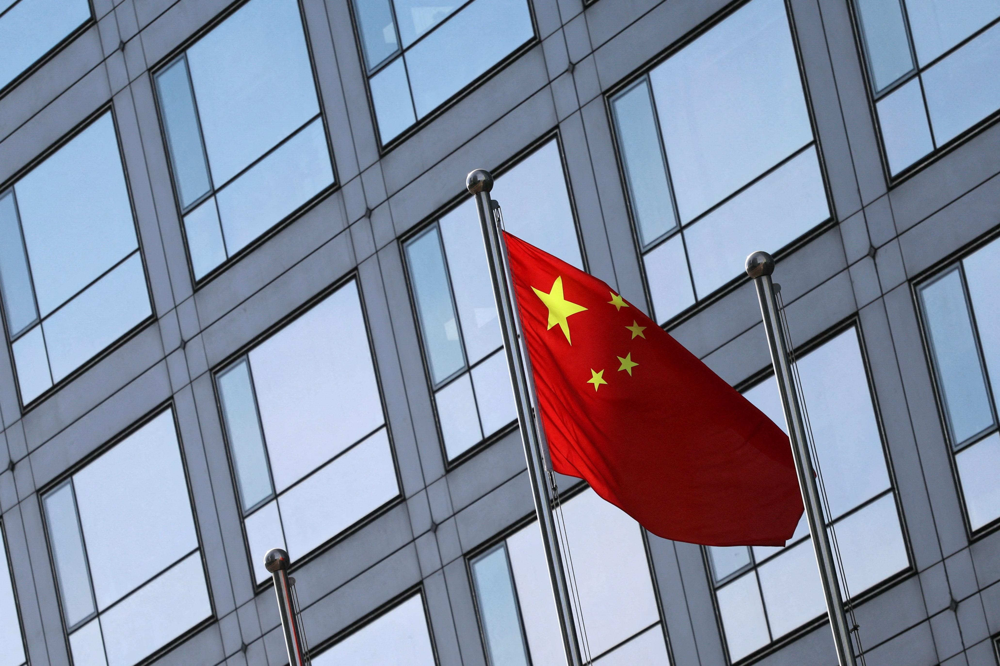

## Table of Contents

## What is short selling?

Short selling is when someone borrows a stock and sells it, hoping to buy it back later at a lower price. They make money if the stock's price goes down. For example, if you borrow and sell a stock for $100, and later buy it back for $80, you keep the $20 difference after returning the stock.

However, short selling can be risky. If the stock price goes up instead of down, you lose money. Using the same example, if you have to buy the stock back at $120, you lose $20. Also, there's no limit to how much you could lose because a stock's price can keep going up. It's like betting against the stock, and it requires careful thinking and understanding of the market.

## Why is short selling regulated?

Short selling is regulated because it can be risky and affect the stock market in big ways. If many people short sell a stock, it can make its price go down a lot. This can scare other investors and cause panic selling. Regulators want to stop this from happening too much, so they make rules to keep the market stable and protect investors.

Also, short selling can be used in bad ways, like spreading false information to make a stock's price fall. This is called market manipulation, and it's illegal. Regulations help catch and stop people who try to cheat the system. By having rules, regulators make sure that short selling is done fairly and openly, which helps keep trust in the stock market.

## What are the basic short selling regulations in China?

In China, short selling is allowed but it's tightly controlled. The main rule is that you can only short sell stocks that are on a special list. This list is made by the China Securities Regulatory Commission (CSRC). They pick stocks that are big and have a lot of shares being traded every day. This helps keep the market stable and stops people from short selling stocks that might cause big problems if their prices fall a lot.

Another important rule is that you have to borrow the stocks before you can short sell them. You can't just sell stocks you don't own. This rule makes sure that short selling is done in a clear and fair way. Also, there are rules about how much you can short sell and when you can do it. These rules help stop people from using short selling to cheat or hurt the market.

## How have short selling regulations in China evolved over time?

Short selling regulations in China have changed a lot over the years. At first, China did not allow short selling at all. It was seen as too risky and could cause big problems in the stock market. But in 2010, China started to let people short sell some stocks. They made a special list of stocks that were big and traded a lot. This was a big change because it let investors bet that some stock prices would go down, not just up.

Over time, the rules got stricter to keep the market safe. After a big drop in the stock market in 2015, China made even more rules. They said you have to borrow the stocks before you can short sell them. They also made rules about how much you can short sell and when you can do it. These changes were to stop people from using short selling to cheat or hurt the market. So, while short selling is allowed now, it's very controlled to keep the market stable and protect investors.

## What are the key differences between short selling regulations in China and other major markets?

In China, short selling is tightly controlled compared to many other major markets. The China Securities Regulatory Commission (CSRC) only allows short selling on a special list of stocks, which are chosen because they are big and have a lot of shares traded every day. This is different from places like the United States, where you can short sell almost any stock as long as you can borrow it. Also, in China, you must borrow the stock before you can short sell it, and there are strict rules about how much you can short sell and when you can do it. These rules help keep the market stable and stop people from cheating.

In contrast, the United States has a more open approach to short selling. The U.S. Securities and Exchange Commission (SEC) allows short selling on most stocks, as long as you follow the rules about borrowing the stock and reporting your trades. There are also rules to stop market manipulation, but investors have more freedom to short sell than in China. In Europe, the rules can vary by country, but many have similar rules to the U.S., with some extra controls during times of market stress. Overall, China's strict regulations show a focus on keeping the market safe and stable, while other major markets give investors more freedom but still have rules to protect the market.

## What are the specific requirements for short selling in the Chinese stock market?

In China, you can only short sell stocks that are on a special list made by the China Securities Regulatory Commission (CSRC). These stocks are big and have a lot of shares traded every day. This rule helps keep the market stable and stops people from short selling stocks that might cause big problems if their prices fall a lot. Before you can short sell, you must borrow the stocks you want to sell. This makes sure that short selling is done in a clear and fair way.

There are also rules about how much you can short sell and when you can do it. These rules help stop people from using short selling to cheat or hurt the market. The CSRC watches the market closely and can change these rules if needed to keep the market safe. So, while short selling is allowed in China, it's very controlled to protect investors and keep the market stable.

## How do short selling regulations in China affect market liquidity?

Short selling regulations in China can make the market less liquid. When there are strict rules about which stocks you can short sell and how much you can do it, fewer people might want to trade. This is because short selling can help make the market more active by letting people bet that stock prices will go down. But with tight rules, fewer people might join in, so there are fewer trades happening. This can make it harder to buy or sell stocks quickly because there are not as many people trading.

On the other hand, these strict rules can also help keep the market stable. By controlling short selling, the rules stop big price drops that can happen if too many people are betting against a stock. This can make investors feel safer and more likely to keep trading, even if it's not as much as they would without the rules. So, while the regulations might make the market less liquid in some ways, they can also help keep it steady, which is important for a healthy market.

## What are the penalties for violating short selling regulations in China?

If you break the short selling rules in China, you can get into big trouble. The China Securities Regulatory Commission (CSRC) can fine you a lot of money. The fine can be up to 10 times the money you made from breaking the rules. They can also stop you from trading for a while or even forever if you do something really bad.

Besides fines and trading bans, the CSRC can also take you to court. If you are found guilty of breaking the rules on purpose, you might have to go to jail. These strict punishments are there to make sure people follow the rules and keep the market fair and safe for everyone.

## How do Chinese regulators monitor and enforce short selling regulations?

Chinese regulators, like the China Securities Regulatory Commission (CSRC), keep a close eye on short selling to make sure people follow the rules. They use special computer systems to watch the stock market all the time. These systems can see when someone tries to short sell a stock that's not on the special list or if they short sell more than they're allowed. If they spot something wrong, they can quickly start an investigation to find out what happened.

If the CSRC finds out that someone broke the short selling rules, they can take strong action. They might fine the person a lot of money, up to 10 times what they made from breaking the rules. They can also stop the person from trading for a while or even forever if it's really bad. Sometimes, they might even send the case to the court, and if the person is found guilty, they could go to jail. These tough rules and punishments help make sure that short selling in China is done fairly and safely.

## What impact do short selling regulations have on foreign investors in China?

Short selling regulations in China can make it harder for foreign investors to trade in the Chinese stock market. The rules are very strict, and foreign investors have to follow them just like everyone else. They can only short sell stocks that are on a special list, and they must borrow the stocks before selling them. This can make it tricky for foreign investors because they might not know all the rules or have easy access to the stocks they need to borrow. It can also make them think twice about short selling in China because the penalties for breaking the rules are very tough.

On the other hand, these strict rules can also make foreign investors feel safer. They know that the Chinese regulators are working hard to keep the market stable and stop people from cheating. This can make them more confident to invest in China, even if they can't short sell as freely as they might in other countries. So, while the regulations might limit what foreign investors can do, they also help create a more trustworthy and stable market, which can be good for everyone in the long run.

## How do short selling regulations in China influence market stability and investor confidence?

Short selling regulations in China help keep the stock market stable. By only letting people short sell certain stocks and making sure they borrow the stocks first, the rules stop big price drops that can happen if too many people bet against a stock. This makes the market less likely to have big swings, which can scare investors. When the market is more stable, people feel safer about putting their money into it.

These rules also help build investor confidence. When investors know that the market is being watched closely and that there are strict rules to stop cheating, they trust the market more. Even though the rules might make it harder for some people to trade, they make investors feel like their money is safer. This can bring more people to invest in China, which is good for the whole market in the long run.

## What future changes to short selling regulations are being discussed or anticipated in China?

People in China are talking about making short selling rules a bit easier. They think that if the rules are not so strict, more people might want to trade. This could make the market more lively and help people buy and sell stocks more easily. But they also want to keep the market safe, so any changes would be small and careful.

At the same time, there's a lot of talk about using new technology to watch the market better. The regulators want to use computers to see if anyone is breaking the rules faster. This could help catch people who try to cheat and keep the market fair. So, while the rules might get a little easier, the way they watch the market will get even stricter.

## References & Further Reading

[1]: Jones, C. M., & Lamont, O. A. (2002). ["Short-Sale Constraints and Stock Returns."](https://www.sciencedirect.com/science/article/pii/S0304405X02002246) The Review of Financial Studies, 6(2), 97-124.

[2]: Brunnermeier, M. K., & Pedersen, L. H. (2005). ["Predatory Trading."](https://onlinelibrary.wiley.com/doi/abs/10.1111/j.1540-6261.2005.00781.x) Journal of Finance, 60(4), 1825-1863.

[3]: Aldridge, I. (2013). ["High-Frequency Trading: A Practical Guide to Algorithmic Strategies and Trading Systems."](https://onlinelibrary.wiley.com/doi/pdf/10.1002/9781119203803.fmatter) John Wiley & Sons.

[4]: Harris, L. E. (2003). ["Trading and Exchanges: Market Microstructure for Practitioners."](https://academic.oup.com/book/52292) Oxford University Press.

[5]: Foucault, T., Pagano, M., & Röell, A. (2013). ["Market Liquidity: Theory, Evidence, and Policy."](https://academic.oup.com/book/55158) Oxford University Press.