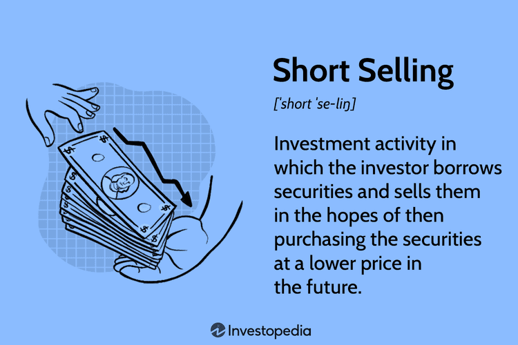

## Table of Contents

## What is short selling?

Short selling is when someone borrows a stock or asset and sells it, hoping to buy it back later at a lower price. They aim to make a profit from the difference between the selling price and the lower buying price. For example, if you borrow a stock worth $100 and sell it, then the stock price drops to $80, you can buy it back for $80, return the stock, and keep the $20 difference as profit.

However, short selling can be risky. If the stock price goes up instead of down, the person who short sold will lose money. Using the same example, if the stock price rises to $120, they would have to buy it back at $120, losing $20. Also, there's no limit to how high a stock price can go, so the potential losses can be very large. This makes short selling a strategy that requires careful consideration and understanding of the market.

## Why is short selling regulated in India?

Short selling is regulated in India to protect the market and investors. The rules help make sure that short selling is done in a fair way. Without rules, some people might try to cheat or make the market unstable. The regulations also help to keep the market honest and stop people from spreading false information to make stock prices go down.

The Securities and Exchange Board of India (SEBI) is the group that makes these rules. They set limits on how much short selling can be done and make sure that everyone follows the same rules. This helps to keep the market safe and fair for everyone. By having these rules, SEBI can watch over the market and step in if something goes wrong.

## What are the basic rules for short selling in India?

In India, short selling is regulated by the Securities and Exchange Board of India (SEBI). The basic rule is that you can only short sell a stock if you can borrow it first. This means you need to make sure you can get the stock from someone else before you sell it. Also, you have to tell the stock exchange that you are short selling. This helps keep everything open and honest.

Another rule is that you can't short sell more than a certain amount of a stock. This limit helps stop the market from getting too wild. If too many people short sell the same stock, it could make the price drop a lot, which isn't good for the market. So, SEBI sets these limits to keep things stable.

Lastly, you have to settle your short sale within the normal trading time. This means you need to buy back the stock and return it to the person you borrowed it from within the same trading day. This rule helps make sure that short selling doesn't mess up the market for too long.

## Who can engage in short selling in India?

In India, short selling is open to both retail investors and institutional investors like banks and mutual funds. Retail investors are everyday people who want to trade stocks, while institutional investors are big organizations that manage a lot of money. Both types of investors need to follow the rules set by the Securities and Exchange Board of India (SEBI) to make sure short selling is done fairly and doesn't harm the market.

To engage in short selling, investors must first find a way to borrow the stocks they want to sell. They can do this through a broker or a stock lending and borrowing platform. Once they have secured the stocks, they can sell them on the stock market. It's important for investors to report their short sales to the stock exchange, so everything is transparent and can be monitored to keep the market stable.

## What types of securities can be short sold in India?

In India, you can short sell stocks that are listed on the stock exchange. These stocks need to be part of the Futures and Options (F&O) segment, which means they are allowed to be traded in the futures and options market. This is because the F&O segment has rules that help make short selling safer and more controlled. So, if a stock is in this segment, you can borrow it and then sell it, hoping to buy it back later at a lower price.

Besides stocks, you can also short sell certain types of bonds and debentures. These are like loans that companies or the government take from investors. If you think the price of these bonds or debentures will go down, you can borrow them and sell them short. Just like with stocks, you need to follow the rules set by SEBI and make sure you can borrow the securities before you sell them.

## What are the disclosure requirements for short sellers in India?

In India, if you want to short sell a stock, you have to tell the stock exchange about it. This is called disclosure. You need to let them know that you are selling a stock that you borrowed and don't actually own. This helps keep the market honest and open. You must report your short sale to the exchange on the same day you do it. This way, everyone knows what's happening and it's easier to keep track of short selling activities.

The rules are set by the Securities and Exchange Board of India (SEBI). They want to make sure that short selling doesn't hurt the market. So, they make sure that everyone who short sells follows the same rules. This includes telling the exchange about your short sale. By doing this, SEBI can watch over the market and make sure that short selling is done fairly and doesn't cause problems.

## How does the Securities and Exchange Board of India (SEBI) monitor short selling?

The Securities and Exchange Board of India (SEBI) keeps an eye on short selling to make sure it's done fairly and doesn't hurt the market. They do this by making rules that everyone has to follow. One big rule is that if you want to short sell a stock, you have to tell the stock exchange about it on the same day. This helps SEBI keep track of who is short selling and how much they are doing it. By knowing this, SEBI can watch the market closely and step in if they see something that might cause problems.

SEBI also sets limits on how much short selling can be done. This is to stop the market from getting too wild. If too many people short sell the same stock, it could make the price drop a lot, which isn't good for everyone. So, SEBI makes sure that there are rules in place to keep the market stable. They also check that people are only short selling stocks they can borrow first. This way, SEBI can make sure that short selling is done in a way that is safe and fair for all investors.

## What are the penalties for non-compliance with short selling regulations in India?

If someone does not follow the rules for short selling in India, they can get in big trouble. The Securities and Exchange Board of India (SEBI) can fine them a lot of money. The fine can be up to 25% of the money they made from short selling, or even more if SEBI thinks it's needed. This is to make sure people take the rules seriously and don't try to cheat.

SEBI can also stop the person from trading for a while. This is called a suspension, and it can last for a few months or even longer. If the person keeps breaking the rules, SEBI might ban them from the market forever. This is a very serious penalty and shows how important it is to follow the short selling rules in India.

## How have short selling regulations in India evolved over time?

Short selling rules in India have changed a lot over the years. At first, there were not many rules, and it was hard to keep track of who was short selling and how much. But as more people started to short sell, the market got more risky. So, the Securities and Exchange Board of India (SEBI) decided to make new rules to keep things fair and safe. They started by saying that you have to tell the stock exchange if you are short selling. This helped SEBI watch the market better and stop people from cheating.

Over time, SEBI added more rules to make short selling safer. They said you can only short sell stocks that are in the Futures and Options (F&O) segment. This means only certain stocks can be short sold, which helps control the market. SEBI also set limits on how much short selling can be done. This stops the market from getting too wild and keeps prices stable. These changes show how SEBI keeps working to make sure short selling is done in a way that is fair for everyone.

## What impact do short selling regulations have on the Indian stock market?

Short selling regulations in India help keep the stock market fair and safe for everyone. When people follow the rules, it stops the market from getting too wild. For example, SEBI says you can only short sell certain stocks and you have to tell the stock exchange about it. This makes sure that everyone knows what's happening and can't cheat. It also helps keep stock prices stable because there are limits on how much short selling can be done. This way, the market doesn't get too crazy and everyone can trade without worrying too much.

If there were no rules, short selling could make the market very risky. Without limits, too many people might short sell the same stock, making its price drop a lot. This could scare other investors and make them lose money. But with rules, SEBI can watch over the market and step in if something goes wrong. This makes investors feel safer and more confident in the market. So, the regulations help keep the market honest and protect everyone who trades stocks in India.

## How do short selling regulations in India compare to those in other major markets?

In India, short selling is tightly controlled by the Securities and Exchange Board of India (SEBI). You can only short sell certain stocks that are in the Futures and Options segment, and you have to tell the stock exchange about it on the same day. There are also limits on how much short selling can be done to keep the market stable. If you break the rules, SEBI can fine you a lot of money or even stop you from trading. These rules help keep the market fair and safe for everyone.

In the United States, the rules are a bit different. The Securities and Exchange Commission (SEC) says you can short sell any stock, but you have to do it at a certain price called the "uptick rule." This means you can only short sell if the last price the stock traded at was higher than the price before it. There are also rules about how much you have to put up as a deposit, called margin requirements. The U.S. also has rules to stop people from spreading false information to make stock prices go down, but the fines and penalties might not be as strict as in India.

In Europe, short selling rules can be different from one country to another, but many follow rules set by the European Securities and Markets Authority (ESMA). Like in the U.S., you can short sell any stock, but you have to report it if you short sell a lot of a certain stock. There are also rules to stop short selling from making the market too unstable, especially during big financial problems. Europe also has strict rules about spreading false information, with big fines for people who break them. Overall, while the details are different, all these places have rules to keep short selling from hurting the market.

## What are the current debates and proposed changes to short selling regulations in India?

There are ongoing debates about short selling rules in India. Some people think the rules are too strict and make it hard for investors to make money. They want to change the rules so more stocks can be short sold and the limits on how much short selling can be done are relaxed. They believe this would make the market more active and help investors make better decisions. On the other hand, some people worry that relaxing the rules could make the market too risky. They think the current rules help keep the market stable and protect investors from big losses.

There are also talks about making the rules clearer and easier to follow. Some investors find the current rules confusing and want SEBI to explain them better. They also want faster ways to report short sales to the stock exchange. SEBI is looking at these ideas and might make changes to the rules soon. They want to find a balance between letting investors short sell and keeping the market safe for everyone.

## References & Further Reading

[1]: Securities and Exchange Board of India. (n.d.). ["SEBI Guidelines on Short Selling and Algorithmic Trading."](https://www.sebi.gov.in/)

[2]: Achar, A. (2020). "The Evolution of Stock Market Regulations in India: A Historical Perspective." *International Journal of Financial Studies, 8*(3), 12.

[3]: Ramesh, S. (2019). "Algorithmic Trading and Market Dynamics in India: Regulatory Perspectives." *Journal of Trading, 14*(2), 45-62.

[4]: "Regulatory Updates: Changes in SEBI's Approach to Short Selling and Algorithmic Trading" (2021), *The Economic Times*. [Link to article](https://www.forbes.com/sites/dereksaul/2024/11/01/how-the-economy-really-fared-under-bidenharris-and-trump-from-jobs-to-inflation-final-update/)

[5]: "How SEBI's Regulatory Framework is Adapting to Technological Advancements in Trading" (2023), *Business Standard*. [Link to article](https://news.gm.com/home.html)

[6]: Patel, H. (2022). "Impact of SEBI's Short Selling Regulations on Market Volatility: An Analytical Review". *Financial Markets and Policy Studies, 10*(4), 78-91.

[7]: Choudhary, R. & Mehta, P. (2021). "Algorithmic Trading: Opportunities and Risks in the Indian Market." *Asia-Pacific Financial Markets Review, 26*(1), 39-58.

[8]: "SEBI's Strategic Reforms: Balancing Innovation and Regulation in the Indian Stock Market" (2022), *Mint*. [Link to article](https://www.livemint.com)

[9]: "How SEBI's Guidelines are Shaping Future Trading Practices" (2022), *Hindustan Times*. [Link to article](https://www.hindustantimes.com/india-news/motion-urging-centre-to-lure-airlines-to-fly-to-europe-us-from-kolkata-passed-in-wb-assembly-101733404092407.html)