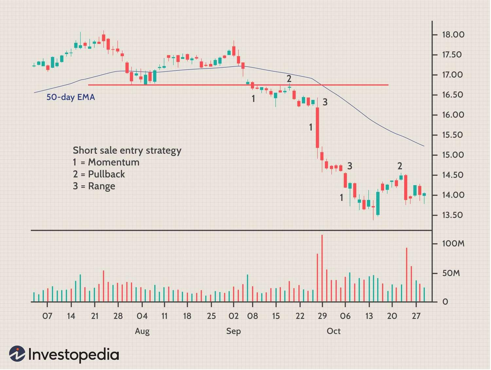

## Table of Contents

## What is short selling and how does it work?

Short selling is a way to make money from a stock when you think its price will go down. Instead of buying a stock and hoping it goes up, you borrow shares of a stock from someone else, sell those shares at the current price, and then buy them back later at a lower price to return them to the lender. The difference between the price you sold at and the price you bought back at is your profit.

Here's how it works in simple steps: Imagine you think the price of XYZ stock, which is currently $50 per share, will drop. You borrow 10 shares of XYZ from a broker and sell them immediately for $500. If the price drops to $40 per share, you buy back the 10 shares for $400, return them to the broker, and keep the $100 difference as your profit. However, if the price goes up instead, you could lose money because you'll have to buy back the shares at a higher price.

## What are the basic requirements to engage in short selling?

To start short selling, you need a margin account with a brokerage firm. This is different from a regular account because it lets you borrow money or stocks. You'll need to meet the firm's requirements, which usually include having enough money in your account to cover potential losses. This is called the margin requirement, and it's a safety measure to make sure you can pay back what you borrow.

Once you have a margin account set up, you need to find a stock that you think will go down in price. Not all stocks can be shorted, so you need to check if the stock is available for short selling. Your broker will also need to have the shares available to lend to you. If everything is in place, you can borrow the shares, sell them, and then buy them back later to return them to the broker. Remember, short selling can be risky because if the stock price goes up instead of down, you could lose more money than you initially invested.

## What are the risks associated with short selling?

Short selling can be risky because if the stock price goes up instead of down, you could lose a lot of money. When you short sell, you borrow shares and sell them, hoping to buy them back cheaper later. But if the price goes up, you have to buy them back at the higher price to return them to the lender. This means your losses can be much bigger than what you started with. It's like betting against the stock, and if you're wrong, it can cost you a lot.

Another risk is that there's no limit to how high a stock price can go. When you buy a stock hoping it will go up, the most you can lose is what you paid for it. But with short selling, if the stock keeps going up, your losses can keep growing too. This is called unlimited risk. Also, if a lot of people are trying to short sell the same stock, it can be hard to find shares to borrow, or the cost to borrow them might go up, making it more expensive and risky.

Lastly, short selling can be affected by something called a short squeeze. This happens when a lot of people have shorted a stock and it starts to go up. Those short sellers might panic and start buying back the shares to cut their losses, which pushes the price up even more. This can lead to big losses for short sellers who are caught in the squeeze. It's a risky situation that can happen quickly and unexpectedly.

## How can one identify stocks that are good candidates for short selling?

To find stocks that might be good for short selling, you should look at companies that are not doing well. This could be because they are losing money, have a lot of debt, or are facing problems like lawsuits or bad news. You can check financial reports and news to see if a company's situation is getting worse. If a company's stock price is high but its business is struggling, it might be a good candidate for short selling.

Another way to spot good short selling opportunities is by looking at stocks that are overvalued. This means the stock price is much higher than what the company is really worth. You can use financial ratios like the price-to-earnings (P/E) ratio to see if a stock is overpriced compared to others in its industry. If a stock's P/E ratio is much higher than similar companies, it might be a good target for short selling. Also, if a lot of people are already betting against the stock (this is called short interest), it might be a sign that others see problems too.

Technical analysis can also help you find stocks to short sell. This involves looking at charts and patterns to predict where a stock's price might go. If you see a stock's price going down over time and it breaks through important support levels, it might be a good time to short sell. Combining these different methods can help you find the best stocks for short selling, but remember, it's still a risky strategy and you should do a lot of research before you start.

## What are the key regulations and rules governing short selling?

Short selling is controlled by rules from the government and stock exchanges to make sure it's fair and safe for everyone. One big rule is the uptick rule, which says you can only short sell a stock if its price is going up a little bit. This is to stop people from making the stock price fall too fast. Another rule is that you have to tell the stock exchange when you short sell, so they can keep track of it. This is called reporting requirements. Also, there are rules about how much money you need to have in your account to short sell, which is called margin requirements. These rules help make sure you can pay back what you borrow if things go wrong.

Another important rule is the locate rule, which says you have to find the shares you want to borrow before you can short sell them. This stops people from short selling shares they can't actually get. There are also special rules during times when the market is very unstable, like a short selling ban. This means you can't short sell certain stocks at all for a while to stop the market from crashing. All these rules are there to keep short selling fair and to protect everyone in the market.

## What is a short squeeze and how can it affect short sellers?

A short squeeze happens when a lot of people have shorted a stock, betting that its price will go down. But if the stock's price starts to go up instead, those short sellers might get worried. They might decide to buy back the shares they borrowed to cut their losses. When a lot of short sellers do this at the same time, it can push the stock price up even more. This is called a short squeeze because it "squeezes" the short sellers, forcing them to buy back the stock at higher and higher prices.

Short squeezes can be really bad for short sellers. If they don't buy back the shares fast enough, the price can keep going up, and their losses can get bigger and bigger. Sometimes, a short squeeze can make the stock price go up so much that it's hard for short sellers to cover their positions at all. This can lead to huge losses, and in some cases, it can even cause the short sellers to lose more money than they started with. That's why short squeezes are one of the biggest risks for people who short sell stocks.

## How do short selling strategies differ between retail and institutional investors?

Retail investors and institutional investors use different short selling strategies mainly because of the size of their investments and the resources they have. Retail investors usually have less money to work with, so they might focus on short selling stocks of smaller companies or those that are easier to borrow. They often use technical analysis to find the right time to short sell, looking at stock charts and patterns. Retail investors might also use online tools and forums to share ideas and learn about potential short selling opportunities. Because they have less money at risk, retail investors might be more willing to take bigger risks on short selling, but they need to be careful because the losses can still be big.

Institutional investors, like big banks or hedge funds, have a lot more money and resources. They can short sell large amounts of stock and often target bigger companies. They use a lot of research and data to find stocks that they think will go down in price. Institutional investors might also use complex strategies like short selling as part of a bigger plan, such as hedging other investments. They have teams of analysts and access to more detailed information, which helps them make better decisions. Because they are dealing with so much money, they need to be very careful about the risks of short selling, and they have more rules and checks to follow to make sure they don't lose too much.

## What are some advanced short selling techniques used by experienced traders?

Experienced traders use a strategy called "pairs trading" for short selling. This means they short sell one stock while buying another stock in the same industry at the same time. They do this because they think one stock will go down while the other goes up. This can help them make money even if the whole market goes up or down. It's a bit like betting on which stock will do better than the other. Pairs trading can be less risky than just short selling one stock because it's more about the difference between the two stocks than the overall market.

Another technique is "shorting against the box." This is when a trader who already owns a stock short sells the same stock. They do this to lock in a profit or to protect against a drop in the stock's price. It's a way to hedge their investment. But there are rules about this, and sometimes it's not allowed. Traders need to be careful and know the rules. Both of these techniques show how experienced traders can use short selling in smart ways to manage risk and try to make money.

## How can short selling be used as part of a broader investment strategy?

Short selling can be a part of a bigger plan to make money from the stock market. It's like a tool that investors use to balance out their other investments. If an investor thinks the market or a certain stock is going to go down, they can short sell that stock to make money even when prices are falling. This can help protect their other investments that might lose value if the market goes down. It's a way to make money no matter which way the market moves, up or down.

Another way short selling fits into a broader strategy is by using it to hedge against risk. For example, if an investor owns a lot of stocks in one industry, they might short sell stocks in that same industry to protect against a drop in that sector. This is called hedging. It's like insurance for their investments. By short selling, they can make money if the industry goes down, which can help cover losses from their other stocks. This way, short selling helps investors manage risk and keep their overall investment strategy balanced.

## What are the tax implications of short selling?

When you make money from short selling, you have to pay taxes on your profits. The money you make from short selling is usually considered capital gains. If you hold the short position for less than a year, it's a short-term capital gain, and you'll pay taxes at your regular income tax rate. If you hold it for more than a year, it's a long-term capital gain, and you'll pay a lower tax rate. This is important to know because it can affect how much money you keep after taxes.

There are also some special rules to keep in mind. If you get dividends from the shares you borrowed to short sell, you have to pay taxes on those dividends too. Also, if you lose money on a short sale, you can use those losses to reduce your taxes. You can deduct those losses from your other income, but there are limits on how much you can deduct each year. It's a good idea to talk to a tax professional to make sure you're doing everything right and taking advantage of all the tax rules that apply to short selling.

## How does short interest and days to cover influence short selling decisions?

Short interest and days to cover are important numbers that help people decide if they should short sell a stock. Short interest is the total number of shares that people have borrowed and sold short. If a lot of people are shorting a stock, it means many think the price will go down. But if too many people are shorting it, it could lead to a short squeeze, where the price goes up fast because everyone is trying to buy back the shares at the same time. So, looking at short interest helps you see how risky it might be to short sell that stock.

Days to cover is another useful number. It tells you how many days it would take for all the short sellers to buy back the shares they borrowed, based on how many shares are traded each day. If the days to cover is high, it means it could take a long time for short sellers to get out of their positions. This can make the stock more risky to short sell because if the price starts to go up, it might be hard to buy back the shares quickly. By looking at both short interest and days to cover, you can get a better idea of whether a stock is a good choice for short selling and how risky it might be.

## What role does market sentiment play in the success of short selling strategies?

Market sentiment is really important when it comes to short selling. It's all about how people feel about the market or a certain stock. If most people think a stock's price will go down, it can make short selling easier and more successful. When everyone is feeling negative, the stock price might drop, which is good for short sellers because they can buy back the shares at a lower price and make money. But, if the market sentiment suddenly changes and people start feeling more positive, it can make short selling riskier. A positive shift can cause the stock price to go up, which is bad for short sellers because they'll lose money if they have to buy back the shares at a higher price.

Understanding market sentiment can help short sellers make better decisions. They need to keep an eye on news, social media, and other signs of how people are feeling about the market. If there's a lot of bad news about a company or the economy, it might be a good time to short sell because the negative sentiment could push the stock price down. But short sellers also have to be ready for quick changes in sentiment. If something good happens or if there's a short squeeze, the stock price can go up fast, and that can lead to big losses. So, market sentiment is a key part of figuring out when and what to short sell.

## References & Further Reading

[1]: Bergstra, J., Bardenet, R., Bengio, Y., & Kégl, B. (2011). ["Algorithms for Hyper-Parameter Optimization."](https://papers.nips.cc/paper/4443-algorithms-for-hyper-parameter-optimization) Advances in Neural Information Processing Systems 24.

[2]: ["Advances in Financial Machine Learning"](https://www.amazon.com/Advances-Financial-Machine-Learning-Marcos/dp/1119482089) by Marcos Lopez de Prado

[3]: ["Evidence-Based Technical Analysis: Applying the Scientific Method and Statistical Inference to Trading Signals"](https://www.amazon.com/Evidence-Based-Technical-Analysis-Scientific-Statistical/dp/0470008741) by David Aronson

[4]: ["Machine Learning for Algorithmic Trading"](https://github.com/stefan-jansen/machine-learning-for-trading) by Stefan Jansen

[5]: ["Quantitative Trading: How to Build Your Own Algorithmic Trading Business"](https://www.amazon.com/Quantitative-Trading-Build-Algorithmic-Business/dp/1119800064) by Ernest P. Chan