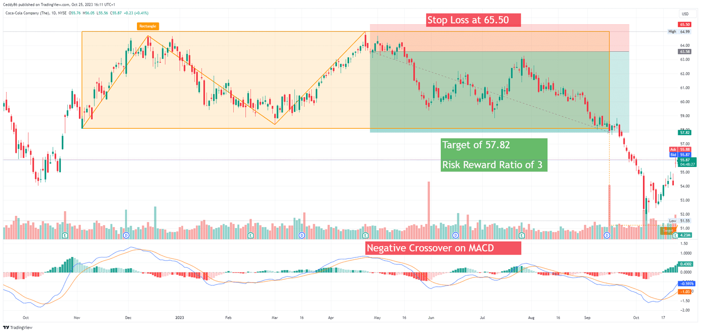

In the fast-paced world of financial markets, investors constantly seek ways to maximize returns and manage risks. The complexity and unpredictability inherent in these markets have led to the development and adoption of sophisticated investment strategies, notably short selling and algorithmic trading. Short selling allows investors to capitalize on declining stock prices by borrowing shares and selling them, with the expectation of repurchasing them at a lower price. Meanwhile, algorithmic trading leverages computer algorithms to execute trades based on predefined criteria, providing speed and efficiency unmatched by traditional trading methods.

These strategies have gained traction among traders and investors due to their potential to enhance portfolio performance and mitigate risks. The effective application of short selling and algorithmic trading can provide investors with a competitive advantage, enabling them to navigate volatile markets and exploit market inefficiencies. However, these strategies also come with their own sets of challenges and risks, requiring a thorough understanding and careful management.



As the landscape of financial markets continues to evolve, the importance of staying informed and adaptable cannot be overstated. Mastery of strategies such as short selling and algorithmic trading is essential for anyone looking to maintain a competitive edge in the financial arena. This article aims to provide a comprehensive overview of these strategies, exploring how they can be effectively leveraged in today's markets. Understanding these concepts will be invaluable for traders and investors seeking to optimize returns and manage risks in an increasingly dynamic and complex financial environment.

## Table of Contents

## Understanding Short Selling

Short selling is a financial strategy that enables investors to capitalize on the decline in the price of stocks. This technique involves borrowing shares of a stock, selling them at the current market price, and subsequently repurchasing them at a hopefully lower price. The core objective is to return the borrowed shares while pocketing the difference as profit. This strategy requires a broker to facilitate the borrowing of shares, typically from other investors within the brokerage's margin account. 

### Timing and Market Trends

Timing plays a pivotal role in the success of short selling. Investors must accurately predict the downturn of a stock's price, a complex task given market variables and external economic factors. Market trends and indicators become essential tools in forecasting these movements. Technical analysis techniques, such as moving averages, relative strength index (RSI), and moving average convergence divergence (MACD), can provide insights into when a stock might decrease in value.

For example, if an investor observes a stock's RSI surpassing 70, indicating that the stock is overbought, they might anticipate a price correction, prompting a short sale. Furthermore, investors keen on short selling often monitor economic announcements, earnings reports, and broader market indices, as these can trigger abrupt shifts in stock prices.

### Risk Management

The risks associated with short selling are significant, primarily due to the potential for unlimited losses. Unlike traditional stock purchases where the maximum loss is capped at the initial investment, stocks shorted can theoretically rise indefinitely, leading to escalating losses. Therefore, rigorous risk management is vital. 

One popular technique is the use of stop-loss orders, which automatically initiate a buy order if the stock price rises to a predetermined level, thus capping losses. Position sizing, diversification, and adherence to a comprehensive risk management plan are all crucial components that help mitigate potential losses. 

Python can be utilized to simulate and optimize short selling strategies, employing libraries like `pandas` for data manipulation and `numpy` for numerical operations. Here's a simple Python snippet that illustrates how a stop-loss mechanism might be implemented in an [algorithmic trading](/wiki/algorithmic-trading) context:

```python
import pandas as pd

# Assume 'data' is a DataFrame containing stock prices with a column 'Close'
data = pd.DataFrame({'Close': [105, 110, 95, 92, 87, 100, 102]})  # Example data

# Define stop-loss threshold and initial short price
stop_loss_threshold = 1.10  # 10% above the short sale price
initial_short_price = 100.0

def check_stop_loss(current_price):
    if current_price >= stop_loss_threshold * initial_short_price:
        print("Stop-loss triggered. Buy to cover the short position.")
    else:
        print("Hold short position.")

# Check stop-loss for each day's closing price
data['Close'].apply(check_stop_loss)
```

### Bear Markets and Volatility

Short selling proves particularly advantageous during bear markets and volatile periods. In a bear market, overall stock prices trend downward, providing fertile ground for short selling strategies. However, in volatile markets, stock prices can fluctuate dramatically over short periods. When used judiciously, short selling allows investors to leverage such price shifts, potentially leading to profitable trade entries and exits.

Successful short selling not only depends on the correct anticipation of price declines but also on nuanced execution strategies that mitigate risk and capitalize on market timing. By mastering these elements, investors can incorporate short selling into their arsenal of trading strategies, potentially enhancing returns in diverse market conditions.

## Risks and Rewards of Short Selling

Short selling, while a potentially profitable investment strategy, carries inherent risks that require careful management and understanding. The fundamental premise of short selling involves borrowing shares of a stock, selling them on the open market, and then repurchasing them at a lower price to return to the lender, thus profiting from the difference. However, this strategy can expose investors to significant financial risks. The potential for unlimited losses is one of the most substantial risks in short selling, as the price of a stock can theoretically rise indefinitely, making the cost of repurchasing the stock potentially limitless.

Furthermore, market [volatility](/wiki/volatility-trading-strategies) and unpredictability compound the risk of short selling. A notable example of this is the short squeeze, which occurs when a heavily shorted stock's price begins to rise, prompting short sellers to cover their positions by buying back shares. This buying activity can further drive up the price, exacerbating losses for short sellers and potentially leading to substantial financial strain.

Investors must also navigate various regulations and market conditions that impact short selling activities. The uptick rule, for instance, was a regulation in the United States that required each short sale transaction to be conducted at a price higher than the last trade price, thereby limiting the downward pressure on a stock's price. Though the original form of the uptick rule has been removed, modified versions continue to affect short selling strategies.

Effective risk management strategies play a crucial role in mitigating the potential adverse effects of short selling. Implementing stop-loss orders is one approach investors use to limit losses by automatically triggering the purchase of shares to cover their short position when the stock reaches a certain price level. This tactic helps maintain control over losses and can prevent financial ruin in highly volatile markets.

The risks associated with short selling emphasize the importance of sound judgment and strategic planning. Investors must remain vigilant, continuously monitoring market conditions and potential regulatory changes that could impact their short selling positions. By maintaining a robust understanding of the risks involved and employing strategic risk management techniques, investors can better navigate the challenges of short selling and potentially enhance their portfolio performance.

 to Algorithmic Trading

Algorithmic trading, often referred to as algo trading, uses computer algorithms to automate the decision-making process and trade execution in financial markets. By relying on mathematical models and statistical analyses, these algorithms operate under predefined criteria, enabling trades to be executed with speed and precision far beyond human capability.

The foundation of algorithmic trading rests on the ability to harness data-driven insights. By analyzing vast amounts of market data in real-time, algorithms can identify trading opportunities that may not be immediately apparent to human traders. This approach not only increases the efficiency of trade execution but also helps in eliminating emotional biases that can often hinder trading performance.

Algorithmic trading strategies generally fall into several categories, each with specific objectives and methodologies:

1. **Arbitrage**: This strategy seeks to exploit price discrepancies between markets or instruments. An arbitrage algorithm might simultaneously buy a security in one market while selling it in another where the price is higher, thus capturing the spread. A basic example is statistical arbitrage, where algorithms identify slight deviations from mean price differences that tend to revert over time.

2. **Trend Following**: Trend-following strategies, such as moving averages, focus on capturing gains through the analysis of an asset's momentum in a particular direction. Algorithms programmed to follow trends use historical price patterns to predict future movements, buying securities that are trending upwards and selling those trending downwards.

3. **Mean Reversion**: This strategy is based on the hypothesis that asset prices and returns eventually return to their long-term mean or average level. Algorithms detect when a security is outside of its normal range and initiate trades anticipating a reversal towards the mean. For example, a mean reversion strategy could utilize Bollinger Bands as a signal for entry and exit points.

The construction of these algorithms involves quantitative modeling, [backtesting](/wiki/backtesting), and optimization. A simple Python code snippet for a basic moving average crossover strategy might look like this:

```python
import pandas as pd

# Fetch historical stock data
data = pd.read_csv('historical_data.csv')
data['SMA50'] = data['Close'].rolling(window=50).mean()
data['SMA200'] = data['Close'].rolling(window=200).mean()

# Define buy and sell signals
data['Signal'] = 0
data['Signal'][50:] = np.where(data['SMA50'][50:] > data['SMA200'][50:], 1, 0)

data['Position'] = data['Signal'].diff()

# Backtesting logic here: calculate returns based on signals
```

In this code, the algorithm first calculates the 50-day and 200-day simple moving averages (SMA). A buy signal is generated when the shorter SMA crosses above the longer SMA, indicating a potential upward trend.

In conclusion, algorithmic trading harnesses technology and quantitative finance principles to enhance trading strategies' efficiency and reliability. With advancements in computational power and data availability, algorithmic trading continues to evolve, providing traders with sophisticated tools to navigate complex financial markets.

## Benefits and Challenges of Algorithmic Trading

Algorithmic trading transformed financial markets by leveraging computational power for executing trades with exceptional speed and precision. By using predefined criteria, algorithms can analyze massive datasets, identify trading opportunities, and execute orders far faster than a human trader could. This automation allows for the elimination of emotional biases that often influence trading decisions, leading to more objective and consistent outcomes.

The speed at which trades are executed through algorithmic trading is one of its most significant advantages. Algorithms can process and respond to market conditions in milliseconds, which is crucial in capitalizing on small price movements. This capability is particularly beneficial in high-frequency trading ([HFT](/wiki/high-frequency-trading-strategies)), where success hinges on executing a large [volume](/wiki/volume-trading-strategy) of orders at rapid speeds.

Precision is another advantage, as algorithms can be finely tuned to execute trades according to specific market conditions and criteria. This level of precision reduces the likelihood of human error that can occur in manual trading. By following a set of instructions without deviation, algorithms maintain consistent trading strategies, ensuring that trades align strictly with the intended plan.

However, algorithmic trading is not without its challenges. System errors, for instance, pose a significant risk. These errors can arise from bugs in the code, network issues, or technical malfunctions, potentially leading to substantial financial losses. Thus, it is crucial to conduct thorough system testing and maintain reliable technical infrastructure.

Data quality is another critical [factor](/wiki/factor-investing). Poor quality data may lead to inaccurate analysis and suboptimal trading decisions. Ensuring access to comprehensive, accurate, and timely data is essential for the success of any algorithmic trading strategy.

Overfitting models presents an additional challenge. An overfitted model may perform well on historical data but fail in live markets due to its inability to generalize. To mitigate this risk, backtesting should be conducted with various datasets, including out-of-sample data, to ensure robustness and adaptability to different market conditions.

A successful implementation of algorithmic trading requires rigorous backtesting, ensuring that the algorithm performs well across different market situations. It also necessitates a solid understanding of market mechanics to interpret the results accurately through quantitative models and historical data analysis. Python, with its extensive libraries such as Pandas for data analysis and NumPy for numerical calculations, is a preferred language for developing and testing algorithms. 

```python
# Example Python code for backtesting a simple moving average crossover strategy
import pandas as pd

# Fetch historical market data
data = pd.read_csv('market_data.csv')
data['Short_MA'] = data['Close'].rolling(window=40).mean()
data['Long_MA'] = data['Close'].rolling(window=100).mean()

# Initialize positions
data['Position'] = 0
data.loc[data['Short_MA'] > data['Long_MA'], 'Position'] = 1  # Buy signal
data.loc[data['Short_MA'] < data['Long_MA'], 'Position'] = -1  # Sell signal

# Calculate strategy returns
data['Strategy_Returns'] = data['Position'].shift(1) * data['Close'].pct_change()

# Output cumulative returns
cumulative_returns = (1 + data['Strategy_Returns']).cumprod()
print(cumulative_returns.tail())
```

This code illustrates a backtesting approach for a simple moving average crossover strategy, which is a basic algorithmic trading model. Backtesting such strategies helps assess their viability and effectiveness, allowing traders to refine their algorithms before deploying them in live markets.

## Integrating Short Selling with Algorithmic Trading

Combining short selling with algorithmic trading offers a sophisticated approach to capitalizing on market downturns. By leveraging automated systems, traders can efficiently identify and exploit short selling opportunities, enhancing the precision and timing of their trades.

Automated algorithms are designed to scan vast datasets and recognize patterns amenable to short selling. These programs rely on historical data, real-time market feeds, and predictive analytics to generate signals indicating potential declines in security prices. For instance, an algorithm might monitor a stock's price movement, trading volume, and relative strength index (RSI) to forecast a downward trend. Upon detecting these indicators, the system can prompt a short sale, enabling traders to act swiftly and capitalize on the anticipated decline.

A practical Python snippet for constructing a simple short selling algorithm might look like this:

```python
import pandas as pd
import numpy as np
from ta.trend import SMAIndicator

def identify_short_opportunity(data):
    # Calculate simple moving averages
    sma_short = SMAIndicator(data['close'], window=20).sma_indicator()
    sma_long = SMAIndicator(data['close'], window=50).sma_indicator()

    # Identify potential short selling signal
    signal = (sma_short < sma_long) & (data['volume'] > data['volume'].rolling(window=5).mean())

    return signal

# Example usage
# Assume 'market_data' is a DataFrame with columns 'close' for closing prices and 'volume' for trading volumes
market_data = pd.DataFrame({'close': [...], 'volume': [...]})
short_signals = identify_short_opportunity(market_data)
```

In this code, an automated strategy is set up to detect when a short-term moving average falls below a long-term moving average, correlated with an increase in trading volume. This crossover pattern is a traditional indicator of a potential downward trend.

However, integrating short selling into algorithmic trading strategies necessitates rigorous development and testing. Algorithms must be meticulously backtested against historical data to validate their predictive power and to mitigate the risks of false positives, which could lead to unwarranted short positions. This involves simulating the algorithm's performance over past data to ensure its robustness and adaptability to varying market conditions. Additionally, careful attention must be paid to the model's parameters to avoid overfitting, where an algorithm performs well on historical data but poorly on unseen data.

In dynamic financial markets, these integrated strategies must be continuously monitored and refined. This involves regular updates to reflect changes in market conditions, regulatory environments, and improvements in data quality and computational resources. Consequently, traders employing this sophisticated integration must remain vigilant and adaptive, ensuring their strategies retain effectiveness amidst evolving market landscapes.

## Conclusion

Investment strategies, such as short selling and algorithmic trading, play a crucial role in the landscape of modern financial markets. When skillfully applied, these techniques can lead to substantial improvements in portfolio performance and provide investors with a much-needed competitive advantage. The efficacy of these strategies largely hinges on their strategic application, particularly in rapidly changing market environments where precision and timing are of the essence.

Short selling, for instance, offers the opportunity to capitalize on declining stock prices. It requires investors to borrow shares with the intention of selling them and subsequently repurchasing them at a lower price. This can lead to significant profits if the market conditions are favorable. However, these transactions [carry](/wiki/carry-trading) considerable risks, such as the potential for unlimited losses if stock prices unexpectedly rise. Hence, proficiency in risk management and a keen understanding of market dynamics are indispensable for succeeding in short selling.

On the other hand, algorithmic trading facilitates the execution of trades through pre-programmed algorithms, which operate at speeds and efficiencies that are unachievable by manual trading. This approach allows for the processing of vast amounts of data to identify trading opportunities based on predefined parameters. Algorithmic trading can improve decision-making by eliminating emotional biases and enhancing consistency in trade execution. Nonetheless, to harness these benefits, traders must ensure robust system reliability and mitigate challenges such as system errors or overfitting models.

For traders and investors who wish to maximize the potentials of short selling and algorithmic trading, continued education and constant awareness of market trends and technological advancements are imperative. The financial landscape is in a constant state of evolution, driven by regulatory changes, technological innovations, and shifts in market sentiment. Therefore, staying informed and adaptable is key to maintaining a strategic edge over competitors. 

Subsequently, integrating both strategies proficiently can yield a synergistic effect, potentially optimizing returns and minimizing risks. As these technologies continue to evolve, it becomes increasingly important for market participants to enhance their skill set and remain attuned to the ongoing advancements in trading methodologies.

## References & Further Reading

[1]: Bergstra, J., Bardenet, R., Bengio, Y., & Kégl, B. (2011). ["Algorithms for Hyper-Parameter Optimization."](https://papers.nips.cc/paper/4443-algorithms-for-hyper-parameter-optimization) Advances in Neural Information Processing Systems 24.

[2]: ["Advances in Financial Machine Learning"](https://www.amazon.com/Advances-Financial-Machine-Learning-Marcos/dp/1119482089) by Marcos Lopez de Prado

[3]: ["Evidence-Based Technical Analysis: Applying the Scientific Method and Statistical Inference to Trading Signals"](https://www.amazon.com/Evidence-Based-Technical-Analysis-Scientific-Statistical/dp/0470008741) by David Aronson

[4]: ["Machine Learning for Algorithmic Trading"](https://github.com/stefan-jansen/machine-learning-for-trading) by Stefan Jansen

[5]: ["Quantitative Trading: How to Build Your Own Algorithmic Trading Business"](https://www.amazon.com/Quantitative-Trading-Build-Algorithmic-Business/dp/1119800064) by Ernest P. Chan