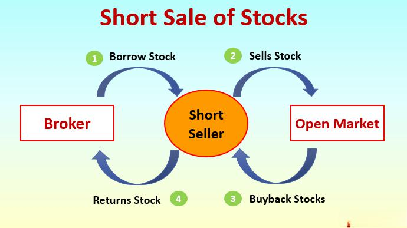

In today's ever-evolving financial markets, investors are continuously exploring sophisticated strategies to maximize their returns. Among the various approaches, short selling and algorithmic trading have emerged as prominent strategies in the stock market. Short selling involves borrowing shares to sell at the current market price, with the anticipation of buying them back at a lower price in the future, thus profiting from the decline in stock prices. Conversely, algorithmic trading employs computer programs and predetermined rules to execute trades, allowing traders to perform high-frequency transactions with precision and speed.

This article seeks to explore these strategies comprehensively, highlighting how they operate, the potential risks and rewards associated with each, and how they can be integrated into investment portfolios. By enhancing understanding of these methods, investors can make informed investment decisions that align with their financial goals and risk tolerance. As financial markets become increasingly complex, mastering these concepts is crucial for investors aiming to maintain a competitive edge and achieve optimal returns.



## Table of Contents

## Understanding Short Selling

Short selling is a financial strategy where an investor seeks to profit from a decline in a stock's price. The process begins with the investor borrowing shares from a brokerage, selling them on the open market to generate immediate capital. The objective is to later repurchase those shares at a reduced price, return them to the lender, and pocket the difference. This method is akin to buying low and selling high, but in reverse order.

To illustrate, consider the following basic steps involved in short selling:

1. **Borrow Shares**: The investor borrows shares from a broker, incurring the responsibility to return them eventually. Brokers usually charge fees for lending these shares.

2. **Sell at Current Price**: The borrowed shares are sold at the current market price, generating cash.

3. **Repurchase at Lower Price**: The investor hopes the stock price will decline, allowing them to buy back the necessary number of shares at a cheaper rate.

4. **Return Shares**: The repurchased shares are returned to the broker, and the investor retains any profit, minus any related costs.

Here's a simple Python example to represent a short selling scenario:

```python
# Initial conditions
initial_price = 100  # Initial stock price
shares_borrowed = 10  # Number of shares borrowed
sell_price = initial_price * shares_borrowed  # Selling borrowed shares

# Hypothetical market conditions
final_price = 80  # Final stock price after decline

# Calculating profits
repurchase_cost = final_price * shares_borrowed  # Cost of buying back shares
profit = sell_price - repurchase_cost  # Total profit from short sell

print(f"Profit from short selling: ${profit}")
```

This Python snippet simulates an ideal circumstance where the stock's price drops from $100 to $80, resulting in a $200 profit from short selling 10 shares.

While potentially lucrative, short selling is fraught with risks. The most notable is the potential for infinite losses. Unlike traditional investing, where losses are limited to the initial capital spent on shares, short selling poses a scenario where stock prices rise indefinitely. This ascent forces short sellers to buy back shares at higher prices, amplifying losses exponentially. An example of such a peril is a "short squeeze," where rapid price increases compel short sellers to repurchase shares, driving the price even higher.

In summary, short selling allows investors to benefit from declining stock prices, but with the trade-off of substantial risk and potential for extensive financial loss. Careful consideration and risk management are essential when employing this strategy.

## Risks and Rewards of Short Selling

Short selling is a technique that offers investors the potential for substantial short-term profits when the value of a stock decreases rapidly. This strategy can be particularly effective in bearish markets, where stock prices are generally expected to decline. The core idea is to sell borrowed shares at a high price and then repurchase them at a lower price, thus capitalizing on the price differential. Despite its potential rewards, short selling is fraught with significant risks that investors must understand.

One of the primary risks of short selling is the theoretically unlimited potential for loss. Unlike traditional stock purchases where the maximum loss is the initial investment amount (as a stock's price cannot fall below zero), short selling involves the risk of the stock price increasing indefinitely. For example, if an investor short sells 100 shares at $50 each, anticipating a price drop, but the stock price instead rises to $100, the investor must cover the $5,000 difference upon repurchasing the shares to return them.

Investors also need to be cautious of short squeezes. A short squeeze occurs when a heavily shorted stock experiences a price increase, forcing short sellers to buy back shares to close their positions and mitigate losses. This buying activity can amplify the stock's upward [momentum](/wiki/momentum), driving prices even higher and exacerbating the losses for short sellers. The GameStop short squeeze of 2021 serves as a prominent example, where retail investors collectively purchased shares, causing the stock price to skyrocket and resulting in significant losses for those who had shorted the stock.

Furthermore, short selling requires investors to maintain a margin account, which introduces additional costs and potential liabilities. This includes paying interest on the borrowed shares and meeting margin requirements, which can result in a margin call if the account's equity falls below a specified level, obligating the investor to deposit additional funds or securities.

In conclusion, while short selling offers opportunities for profit during declining markets, the associated risks, such as unlimited losses and short squeezes, necessitate a thorough understanding and robust risk management strategies. Investors should carefully assess these risks before engaging in short selling to ensure they are prepared for potential adverse market movements.

 to Algorithmic Trading

Algorithmic trading utilizes sophisticated computer algorithms to automate and streamline trading activities. By employing predefined rules and quantitative models, traders can execute transactions with minimal human intervention. This strategy enables high-frequency trading, where algorithms analyze multiple markets simultaneously and execute trades within milliseconds, optimizing prices and minimizing manual errors.

In [algorithmic trading](/wiki/algorithmic-trading), the basic mechanism involves using mathematical models and historical data to predict future market movements. For example, an algorithm might execute a buy order when a stock's 50-day moving average exceeds its 200-day moving average, suggesting an upward trend. Such strategies are coded into trading platforms, allowing for the automation of complex processes.

This methodology has become integral to modern financial markets, extensively adopted by institutional investors, hedge funds, and retail traders. Institutional investors benefit from the ability to trade large volumes without causing significant market disruptions, while hedge funds leverage algorithms for sophisticated strategies like statistical [arbitrage](/wiki/arbitrage).

For retail traders, algorithmic trading democratizes access to advanced market strategies through user-friendly platforms and customizable algorithms. This widespread usage reflects the efficiency and precision algorithmic trading brings to financial markets, effectively challenging traditional trading practices and reshaping market dynamics.

Algorithmic trading's appeal lies in its reduction of emotional bias and human error, leading to more consistent trading outcomes. However, it also requires substantial technical and financial knowledge to develop, test, and maintain these systems. The increasing complexity of financial markets necessitates continuous algorithm refinement to ensure optimized performance and risk management.

In summary, algorithmic trading represents a paradigm shift in trading methodologies, emphasizing automation, speed, and accuracy. It continues to evolve, driven by advancements in technology and data analytics, offering competitive advantages in trade execution and strategy implementation. As financial markets grow increasingly complex, algorithmic trading remains a vital tool for traders seeking to maintain a competitive edge.

## Advantages and Disadvantages of Algo Trading

Algorithmic trading, utilizing sophisticated algorithms and computer programs, has revolutionized the financial markets by automating trades and reducing human intervention. This approach offers several notable advantages that can enhance trading efficiency and execution. Primarily, algo-trading enables traders to execute orders with precision, leveraging pre-defined parameters to optimize transaction timing and price. This accuracy minimizes latency and slippage, common issues in manual trading, thus contributing to better trade outcomes.

One of the critical benefits of algorithmic trading is the elimination of human errors, which can significantly impact trading decisions. Human traders, susceptible to emotional and cognitive biases, might make irrational decisions during market turbulence. In contrast, algorithms operate based on logic and pre-set criteria, ensuring consistency and objectivity. By removing emotional influences, algorithmic systems maintain discipline in executing trades, adhering strictly to the defined strategies regardless of market [volatility](/wiki/volatility-trading-strategies).

Additionally, the rapid data processing capability of algorithms allows for high-frequency trading ([HFT](/wiki/high-frequency-trading-strategies)), where thousands of transactions can occur within fractions of a second. This speed facilitates capturing small price movements, contributing to cumulative profits over time. High-frequency trading requires sophisticated algorithms that can analyze vast datasets instantaneously, identifying trading opportunities unattainable through traditional means.

However, several challenges accompany the implementation of algorithmic trading. A primary concern is the heavy reliance on technology, including hardware, software, and network infrastructure. Any malfunctions or system glitches can result in significant financial losses, highlighting the importance of robust technological frameworks. For example, a sudden power failure or software bug could disrupt trading operations, leading to unintended trades or missed opportunities.

Another challenge is the potential market impact of algo-trading strategies, particularly in low-[liquidity](/wiki/liquidity-risk-premium) environments. Large algorithmic orders can inadvertently affect stock prices, causing adverse price movements against the trader's original intent. This impact necessitates careful formulation of execution strategies to mitigate potential market disruptions.

Algorithmic systems are also susceptible to rare market events, often termed "flash crashes," where aberrations in market activity lead to sharp and swift declines in asset values. Such events, albeit infrequent, can pose significant risks to algorithmic traders. Thus, incorporating fail-safes and controls within algorithms is crucial to prevent cascading effects during unexpected market anomalies.

Developing and maintaining efficient algorithmic trading systems is resource-intensive, requiring a blend of programming expertise and financial market knowledge. The complexity of creating and optimizing these algorithms necessitates investments in skilled personnel and technology infrastructure. Traders must continuously monitor and update their algorithms to adapt to evolving market conditions and regulatory landscapes, which can be a formidable task.

In summary, while algorithmic trading provides distinct advantages in terms of accuracy, efficiency, and emotionless decision-making, traders must remain cognizant of the accompanying technological dependencies, market impacts, and development costs. Successfully navigating these challenges can yield a competitive edge in the ever-changing landscape of financial trading.

## Integrating Short Selling and Algo Trading

Combining short selling with algorithmic trading can significantly enhance an investment strategy’s performance by capitalizing on both the analytical prowess of algorithms and the speculative nature of short selling. Algorithms, the backbone of this integration, can be engineered to continuously analyze large volumes of data to pinpoint potential short selling opportunities. These opportunities can emerge from various signals, such as price movements, technical indicators, or market events that suggest an overvaluation of a stock.

The automated nature of algorithmic trading means that trades can be executed swiftly and efficiently, capitalizing on market inefficiencies before they are corrected. This speed is critical in short selling, where timing can drastically affect profitability. By using pre-set parameters and conditions, algorithms can make objective decisions that reduce the risk associated with human emotion.

Consider a simple Python algorithm designed to identify a short selling opportunity based on moving averages. We define shorting conditions when the short-term moving average crosses below the long-term moving average, a common signal used by traders:

```python
import pandas as pd

# Load historical stock data
data = pd.read_csv('stock_data.csv')

# Calculate moving averages
data['short_ma'] = data['Close'].rolling(window=20).mean()
data['long_ma'] = data['Close'].rolling(window=50).mean()

# Identify short selling signals
data['short_signal'] = data.apply(lambda row: 1 if row['short_ma'] < row['long_ma'] else 0, axis=1)

# Execute trades based on signals
for i in range(1, len(data)):
    if data['short_signal'].iloc[i] == 1 and data['short_signal'].iloc[i-1] == 0:
        print(f'Short sell stock at index {i} - Price: {data["Close"].iloc[i]}')
```

However, integrating short selling with algorithmic trading is not without its complexities. Robust risk management systems are essential to mitigate the high volatility and potential losses inherent in short selling. Techniques such as stop-loss orders, position-sizing algorithms, and diversification can be employed to limit exposure and protect against adverse price movements. Algorithms can dynamically adjust these parameters based on real-time market data, thus preserving the integrity of the investment portfolio.

Effective risk management also encompasses monitoring broader market indictors and potential ‘black swan’ events that could trigger unfavorable trends. By embedding such multifaceted risk management protocols into algorithmic frameworks, investors can better navigate the unpredictable nature of the stock market, ensuring that the combination of short selling and algorithmic trading maximizes returns while maintaining manageable risk levels.

## Case Studies and Examples

The 2021 GameStop short squeeze serves as a prominent example illustrating the risks associated with short selling and the significant role of algorithmic trading. During this event, a group of retail investors organized on Reddit's WallStreetBets forum to purchase shares of GameStop, a struggling video game retailer. This surge in buying activity drove up the stock price dramatically, forcing many institutional investors who had shorted the stock to cover their positions by buying shares themselves. This rush to cover short positions only further inflated the stock price, exemplifying a phenomenon known as a "short squeeze."

Short squeezes occur when a heavily shorted stock's price rises, prompting short sellers to purchase shares to cover their positions and limit losses, thereby driving the price even higher. The GameStop case emphasized the perils of high short interest and the unpredictability of market dynamics.

Algorithmic trading played a dual role in this scenario. On one hand, algorithms programmed for high-frequency trading and momentum investing were quick to react to the volatility, exacerbating the price movements. On the other hand, algorithmic tools could potentially have helped hedge funds and other institutional investors identify and adapt to the evolving market conditions more rapidly. These tools could execute trades based on pre-set conditions faster than a human trader.

Successful hedge funds frequently integrate short selling and algorithmic trading to mitigate risk and capitalize on market opportunities. A good example is Renaissance Technologies, a [hedge fund](/wiki/hedge-fund-trading-strategies) known for its advanced algorithmic strategies. By using sophisticated mathematical models and extensive historical data analysis, they manage to exploit short-term market inefficiencies while maintaining a balanced risk profile through diversification.

Understanding these dynamics through case studies like GameStop and exploring strategies employed by hedge funds offer valuable insights for investors. Such real-world examples illuminate the complex interplay between market forces and emphasize the need for robust risk management strategies. For novice investors, these insights highlight the importance of due diligence and prudent approach to complex strategies. Seasoned investors, meanwhile, can refine their strategies by considering how technology and market conditions can influence traditional trading approaches. These lessons are crucial for navigating today's volatile financial markets effectively.

## Conclusion

Short selling and algorithmic trading present unique opportunities and challenges for investors navigating the complexities of the stock market. Both strategies offer the potential for substantial financial rewards, yet they come with inherent risks that require careful consideration and understanding.

For short selling, the key opportunity lies in the ability to profit from declining stock prices. This strategy, however, is not without its perils. Theoretically, the potential for loss is unlimited, as stock prices can rise indefinitely. Therefore, informed investors must weigh these risks against potential rewards, implementing robust risk management practices to mitigate potential losses. Understanding market conditions and company fundamentals plays a crucial role in predicting downward price movements effectively.

Algorithmic trading, on the other hand, capitalizes on technology to execute trades based on pre-defined criteria at speeds and frequencies that human traders cannot match. This capability allows for optimization of trade execution, minimizing manual errors and removing emotional biases. Nevertheless, dependence on technology introduces risks such as system failures, bugs, or unforeseen market events. Furthermore, the development and maintenance of trading algorithms require substantial expertise in both programming and financial markets, alongside significant financial investment.

As financial markets and technologies evolve, staying updated with these strategies can offer a considerable competitive edge. Investors must be proactive in seeking knowledge and adapting to market innovations to harness the full potential of short selling and algorithmic trading. Continuous learning and adaptation are essential, as they enable investors to optimize their approach, leveraging opportunities while effectively managing risks in their investment portfolios.

## References & Further Reading

[1]: ["Advances in Financial Machine Learning"](https://www.amazon.com/Advances-Financial-Machine-Learning-Marcos/dp/1119482089) by Marcos Lopez de Prado

[2]: ["Quantitative Trading: How to Build Your Own Algorithmic Trading Business"](https://books.google.com/books/about/Quantitative_Trading.html?id=j70yEAAAQBAJ) by Ernest P. Chan

[3]: ["Machine Learning for Algorithmic Trading"](https://github.com/PacktPublishing/Machine-Learning-for-Algorithmic-Trading-Second-Edition) by Stefan Jansen

[4]: "Short Selling: Strategies, Risks, and Rewards" by Frank J. Fabozzi, Choudhry Moorad, Sergio M. Focardi, available on [Wiley Online Library](https://www.wiley.com/en-us/Short+Selling%3A+Strategies%2C+Risks%2C+and+Rewards-p-9780471660200).

[5]: "Algorithmic and High-Frequency Trading" by Álvaro Cartea, available on [Cambridge University Press](https://www.cambridge.org/us/universitypress/subjects/mathematics/mathematical-finance/algorithmic-and-high-frequency-trading).