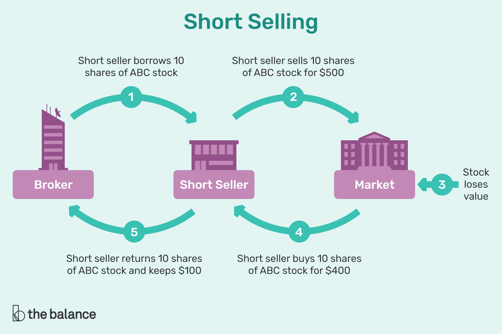

## Table of Contents

## What is short selling?

Short selling is when someone borrows a stock, sells it, and then buys it back later to return it. They do this because they think the stock's price will go down. If it does go down, they can buy it back cheaper than they sold it, making a profit. For example, if you borrow a stock worth $100, sell it, and then the price drops to $80, you can buy it back at $80, return the stock, and keep the $20 difference.

However, short selling can be risky. If the stock price goes up instead of down, the person who short sold will lose money. They have to buy the stock back at a higher price than they sold it. For instance, if the stock you borrowed and sold for $100 goes up to $120, you'll have to buy it back at $120, losing $20. Because of this risk, short selling is often seen as a more advanced investment strategy.

## How does short selling work?

Short selling is a way to make money when you think a stock's price will go down. Imagine you borrow a stock from someone else, like borrowing a book from a friend. You then sell this stock at its current price, say $50. If the stock price drops to $40 later, you can buy it back at this lower price, return the stock to your friend, and keep the $10 difference as profit.

However, short selling can be risky. If the stock price goes up instead of down, you lose money. For example, if you sold the stock at $50 and it goes up to $60, you have to buy it back at $60 to return it. That means you lose $10. Because of this risk, short selling is usually done by people who know a lot about the stock market and are willing to take big risks.

## What are the risks involved in short selling?

Short selling can be risky because if the stock price goes up instead of down, you lose money. Imagine you borrow a stock and sell it for $50, thinking it will go down. But if it goes up to $60, you have to buy it back at $60 to return it. That means you lose $10. This is called a "short squeeze" and it can happen fast, making your losses even bigger.

Another risk is that there's no limit to how much you can lose. When you buy a stock hoping it goes up, the worst that can happen is you lose what you paid. But with short selling, if the stock keeps going up and up, your losses can keep growing too. This can be scary and stressful, especially if you're not ready for it.

Also, short selling can be tricky because you need to find someone willing to lend you the stock. If no one wants to lend it, you can't short sell. And if you do find someone, they might want you to pay them extra money, called a "borrowing fee," which can eat into your profits or make your losses even worse.

## What happens when a company goes bankrupt?

When a company goes bankrupt, it means they can't pay their bills and debts anymore. The company has to go to court and ask for help. The court might decide to let the company try to fix its problems and keep going, or it might decide to shut the company down completely. If the company gets shut down, it has to sell everything it owns, like buildings and machines, to pay back the people it owes money to.

If you own stock in a company that goes bankrupt, your stock might become worthless. This means you lose all the money you put into buying the stock. If the company is trying to fix its problems, your stock might still be worth something, but it's usually worth a lot less than before. It's a tough situation for everyone involved, from the people who work at the company to the people who own its stock.

## Can you short sell stocks of a company that is already bankrupt?

When a company goes bankrupt, it usually means its stock price drops a lot. If you want to short sell a stock, you need to borrow it first. But if a company is already bankrupt, it can be really hard to find someone willing to lend you their stock. This is because the stock is probably worth very little, and people might not want to take the risk of lending it out.

Even if you can find someone to lend you the stock, short selling a bankrupt company's stock is risky. The stock price might already be very low, so there's not much room for it to go down even more. If the stock price goes up a little bit, you could lose money. Also, if the company is in the process of trying to fix its problems, the stock might go up instead of down, making your short selling strategy fail.

## What are the potential benefits of short selling stocks of bankrupt companies?

Short selling stocks of bankrupt companies can be profitable if the stock price keeps going down. Imagine you borrow a stock that's already low because the company went bankrupt. If the price drops even more, you can buy it back cheaper than you sold it, making a profit. For example, if you sell a stock at $1 and it drops to $0.50, you can buy it back at $0.50, return the stock, and keep the $0.50 difference.

However, this strategy is very risky. The stock of a bankrupt company might already be at its lowest point, so there's not much room for it to go down more. If anything good happens to the company, like it finds a way to fix its problems, the stock price could go up instead. If that happens, you lose money because you have to buy the stock back at a higher price than you sold it.

## What are the specific regulations and legal considerations for short selling bankrupt companies?

Short selling stocks of bankrupt companies comes with special rules and things you need to think about. In the United States, the Securities and Exchange Commission (SEC) has rules to make sure short selling is fair and open. One rule is that you have to tell the SEC if you're short selling a lot of a certain stock. This is to stop people from trying to trick the market. Also, some countries have their own rules about short selling, so you need to know the rules where you're trading.

Another thing to think about is that short selling a bankrupt company's stock can be hard because you need to borrow the stock first. If the company is bankrupt, not many people might want to lend their stock to you. This makes it tough to even start short selling. Plus, if you can find someone to lend you the stock, they might want you to pay them extra money, called a "borrowing fee," which can make your profits smaller or your losses bigger.

Lastly, if the company you're short selling goes through bankruptcy court, there can be legal issues. The court might decide to stop trading the stock, which would mean you can't buy it back to return it. Or the court might decide to let the company try to fix its problems, which could make the stock price go up. This can be risky because you might lose money if you have to buy the stock back at a higher price than you sold it. So, it's really important to understand all the rules and risks before you try short selling a bankrupt company's stock.

## How do you identify a company that is likely to go bankrupt?

To identify a company that might go bankrupt, you need to look at a few things. First, check the company's financial reports. If they're losing a lot of money and have a lot of debt, that's a warning sign. Also, see if they're having trouble paying their bills on time. If they're always late or missing payments, it could mean they're running out of money. Another thing to look at is what people are saying about the company. If news articles and experts are talking about how the company is in trouble, that's another sign it might go bankrupt.

You can also look at the company's industry. If the whole industry is doing badly, it can be harder for the company to make money. For example, if a new law makes it harder for companies in that industry to operate, or if people are buying less of what the company sells, that can be bad news. Finally, keep an eye on the company's stock price. If it keeps going down and down, it might mean investors think the company is in trouble. All these things together can help you figure out if a company is likely to go bankrupt.

## What are some historical examples of successful short sells on bankrupt companies?

One famous example of a successful short sell on a bankrupt company is when Jim Chanos short sold Enron in the early 2000s. Enron was a big energy company that was hiding its debts and losses. Chanos noticed that Enron's financial reports didn't make sense and he thought the company was in big trouble. He borrowed Enron stock and sold it, betting that the price would go down. When Enron's problems were exposed and the company went bankrupt, the stock price crashed. Chanos made a lot of money because he could buy the stock back much cheaper than he sold it.

Another example is when investors short sold Lehman Brothers before it went bankrupt in 2008. Lehman Brothers was a big bank that got into trouble because of risky investments during the housing market crash. Some investors saw the signs that Lehman was in trouble and decided to short sell its stock. When Lehman Brothers went bankrupt, its stock price dropped a lot. The investors who short sold made money because they could buy the stock back at a much lower price than they sold it.

## How does the timing of short selling affect the outcome when dealing with bankrupt companies?

The timing of short selling a bankrupt company's stock can make a big difference in how much money you make or lose. If you start short selling before the company goes bankrupt, you might make more money. This is because the stock price might still be high enough to drop a lot when the bankruptcy happens. For example, if you short sell a stock at $10 and it drops to $1 after the company goes bankrupt, you make a big profit.

But if you wait too long and the company is already bankrupt, the stock price might already be very low. There's not much room for it to go down more, so your profit might be small. Plus, if anything good happens to the company during bankruptcy, like it finds a way to fix its problems, the stock price could go up. If you have to buy the stock back at a higher price than you sold it, you lose money. So, getting the timing right is really important when short selling stocks of bankrupt companies.

## What advanced strategies can be used to maximize gains from short selling bankrupt stocks?

To maximize gains from short selling bankrupt stocks, you need to pay close attention to the timing of your trades. Start short selling before the company goes bankrupt, when the stock price is still high enough to drop a lot. This way, you can make more money when the stock price falls after the bankruptcy news comes out. Also, keep an eye on the news and financial reports of the company. If you see signs that the company is in big trouble, like it's losing a lot of money or can't pay its bills, that's a good time to start short selling. But be careful, because if you wait too long and the stock is already very low, there might not be much room for it to go down more.

Another strategy is to use options to increase your potential profits. You can buy put options on the stock, which give you the right to sell the stock at a certain price. If the stock price goes down a lot, the value of your put options goes up, and you can make money from that. This can be riskier than just short selling the stock, but it can also lead to bigger gains if you're right about the stock going down. Remember, though, that short selling and using options are both very risky, so make sure you understand all the risks before you start.

## How do market conditions influence the success of short selling bankrupt company stocks?

Market conditions can really affect how well you do when you short sell stocks of a bankrupt company. If the whole market is going down, like during a big economic crash, more stocks might go down too. This can be good for you if you short sell a bankrupt company's stock, because the stock might drop even more than you expected. But if the market is going up, even a bankrupt company's stock might go up a little bit. This can be bad for you because you might lose money if you have to buy the stock back at a higher price than you sold it.

Also, what's happening in the industry of the bankrupt company can make a big difference. If the whole industry is doing badly, like if a new law makes it hard for companies in that industry to make money, the stock might go down a lot. This can help you make more money from short selling. But if something good happens in the industry, like a new technology that helps companies make more money, even a bankrupt company's stock might go up. This can hurt your short selling strategy because you might lose money if the stock price goes up instead of down.

## How can short selling be integrated into algorithmic trading?

Incorporating short selling into [algorithmic trading](/wiki/algorithmic-trading) leverages the computational power of algorithms to exploit real-time market dynamics. This integration relies on technical analysis and historical data to identify potential short selling opportunities. By automating this process, traders aim to increase efficiency and accuracy in their strategies.

Pair trading and statistical [arbitrage](/wiki/arbitrage) are popular strategies employed in this context. Pair trading involves finding two correlated stocks and taking opposing positions when their price divergence exceeds a certain threshold. This strategy assumes that the prices will revert to their historical correlation. For instance, if stock A and stock B usually move together, and stock A increases significantly while stock B does not, a trader may short stock A while going long on stock B, anticipating a convergence.

Statistical arbitrage takes this concept further by using sophisticated statistical models to identify and exploit pricing inefficiencies across a broader set of related assets. These models are built using extensive historical data and are calibrated to detect anomalies that indicate temporary mispricing. An example formula used in [statistical arbitrage](/wiki/statistical-arbitrage) is the z-score, given by:

$$
z = \frac{(X - \mu)}{\sigma}
$$

where $X$ is the current value, $\mu$ is the mean of historical values, and $\sigma$ is the standard deviation.

Python is a preferred language for implementing these strategies due to its rich ecosystem of libraries such as pandas for data manipulation, NumPy for numerical operations, and scikit-learn for [machine learning](/wiki/machine-learning). A simple Python script to calculate a moving average, a common tool in technical analysis, might look like this:

```python
import pandas as pd

def moving_average(data, window_size):
    return data.rolling(window=window_size).mean()

# Example usage
data = pd.Series([10, 12, 13, 12, 14, 15, 16])
ma = moving_average(data, window_size=3)
print(ma)
```

Developing, testing, and refining such techniques require iterative cycles of hypothesis formulation, model training, and [backtesting](/wiki/backtesting). The testing phase ensures that the algorithms perform well under different market conditions, and adjustments are made based on backtest results to optimize performance.

Ultimately, integrating short selling into algorithmic trading enables traders to act swiftly on short selling signals that may arise from transient market inefficiencies, potentially increasing profitability and maintaining a competitive edge.

## References & Further Reading

[1]: Bergstra, J., Bardenet, R., Bengio, Y., & Kégl, B. (2011). ["Algorithms for Hyper-Parameter Optimization."](https://dl.acm.org/doi/10.5555/2986459.2986743) Advances in Neural Information Processing Systems 24.

[2]: ["Advances in Financial Machine Learning"](https://www.amazon.com/Advances-Financial-Machine-Learning-Marcos/dp/1119482089) by Marcos Lopez de Prado

[3]: ["Evidence-Based Technical Analysis: Applying the Scientific Method and Statistical Inference to Trading Signals"](https://www.amazon.com/Evidence-Based-Technical-Analysis-Scientific-Statistical/dp/0470008741) by David Aronson

[4]: ["Machine Learning for Algorithmic Trading"](https://github.com/stefan-jansen/machine-learning-for-trading) by Stefan Jansen

[5]: ["Quantitative Trading: How to Build Your Own Algorithmic Trading Business"](https://www.amazon.com/Quantitative-Trading-Build-Algorithmic-Business/dp/1119800064) by Ernest P. Chan