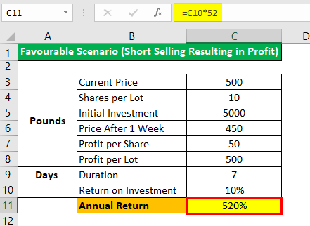

## Table of Contents

## What is short-selling and how does it work?

Short-selling is when someone borrows a stock they don't own and sells it, hoping to buy it back later at a lower price. This is done because the person believes the stock's price will go down. They make money if the price does drop, because they can buy the stock back cheaper than they sold it for, and return the borrowed stock to the owner.

Here's how it works: Imagine you borrow a friend's toy and sell it for $100, thinking you can buy it back later for less. If the toy's price drops to $80, you buy it back at that price, return it to your friend, and you keep the $20 difference as profit. But, if the toy's price goes up to $120 instead, you lose money because you have to buy it back at the higher price to return it to your friend. So, short-selling can be risky because if the stock price goes up instead of down, you lose money.

## What are the basic requirements to start short-selling?

To start short-selling, you need to have a brokerage account that allows short-selling. Not all brokers let you do this, so you need to check if yours does. You also need to have enough money in your account. This is because when you short-sell, you have to put up some money as a promise that you can buy back the stock later, even if the price goes up.

Once you have the right account and enough money, you need to find a stock you think will go down in price. You then borrow that stock from your broker and sell it right away. Later, if the price drops like you hoped, you buy the stock back at the lower price, return it to your broker, and keep the difference as profit. But remember, if the price goes up instead, you lose money because you have to buy it back at a higher price.

## What are the risks involved in short-selling?

Short-selling can be risky because if the stock price goes up instead of down, you lose money. When you short-sell, you borrow a stock and sell it, hoping to buy it back cheaper later. But if the price goes up, you have to buy it back at the higher price to return it to the person you borrowed it from. This means you lose money because you have to pay more to buy it back than what you got when you sold it.

Another risk is that there's no limit to how much you can lose. When you buy a stock normally, the most you can lose is the money you paid for it. But with short-selling, if the stock price keeps going up and up, your losses can keep growing too. This is why short-selling can be very dangerous if the stock doesn't go down like you thought it would.

Also, short-selling involves borrowing, and you have to pay fees for that. These fees can add up and eat into your profits or make your losses even bigger. Plus, if the stock you borrowed becomes hard to find, your broker might ask you to buy it back right away, even if the price is high. This is called a "short squeeze" and can force you to close your position at a bad time, making you lose money.

## How can beginners identify stocks suitable for short-selling?

Beginners looking to identify stocks for short-selling should start by looking at companies that are not doing well. This could mean the company is losing money, has a lot of debt, or is facing tough competition. You can find this information by reading news about the company or looking at their financial reports. If a company's stock price is going down because of these problems, it might be a good candidate for short-selling.

Another way to find stocks to short-sell is by looking at technical analysis. This means looking at charts and patterns to see if a stock's price is likely to keep going down. For example, if a stock has been going down for a while and shows no signs of stopping, it might be a good choice. But remember, technical analysis can be tricky and it's not always right, so it's important to learn more about it before relying on it too much.

It's also a good idea to look at what other people are saying about the stock. If a lot of people are talking about a company's problems or if experts are predicting the stock will go down, that could be a sign it's a good stock to short-sell. Just make sure to do your own research too, because following others without understanding why can be risky.

## What are some common short-selling strategies for beginners?

One common short-selling strategy for beginners is to look for stocks that are overvalued. This means the stock price is higher than it should be based on the company's earnings or other financial measures. You can find these stocks by comparing their price-to-earnings ratio (P/E ratio) with other companies in the same industry. If a stock's P/E ratio is much higher than its peers, it might be overvalued and could be a good candidate for short-selling. The idea is to sell the stock now and buy it back later when the price drops to a more reasonable level.

Another strategy is to focus on companies that are facing bad news or problems. This could be anything from losing money, having a lot of debt, or facing new competition. By reading news articles and financial reports, you can find out which companies are struggling. If a company's stock price starts to go down because of these issues, it might be a good time to short-sell. The key is to act quickly before the price drops too much, and then wait for the right moment to buy the stock back at a lower price.

A third strategy is to use technical analysis to spot trends. This means looking at stock charts to see if a stock's price is going down and likely to keep going down. For example, if a stock has been dropping for a while and shows no signs of stopping, it might be a good choice for short-selling. However, technical analysis can be tricky and it's not always right, so it's important to learn more about it before relying on it too much. Remember, short-selling can be risky, so always do your research and be careful.

## How does margin trading relate to short-selling?

Margin trading and short-selling are closely related because both involve borrowing from your broker. When you short-sell, you borrow a stock you don't own and sell it, hoping to buy it back later at a lower price. To do this, you need to have a margin account, which lets you borrow money or stocks from your broker. The money you borrow is called margin, and it's what you use to buy back the stock you short-sold.

In margin trading, you use borrowed money to buy stocks, hoping their price will go up so you can make a profit. With short-selling, you use the borrowed stock to sell it and make money if the price goes down. Both strategies are risky because if the stock price moves against you, you can lose more money than you put in. That's why it's important to understand how margin works and to be careful when using it for short-selling.

## What are the regulatory and legal considerations for short-selling?

Short-selling has rules you need to follow to make sure it's done fairly and openly. In many countries, you have to tell people when you're short-selling a stock. This is called reporting, and it helps keep the market honest. Also, there are rules about how long you can keep a short position open. In the U.S., for example, you usually have to close your short position by the end of the trading day if it's a "hard-to-borrow" stock. These rules are there to stop people from doing things that could hurt the market or other investors.

Another important rule is the uptick rule, which says you can only short-sell a stock if its price has gone up a little bit since the last trade. This is to stop people from making the stock price fall too fast. Breaking these rules can get you in trouble with the law, so it's important to know them before you start short-selling. Remember, short-selling is legal, but you have to do it the right way to avoid problems.

## How can short-sellers manage and mitigate potential losses?

Short-sellers can manage and mitigate potential losses by setting a stop-loss order. This is a rule you set with your broker that says, "If the stock price goes up to this amount, sell it back right away." This helps limit how much money you can lose if the stock price starts going up instead of down. It's like having a safety net that stops you from losing too much money.

Another way to manage losses is by keeping an eye on the stock and being ready to act quickly. If the stock starts going up, you might decide to buy it back and close your short position before it goes up too much. This means you need to check the stock's price often and be ready to make a move if things don't go as planned. It's important to stay calm and not let your emotions make you wait too long, hoping the price will go back down.

## What advanced techniques can be used to enhance short-selling strategies?

One advanced technique for enhancing short-selling strategies is called pairs trading. This means you short-sell one stock and buy another stock at the same time. You pick two stocks that are similar but one is doing better than the other. You short-sell the stock that's doing worse and buy the one that's doing better. The idea is that if the worse stock keeps going down and the better one keeps going up, you make money from both. This can help lower your risk because you're not just betting on one stock going down, but also on the other stock going up.

Another advanced technique is using options to hedge your short position. Options are like bets on whether a stock will go up or down. If you short-sell a stock, you can buy a call option on that same stock. A call option gives you the right to buy the stock at a certain price later. If the stock price goes up a lot, the call option can help you limit your losses because you can buy the stock at the lower price you set with the option. This can make short-selling less risky, but it also costs money to buy the option, so you need to think about if it's worth it.

## How do market conditions affect short-selling opportunities and risks?

Market conditions can really change how good or bad short-selling can be. When the market is going down, like during a bear market, there are more chances to make money from short-selling. This is because more stocks are likely to go down in price, so you can find more stocks to short-sell. But, it's still risky because even in a bad market, some stocks can go up if people think they're a good deal or if the company is doing well despite the market.

On the other hand, when the market is going up, like during a bull market, short-selling gets harder and riskier. Fewer stocks are going down, so it's harder to find good ones to short-sell. And if you do short-sell and the market keeps going up, you can lose a lot of money fast. Also, if everyone is feeling good about the market and buying stocks, it can cause a short squeeze. This is when the price of a stock you short-sold goes up a lot because everyone is buying it, and you have to buy it back at a high price to close your position.

## What role does short interest and days to cover play in short-selling?

Short interest and days to cover are important things to know about when you're short-selling. Short interest is the total number of shares that people have borrowed and sold short. If a lot of people are short-selling a stock, it means the short interest is high. This can be a sign that many people think the stock's price will go down. But it can also be risky because if everyone tries to buy the stock back at the same time, it can make the price go up a lot, which is bad for short-sellers.

Days to cover is how many days it would take for all those short-sellers to buy back the stock they borrowed, based on how many shares are traded each day. If the days to cover number is high, it means it would take a long time for short-sellers to close their positions. This can make the stock more likely to have a short squeeze, where the price goes up fast because everyone is trying to buy it back. So, knowing the short interest and days to cover can help you decide if a stock is a good one to short-sell or if it might be too risky.

## How can experts use options and other derivatives to complement short-selling strategies?

Experts can use options and other derivatives to make short-selling safer and possibly more profitable. One way to do this is by buying call options on the stock they are short-selling. A call option gives them the right to buy the stock at a set price later. If the stock price goes up a lot, the call option can help limit their losses because they can buy the stock at the lower price they set with the option. This is called hedging, and it can make short-selling less risky, but it also costs money to buy the option.

Another way experts use derivatives is by selling put options. A put option gives someone else the right to sell the stock to them at a set price. If the stock price goes down like they hoped, the put option can make them more money because they can buy the stock back at a lower price than they sold it for. Using options this way can make their short-selling strategy more complex but also more powerful. It's important to understand how options work and to be careful because they can add to the risks if not used right.

## What are the key strategies for short selling in algo trading?

### Key Strategies for Short Selling in Algo Trading

**Momentum and Trend-Following Strategies**

Momentum and trend-following strategies focus on identifying and shorting assets that exhibit a strong and persistent downward price trend. This approach allows traders to exploit price [momentum](/wiki/momentum) before potential market corrections occur. By monitoring technical indicators such as moving averages and the relative strength index (RSI), algorithms can systematically detect overbought conditions, signaling optimal entry points for short positions. The RSI, for instance, helps identify when an asset is potentially overvalued and primed for a downward correction. Python can be used to programmatically implement these indicators:

```python
import pandas as pd

def compute_RSI(data, window=14):
    delta = data.diff()
    gain = (delta.where(delta > 0, 0)).rolling(window=window, min_periods=1).mean()
    loss = (-delta.where(delta < 0, 0)).rolling(window=window, min_periods=1).mean()
    rs = gain / loss
    return 100 - 100 / (1 + rs)

# Example usage:
data = pd.Series([100, 102, 101, 105, 104, 103, 107, 108, 105, 104])
rsi = compute_RSI(data)
```

**Pair Trading and Statistical Arbitrage**

Pair trading and [statistical [arbitrage](/wiki/arbitrage)](/wiki/statistical-arbitrage) focus on identifying and exploiting the pricing inefficiencies between two related assets. In this strategy, traders short sell overvalued assets while simultaneously taking long positions in the undervalued counterparts, aiming to profit from the convergence of their prices. The strategy relies on statistical methods to analyze historical price correlations and deviations. A critical aspect of [pair trading](/wiki/pair-trading) is identifying pairs of stocks or securities with a historical mean-reverting price relationship. Statistical arbitrage algorithms apply statistical tests to validate the strength of such relationships, primarily focusing on metrics such as cointegration and correlation.

**Risk Management Techniques**

Risk management is paramount when executing short selling strategies within [algorithmic trading](/wiki/algorithmic-trading). Algorithms incorporate various risk management techniques to limit exposure and adjust for market [volatility](/wiki/volatility-trading-strategies). Stop-loss orders are commonly used to automatically [exit](/wiki/exit-strategy) positions when the market moves unfavorably beyond a predefined threshold. Position-sizing algorithms adjust the [volume](/wiki/volume-trading-strategy) of trades based on current market volatility and the calculated risk of each trade. This process often involves the application of the Kelly Criterion or volatility-based position sizing. The Kelly Criterion, for instance, is used to determine the optimal size of a series of bets:

$$
f^* = \frac{bp - q}{b}
$$

Where:
- $f^*$ is the fraction of the capital to invest,
- $b$ is the ratio of the net profit to the amount staked,
- $p$ is the probability of winning,
- $q$ is the probability of losing, defined as $1 - p$.

By applying these techniques, algorithms ensure that short positions are effectively managed, balancing potential returns against market risks. This approach enhances the robustness of trading strategies under varying market conditions.

## References & Further Reading

Additional resources and literature on algorithmic trading and short selling can provide further insights into advanced strategies, regulatory considerations, and technological trends. 

For practitioners looking to deepen their understanding of algorithmic trading, "Advances in Financial Machine Learning" by Marcos Lopez de Prado offers a comprehensive guide. This book explores the application of [machine learning](/wiki/machine-learning) in financial markets, providing methods to improve the accuracy of predictive analytics in trading strategies. It investigates into the use of algorithms for feature selection, hyper-parameter optimization, and model performance improvement, key elements for integrating short selling in algorithmic frameworks.

Another valuable resource is "Algorithmic Trading: Winning Strategies and Their Rationale" by Ernie Chan. This book focuses on practical algorithmic trading strategies that are both technically feasible and economically viable. Chan examines various trading concepts, including [statistical arbitrage](/wiki/statistical-arbitrage) and momentum trading, which could incorporate short selling techniques. The book is especially useful for those interested in the quantitative aspects of trading, providing Python code snippets to implement the discussed strategies.

For further reading, several academic papers and industry reports on algorithmic trading and its regulatory considerations are available. Journals such as the "Journal of Portfolio Management" and "Quantitative Finance" often publish studies on the effectiveness of various trading algorithms under different market conditions. Additionally, industry reports from financial institutions and consulting firms provide insights into the latest technological and regulatory developments affecting algorithmic trading.

These resources collectively offer a robust foundation for understanding the complex dynamics at the intersection of short selling and algorithmic trading, equipping traders and researchers with the tools and knowledge necessary to navigate this rapidly evolving domain effectively.

