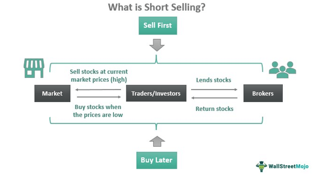

In today's ever-evolving financial markets, investors are continuously exploring sophisticated strategies to maximize their returns. Among the various approaches, short selling and algorithmic trading have emerged as prominent strategies in the stock market. These advanced techniques are transforming how market participants capitalize on price movements and enhance portfolio performance.

Short selling involves borrowing shares to sell at the current market price, with the anticipation of buying them back at a lower price in the future. This strategy allows investors to exploit declining stock prices, thus profiting from downward market trends. By betting against overvalued securities, short selling provides a mechanism to correct overpricing and introduce liquidity into the market. However, it also carries inherent risks, such as potential infinite losses and exposure to short squeezes, where rapidly rising prices force short sellers to cover positions at increasingly higher prices.



On the other hand, algorithmic trading employs computer programs and predetermined rules to execute trades, allowing traders to perform high-frequency transactions with precision and speed. These algorithms analyze market data, identify favorable trading opportunities, and execute orders in milliseconds, reducing the reliance on human decision-making. The automation inherent in algorithmic trading minimizes human errors and eliminates emotional biases that often affect trading decisions. Its high-speed capability enables institutional investors and hedge funds to execute large-scale trades without significantly impacting market prices.

This article seeks to explore these strategies comprehensively, highlighting how they operate, the potential risks and rewards associated with each, and how they can be integrated into investment portfolios. By understanding the mechanics and implications of short selling and algorithmic trading, investors can make informed decisions and optimize their trading strategies to navigate the complexities of modern financial markets effectively.

## Table of Contents

## Understanding Short Selling

Short selling is a sophisticated financial strategy where an investor capitalizes on the anticipated decline in a stock's price. It involves several critical steps and carries inherent risks that must be carefully managed. The process initiates with the investor borrowing shares from a brokerage firm. These shares, typically held by the brokerage in a client account, are loaned to the short seller through a margin account. 

Once the shares are borrowed, the short seller proceeds to sell them on the open market at the current market price, thus generating immediate capital. The expectation is that the stock's price will fall in the future, allowing the investor to repurchase the shares at a lower price, a process commonly referred to as "covering" the short position. After buying back the shares, the investor returns them to the brokerage, and the profit is the difference between the initial selling price and the subsequent buying price, minus any interest or costs associated with borrowing the shares.

This approach is akin to the conventional investment strategy of buying low and selling high, albeit in reverse order: the investor aims first to sell high, then buy low. The mathematical expression representing the profit from short selling can be defined as:

$$
\text{Profit} = (P_{\text{sell}} - P_{\text{buy}}) \times Q - \text{Cost}
$$

Where:
- $P_{\text{sell}}$ is the price at which the shares were sold,
- $P_{\text{buy}}$ is the price at which the shares are repurchased,
- $Q$ is the quantity of shares sold short,
- \text{Cost} includes interest and other fees associated with borrowing the shares.

Despite its potential for profitability, short selling entails significant risks. One of the primary hazards is the possibility of theoretically infinite losses. This stands in stark contrast with buying stocks, where the potential loss is limited to the total investment. If the stock price increases indefinitely, the short seller must cover the position at a much higher price, leading to substantial financial loss.

Additionally, short sellers are subject to margin requirements. Brokers typically require that short sellers maintain a margin account with sufficient collateral to cover potential losses. If the margin account falls below the broker's maintenance requirement, a margin call occurs, compelling the investor to either deposit additional funds or liquidate securities to cover the shortfall. Failure to meet these requirements can result in forced closure of the position at a disadvantageous price, further compounding losses.

In summary, while short selling can yield significant returns if stock prices decline, it necessitates careful risk assessment and management due to its associated high stakes and potential for substantial loss.

## Risks and Rewards of Short Selling

Short selling provides significant opportunities for investors to profit from anticipated declines in stock prices, especially in bearish markets where the sentiment is generally negative. By strategically betting against overvalued or declining stocks, traders can capitalize on abrupt share price decreases. However, this strategy is not without substantial risks.

One of the most significant risks associated with short selling is the theoretically unlimited potential for losses. Unlike owning a stock where the maximum loss is the initial investment (i.e., the stock price drops to zero), short sellers face limitless risk because a stock's price can rise indefinitely. Consequently, if the market moves against their position, losses can quickly accumulate.

A notable example of this risk is a phenomenon known as a short squeeze. A short squeeze occurs when a heavily shorted stock's price begins to rise, often due to positive news or substantial buying pressure. As the price rises, short sellers may be forced to buy back shares to cover their positions, further driving up the price in a self-reinforcing cycle. The 2021 GameStop saga is a prime example of a short squeeze, where retail investors and [algorithmic trading](/wiki/algorithmic-trading) combined forces to boost the stock price precipitously, resulting in massive losses for some short sellers.

Short selling also necessitates the use of margin accounts, which can complicate the financial landscape for investors. Margin accounts allow traders to borrow funds to increase the size of their trades. However, they also introduce additional costs, such as interest on borrowed stocks, and can lead to margin calls if the stock price moves unfavorably. A margin call requires the investor to deposit additional funds or securities to maintain their position, which can be financially straining.

Despite these considerable risks, short selling, when executed correctly, can offer lucrative returns. For instance, in a declining market, adept short selling can yield profits as stock values decrease. Successful short sellers often employ robust risk management strategies, such as setting stop-loss orders and maintaining diversified portfolios to mitigate potential adverse effects.

In conclusion, while short selling provides an avenue for potentially substantial gains, it is accompanied by significant risks that require careful understanding and management. Ensuring effective risk management is essential for investors looking to harness the benefits of short selling in their investment strategies.

 to Algorithmic Trading

Algorithmic trading, often referred to as algo trading, employs computer algorithms to streamline and automate trading tasks according to predefined rules. This method has revolutionized modern financial markets by enhancing the speed and efficiency of trade execution. By processing vast amounts of market data, algorithms can analyze multiple securities across different markets and execute trades within milliseconds, offering a significant advantage in today’s fast-paced trading environment.

One key feature of algorithmic trading is its support for high-frequency trading ([HFT](/wiki/high-frequency-trading-strategies)). HFT strategies involve conducting a large number of trades at extremely high speeds, often capitalizing on small price discrepancies across markets or securities. This capability allows traders to exploit fleeting opportunities that are imperceptible to human traders, resulting in optimized trade outcomes and minimized transaction costs.

Institutional investors, such as mutual funds and pension funds, leverage algorithmic trading to manage and execute large [volume](/wiki/volume-trading-strategy) trades stealthily. By breaking down substantial orders into smaller, randomized trades, algorithms can minimize market impact and reduce the possibility of price slippage, thereby maintaining favorable prices while executing large trades.

Hedge funds utilize algorithmic trading to exploit opportunities like statistical [arbitrage](/wiki/arbitrage), which involves simultaneously buying and selling related securities to exploit pricing inefficiencies. Algorithms can swiftly assess correlations between securities and execute trades that capitalize on deviations from expected price movements, ensuring profits from arbitrage opportunities.

Moreover, algorithmic trading increases efficiency by reducing human errors and eliminating emotional influences from trading decisions. Human traders are vulnerable to biases and emotional reactions, such as fear or overconfidence, which can adversely affect trading performance. By relying on predefined rules and data-driven insights, algorithmic trading systems can make objective decisions, enhancing consistency and reliability in trading outcomes.

In conclusion, algorithmic trading has transformed the landscape of financial markets by enabling rapid, precise, and unbiased trading operations. Its integration into institutional trading strategies continues to provide significant advantages, including cost efficiency, reduced market impact, and enhanced capacity to identify and capitalize on transient market opportunities.

## Advantages and Disadvantages of Algo Trading

Algorithmic trading has revolutionized financial markets by leveraging computational power to optimize trading activities. One of the primary advantages of algorithmic trading is its precision in trade execution. Algorithms can process vast amounts of data, identify opportunities, and execute trades with impeccable timing, often within milliseconds. This precision reduces slippage, which is the difference between the expected price of a trade and the actual price.

Another significant advantage is the elimination of human errors and emotional biases. Human traders are susceptible to psychological biases, such as fear or greed, which can impede decision-making. Algorithmic trading systems operate solely based on predefined criteria, ensuring consistency and objectivity in trading decisions.

Algorithmic trading also enables high-frequency trading (HFT), which facilitates the execution of a large number of orders at extremely low latency. This capability allows traders to capitalize on minute price discrepancies, enhancing potential profitability. High-frequency trading contributes significantly to market [liquidity](/wiki/liquidity-risk-premium) and can reduce transaction costs due to tighter spreads.

However, algorithmic trading is not without its challenges. A major concern is the reliance on technology. Trading systems depend on robust technological infrastructure, and any failure, such as system crashes or connectivity issues, can lead to significant financial losses. Additionally, these systems are susceptible to software bugs, which could result in erroneous trades.

Algorithmic trading can also impact market dynamics, sometimes exacerbating [volatility](/wiki/volatility-trading-strategies). This is particularly evident during rare market events, such as the 'flash crashes' where rapid trading led to dramatic, albeit short-lived, price declines. Regulators pay close attention to these events, imposing rules to mitigate their frequency.

Another challenge is the substantial investment required to develop and maintain an algorithmic trading system. This involves costs related to hardware, software development, and continuous updates to adapt to changing market conditions. Moreover, constructing efficient algorithms demands a high level of technical and financial market expertise.

Despite these challenges, algorithmic trading remains an integral component of modern financial markets, offering distinct advantages over traditional trading approaches when managed effectively.

## Integrating Short Selling and Algo Trading

Combining short selling with algorithmic trading presents a potent strategy for investors aiming to capitalize on overvaluation signals in the stock market. By utilizing algorithms, investors can objectively and swiftly execute trades, reducing the emotional biases that often accompany short selling. This confluence of technologies enables investors to react promptly to perceived overpricing, seizing opportunities that may arise from transient market inefficiencies.

Algorithmic trading systems, designed to automate decision-making processes, assess vast amounts of market data to identify potential overvaluation cues. These systems employ statistical models and [machine learning](/wiki/machine-learning) algorithms to detect anomalies or patterns indicative of mispriced assets. For instance, a basic moving average crossover strategy can be coded in Python to automate short selling decisions. Below is a simple implementation:

```python
import numpy as np
import pandas as pd

def moving_average_strategy(prices, short_window=40, long_window=100):
    signals = pd.DataFrame(index=prices.index)
    signals['price'] = prices
    signals['short_mavg'] = prices.rolling(window=short_window, min_periods=1, center=False).mean()
    signals['long_mavg'] = prices.rolling(window=long_window, min_periods=1, center=False).mean()
    signals['signal'] = 0.0
    signals['signal'][short_window:] = np.where(signals['short_mavg'][short_window:] < signals['long_mavg'][short_window:], -1.0, 0.0)
    signals['positions'] = signals['signal'].diff()
    return signals

# Example usage:
# prices: Assume this is a pandas Series of stock prices
# signals = moving_average_strategy(prices)
```

Risk management systems are crucial when integrating short selling with algorithmic trading, particularly given the high volatility inherent in short selling. These systems must be designed to handle adverse price movements efficiently. By setting precise stop-loss orders and incorporating volatility limits, investors can safeguard against unforeseen market shifts. Additionally, robust [backtesting](/wiki/backtesting) frameworks are vital for evaluating the efficacy and safety of algorithmic strategies before they are deployed in live trading. Maintaining these systems requires continual adaptation to changing market conditions, ensuring that algorithms remain effective and aligned with risk management objectives.

In summary, the fusion of short selling with algorithmic trading marries speed with analytical rigor, providing investors a competitive edge in rapidly moving markets. However, this approach necessitates comprehensive risk management practices to mitigate the associated volatilities and protect against potential losses.

## Case Studies and Examples

The 2021 GameStop short squeeze is a classic example illustrating the risks associated with short selling and the influence of algorithmic trading in modern financial markets. The event began when a group of retail investors on the subreddit r/WallStreetBets collaborated to drive up the price of GameStop shares, a company heavily shorted by institutional investors. As retail investors purchased GameStop stocks en masse, the stock price surged, forcing short sellers to cover their positions to limit losses. This covering action amplified the price ascent, creating a short squeeze. Algorithmic trading systems played a pivotal role by quickly identifying the price volatility and initiating trades based on predetermined criteria. The episode underscores the susceptibility of short sellers to coordinated buying and the rapid market movements that algorithmic traders can generate or exacerbate.

Renaissance Technologies, a prominent [hedge fund](/wiki/hedge-fund-trading-strategies), exemplifies the successful integration of sophisticated computational strategies with short selling. Known for its Medallion Fund, Renaissance uses complex mathematical models and vast datasets to identify signals and patterns in market behavior. Through machine learning and [statistical arbitrage](/wiki/statistical-arbitrage), the fund leverages algorithmic trading to optimize short selling strategies. This integration allows Renaissance to make data-driven decisions, minimize human bias, and efficiently exploit market inefficiencies. However, the requirement for substantial computational resources and expertise highlights the barrier to entry for smaller investors and the importance of maintaining robust risk management frameworks.

These case studies demonstrate both the potential and pitfalls of combining short selling with algorithmic trading. The GameStop saga highlighted the risk of losses ballooning rapidly due to unforeseen market forces, particularly the organized actions of retail investors. Meanwhile, Renaissance Technologies exemplifies how advanced technology and analytical processes can turn short selling into a profitable venture. Collectively, these examples stress the need for vigilance, adaptability, and comprehensive risk management strategies when employing such sophisticated trading approaches in the financial markets.

## Conclusion

Short selling and algorithmic trading present opportunities for substantial financial gains; however, these strategies come with inherent risks that necessitate careful understanding and management. To capitalize on these opportunities, investors must conduct a thorough analysis of both strategies, incorporating robust risk management practices to mitigate potential pitfalls. 

For instance, short sellers must be acutely aware of the risks of unlimited losses due to rising stock prices and make use of margin accounts cautiously to avoid excessive liabilities. Meanwhile, the implementation of algorithmic trading requires significant investment in technology and expertise, along with a vigilant eye on rare market events such as "flash crashes" that can disrupt trading systems.

A critical aspect of successful investment strategies involving these approaches is staying abreast of continual advancements in technology and trading strategies. Since financial markets are dynamic, an investor's ability to adapt to new tools, technologies, and methodologies is vital. This adaptability ensures that their strategies evolve in response to changing market conditions, allowing them to maintain a competitive edge.

Continuous learning is paramount for investors aspiring to leverage short selling and algorithmic trading effectively. Engaging in educational resources, attending industry seminars, and networking with seasoned traders and analysts can furnish investors with the insights necessary to navigate the complexities of these trading strategies. By embracing a mindset of perpetual learning and adaptation, investors can optimize their investment approaches while managing risks to achieve favorable financial outcomes.

## References & Further Reading

[1]: ["Short Selling: Strategies, Risks, and Rewards"](https://www.amazon.com/Short-Selling-Strategies-Risks-Rewards/dp/0471660205) published by CFA Institute.

[2]: ["Advances in Financial Machine Learning"](https://www.amazon.com/Advances-Financial-Machine-Learning-Marcos/dp/1119482089) by Marcos Lopez de Prado.

[3]: ["Evidence-Based Technical Analysis: Applying the Scientific Method and Statistical Inference to Trading Signals"](https://www.amazon.com/Evidence-Based-Technical-Analysis-Scientific-Statistical/dp/0470008741) by David Aronson.

[4]: ["Quantitative Trading: How to Build Your Own Algorithmic Trading Business"](https://www.amazon.com/Quantitative-Trading-Build-Algorithmic-Business/dp/1119800064) by Ernest P. Chan.

[5]: Jegadeesh, N., & Titman, S. (1993). ["Returns to Buying Winners and Selling Losers: Implications for Stock Market Efficiency."](https://www.jstor.org/stable/2328882) The Journal of Finance, 48(1), 65-91.

[6]: Jones, C. M., & Lamont, O. A. (2002). ["Short-sale constraints and stock returns."](https://www.sciencedirect.com/science/article/pii/S0304405X02002246) Journal of Financial Economics, 66(2-3), 207-239.

[7]: Fama, E. F., & French, K. R. (1992). ["The Cross-Section of Expected Stock Returns."](https://onlinelibrary.wiley.com/doi/full/10.1111/j.1540-6261.1992.tb04398.x) The Journal of Finance, 47(2), 427-465.