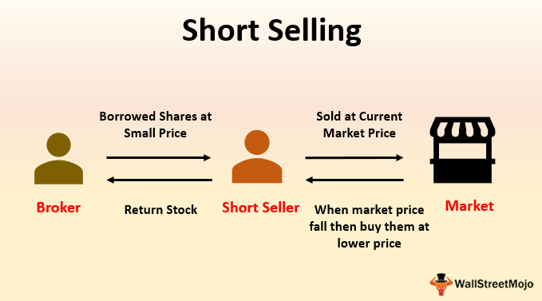

## Table of Contents

## What is short selling?

Short selling is when someone borrows a stock or asset and sells it, hoping to buy it back later at a lower price. The goal is to make a profit from the difference between the selling price and the lower buying price. For example, if you borrow and sell a stock for $100, and later buy it back for $80, you make a $20 profit after returning the stock.

However, short selling can be risky. If the price of the stock goes up instead of down, the person who shorted the stock will lose money. Using the same example, if the stock price rises to $120, they would have to buy it back at a higher price, resulting in a $20 loss. Because of these risks, short selling is often seen as a more advanced investment strategy.

## How does short selling work?

Short selling is a way to make money when you think a stock's price will go down. You borrow shares of that stock from someone else, like a broker, and then sell those shares right away at the current price. For example, if you borrow 100 shares of a stock that's worth $50 each, you sell them for $5,000. You hope that the price of the stock will drop soon.

If the stock price does drop, say to $40 per share, you can buy back the 100 shares for $4,000. You return the 100 shares to the person you borrowed them from, and you keep the $1,000 difference as your profit. But, if the stock price goes up instead, you lose money. If it goes up to $60 per share, you have to buy back the 100 shares for $6,000, and you lose $1,000. Short selling can be risky because there's no limit to how high a stock price can go, so your losses can be big if you guess wrong.

## What are the risks associated with short selling?

Short selling can be risky because if the stock price goes up instead of down, you can lose a lot of money. When you short sell, you borrow shares and sell them, hoping to buy them back cheaper later. But if the price goes up, you have to buy the shares back at a higher price to return them to the person you borrowed from. There's no limit to how high a stock price can go, so your losses can be very big if you're wrong about the stock going down.

Another risk is that you might have to buy back the shares before you want to. This can happen if the person you borrowed the shares from wants them back, or if there's a lot of demand for the stock and it's hard to find shares to borrow. This is called a short squeeze, and it can force you to buy back the shares at a higher price than you expected, which can lead to big losses.

Also, short selling involves extra costs like borrowing fees and interest on the money you use to buy back the shares. These costs can add up and eat into your profits or make your losses even bigger. So, short selling is a strategy that needs careful thinking and watching the market closely.

## What are the potential benefits of short selling?

Short selling can be a way to make money when you think a stock's price will go down. If you're right and the price drops, you can buy back the stock for less than you sold it for, and keep the difference as profit. This can be useful if you see a stock that you think is overvalued or if you think a company is going to have problems that will make its stock price fall.

Another benefit of short selling is that it can help balance the market. When people short sell, they add more shares to the market, which can help keep prices from getting too high. This can make the market more stable and fair for everyone. Short selling can also give investors more ways to make money, not just when prices go up, but also when they go down.

## What are the requirements to engage in short selling?

To start short selling, you need a margin account with a brokerage firm. This is different from a regular account because it lets you borrow money and stocks. You also need to have enough money in your account to cover any losses, which is called the margin requirement. The brokerage firm will set this amount, and it can change based on how risky they think the stock is.

Once you have the right account and enough money, you can find a stock you think will go down in price. You ask your broker to borrow the shares of that stock, and then you sell them right away at the current price. Later, if the price drops like you hoped, you buy the shares back at the lower price and return them to the broker. If you guessed right, you make a profit from the difference between the price you sold at and the price you bought back at.

## How does one initiate a short sale?

To start a short sale, you first need a special type of account called a margin account. This is different from a regular account because it lets you borrow stocks from your broker. You also need to have enough money in your account to cover any possible losses. This is called the margin requirement, and your broker will tell you how much you need. Once you have the right account and enough money, you can pick a stock that you think will go down in price.

After choosing the stock, you ask your broker to borrow the shares. Once you get the shares, you sell them right away at the current price. Later, if the price of the stock drops like you thought it would, you buy the shares back at the lower price and return them to your broker. If you guessed right and the price did go down, you make a profit from the difference between the price you sold at and the price you bought back at.

## What is a short squeeze and how does it affect short sellers?

A short squeeze happens when a lot of people have short sold a stock, and then the price of the stock starts to go up instead of down. When this happens, the people who short sold the stock start to get worried. They might have to buy back the stock to return it to the person they borrowed it from. If a lot of short sellers try to buy back the stock at the same time, it can make the price go up even more.

This can be really bad for short sellers. If the price keeps going up, they might have to buy back the stock at a much higher price than they sold it for. This means they lose money, sometimes a lot of money. A short squeeze can force short sellers to close their positions quickly, and it can lead to big losses if they guessed wrong about the stock going down.

## What are the regulatory considerations for short selling?

Short selling is watched closely by rules to make sure it's done fairly. In many places, you have to tell the people in charge when you short sell a stock. This helps them keep an eye on the market and stop any tricks. There are also rules about how much money you need to have in your account to short sell, called margin requirements. These rules can change, so you need to know them before you start.

Some countries have special rules during times when the market is shaky. They might stop short selling for a while to keep the market from getting too wild. Also, there are rules against spreading false information to make a stock's price go down so you can make money from short selling. These rules are there to keep the market honest and protect everyone who invests.

## How do short interest and short interest ratio impact stock prices?

Short interest is the total number of shares of a stock that have been sold short by investors. When short interest is high, it means a lot of people think the stock's price will go down. This can sometimes make the stock's price go down because it shows that many people are betting against it. But, if the stock's price starts to go up instead, it can cause a short squeeze. This happens when short sellers have to buy back the stock to cover their positions, pushing the price even higher.

The short interest ratio, also called days to cover, shows how many days it would take for all the short sellers to buy back the shares they've sold short, based on how many shares are traded each day. A high short interest ratio can mean that the stock is at risk of a short squeeze. If the stock's price starts to rise, short sellers might rush to buy back their shares, which can make the price go up even more. So, both short interest and the short interest ratio can affect how a stock's price moves, depending on what happens in the market.

## What are some famous examples of short selling in history?

One famous example of short selling is the case of Enron in the early 2000s. Enron was a big energy company that people thought was doing well. But some smart investors, like Jim Chanos, noticed that Enron's numbers didn't add up. They started short selling Enron's stock, betting that the price would go down. When it came out that Enron was hiding big losses and lying about its money, the stock price crashed. The short sellers made a lot of money because they guessed right that Enron's stock would fall.

Another example is the short selling of Volkswagen stock in 2008. A lot of people were short selling Volkswagen because they thought its price would go down. But then, another company called Porsche said it owned a lot more of Volkswagen than people thought. This made Volkswagen's stock price shoot up really fast. It caused a huge short squeeze, where short sellers had to buy back the stock at much higher prices. Many of them lost a lot of money because they couldn't buy back the shares in time before the price went up too much.

## How can short selling be used as part of a broader investment strategy?

Short selling can be a useful part of a bigger investment plan. It lets you make money when you think a stock's price will go down. This can balance out your other investments that go up when stock prices rise. By using short selling, you can protect your money from big drops in the market. It's like having a safety net that can help you make money even when things are not going well for some stocks or the whole market.

But, short selling needs to be done carefully because it can be risky. You need to do a lot of research to pick the right stocks to short sell. It's also important to keep an eye on the market and be ready to act fast if things change. Using short selling along with other ways to invest, like buying stocks or funds, can help you spread out your risk and maybe make more money. Just remember, it's a tool that needs to be used wisely as part of your overall plan.

## What advanced techniques can be used to manage and optimize short selling positions?

One advanced technique for managing short selling positions is called stop-loss orders. This means setting a price at which you will automatically buy back the stock if it goes up too much. This can help limit your losses if the stock price doesn't go down like you thought it would. Another technique is called hedging, where you buy other investments that might go up if the stock you shorted goes down. This can help protect your money and make your short selling safer.

Another way to optimize short selling is by using options. Options are like bets on whether a stock will go up or down. You can buy options that let you buy the stock back at a certain price, which can help you make more money if the stock goes down a lot. Also, keeping an eye on the short interest and short interest ratio can help you decide when to start or stop short selling. If a lot of people are short selling the same stock, it might be at risk of a short squeeze, so you need to be ready to act fast.

## What is Short Selling and How Does it Work?

Short selling is a specialized strategy in financial markets that allows traders to profit from declining asset prices. At its core, short selling involves borrowing shares of a stock or other security that an investor believes will decrease in value. The investor then sells these borrowed shares in the open market. If the price of the stock falls, the investor can purchase an equivalent number of shares at the lower price to return to the lender, pocketing the difference as profit. This transaction can be summarized in the following steps:

1. **Borrowing Shares**: The investor borrows shares from a broker, usually for a fee, agreeing to return the same number of shares at a later date.

2. **Selling Borrowed Shares**: The borrowed shares are sold immediately in the open market at the current price.

3. **Buying Back Shares (Covering the Short)**: If the stock price drops, the investor repurchases the same number of shares at the lower price.

4. **Returning Shares**: The shares are returned to the broker, and the investor keeps the profit, minus any fees or interest.

To better understand, consider this simplified example. Suppose an investor shorts a stock at $100 per share, borrowing and selling 10 shares. The market price falls to $70, and the investor buys back the shares, thus:

$$
\text{Profit} = (100 - 70) \times 10 = 300
$$

While short selling can be lucrative, it carries distinct risks and benefits. 

### Potential Benefits:
- **Profit from Declines**: Short selling provides investors the opportunity to profit from falling prices, a feature not typical of traditional long positions. This can be particularly advantageous in bear markets or during short-term retracements.
- **Hedging Tools**: Investors use short selling to hedge against potential losses in their portfolios, mitigating risk when owning long positions.

### Risks:
- **Unlimited Liability**: Unlike buying and holding a stock (where potential loss is limited to the initial investment), short selling exposes the investor to theoretically infinite losses if the stock price rises. If the stock surges to $150, the investor from our example would incur a loss of:

$$
\text{Loss} = (150 - 100) \times 10 = 500
$$

- **Margin Requirements**: Short selling typically requires maintaining a margin account with the broker. Market volatility can lead to margin calls, where the investor must deposit additional funds to maintain the position.

- **Regulatory and Borrowing Costs**: Short sellers may face regulatory scrutiny and borrowing costs. Availability of shares to borrow can sometimes be limited, impacting the ability to initiate a short position.

In summary, while short selling offers unique opportunities for profits in declining markets, it is a complex strategy requiring careful risk management and a thorough understanding of market dynamics.

## References & Further Reading

[1]: Bergstra, J., Bardenet, R., Bengio, Y., & Kégl, B. (2011). ["Algorithms for Hyper-Parameter Optimization."](https://papers.nips.cc/paper_files/paper/2011/hash/86e8f7ab32cfd12577bc2619bc635690-Abstract.html) Advances in Neural Information Processing Systems 24.

[2]: ["Advances in Financial Machine Learning"](https://www.amazon.com/Advances-Financial-Machine-Learning-Marcos/dp/1119482089) by Marcos Lopez de Prado

[3]: ["Evidence-Based Technical Analysis: Applying the Scientific Method and Statistical Inference to Trading Signals"](https://www.wiley.com/en-gb/Evidence+Based+Technical+Analysis:+Applying+the+Scientific+Method+and+Statistical+Inference+to+Trading+Signals-p-9780470008744) by David Aronson

[4]: ["Machine Learning for Algorithmic Trading"](https://www.amazon.com/Machine-Learning-Algorithmic-Trading-intelligence/dp/9918608013) by Stefan Jansen

[5]: ["Quantitative Trading: How to Build Your Own Algorithmic Trading Business"](https://www.amazon.com/Quantitative-Trading-Build-Algorithmic-Business/dp/0470284889) by Ernest P. Chan