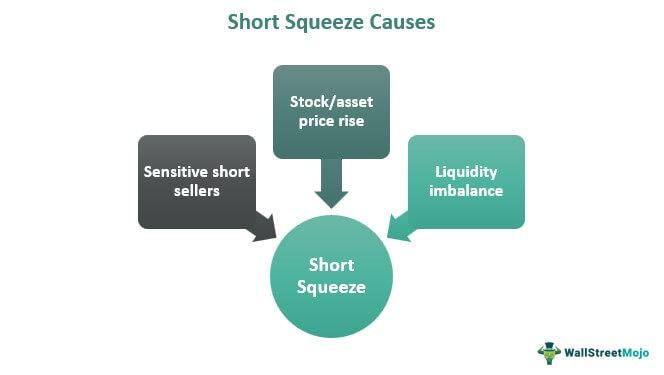

In the world of stock market investing, strategies continuously evolve to adapt to market dynamics. A phenomenon that has garnered the attention of both traditional and modern investors is the short squeeze. A short squeeze occurs when a heavily shorted stock quickly increases in price, forcing short sellers to buy the stock to cover their positions, thereby pushing the price even higher. This creates a feedback loop of buying activity, leading to rapid price escalations and significant market volatility.

The increasing prevalence of short squeezes has coincided with the rise of algorithmic trading. Algorithmic trading involves automated systems using pre-set rules to execute trades, allowing for rapid responses to market changes and enhanced efficiency in trade execution. This advancement in technology has made understanding market strategies more crucial than ever, as algorithms can rapidly process vast amounts of data to exploit short-term price movements. Thus, grasping the mechanics of both short squeezes and algorithmic trading is essential for investors seeking to navigate the complexities of the modern stock market.



## Table of Contents

## Understanding Short Squeeze

A short squeeze occurs when the price of a stock with a high level of short interest rises unexpectedly, creating a situation where short sellers are compelled to purchase shares to cover their short positions. This action propels the price even higher due to the increased buying pressure. The mechanics of a short squeeze are driven by the dynamics of supply and demand. When a stock is heavily shorted, there is increased potential due to the presence of numerous investors betting against it. However, if the stock unexpectedly rises in price, these short sellers face increasing losses.

The short sellers' efforts to mitigate losses by buying the stock can create a feedback loop, causing rapid price escalation. This phenomenon can lead to significant volatility as the forced buying by short sellers often coincides with buying from regular investors, both of whom are driven by the fear of missing out or by the [momentum](/wiki/momentum) of rising prices.

The GameStop episode in early 2021 serves as a prominent example of how coordinated buying activity can sharply alter stock valuations. Social media platforms and online forums played a crucial role in this event, where retail investors collectively purchased shares and options of GameStop, triggered a massive short squeeze. At its peak, the stock's valuation was driven to previously unimaginable heights, illustrating how market sentiment and collaborative retail actions can exacerbate the mechanics of a short squeeze. This example highlights the dramatic impact such market phenomena can have on stock prices and market stability.

## Causes and Triggers of Short Squeezes

Short squeezes are complex market events primarily triggered by various internal and external factors. A common catalyst for a short squeeze is unexpected positive news about a company or its industry. This news can take many forms, including better-than-expected earnings reports, unveiling of innovative products, favorable changes in management, or strategic mergers and acquisitions. Such developments can prompt long-term investors to accumulate the stock, thereby pushing up the price and squeezing short sellers who must now cover their positions at a loss.

Market sentiment shifts also play a crucial role in triggering short squeezes. A sudden surge of investor interest or optimism can propel stock prices upward. In recent years, the impact of social media platforms has become significantly pronounced in this context. Platforms such as Twitter, Reddit, and online trading forums have facilitated rapid dissemination of information and coordination among retail investors. The GameStop short squeeze of early 2021 is a notable example, where enthusiasm and coordination among retail traders, largely through a Reddit community, led to a dramatic increase in the stock price, squeezing many institutional short sellers.

The short interest ratio, often calculated as the number of shares sold short divided by the average daily trading [volume](/wiki/volume-trading-strategy), is a critical metric in evaluating the likelihood of a short squeeze. A high short interest ratio indicates that a significant proportion of the stock's available shares have been shorted, suggesting potential upward pressure on the stock price should short sellers need to cover their positions. This phenomenon can be mathematically represented as:

$$
\text{Short Interest Ratio} = \frac{\text{Shares Sold Short}}{\text{Average Daily Volume}}
$$

A higher ratio signifies greater vulnerability to a short squeeze, as even a moderate positive catalyst can compel short sellers to [exit](/wiki/exit-strategy) their positions quickly, leading to a rapid price spike. Understanding these causes and triggers can equip investors with the insights needed to navigate and potentially benefit from these volatile market episodes.

## Investment Strategies in Response to Short Squeezes

In the context of short squeezes, contrarian investors strategicize by moving against prevailing market sentiment. These investors often view short squeezes as opportunities to capitalize on rapid price movements. By understanding market psychology and anticipating potential reversals, contrarian investors aim to profit when others face significant losses.

However, the volatile nature of short squeezes necessitates robust risk management strategies. The financial losses incurred from unexpected market movements during short squeezes can be substantial. Therefore, investors must employ strategies that minimize exposure to such risks. This can include setting stop-loss orders, diversifying portfolios, and maintaining a balanced investment approach to mitigate potential financial setbacks.

Predicting short squeeze scenarios can be enhanced by leveraging historical data and specific market indicators. Historical analysis allows investors to identify patterns and conditions that preceded past short squeezes. Key indicators such as the short interest ratio, days to cover, and trading volume spikes can serve as signals for potential short squeeze opportunities. By employing data analytics, investors can develop predictive models to identify stocks susceptible to short squeezes.

Python, a powerful tool for data analysis, can be employed to analyze these indicators effectively. For example, using libraries such as pandas for data manipulation, one can calculate the short interest ratio and analyze trading volume changes to identify potential squeeze candidates. Here is a simple Python snippet that demonstrates how to calculate a short interest ratio:

```python
import pandas as pd

# Sample data: short interest and average daily trading volume
data = {'Short_Interest': [1500000, 2000000, 2500000],
        'Avg_Daily_Volume': [500000, 600000, 700000]}

df = pd.DataFrame(data)

# Calculate Short Interest Ratio
df['Short_Interest_Ratio'] = df['Short_Interest'] / df['Avg_Daily_Volume']

print(df)
```

Ultimately, contrarian strategies in short squeezes require not only a keen understanding of market dynamics and investor behavior but also access to robust data analytics capabilities. Balancing these factors allows investors to effectively manage risk and optimize their trading outcomes in the highly volatile environments that short squeezes often create.

## Algorithmic Trading: A Game Changer

Algorithmic trading has revolutionized the execution of trades within financial markets by leveraging computer algorithms to make trading decisions based on pre-set criteria such as timing, price, or quantity. The objective of these algorithms is to enhance trading efficiency, minimizing human error, and capitalizing on market opportunities with speed and precision unattainable via manual trading. 

A fundamental feature of [algorithmic trading](/wiki/algorithmic-trading) is its ability to detect intricate market signals. These algorithms can analyze vast quantities of market data in real-time, identifying trends, patterns, and anomalies that can indicate a potential short squeeze situation. For instance, if an unusually high volume of shares is being borrowed for short selling, coupled with signs of positive sentiment or an upturn in stock price, an algorithm might predict an impending short squeeze. 

Moreover, algorithmic trading systems are designed to respond swiftly to market conditions. This responsiveness is a key advantage over manual trading, particularly when dealing with short-term price movements which are critical during a short squeeze. Algorithms can execute trades in fractions of a second, a capability known as high-frequency trading ([HFT](/wiki/high-frequency-trading-strategies)), which allows traders to capitalize on minute price discrepancies before the broader market can react.

Take, for example, a simplified Python implementation of a basic algorithmic trading strategy:

```python
def detect_short_squeeze(price_data, volume_data):
    # Define a threshold for detecting significant price increase
    price_threshold = 1.05  # 5% price increase

    for day in range(1, len(price_data)):
        if (price_data[day] > price_data[day - 1] * price_threshold and 
            volume_data[day] > 1.5 * volume_data[day - 1]):
            return f"Potential short squeeze detected on day {day}"
    return "No short squeeze detected"

# Example price and volume data
price_data = [100, 102, 107, 104, 110]
volume_data = [500, 520, 800, 700, 1200]

print(detect_short_squeeze(price_data, volume_data))
```

In this hypothetical script, the algorithm reviews price and volume data to detect a price increase above 5% accompanied by a significant increase in trading volume, which could signal a potential short squeeze scenario.

The rapid execution capabilities provided by algorithmic trading not only enhance the potential returns but also diversify trading strategies, allowing traders to exploit short-lived opportunities in volatile environments. Consequently, algorithmic trading has become an indispensable tool in modern financial markets, offering immense competitive advantages through advanced analytics and rapid trade execution efficiencies.

## Risks and Challenges of Algo Trading in Short Squeezes

Algorithmic trading, despite its transformative impact on financial markets, carries inherent risks, especially when dealing with volatile market scenarios like short squeezes. One major risk involves overfitting strategies, where algorithms are excessively tailored to past market data. This meticulous calibration leads to strategies that perform well on historical data but falter under new, unforeseen market conditions. Overfitting undermines the robustness of trading algorithms, making them susceptible to market anomalies and reducing their adaptability to evolving market dynamics.

Technical failures are another critical challenge. These failures can range from software bugs and hardware malfunctions to connectivity issues, potentially causing significant financial losses during high [volatility](/wiki/volatility-trading-strategies) periods such as short squeezes. The rapid nature of algorithmic trading exacerbates these risks, where milliseconds can determine the difference between profit and loss. 

High-frequency trading (HFT), a subset of algorithmic trading, introduces the possibility of unintended market phenomena like flash crashes. Flash crashes occur when automated trading algorithms collectively create or exploit market conditions, leading to dramatic price shifts in mere moments. For example, on May 6, 2010, the U.S. stock market experienced a flash crash where major indices plummeted in value before recovering within minutes, largely attributed to complex interactions among high-frequency trading algorithms.

Regulatory bodies, acknowledging these challenges, are increasingly scrutinizing the effects of algorithmic trading. This scrutiny results in stricter compliance requirements and trading restrictions, complicating the deployment of such strategies. Regulations may include measures such as circuit breakers, trading curbs, and enhanced reporting requirements, all of which demand adaptive strategies from traders. 

Balancing the advantages of speed and efficiency afforded by algorithmic trading with its associated risks is crucial. Traders must employ rigorous testing, implement fail-safes, and monitor regulatory changes to navigate the complexities of trading in high-frequency environments, particularly during short squeezes.

## Conclusion

Understanding market strategies, like short squeezes, is crucial for both traditional and algorithmic traders who aim to navigate the complexities of the stock market effectively. The dynamics of short squeezes exemplify the unpredictable and volatile nature of market movements, driven by factors such as unexpected news, shifts in market sentiment, and increased social media influence.

As the stock market landscape continues to evolve, the integration of technology in trading strategies accelerates at a rapid pace. Algorithmic trading stands out as a transformative force, capable of analyzing vast amounts of data quickly and executing trades at speeds unattainable by human traders. This technological advancement enables traders to identify potential short squeeze scenarios and capitalize on short-term price fluctuations with greater precision.

However, the pursuit of profitable trading outcomes demands a balance between opportunity and risk. While technological tools and sophisticated algorithms enhance the capability to predict and react to market events, they also introduce unique challenges. Issues such as overfitting strategies, technical failures, and the possibility of unintended market disturbances like flash crashes pose significant risks.

Therefore, investors must maintain a vigilant approach. Embracing advancements in trading technology should be accompanied by diligent risk management and a thorough understanding of market mechanics. By remaining informed and adaptable, traders can harness the benefits of both traditional and algorithmic strategies to optimize their investments amidst a rapidly changing financial environment.

## References & Further Reading

[1]: Bergstra, J., Bardenet, R., Bengio, Y., & Kégl, B. (2011). ["Algorithms for Hyper-Parameter Optimization."](https://papers.nips.cc/paper/4443-algorithms-for-hyper-parameter-optimization) Advances in Neural Information Processing Systems 24.

[2]: ["Advances in Financial Machine Learning"](https://www.amazon.com/Advances-Financial-Machine-Learning-Marcos/dp/1119482089) by Marcos Lopez de Prado

[3]: ["Evidence-Based Technical Analysis: Applying the Scientific Method and Statistical Inference to Trading Signals"](https://www.amazon.com/Evidence-Based-Technical-Analysis-Scientific-Statistical/dp/0470008741) by David Aronson

[4]: ["Machine Learning for Algorithmic Trading"](https://github.com/stefan-jansen/machine-learning-for-trading) by Stefan Jansen

[5]: ["Quantitative Trading: How to Build Your Own Algorithmic Trading Business"](https://www.amazon.com/Quantitative-Trading-Build-Algorithmic-Business/dp/1119800064) by Ernest P. Chan