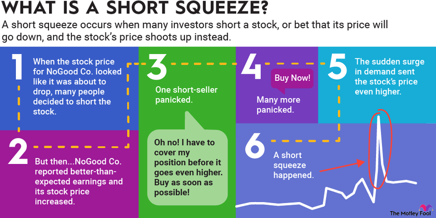

## Table of Contents

## What is a short squeeze?

A short squeeze happens when a lot of people have borrowed and sold a stock, betting that its price will go down. This is called short selling. If the stock price starts to go up instead, these short sellers might panic. They will want to buy the stock back quickly to avoid losing more money. This buying can push the stock price up even more.

As more short sellers rush to buy back the stock, the price can go up very fast. This creates a "squeeze" because the short sellers are squeezed out of their positions. It can lead to big price jumps in a short time. A famous example of a short squeeze is what happened with GameStop stock in early 2021.

## How does a short squeeze occur?

A short squeeze happens when many people have bet that a stock's price will go down by borrowing and selling the stock, a practice known as short selling. If the stock's price starts to rise instead, these short sellers get worried. They want to buy the stock back to return it to the person they borrowed it from, but now they have to pay more because the price has gone up. This can make them lose a lot of money.

As more short sellers rush to buy back the stock to cut their losses, their buying pushes the stock's price up even more. This creates a cycle where the price keeps going up because everyone is trying to buy back the stock at the same time. This is called a short squeeze because the short sellers are squeezed out of their positions, and it can make the stock's price jump a lot in a short time.

## What are the key factors that can trigger a short squeeze?

A short squeeze can start when a lot of people have bet that a stock's price will go down by short selling it. If something good happens to the company, like better-than-expected earnings or positive news, the stock price might start to go up. When this happens, short sellers start to worry because they need to buy the stock back to return it, but now it costs more. This fear can make them rush to buy the stock back, which pushes the price up even more.

Another thing that can trigger a short squeeze is when a lot of people suddenly start buying the stock, maybe because they think it's a good deal or they want to push the price up on purpose. This buying can make the stock price go up quickly, which scares the short sellers into buying back the stock to avoid bigger losses. This cycle of buying and price increases can create a short squeeze, making the stock's price jump a lot in a short time.

## Can you explain the mechanics of short selling and how it relates to a short squeeze?

Short selling is when someone borrows a stock from someone else and sells it right away, hoping the price will go down. If it does go down, they can buy it back cheaper later and return it to the person they borrowed it from. They make money because they sold it for more than they bought it back for. But, if the price goes up instead, they lose money because they have to buy it back at the higher price to return it.

A short squeeze happens when a lot of people have short sold a stock, and then the price starts to go up. The short sellers get scared because they need to buy the stock back to return it, but now it's more expensive. They start buying it back quickly to cut their losses, which pushes the price up even more. This makes other short sellers panic and buy back the stock too, creating a cycle where the price keeps going up fast. This is called a short squeeze because the short sellers are squeezed out of their positions as the price rises.

## What are some common indicators that a short squeeze might be imminent?

One sign that a short squeeze might be coming is when a lot of people have short sold a stock. You can see this by looking at the short interest, which is the number of shares that have been short sold. If the short interest is high, it means many people are betting the price will go down. If something good happens to the company, like better earnings or positive news, the stock price might start to go up. This can make short sellers worried because they need to buy the stock back to return it, but now it's more expensive.

Another sign is when the stock starts to go up quickly. This can happen if a lot of people suddenly start buying the stock, maybe because they think it's a good deal or they want to push the price up on purpose. When the price goes up, short sellers get scared and start buying the stock back to avoid bigger losses. This buying can make the price go up even more, creating a cycle where the price keeps rising fast. This is when a short squeeze can happen, making the stock's price jump a lot in a short time.

## How do short squeezes impact the stock market and individual investors?

Short squeezes can shake up the stock market. When a short squeeze happens, the stock price can go up a lot in a short time. This can make the market feel more risky and can cause big changes in stock prices. Big investors might lose a lot of money if they were betting the price would go down. On the other hand, people who own the stock or bet the price would go up can make a lot of money. This can lead to more people trying to start short squeezes, which can make the market feel unstable.

For individual investors, short squeezes can be both good and bad. If you own the stock when a short squeeze happens, you can make a lot of money because the price goes up fast. But, it can also be risky. If you bought the stock hoping for a short squeeze and it doesn't happen, you might lose money. Also, if you short sold the stock and a short squeeze happens, you can lose a lot of money because you have to buy the stock back at a much higher price. So, short squeezes can make the stock market exciting but also very risky for individual investors.

## Can you provide historical examples of notable short squeezes?

One famous short squeeze happened with Volkswagen stock in 2008. A lot of people had bet that Volkswagen's stock price would go down. But then, another company called Porsche said it owned a lot of Volkswagen stock, which made the price go up a lot. Short sellers got scared and started buying the stock back to avoid losing more money. This made the price go up even more, creating a big short squeeze. At one point, Volkswagen became the most valuable company in the world for a short time.

Another well-known short squeeze happened with GameStop in 2021. Many big investors had bet that GameStop's stock price would go down. But then, a lot of people on a website called Reddit started buying GameStop stock because they thought it was a good deal. This made the price go up a lot, and the short sellers got worried. They started buying the stock back, which pushed the price up even more. The short squeeze made GameStop's stock price jump a lot in a short time, causing big losses for some short sellers and big gains for others.

## What role do social media and online communities play in modern short squeezes?

Social media and online communities have become very important in modern short squeezes. They can get a lot of people to buy a stock at the same time. For example, in the GameStop short squeeze, people on a website called Reddit talked about buying GameStop stock. They thought it was a good deal and wanted to push the price up to cause a short squeeze. When a lot of people start buying the stock because of what they see on social media, it can make the price go up quickly.

This can scare short sellers who bet the price would go down. They start buying the stock back to avoid losing more money, which makes the price go up even more. Social media can make this happen faster because news and ideas spread quickly online. It can also make more people join in, making the short squeeze even bigger. So, social media and online communities can start and make short squeezes stronger in today's world.

## How can investors protect themselves from the risks associated with short squeezes?

Investors can protect themselves from the risks of short squeezes by doing a lot of research before they buy or short sell a stock. They should look at how many people have short sold the stock, which is called short interest. If a lot of people have short sold it, there's a bigger chance of a short squeeze happening. Investors should also keep an eye on the news and anything that might make the stock's price go up or down. If they see the price going up fast, they might want to be careful because it could be the start of a short squeeze.

Another way to protect themselves is by using stop-loss orders. This is a way to tell their broker to sell the stock if it goes down to a certain price. This can help limit how much money they might lose if a short squeeze happens and the price goes up a lot. Investors should also think about not putting all their money into one stock. By spreading their money across different stocks, they can lower the risk of losing a lot of money if one stock gets caught in a short squeeze.

## What are the regulatory considerations and potential interventions during a short squeeze?

During a short squeeze, regulators might step in to make sure the market stays fair and safe. They watch to see if anyone is doing anything wrong, like spreading false information or trying to manipulate the stock price. If they find problems, they might stop trading in that stock for a while or take other actions to calm things down. They want to make sure everyone can buy and sell stocks without being tricked or hurt by sudden big price changes.

Regulators also look at how short selling is done to make sure it's not causing too much trouble. They might change rules about short selling to stop short squeezes from happening too often or getting too wild. For example, they might make short sellers report what they're doing more often or set limits on how much short selling can happen. By doing these things, regulators try to keep the market working well and protect investors from the risks of short squeezes.

## How do short squeezes affect the broader financial ecosystem, including hedge funds and market makers?

Short squeezes can really shake things up for hedge funds and market makers. Hedge funds often bet on stocks going down by short selling them. If a short squeeze happens, they can lose a lot of money because they have to buy the stock back at a much higher price. This can hurt their overall performance and might even make some hedge funds go out of business. Market makers, who help keep the market running smoothly by buying and selling stocks, can also feel the impact. They might have to deal with a lot of buying and selling all at once, which can be hard to handle and might make the market feel unstable.

The effects of short squeezes can spread to the whole financial ecosystem. When hedge funds lose money, it can make them pull back from other investments, which can affect other parts of the market. If a lot of hedge funds are losing money at the same time, it can make the whole market feel less sure and more risky. Market makers might also have to change how they work to deal with the sudden changes in stock prices. This can lead to more rules and changes in how the market works to try to stop short squeezes from happening too often or getting too wild.

## What advanced strategies can traders use to either capitalize on or hedge against short squeezes?

Traders can use a few smart moves to make money from short squeezes or to protect themselves from losing too much. One way is to buy call options on stocks that have a lot of short interest. Call options give you the right to buy a stock at a certain price later. If a short squeeze happens and the stock price goes up a lot, the call options can become very valuable. Another way is to use a strategy called a long straddle, where you buy both a call option and a put option at the same time. This can help you make money if the stock price moves a lot in either direction, which often happens during a short squeeze.

To protect against the risks of a short squeeze, traders can use stop-loss orders. A stop-loss order tells your broker to sell the stock if it goes down to a certain price, which can help limit how much money you might lose. Another way to hedge is by buying put options, which give you the right to sell a stock at a certain price later. If the stock price goes down because of a short squeeze that doesn't happen, the put options can help you make some money back. By using these strategies, traders can try to make money from short squeezes or at least not lose as much if things go the other way.

## What are the causes and triggers of short squeezes?

Short squeezes are complex market events primarily triggered by various internal and external factors. A common catalyst for a short squeeze is unexpected positive news about a company or its industry. This news can take many forms, including better-than-expected earnings reports, unveiling of innovative products, favorable changes in management, or strategic mergers and acquisitions. Such developments can prompt long-term investors to accumulate the stock, thereby pushing up the price and squeezing short sellers who must now cover their positions at a loss.

Market sentiment shifts also play a crucial role in triggering short squeezes. A sudden surge of investor interest or optimism can propel stock prices upward. In recent years, the impact of social media platforms has become significantly pronounced in this context. Platforms such as Twitter, Reddit, and online trading forums have facilitated rapid dissemination of information and coordination among retail investors. The GameStop short squeeze of early 2021 is a notable example, where enthusiasm and coordination among retail traders, largely through a Reddit community, led to a dramatic increase in the stock price, squeezing many institutional short sellers.

The short interest ratio, often calculated as the number of shares sold short divided by the average daily trading [volume](/wiki/volume-trading-strategy), is a critical metric in evaluating the likelihood of a short squeeze. A high short interest ratio indicates that a significant proportion of the stock's available shares have been shorted, suggesting potential upward pressure on the stock price should short sellers need to cover their positions. This phenomenon can be mathematically represented as:

$$
\text{Short Interest Ratio} = \frac{\text{Shares Sold Short}}{\text{Average Daily Volume}}
$$

A higher ratio signifies greater vulnerability to a short squeeze, as even a moderate positive catalyst can compel short sellers to [exit](/wiki/exit-strategy) their positions quickly, leading to a rapid price spike. Understanding these causes and triggers can equip investors with the insights needed to navigate and potentially benefit from these volatile market episodes.

## References & Further Reading

[1]: Bergstra, J., Bardenet, R., Bengio, Y., & Kégl, B. (2011). ["Algorithms for Hyper-Parameter Optimization."](https://papers.nips.cc/paper/4443-algorithms-for-hyper-parameter-optimization) Advances in Neural Information Processing Systems 24.

[2]: ["Advances in Financial Machine Learning"](https://www.amazon.com/Advances-Financial-Machine-Learning-Marcos/dp/1119482089) by Marcos Lopez de Prado

[3]: ["Evidence-Based Technical Analysis: Applying the Scientific Method and Statistical Inference to Trading Signals"](https://www.amazon.com/Evidence-Based-Technical-Analysis-Scientific-Statistical/dp/0470008741) by David Aronson

[4]: ["Machine Learning for Algorithmic Trading"](https://github.com/stefan-jansen/machine-learning-for-trading) by Stefan Jansen

[5]: ["Quantitative Trading: How to Build Your Own Algorithmic Trading Business"](https://www.amazon.com/Quantitative-Trading-Build-Algorithmic-Business/dp/1119800064) by Ernest P. Chan