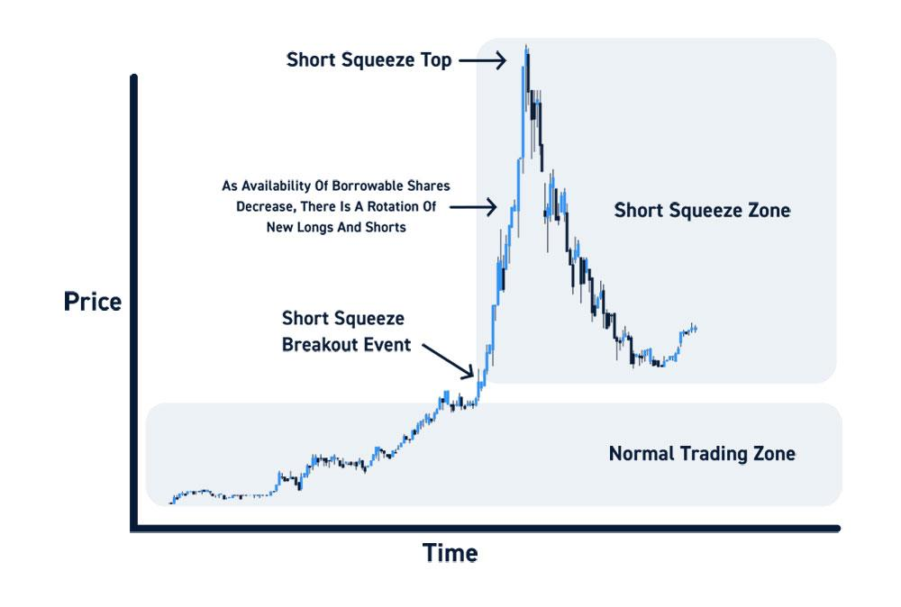

In the ever-evolving landscape of financial markets, investment strategies must adapt swiftly to new trends and technologies. A notable phenomenon that has garnered substantial attention in recent times is the short squeeze. This market event occurs when a heavily shorted stock experiences a rapid increase in price, compelling short sellers to purchase shares to cover their positions, thereby driving prices further up. The GameStop incident in early 2021 is a prime example, showcasing how retail investors, leveraging platforms like social media, can induce such dramatic market movements.

Simultaneously, algorithmic trading has become integral to modern financial markets. It enables rapid trade execution and comprehensive data analysis by using complex algorithms to identify and act on market signals. Investors and firms use algorithmic trading to enhance trading speed and precision, making it a cornerstone activity that supports dealing with the swift price dynamics seen in phenomena like short squeezes.



This article investigates the interaction between short squeeze opportunities, algorithmic trading, and the development of effective investment strategies. Understanding this intersection is essential for making informed investment decisions in today's financial markets. Leveraging technology and keeping abreast of market mechanics provides investors with tools not only to identify potential profit avenues but also to manage risks effectively. In doing so, they position themselves to thrive amidst the volatility and rapid changes that characterize contemporary market environments.

## Table of Contents

## Understanding Short Squeeze

A short squeeze is a market phenomenon that occurs when a heavily shorted stock experiences a rapid increase in price, compelling traders who have previously shorted the stock to buy it back in order to limit their losses. In a typical short sale, traders borrow shares to sell them on the open market, betting on the price decline to repurchase them later at a lower cost. However, if the stock price rises unexpectedly, these traders may face significant financial pressure to cover their short positions by purchasing shares, which in turn drives the price of the stock even higher.

This feedback loop can result in a dramatic escalation of the stock's price, exacerbated by the fact that the urgency to cover short positions increases buying pressure. As the stock price surges, other market participants, such as momentum traders and retail investors, may be drawn to the rising price trend, further amplifying the effect.

A notable illustration of a short squeeze was the GameStop event in early 2021. During this period, a collective of retail investors, primarily organized through social media platforms such as Reddit's WallStreetBets, significantly increased the demand for GameStop shares. As the stock price soared, short sellers scrambled to cover their positions, leading to an even greater surge in the stock price. This event highlighted the powerful impact of coordinated buying efforts and the risks inherent in excessive short selling.

To navigate or exploit short squeeze events, investors must understand the underlying mechanisms and potential triggers involved. Several indicators can signal the likelihood of a short squeeze, such as a stock's short interest ratio—the percentage of a stock's total available shares that are currently sold short. A higher short interest ratio often indicates a greater potential for a short squeeze, especially if the stock starts trending upward unexpectedly.

Additionally, analysts may examine trading volumes and price [momentum](/wiki/momentum) to assess whether a short squeeze is underway or likely to occur. Monitoring news and social media channels can also provide insights into market sentiment and potential catalysts for price movements.

## Investment Strategies in Response to Short Squeezes

Investors looking to profit from short squeezes often employ contrarian strategies, acting contrary to prevailing market sentiment. This approach typically involves buying securities that are heavily shorted with the anticipation that their prices will rise sharply, forcing short sellers to cover their positions. Successfully executing these strategies requires a deep understanding of market dynamics and effective risk management to mitigate potential losses given the high [volatility](/wiki/volatility-trading-strategies) associated with short squeezes.

Risk management is essential when trading in potentially turbulent markets like those undergoing a short squeeze. Volatility can lead to substantial financial losses if not adequately managed. One effective strategy is the use of stop-loss orders, which can automatically sell a security when it reaches a predetermined price threshold, thereby limiting potential losses. Diversification is another key tactic, spreading investments across various assets to reduce the impact of a single asset's poor performance.

Investors may also rely on historical data and market indicators to predict potential short squeeze scenarios. Analyzing historical short interest ratios can provide insights into stocks that might be vulnerable to sudden price increases. For instance, a high short interest ratio might indicate that many traders are betting against a stock, making it a candidate for a short squeeze if the market sentiment changes unexpectedly.

Leveraging technological tools like Python for data analysis can further enhance an investor's ability to identify profitable short squeeze opportunities. Python's capability to handle large datasets and perform complex calculations makes it an ideal tool for financial analysis. By accessing real-time data feeds and applying algorithms, investors can assess factors such as trading [volume](/wiki/volume-trading-strategy) spikes, price momentum, and changes in short interest.

A simple Python script using libraries like `pandas` and `numpy` can be employed to analyze trading volumes and short interest ratios:

```python
import pandas as pd
import numpy as np

# Load historical data
data = pd.read_csv('stock_data.csv')

# Calculate short interest ratio
data['short_interest_ratio'] = data['short_interest'] / data['float']

# Detect potential short squeeze signals
volume_threshold = data['volume'].mean() * 1.5
potential_squeeze = data[(data['short_interest_ratio'] > 0.2) & (data['volume'] > volume_threshold)]

print(potential_squeeze)
```

This script reads historical stock data, computes the short interest ratio, and identifies situations where the ratio exceeds 20% and trading volume is significantly higher than average. Such indicators can suggest potential short squeeze opportunities, informing investment decisions.

Overall, effectively navigating short squeeze scenarios requires balancing technological insights with prudent risk management. By understanding market behavior patterns and utilizing advanced analytical tools, investors can potentially capitalize on the rapid price movements characteristic of short squeezes, while also safeguarding against the inherent risks.

## Algorithmic Trading: A Game Changer

Algorithmic trading employs sophisticated computer algorithms to execute trades, evaluating precise criteria to enhance both speed and accuracy in transaction processing. These algorithms have revolutionized trading by being able to process vast amounts of data in real-time. This capability is particularly significant for detecting market signals, such as those that suggest the potential for a short squeeze scenario, where rapid movements in stock prices can create both significant opportunities and risks.

High-frequency trading ([HFT](/wiki/high-frequency-trading-strategies)), a subset of [algorithmic trading](/wiki/algorithmic-trading), plays a crucial role in such volatile situations. HFT relies on the execution of a large number of orders at extremely high speeds, often in fractions of a second, thereby making it possible to capture profits from small price discrepancies that may only exist for brief moments. This type of trading is especially pertinent during periods of heightened volatility, such as a short squeeze, where swift action can be the difference between gains and losses.

Algorithmic trading's analytical prowess enables it to identify short-lived market opportunities that might otherwise go unnoticed. It uses advanced statistical models to predict future price movements based on historical data patterns, executing trades that align with these predictions. A practical implementation could involve using Python to develop algorithms that scan for specific indicators of a short squeeze, such as unusual trading volume spikes or changes in short interest ratios.

For example, an algorithm designed to monitor short interest might implement the following Python function:

```python
def monitor_short_interest(stock_data):
    threshold = 1.5  # Example threshold for short interest ratio
    for stock in stock_data:
        short_interest_ratio = stock['short_interest'] / stock['float_shares']

        if short_interest_ratio > threshold:
            print(f"Potential short squeeze alert for {stock['symbol']}")
```

This function illustrates how an algorithm can track and respond to changes in the market in real-time, efficiently processing data that would be challenging for human traders to handle manually. By continually seeking out emerging patterns and opportunities within the financial markets, algorithmic trading provides a substantial edge, allowing investors to respond swiftly and decisively to the fleeting nature of market fluctuations.

## Risks and Challenges of Algo Trading in Short Squeezes

Algorithmic trading, while offering significant benefits like increased speed and accuracy, also presents notable risks in volatile scenarios such as short squeezes. One major concern is the propensity for strategies to be overfitted to historical data. Overfitting arises when an algorithmic model is excessively tailored to fit past data patterns, potentially resulting in poor performance when applied to new market conditions. This is particularly problematic in dynamic environments, such as short squeezes, where the market behavior deviates sharply from historical norms.

Moreover, the fast-paced nature of algorithmic trading heightens the risk of technical failures. Software bugs or hardware malfunctions can lead to rapid, unintended transactions, causing potential financial losses. Given the [high frequency](/wiki/high-frequency-trading) and volume of trades executed programmatically, even small technical issues can aggregate into significant impacts within a short period.

Regulatory challenges further complicate algorithmic trading in short squeezes. Traders must remain compliant with evolving regulations aimed at maintaining market integrity and protecting against manipulative practices. The phenomenon of flash crashes, where rapid selling leads to a swift market decline, is another critical concern. Such events, driven by automated trading systems, can exacerbate market volatility and lead to distorted price movements, affecting not only traders but the broader market.

In summary, while algorithmic trading can provide advantages during short squeezes, these opportunities are accompanied by significant risks. Effective risk management, robust system checks, and adherence to regulatory standards are essential to mitigating these challenges.

## Conclusion

Mastering investment strategies amidst short squeezes requires a nuanced understanding of both traditional and algorithmic trading dynamics. Algorithmic trading technologies offer investors unprecedented opportunities for profit through enhanced speed and sophisticated data analyses. By executing trades based on precise criteria and analyzing large volumes of data in real time, algorithms can detect and respond to short-lived market conditions more efficiently than manual trading methods.

However, the incorporation of algorithmic trading into investment strategies introduces unique challenges that must be carefully managed. Chief among these is the risk of overfitting algorithms to historical data, which can result in poor performance when market conditions change. Additionally, the fast-paced nature of algorithmic trading can amplify losses in the event of technical failures or unexpected market behavior.

Investors are required to balance the advanced insights and rapid execution capabilities provided by algorithms with robust risk management practices. This involves implementing strategies such as setting stop-loss orders, diversifying portfolios to mitigate exposure to volatile assets, and maintaining vigilant oversight of algorithmic activities to ensure they respond appropriately to market changes.

Moreover, a deep understanding of market mechanics is essential for effectively navigating the complexities of short squeezes. Traders must remain adaptable, constantly reviewing and refining their strategies to account for evolving market signals and regulatory changes. This vigilance, coupled with an informed application of both traditional and technological trading tools, is crucial for thriving in today's fast-paced financial markets.

## References & Further Reading

[1]: Bergstra, J., Bardenet, R., Bengio, Y., & Kégl, B. (2011). ["Algorithms for Hyper-Parameter Optimization."](https://dl.acm.org/doi/10.5555/2986459.2986743) Advances in Neural Information Processing Systems 24.

[2]: ["Advances in Financial Machine Learning"](https://www.amazon.com/Advances-Financial-Machine-Learning-Marcos/dp/1119482089) by Marcos Lopez de Prado

[3]: ["Evidence-Based Technical Analysis: Applying the Scientific Method and Statistical Inference to Trading Signals"](https://www.amazon.com/Evidence-Based-Technical-Analysis-Scientific-Statistical/dp/0470008741) by David Aronson

[4]: ["Machine Learning for Algorithmic Trading"](https://github.com/stefan-jansen/machine-learning-for-trading) by Stefan Jansen

[5]: ["Quantitative Trading: How to Build Your Own Algorithmic Trading Business"](https://www.amazon.com/Quantitative-Trading-Build-Algorithmic-Business/dp/1119800064) by Ernest P. Chan