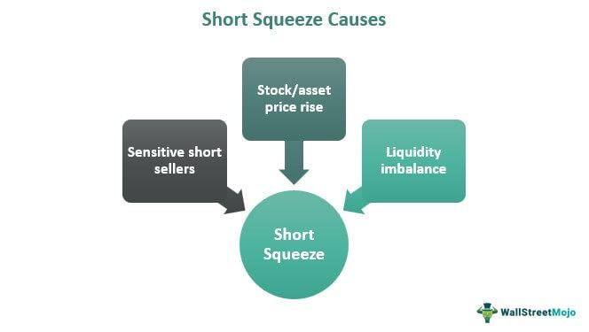

In the complex world of stock markets, the terms "short covering" and "short squeeze" are pivotal for traders and investors who deal with short positions. These phenomena are critical for understanding market dynamics, as they can significantly influence price movements and trading strategies.

Short covering is a process where an investor buys back borrowed securities to close an open short position. This action is often driven by the goal of securing profits or cutting losses in a volatile market environment. Conversely, a short squeeze occurs when a heavily shorted stock experiences a rapid price increase. This surge compels short sellers to buy back shares to cover their positions, often pushing the stock price even higher due to increased demand. This self-perpetuating cycle can lead to dramatic price escalations, creating both risks and opportunities for market participants.



Algorithmic trading plays a crucial role in navigating these challenges and opportunities. As trading increasingly relies on sophisticated algorithms, understanding the mechanics of short covering and short squeezes is essential for developing effective strategies that manage risk and exploit volatile market conditions. Real-world examples and historical events, such as the notable case of GameStop in 2021, illustrate the profound impacts short covering and short squeezes can have on the market. Exploring these concepts provides insights into their influence on investor behavior and market dynamics, underscoring their importance in the contemporary trading landscape.

## Table of Contents

## What is Short Covering?

Short covering is an essential concept in stock trading that occurs when traders who have previously sold securities short buy them back to close their open positions. Short selling involves borrowing securities and selling them on the market, with the expectation of buying them back later at a lower price to return to the lender, thereby profiting from the price difference. However, several scenarios can prompt traders to cover their short positions by repurchasing the borrowed securities.

One primary reason for short covering is to lock in profits. When the price of a security falls as anticipated, the trader can buy back the stock at the lower price, return it to the lender, and pocket the difference as profit. For instance, if a trader shorts 100 shares of a stock at $50 per share and the stock price drops to $40, the trader can purchase the 100 shares at this lower price, return them to the lender, and secure a profit of $10 per share, totaling $1,000.

Conversely, short covering can also be a defensive tactic to mitigate losses. If a shorted stock's price rises instead of falling, traders may decide to cover their positions by buying back the shares to limit potential losses. This scenario demonstrates the risk inherent in short selling, as losses can theoretically be unlimited if the stock price continues to rise.

Short covering influences market dynamics in several ways, particularly under volatile conditions. When many traders cover their short positions simultaneously, it can lead to increased buying pressure, driving the stock price further upwards. This phenomenon can be particularly pronounced in stocks with high short interest, where a large portion of the outstanding shares have been sold short. As traders rush to cover their positions, the increased demand for shares can exacerbate price fluctuations, creating a feedback loop that further accelerates the price increase.

Investor behavior during periods of short covering can also reflect broader market sentiment. For instance, if many investors believe a stock is overvalued, they might engage in short selling, expecting a price drop. Conversely, if sentiment shifts due to new information or changes in market conditions, inducing investors to cover their shorts, this can signal a change in market outlook and contribute to [volatility](/wiki/volatility-trading-strategies).

Overall, understanding short covering is crucial for traders seeking to navigate the complexities of the stock market. It plays a significant role in both individual investment strategies and the broader market ecosystem, affecting price movements and investment decisions.

## Understanding Short Squeezes

A short squeeze is a market phenomenon that transpires when a heavily shorted stock suddenly experiences a significant price increase. This abrupt upsurge compels short sellers to buy back shares to cover their positions, often at a loss, thereby further driving up the stock price. The cycle is self-reinforcing, as each round of purchasing generates additional upward pressure on the stock's price.

To understand the mechanics of a short squeeze, one must first grasp the concept of short selling. In short selling, investors borrow shares of a stock they believe will decrease in price and sell them on the open market. The objective is to repurchase the shares at a lower price, return them to the lender, and pocket the price difference. However, if the stock price rises, short sellers face potentially unlimited losses, as they may have to buy back the stock at a price higher than what they sold it for.

The GameStop short squeeze of January 2021 serves as a prominent example. GameStop, a retail company, had a high short interest, meaning that a large percentage of its shares were sold short by investors anticipating a price decline. Unexpectedly, retail investors, primarily from the Reddit community WallStreetBets, began purchasing substantial quantities of GameStop shares, driving up the price drastically. Short sellers, facing soaring losses and margin calls, rushed to purchase shares to cover their positions, which further exacerbated the price increase. Consequently, GameStop's stock price skyrocketed from approximately $20 in early January 2021 to an intraday high of $483 on January 28, 2021.

This dramatic event underscores the potential market impacts of short squeezes, where speculative trading and crowd psychology can lead to significant market volatility. The GameStop saga highlights how coordinated retail investor actions, particularly those amplified by social media platforms, can disrupt traditional market dynamics and challenge the assumptions of both individual and institutional investors.

Understanding the fundamentals of short squeezes is vital for traders aiming to manage risk and leverage market instability effectively. The phenomenon illustrates the market's susceptibility to sudden shifts in sentiment and the complex interplay between short sellers and market participants.

## Factors Influencing Short Squeezes

Several elements can significantly influence the duration and intensity of short squeezes. A crucial determinant is the short interest ratio, which represents the percentage of a company's total shares that are currently sold short. A high short interest ratio often indicates that many investors are betting against the stock, increasing the potential for a squeeze if positive news drives demand for the stock.

Trading [volume](/wiki/volume-trading-strategy) also plays a vital role. High trading volumes can lead to rapid price movements, especially when coupled with a high short interest ratio. When the trading volume exceeds the number of shares shorted, short sellers may struggle to find available shares to buy back, intensifying the squeeze. For instance, using Python, one might calculate the short interest ratio (SIR) as follows:

```python
def calculate_sir(shorted_shares, total_shares):
    return shorted_shares / total_shares

# Example usage
shorted_shares = 1_000_000
total_shares = 10_000_000
sir = calculate_sir(shorted_shares, total_shares)
print(f"Short Interest Ratio: {sir:.2%}")
```

Market sentiment is another influential [factor](/wiki/factor-investing), as it can amplify the effects of both short covering and short squeezes. Positive sentiment may spur further buying among traders, encouraging short sellers to cover their positions quickly to mitigate losses. Conversely, negative sentiment might delay covering, adding fuel to potential squeezes as short sellers dig in further.

External events also affect short squeezes significantly. Announcements such as mergers, earnings reports, or regulatory changes can trigger sudden price increases, catching short sellers off guard. A notable example is the GameStop saga in 2021, where internet forums rallied retail investors, creating a coordinated buying frenzy that drove the stock price up dramatically.

Brokers play a critical role in managing these dynamics, particularly through margin calls. If a stock's price rises sharply, brokers may issue margin calls, requiring short sellers to deposit additional funds or close positions. This action can exacerbate a short squeeze by forcing more short sellers to buy shares, thus pushing the price higher.

Margin calls can be illustrated mathematically. The maintenance margin requirement, $MMR$, dictates how much equity must remain in the account relative to the value of the borrowed stock. If $V$ denotes the value of the shorted stock and $E$ represents the equity in the account, the condition for a margin call is $E < MMR \times V$.

In summary, a combination of the short interest ratio, trading volume, market sentiment, and external events can influence the odds and impact of short squeezes. The involvement of brokers and their margin requirements adds another layer of complexity, potentially aggravating these short-term price volatilities.

## Algorithmic Trading and Its Impact

Algorithmic trading, a strategy utilizing computer systems to execute trades based on predetermined criteria, significantly impacts short squeezes and is influenced by them as well. These systems enable traders to process vast amounts of data in real-time, enhancing the ability to detect early signs of a potential squeeze and facilitate rapid decision-making processes.

Algorithms deploy various statistical models and data analytics to identify patterns that signal an impending short squeeze. Machine learning models, particularly those leveraging historical market data, are adept at recognizing unusual patterns in stock price movements, volume fluctuations, and changes in market sentiment—key indicators of a short squeeze. For instance, a sudden increase in trading volume coupled with rising stock prices may be flagged by these systems as a potential precursor to a squeeze.

Real-time data processing allows algorithms to react promptly to market dynamics, a crucial capability during a short squeeze when the window for action is narrow. This rapid processing not only involves monitoring stock prices and volumes but also evaluating news events that may influence market perceptions and trigger buying frenzies. Algorithms can be programmed to adjust trading strategies dynamically, buying or selling shares based on pre-set conditions such as threshold breaches in stock movement or volatility indexes like the VIX.

Moreover, [algorithmic trading](/wiki/algorithmic-trading) can amplify the volatility of a short squeeze. High-frequency trading ([HFT](/wiki/high-frequency-trading-strategies)) algorithms, which execute a large number of trades in milliseconds, can exacerbate the upward price [momentum](/wiki/momentum) during a squeeze by continuously buying stocks to hedge short positions, further increasing demand and elevating prices. The interaction of multiple HFT systems can lead to complex market behavior where the feedback loop accelerates price changes.

Here's a simple Python script illustrating how a [machine learning](/wiki/machine-learning) approach could be utilized to predict potential squeezes:

```python
import pandas as pd
from sklearn.ensemble import RandomForestClassifier
from sklearn.model_selection import train_test_split

# Example dataset with features: Price Change, Volume, and Short Interest Ratio
data = pd.read_csv('market_data.csv')

# Features and target
X = data[['Price_Change', 'Volume', 'Short_Interest_Ratio']]
y = data['Squeeze_Upcoming']

# Split the data
X_train, X_test, y_train, y_test = train_test_split(X, y, test_size=0.2, random_state=42)

# Random forest classifier
model = RandomForestClassifier(n_estimators=100, random_state=42)
model.fit(X_train, y_train)

# Predict and evaluate
predictions = model.predict(X_test)

accuracy = model.score(X_test, y_test)
print(f"Model Accuracy: {accuracy:.2f}")
```

While algorithmic trading provides powerful tools for anticipating and leveraging short squeezes, it also faces inherent uncertainties due to the unpredictable nature of market events and human psychology. Therefore, continuous refinement and adaptation of these algorithms are crucial to maintain a competitive edge in dynamically evolving markets.

## Challenges in Predicting Short Squeezes

Predicting short squeezes presents considerable challenges due to their unpredictable nature and rarity. Short squeezes occur when there is a significant increase in a stock's price, compelling short sellers to buy the stock to cover their positions, subsequently pushing the price even higher. The rarity of these events stems from the multitude of variables that need to align perfectly for a short squeeze to happen, making them difficult to anticipate reliably.

Traditional quantitative models and [backtesting](/wiki/backtesting) methods often fall short in forecasting short squeezes. These models typically operate under assumptions of market efficiency and normal distribution of stock price movements, neither of which hold true during a short squeeze. The underlying assumptions can lead to significant model risk when actual market conditions deviate from the historical data upon which these models are based. Specifically, these models may be unable to capture the abrupt changes in market sentiment and trading volume that characterize a short squeeze. Furthermore, backtesting relies on historical data, which can be misleading due to the unique circumstances accompanying each short squeeze event. This limitation highlights a critical flaw in using backward-looking models for rare and highly volatile phenomena.

Given these challenges, there is a pronounced need for innovative approaches in algorithmic trading to manage the complexity of short squeezes effectively. Advanced data analytics and machine learning algorithms offer promising avenues for improvement. Machine learning models, such as neural networks and decision trees, can be trained to recognize complex patterns and signals indicative of a potential short squeeze. These models can analyze large volumes of data in real time, identifying non-linear relationships and emerging trends that traditional models may overlook.

In Python, libraries such as TensorFlow and Scikit-learn facilitate the development of such predictive models. Here is a simple example of how one might set up a machine learning model to predict potential short squeezes using historical stock data:

```python
import pandas as pd
from sklearn.model_selection import train_test_split
from sklearn.ensemble import RandomForestClassifier
from sklearn.metrics import classification_report

# Load your dataset
data = pd.read_csv('historical_stock_data.csv')

# Feature selection
features = ['short_interest_ratio', 'trading_volume', 'price_change', 'market_sentiment']
X = data[features]
y = data['short_squeeze_occurred']  # Binary target indicating if a short squeeze occurred

# Split the data
X_train, X_test, y_train, y_test = train_test_split(X, y, test_size=0.2, random_state=42)

# Train a Random Forest model
model = RandomForestClassifier(n_estimators=100, random_state=42)
model.fit(X_train, y_train)

# Predict and evaluate the model
y_pred = model.predict(X_test)
print(classification_report(y_test, y_pred))
```

This example demonstrates how machine learning can facilitate the detection of signals potentially leading to a short squeeze. However, it is crucial to note that despite the advantages of machine learning, these models also require diligent validation and continuous learning to adapt to evolving market conditions. Real-time data processing capabilities further amplify the potential for algorithmic trading systems to respond swiftly as market dynamics change.

Innovative approaches such as sentiment analysis through natural language processing (NLP) of news articles and social media data can further enhance predictive accuracy. The combination of market data with sentiment indicators may provide a more holistic view, enabling traders to anticipate market sentiment shifts that often precede short squeezes.

In conclusion, predicting short squeezes remains a formidable challenge due to their inherently unpredictable and rare nature. To improve predictive capabilities, integrating advanced algorithmic strategies, machine learning, and real-time data processing is essential for traders navigating the complexities of modern financial markets.

## Conclusion

In this article, we have explored the nuanced phenomena of short covering and short squeezes, together with the pivotal role algorithmic trading plays in the stock market landscape. Short covering arises as an essential mechanism for closing out borrowed securities, providing traders an opportunity to lock in profits or mitigate potential losses. Meanwhile, short squeezes represent unique opportunities and threats in trading—moments when the unexpected rise in a heavily shorted stock forces short sellers to cover their positions, driving the stock price up even further in a cycle that can rapidly escalate.

Understanding these dynamics is crucial for effective risk management and strategic planning in trading. The impact of short squeezes, as illustrated by historical events like the GameStop incident in 2021, underscores the potential for significant volatility in the market. By grasping the factors that influence short squeezes—like short interest ratios, trading volumes, and market sentiment—traders can enhance their ability to anticipate and navigate these challenging market events.

Algorithmic trading emerges as a powerful tool in this context, offering unique advantages in detecting early signs of a short squeeze through sophisticated data analytics and machine learning models. Algorithms can swiftly process real-time data, potentially anticipating market movements and enabling strategic responses during a short squeeze. However, the unpredictable nature and rarity of short squeezes pose considerable challenges, highlighting limitations in traditional quantitative models. Therefore, innovation in trading algorithms is essential for adapting to the complexity of these events.

In conclusion, traders must remain adaptive and vigilant in the volatile market conditions influenced by short squeezes. An in-depth understanding of these phenomena not only aids in managing risks but also in leveraging potential opportunities presented by market volatility. For traders and investors, the continual evolution and application of algorithmic trading strategies form a critical component of navigating the ever-changing dynamics of the stock market.

## References & Further Reading

1. **Kolanovic, M., & Wei, H. (2013).** *"Short selling and market efficiency: A literature review"*. This paper provides a comprehensive analysis of how short selling impacts market efficiency and discusses the implications of short covering and short squeezes. (Available at: [SSRN](https://ssrn.com/abstract=2388389))

2. **Saffi, P. A. C., & Sigurdsson, K. (2011).** *"Price Efficiency and Short Selling"*. This research examines the relationships between short selling and stock price efficiency, providing key insights into the dynamics of short covering. (Journal of Finance, 66(5), 1773-1811)

3. **Brunnermeier, M. K., & Pedersen, L. H. (2005).** *"Predatory Trading"*. The study explores how traders might exploit market conditions to trigger short squeezes, discussing market dynamics and trader behavior in detail. (Journal of Finance, 60(4), 1825-1863)

4. **Floyd, E., & List, E. (2021).** *"GameStop and the Rise of Retail Investors"*. An analysis of the 2021 GameStop short squeeze event, focusing on the power dynamics between retail investors and institutional short sellers. (Available at: [SSRN](https://ssrn.com/abstract=3778115))

5. **Boehmer, E., Huszár, Z. R., & Jordan, B. D. (2010).** *"The Good News in Short Interest"*. This paper examines the informational content of short interest ratios and its relation to stock prices, crucial for understanding short squeeze triggers. (Journal of Financial Economics, 96(1), 80-97)

6. **Christine, A., & Robert, F. (2018).** *"Automated Trading and Its Role in Modern Markets"*. This work explores the impact of algorithmic trading on financial markets, highlighting how it can influence or mitigate short squeezes through advanced trading strategies. (Review of Financial Studies, 31(7), 2441-2476)

7. **Garleanu, N., Pedersen, L. H., & Poteshman, A. M. (2009).** *"Demand-based Option Pricing"*. An investigation into how demand pressures, including those from short squeezes, affect option prices, offering quantitative insights applicable to short sellers. (Review of Financial Studies, 22(10), 4259-4299)

8. **Fung, B., & Hsieh, D. A. (2001).** *"The Risk in Hedge Fund Strategies: Theory and Evidence from Trend Followers"*. Offers perspective on how hedge funds might employ trends in short selling and covering to optimize their strategies. (Review of Financial Studies, 14(2), 313-341)

These references provide a foundation for understanding the complexities of short covering and short squeezes, as well as the technological and strategic tools employed in modern trading environments.