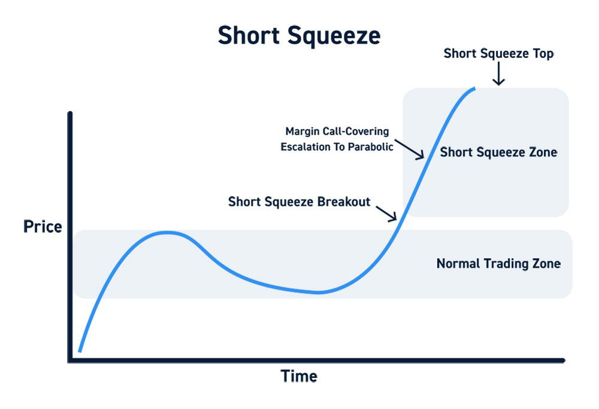

## Table of Contents

## What is a short squeeze?

A short squeeze happens when a lot of people who bet that a stock's price will go down (these people are called short sellers) have to buy the stock quickly to avoid losing more money. This happens because the stock's price starts going up instead of down. When short sellers buy the stock to cover their bets, it pushes the price up even more. This can cause a big jump in the stock's price in a short time.

A famous example of a short squeeze is what happened with GameStop in early 2021. A lot of people on social media started buying GameStop stock and telling others to do the same. This made the stock's price go up a lot, which forced short sellers to buy the stock to cut their losses. The price kept going up as more short sellers had to buy, making it a big short squeeze.

## How does a short squeeze occur?

A short squeeze happens when a lot of people who bet that a stock's price will go down (these people are called short sellers) suddenly have to buy the stock to avoid losing more money. Short sellers borrow shares and sell them, hoping to buy them back later at a lower price to make a profit. But if the stock's price starts going up instead of down, they can lose a lot of money. To stop their losses from getting worse, they have to buy the stock back at the higher price.

When many short sellers start buying the stock at the same time, it pushes the price up even more. This can create a cycle where the rising price forces more short sellers to buy, which keeps pushing the price higher. This is called a short squeeze. It can happen quickly and cause the stock's price to jump a lot in a short time, which can be exciting but also risky for investors.

## What are the key indicators of a potential short squeeze?

One key indicator of a potential short squeeze is a high short interest ratio. This means that a large percentage of the stock's available shares have been sold short. When many investors are betting that the stock price will go down, it sets the stage for a squeeze if the price starts to rise instead. Another indicator is a high days-to-cover ratio, which shows how many days it would take for short sellers to buy back all the shares they've borrowed. A higher number of days means it could take longer for short sellers to cover their positions, making a squeeze more likely if the price starts to increase.

Another sign to watch for is a sudden increase in the stock's price, often triggered by positive news or a surge in buying from other investors. This can start to worry short sellers, who might then rush to buy back the shares to limit their losses. This buying pressure can lead to a short squeeze. Also, if you see a lot of trading volume, it can mean that a short squeeze might be happening or about to happen, as more people are buying and selling the stock quickly.

## Can you explain the mechanics of short selling?

Short selling is when someone borrows shares of a stock from a broker and sells them, hoping to buy them back later at a lower price. They make money if the stock's price goes down. For example, if you borrow 100 shares and sell them at $10 each, you get $1,000. If the price drops to $8, you can buy back the 100 shares for $800, return them to the broker, and keep the $200 difference as profit.

But short selling can be risky. If the stock's price goes up instead of down, you lose money. Using the same example, if the price goes up to $12, you'd have to buy back the 100 shares for $1,200, losing $200. There's no limit to how much you could lose if the price keeps going up. Also, you have to pay interest on the borrowed shares, which adds to the cost of short selling.

## What are some famous examples of short squeezes?

One famous example of a short squeeze happened with Volkswagen in 2008. A lot of people bet that Volkswagen's stock price would go down. But then Porsche announced they owned a lot of Volkswagen shares, which made the stock price go up a lot. Short sellers had to buy back the shares quickly to avoid losing more money, which pushed the price even higher. This caused a big short squeeze, and Volkswagen's stock price became the most valuable in the world for a short time.

Another well-known short squeeze happened with GameStop in early 2021. A lot of people on social media, especially on a site called Reddit, started buying GameStop stock and telling others to do the same. This made the stock's price go up a lot, which surprised the short sellers who bet the price would go down. They had to buy back the shares to cut their losses, which made the price go up even more. This created a huge short squeeze that got a lot of attention and caused big losses for some big investors.

## How do short squeezes affect the stock market?

Short squeezes can make the stock market go a bit crazy. When a short squeeze happens, the price of a stock can go up really fast because a lot of people who bet the price would go down have to buy it back quickly. This can make the stock's price jump a lot in a short time, which can be exciting but also scary for people who own the stock or want to buy it. It can also make the whole market feel more risky because people might start to worry about other stocks doing the same thing.

These big jumps in stock prices can also make the market feel less stable. When a short squeeze happens, it can make people think that the stock market is not as predictable as they thought. This can lead to more people selling their stocks to avoid losing money, which can make the market go down. But short squeezes can also make some people want to buy more stocks, hoping to make money from the next big jump in price. So, short squeezes can make the stock market feel like a roller coaster, with lots of ups and downs.

## What role do short interest and short interest ratio play in a short squeeze?

Short interest is the total number of shares of a stock that have been sold short by investors. It shows how many people are betting that the stock's price will go down. The short interest ratio, also called days to cover, tells you how many days it would take for all those short sellers to buy back the shares they borrowed. If the short interest is high and the short interest ratio is also high, it means a lot of people are betting against the stock and it might take them a long time to buy back their shares.

When the stock's price starts to go up, short sellers can get worried. They might start buying back the shares quickly to avoid losing more money, which pushes the price up even more. This can start a short squeeze, especially if the short interest and short interest ratio are high. The more people betting against the stock and the longer it would take them to cover their positions, the bigger the potential for a short squeeze to happen.

## What strategies can traders use to anticipate and profit from a short squeeze?

Traders can look at the short interest and the short interest ratio to guess if a short squeeze might happen. If a lot of people are betting against a stock and it would take them a long time to buy back their shares, it could mean a short squeeze is coming. Traders can also watch for news or events that might make the stock's price go up suddenly, like good company news or a lot of people talking about the stock on social media. If the stock starts to go up and there's a lot of trading happening, it might be a sign that a short squeeze is starting.

To make money from a short squeeze, traders can buy the stock before the squeeze happens and sell it when the price goes up a lot. They need to be careful, though, because short squeezes can be risky and hard to predict. It's important to have a plan for when to sell the stock to make sure they don't lose money if the price goes down again. By keeping an eye on the signs and being ready to act quickly, traders can try to profit from a short squeeze, but they should always be ready for things to not go as planned.

## How do regulatory bodies monitor and respond to short squeezes?

Regulatory bodies like the Securities and Exchange Commission (SEC) in the United States keep an eye on the stock market to make sure everything is fair and safe for investors. They watch for things like short squeezes because these can make the market go crazy and hurt people who own stocks. The SEC looks at data like short interest and trading volumes to see if a short squeeze might be happening. If they think something fishy is going on, they can start an investigation to see if anyone is breaking the rules.

If the SEC finds out that someone is doing something wrong during a short squeeze, like spreading false information to make the stock price go up or down, they can take action. They might fine the people who broke the rules or even stop them from trading for a while. This helps keep the market fair and protects investors from losing money because of tricks or bad behavior. By watching the market closely, regulatory bodies try to stop short squeezes from causing too much trouble.

## What are the risks associated with participating in a short squeeze?

Participating in a short squeeze can be really risky. If you buy a stock hoping for a short squeeze, the price might not go up like you expect. If it goes down instead, you could lose a lot of money. Also, short squeezes can be hard to predict. They can happen fast and end just as quickly, so if you don't sell your stock at the right time, you might miss out on making money or even lose what you've already made.

Another big risk is that short squeezes can make the market feel unstable. When a lot of people are buying and selling a stock quickly, it can make other investors nervous. This can lead to more people selling their stocks, which might make the whole market go down. If you're not careful, you could get caught up in this and lose money on other investments too. So, while trying to make money from a short squeeze can be exciting, it's important to be aware of these risks and have a plan to protect yourself.

## How can investors protect themselves from the negative effects of a short squeeze?

Investors can protect themselves from the negative effects of a short squeeze by being careful and doing their homework. They should look at things like the short interest and short interest ratio to see if a short squeeze might happen. If these numbers are high, it could mean a lot of people are betting against the stock, which might lead to a squeeze. By keeping an eye on these signs, investors can decide if they want to buy or sell the stock, or maybe stay away from it altogether.

It's also important for investors to have a plan for what to do if the stock's price goes up or down a lot. They should decide ahead of time when they will sell the stock to make sure they don't lose money if the price drops suddenly. Using stop-loss orders can help with this. A stop-loss order tells the broker to sell the stock if it reaches a certain low price, which can help limit losses. By being prepared and having a clear plan, investors can better handle the ups and downs that come with a short squeeze.

## What advanced metrics and data analysis techniques are used to predict short squeezes?

To predict short squeezes, traders and analysts use advanced metrics like the short interest ratio, which shows how many days it would take for all the short sellers to buy back the shares they borrowed. A high short interest ratio means it could take a long time for short sellers to cover their positions, making a short squeeze more likely if the stock's price starts to rise. Another important metric is the short interest as a percentage of the float, which tells you how many of the available shares have been sold short. If this number is high, it means a lot of people are betting against the stock, setting the stage for a squeeze if the price goes up instead of down.

Data analysis techniques like regression analysis and machine learning can also help predict short squeezes. Regression analysis looks at past data to find patterns that might show when a short squeeze is likely to happen. Machine learning can go even further by using lots of data to make predictions about stock prices and short squeezes. These techniques can look at things like trading volume, price changes, and even news and social media sentiment to see if a short squeeze might be coming. By combining these advanced metrics and data analysis techniques, investors can get a better idea of when a short squeeze might happen and how to prepare for it.

## References & Further Reading

Brunnermeier, M. K., & Pedersen, L. H. (2005) explore the concept of 'Predatory Trading' in their paper published in The Journal of Finance. The authors discuss how traders can exploit market dynamics to force other participants into unfavorable positions, notably in scenarios involving short squeezes.

Černý, A. (2004) addresses the 'Risk of the Short Squeeze on Over-the-Counter Options' in Quantitative Finance. This work examines how short squeezes can pose significant risks, particularly in less regulated environments like the over-the-counter markets.

Sornette, D. (2003) in 'Why Stock Markets Crash: Critical Events in Complex Financial Systems', published by Princeton University Press, investigates the underlying causes of market crashes, offering insights into the critical events and conditions that may precipitate a short squeeze.

Bijl, L., et al. (2015) present a study titled 'Google searches and stock returns' in the International Review of Financial Analysis. The authors analyze the relationship between online search trends and stock price movements, providing empirical evidence on new predictors of market behavior, which can impact short squeeze occurrences.

Ofek, E., & Richardson, M. (2003) discuss 'DotCom Mania: The Rise and Fall of Internet Stock Prices' in The Journal of Finance. Their research provides a historical perspective on market excesses and corrections, offering valuable lessons on the mechanics of speculative bubbles and short squeezes.

