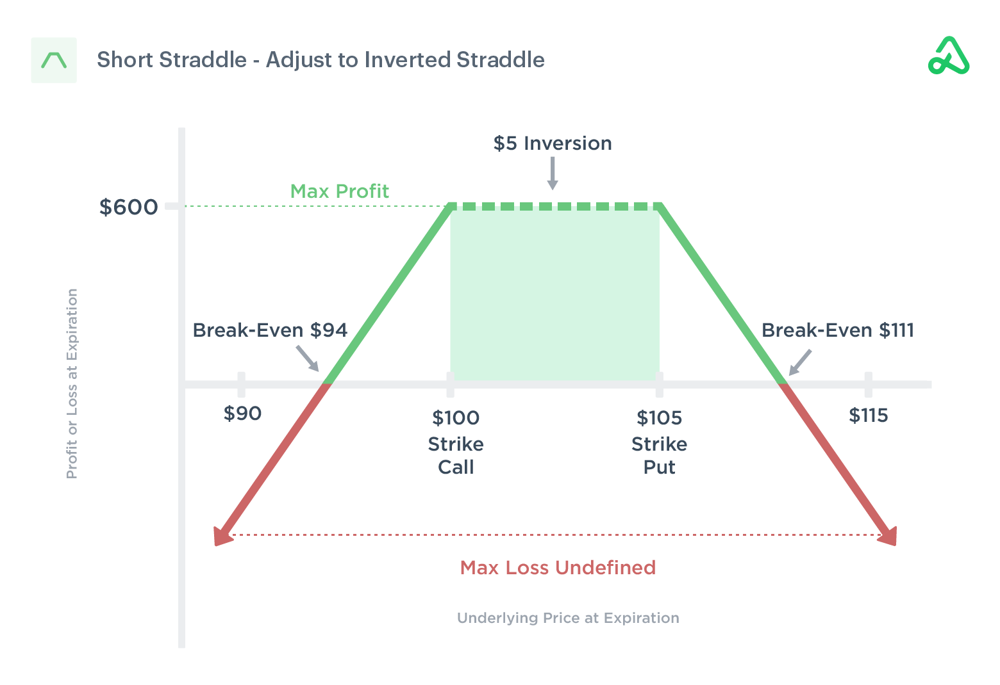

Options trading offers a diverse array of strategies designed to help traders capitalize on various market conditions. Among these strategies, the short straddle stands out as a popular choice for traders aiming to benefit from anticipated stability in the price of a particular asset. A short straddle involves simultaneously selling a call option and a put option with the same strike price and expiration date. This approach allows the trader to collect premiums on the options written, with the primary objective being to profit from the lack of significant price movement in the underlying asset.

The short straddle strategy is particularly appealing in market environments characterized by low volatility. By employing this strategy, traders can potentially maximize their returns if the asset's price remains stable, resulting in both options expiring worthless. However, the short straddle comes with its unique set of challenges, most notably the risk of unlimited potential losses. Such risks emerge when the underlying asset experiences considerable price shifts, necessitating a robust understanding of market dynamics and prudent risk management.

In this article, the focus will be on elucidating the mechanics of the short straddle strategy, examining its advantages, such as potential profits through premium collection, and exploring its disadvantages, including exposure to substantial risks. The discussion will also touch upon the integration of the short straddle within modern algorithmic trading practices, highlighting how technology can enhance the execution and risk management associated with this options strategy.

## Table of Contents

## What Is a Short Straddle?

A short straddle is an advanced options trading strategy that involves simultaneously selling a call option and a put option on the same underlying asset, with both options having the same strike price and expiration date. The primary motivation for deploying a short straddle is to capitalize on a market outlook where the trader expects the underlying asset's price to remain stable, exhibiting minimal volatility throughout the options' duration.

In a short straddle, the trader profits from the premiums received from selling the call and put options. This initial collection of premiums represents the maximum potential profit of the strategy. The breakeven scenarios for the short straddle can be mathematically determined as follows:

1. **Breakeven on the Upside:** $\text{Strike Price} + \text{Total Premium Collected}$
2. **Breakeven on the Downside:** $\text{Strike Price} - \text{Total Premium Collected}$

For example, if both the call and put options are sold for a total premium of $10 each on an asset with a strike price of $100, the upside breakeven point would be $110, and the downside breakeven point would be $90.

Despite its potential for profit, the short straddle carries a risk profile characterized by unlimited potential losses, especially if the market experiences significant price movements. Should the asset's price rise or fall substantially, the position may incur substantial losses, particularly if the market moves beyond the breakeven points. Consequently, the short straddle strategy is typically employed by traders who have a strong conviction that the asset's price will remain relatively unchanged within the option's timeframe and who are well-versed in risk management techniques.

Ultimately, while the short straddle can be lucrative through premium collection in low-[volatility](/wiki/volatility-trading-strategies) conditions, its deployment necessitates a nuanced understanding of market dynamics and an appetite for potentially high risks.

## Understanding Short Straddles

Short straddles are a strategic options trading approach particularly attractive in environments where implied volatility is high. The basic premise is to sell a call option and a put option with identical strike prices and expiration dates. This setup capitalizes on the likelihood that these options are overvalued due to the elevated volatility, which is expected to decrease, thereby reducing the options' premiums.

Profit realization in a short straddle revolves around the stability of the underlying asset's price. If the asset's price remains relatively unchanged, both options will expire worthless, allowing the trader to retain the full premiums collected at the outset. This condition provides the maximum potential profit, calculated as the sum of the premiums from both the call and put options.

However, this strategy carries substantial risks, primarily due to its potential for unlimited losses. Significant price movements in the underlying asset, either upwards or downwards, can lead to considerable financial exposure. For instance, if the asset price moves well above the call option's strike price, the trader must deliver the asset at a potentially significant market price difference. Conversely, a substantial decline in the asset's price could lead to losses from the put option.

Thus, effective risk management is crucial when deploying a short straddle. Traders often use various hedging techniques or stop-loss orders to mitigate potential losses. Additionally, continuously monitoring market conditions helps in making informed adjustments to positions, ensuring that the strategy remains aligned with its intended risk and reward profile. Traders may also consider adjusting their straddle positions dynamically as the market fluctuates to further manage risk.

## Example of a Short Straddle

In this example, let's consider an exchange-traded fund ([ETF](/wiki/etf-trading-strategies)) that is trading at $100. A trader employing the short straddle strategy decides to sell both a call option and a put option, each with a strike price of $100 and the same expiration date. The combined premium received from these sales amounts to $8.

The break-even points for this strategy can be calculated using the premiums collected. Specifically:

- The lower break-even point occurs when the ETF's price at expiration is equal to the strike price minus the total premium received: 
$$
  \text{Lower break-even point} = 100 - 8 = 92 

$$

- The upper break-even point is found by adding the premium to the strike price:
$$
  \text{Upper break-even point} = 100 + 8 = 108 

$$

For the trader implementing this short straddle, the ideal scenario is for the ETF price to remain stable and close somewhere between $92 and $108 at expiration. Within this range, both the call and put options will expire worthless, and the trader retains the full $8 premium as profit. This example illustrates how the short straddle capitalizes on minimal price movement in the underlying asset by profiting from the premiums received through option sales. If the ETF closes precisely at the $100 strike price, this scenario results in the maximum profit for the trader.

## Implied Volatility, Time Decay, and Other Aspects

Short straddles derive potential profitability from two main factors: time decay and changes in implied volatility. Time decay, or theta, plays a critical role in the short straddle strategy. As time progresses towards the options' expiration, the extrinsic value—comprising time value—of the options diminishes. This phenomenon benefits the seller of the options, as the decline in extrinsic value increases the likelihood of the options expiring worthless or at a reduced value, maximizing the profit retained from the initial premium collected.

The impact of time decay is generally non-linear, accelerating as the expiration date approaches. Thus, a short straddle is more profitable in periods where there is minimal price movement, allowing theta decay to gradually reduce option value.

Additionally, implied volatility (IV) significantly influences the short straddle strategy. Short straddles are initiated under the anticipation that current high implied volatility will decrease. As implied volatility declines, the premium—or market price—of the options generally reduces, leading to favorable returns for the seller if the options can be bought back at a lower price or expire worthless. This effect is a key reason traders might opt for this strategy during times of elevated implied volatility.

However, traders should be aware of certain risks, including early assignment. This risk becomes pronounced in short straddles involving American-style options, which can be exercised any day before expiration. In particular, during ex-dividend dates, there is an increased risk of having calls assigned early if the dividend amount surpasses the remaining time value in the option's premium.

For traders considering this strategy, a thorough understanding of both the impacts of time decay and implied volatility, alongside the financial implications of early assignment, is crucial. It ensures that the trader can manage risk effectively while seeking to profit from the temporal and volatility conditions present in the market.

## How Algo Trading Integrates with Short Straddles

Algorithmic trading, often known as algo trading, has become an essential aspect of modern financial markets, providing traders with the tools to execute complex strategies like the short straddle with high precision and efficiency. This integration of technology allows for real-time monitoring and management of various market variables that significantly impact the success of a short straddle.

Algo trading systems can continuously track the market volatility, ensuring that trades are executed when conditions are optimal. For a short straddle strategy, which profits from minimal price movement in the underlying asset, keeping a real-time check on volatility is crucial. Algorithms can adjust positions dynamically, helping traders navigate sudden market shifts that could otherwise lead to significant losses due to the unlimited risk exposure inherent in short straddles.

Moreover, advanced data analytics plays a pivotal role in enhancing the effectiveness of the short straddle strategy. By analyzing historical and current market data, algorithms can predict low volatility scenarios where short straddles are most likely to be profitable. These predictive capabilities assist traders in deciding the best times to initiate or liquidate positions, thereby maximizing the potential premium collected from selling options.

Risk management protocols are another area where [algorithmic trading](/wiki/algorithmic-trading) provides substantial benefits. Algos can automate stop losses and other risk-minimizing strategies, allowing traders to maintain tighter control over their capital in volatile conditions. This is especially important in managing the ever-present risk of early assignment, given that unexpected market events can trigger options contracts before their intended expiration.

Incorporating algorithmic models in a short straddle strategy also facilitates [backtesting](/wiki/backtesting), where traders can simulate the strategy using historical data to ascertain potential outcomes and fine-tune their approach. This testing ensures that the strategy can be vetted for reliability before being implemented in live markets.

In summary, the integration of algorithmic trading into the short straddle strategy enhances the ability of traders to execute trades with precision, maintain robust risk management protocols, and leverage data analytics to predict favorable market conditions. By doing so, it allows traders to handle the complexities and inherent risks of the short straddle strategy more effectively, optimizing their potential for profit in stable market environments.

## Pros and Cons of Short Straddle Strategy

The short straddle strategy is a popular yet complex method in options trading, offering both attractive benefits and notable risks.

**Pros**:
1. **Profits from Premium Collection and Time Decay**: One of the primary advantages of a short straddle is its ability to capitalize on premiums received from selling both call and put options. The seller profits as the options approach expiration due to time decay, also known as theta. As time progresses, the extrinsic value of the options erodes, benefiting the trader if the price of the underlying asset remains near the strike price.

2. **Ideal in Stable Markets**: The strategy thrives in stable markets where there is little expectation of significant price movements in the underlying asset. If the asset's price ends near the strike price at expiration, the options expire worthless, and the trader retains the full premium as profit.

3. **Benefits from a Decrease in Volatility**: A decline in implied volatility is advantageous for a short straddle because it typically results in a decrease in options prices. Traders who execute the strategy during periods of high implied volatility can benefit when the volatility normalizes or decreases, as the premium received becomes more substantial.

**Cons**:
1. **Unlimited Loss Potential**: The most significant risk associated with short straddles is the potential for unlimited losses. Since the strategy involves two short positions (a call and a put), extreme movements in the underlying asset's price can lead to substantial losses. There is no cap on losses if the market moves sharply in either direction.

2. **Significant Margin Requirements**: Due to the risk of unlimited losses, brokers typically require significant margin deposits for positions in short straddles. This requirement can limit the accessibility of this strategy for smaller traders or those unwilling to lock up substantial capital as collateral.

3. **Vulnerability to Large Market Movements**: Large price shifts in the underlying asset can dramatically impact the short straddle's profitability. Events such as earnings announcements, economic data releases, or geopolitical developments that increase volatility can lead to losses that exceed the initial premiums collected.

Overall, the short straddle strategy is best suited to traders with advanced risk management skills and the ability to monitor and adapt to market conditions. It is attractive to those aiming to profit from stable markets and decreases in implied volatility, but its risks require careful consideration and execution.

## Conclusion

The short straddle strategy is a sophisticated approach within options trading, demanding a comprehensive understanding of market dynamics. It is designed to exploit the collection of option premiums, offering potential profits particularly in stable market conditions where price movements in the underlying asset are minimal. However, this strategy is not without its challenges. The greatest risk lies in the potential for unlimited losses if the market exhibits significant volatility and the underlying asset's price deviates substantially from the strike price at expiration.

Executing a short straddle successfully requires meticulous attention to market conditions, as well as a robust risk management framework. Traders must be adept at monitoring changes in implied volatility and be prepared to adjust positions accordingly to mitigate potential losses. The strategy benefits from the natural depreciation of option value over time, known as time decay, but this alone does not eliminate the inherent risks.

Algorithmic trading can significantly enhance the efficiency and precision of managing a short straddle strategy. Algorithms can automate trade execution based on predefined market conditions, continuously assess market volatility, and implement real-time adjustments to trading positions. This technological integration allows for more dynamic risk management and can improve the overall outcome of the strategy.

In conclusion, while the short straddle offers the allure of premium collection in stable markets, it requires traders to exercise caution and employ advanced strategies to manage the substantial risks involved. Algorithmic trading provides an invaluable tool for optimally executing and adjusting this strategy, particularly for seasoned traders who can identify and predict market scenarios conducive to minimizing exposure to volatility.

## References & Further Reading

[1]: Natenberg, S. (1994). ["Option Volatility and Pricing: Advanced Trading Strategies and Techniques."](https://archive.org/details/optionvolatility00shel) McGraw-Hill Education.

[2]: Hull, J. C. (2009). ["Options, Futures, and Other Derivatives."](https://www.amazon.com/Options-Futures-Other-Derivatives-9th/dp/0133456315) Pearson Prentice Hall.

[3]: Corsi, F. (2009). ["A Simple Approximate Long-Memory Model of Realized Volatility."](https://academic.oup.com/jfec/article-abstract/7/2/174/856522) The Review of Financial Studies.

[4]: Sinclair, E. (2010). ["Option Trading: Pricing and Volatility Strategies and Techniques."](https://www.wiley.com/en-us/Option%20Trading:%20Pricing%20and%20Volatility%20Strategies%20and%20Techniques%20-p-00029444) Wiley.

[5]: Taleb, N. N. (1997). ["Dynamic Hedging: Managing Vanilla and Exotic Options."](https://archive.org/details/dynamichedgingma0000tale) Wiley.