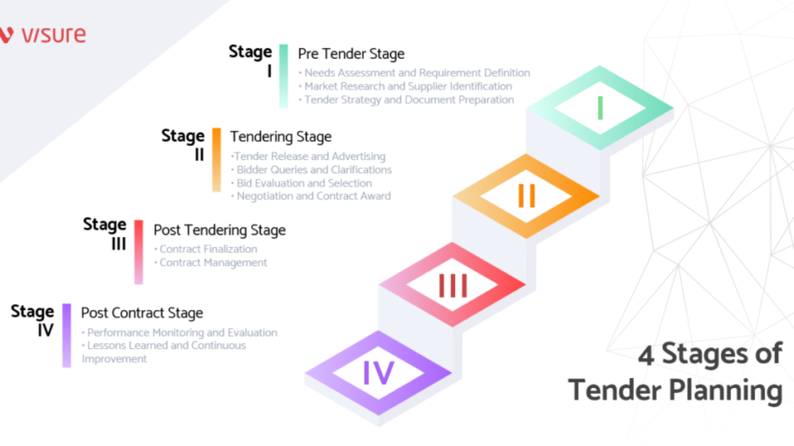

## Table of Contents

## What is a short tender?

A short tender is a type of offer made by a company to buy back its own shares from shareholders. It's called "short" because the offer period is usually shorter than a regular tender offer. Companies do this to quickly reduce the number of shares they have, which can help increase the value of the remaining shares.

Sometimes, a company might use a short tender to stop other companies from taking over them. By buying back shares, they make it harder for another company to get enough shares to control the company. This can be a smart move to keep the company independent and protect the interests of current shareholders.

## How does a short tender differ from a regular tender?

A short tender and a regular tender are ways for a company to buy back its own shares, but they have some key differences. The main difference is the time they last. A short tender lasts for a shorter time, usually just a few days, while a regular tender can last for weeks or even months. This short time frame is why it's called a "short" tender.

Another difference is why companies use them. Companies might use a short tender to quickly buy back shares and stop another company from taking over. It's like a quick move to protect themselves. On the other hand, a regular tender might be used for more general reasons, like wanting to reduce the number of shares to make each share more valuable, or to return money to shareholders. So, while both types of tenders help a company buy back its shares, they differ in how long they take and why they are used.

## What are the main purposes of using a short tender?

One main purpose of using a short tender is to quickly buy back shares from shareholders. This is important when a company wants to act fast. The short time frame of a short tender, usually just a few days, helps the company make quick decisions. By buying back shares quickly, the company can reduce the total number of shares out there. This can make each remaining share more valuable because there are fewer shares to go around.

Another big reason for using a short tender is to stop other companies from taking over. If another company is trying to buy a lot of shares to gain control, a short tender can help stop them. By quickly buying back shares, the company makes it harder for the other company to get enough shares to take over. This helps keep the company independent and protects the interests of the current shareholders.

## Who can participate in a short tender?

Anyone who owns shares in the company can take part in a short tender. This means if you have shares, you can choose to sell them back to the company during the short tender period. It's open to all shareholders, whether they are big investors or small ones.

The company will usually tell everyone about the short tender through a public announcement. They will explain how to take part and what you need to do to sell your shares back. It's important for shareholders to pay attention to these announcements so they don't miss the chance to participate if they want to.

## What are the typical steps involved in a short tender process?

When a company decides to do a short tender, they first make a public announcement. This announcement tells everyone that the company wants to buy back its shares and explains how shareholders can take part. The company will say how many shares they want to buy, what price they will pay, and how long the short tender will last. This is usually just a few days, so it's important for shareholders to act quickly if they want to sell their shares back.

Once the announcement is made, shareholders who want to participate need to send their shares to the company or a special place the company tells them to use. They need to do this before the short tender period ends. If everything is done right and on time, the company will buy the shares back at the price they said in the announcement. After the short tender is over, the company will tell everyone how many shares they bought back and what happens next.

## What are the key documents required for a short tender?

When a company does a short tender, they need to prepare a few important documents. The main document is the tender offer statement. This statement tells shareholders all about the short tender, like how many shares the company wants to buy back, the price they will pay, and how long the short tender will last. It's like a guide that helps shareholders understand what's happening and what they need to do if they want to sell their shares back to the company.

Another important document is the letter of transmittal. This is what shareholders use to send their shares to the company or the place the company tells them to use. The letter of transmittal has instructions on how to fill it out and what information to include, like how many shares the shareholder wants to sell and their contact details. It's really important for shareholders to follow these instructions carefully so their shares can be accepted during the short tender.

Sometimes, the company might also need to prepare other documents, like a press release to announce the short tender to the public. This press release helps spread the word about the short tender and makes sure that all shareholders know about it. All these documents work together to make sure the short tender goes smoothly and that shareholders have all the information they need to decide if they want to take part.

## How is the evaluation process conducted in a short tender?

In a short tender, the evaluation process starts when shareholders send their shares to the company or a place the company tells them to use. This is done using a letter of transmittal, which has all the details about the shares the shareholder wants to sell. The company checks these letters to make sure they are filled out correctly and that the shares are sent on time. If everything is right, the company will accept the shares and buy them back at the price they said in the tender offer statement.

After the short tender period ends, the company counts all the shares they got back from shareholders. They then compare this number to the number of shares they wanted to buy back. If more shares are sent than the company wanted, they might have to decide how to handle the extra shares. This could mean buying all the shares at a lower price or buying back shares from some shareholders but not others, usually in a fair way, like by [picking](/wiki/asset-class-picking) names at random or using a set rule. Once the company figures this out, they tell everyone how many shares they bought and what happens next.

## What are the common challenges faced during a short tender?

One common challenge during a short tender is the short time frame. Because a short tender only lasts a few days, shareholders need to act quickly to send their shares back to the company. If they miss the deadline, they won't be able to take part. This can be hard for people who are busy or who don't check their mail often. It's important for the company to make sure everyone knows about the short tender as soon as possible so no one misses out.

Another challenge is handling more shares than the company wanted to buy. Sometimes, more shareholders want to sell their shares than the company planned to buy back. This means the company has to decide what to do with the extra shares. They might have to buy all the shares at a lower price or pick some shareholders to buy from but not others. This can be tricky and needs to be done in a fair way so everyone feels treated the same. 

Lastly, making sure all the paperwork is correct can be a big challenge. Shareholders need to fill out the letter of transmittal correctly and send it on time. If there are mistakes or if the letter is late, the company might not be able to accept the shares. This can cause frustration for shareholders who want to take part but can't because of small errors. The company needs to give clear instructions and be ready to help shareholders if they have questions or problems.

## How do legal and regulatory frameworks affect short tenders?

Legal and regulatory frameworks play a big role in how short tenders work. They set rules that companies have to follow when they want to buy back their shares. For example, there are rules about how long the short tender can last, what information the company has to share with shareholders, and how they have to treat everyone fairly. These rules are there to protect shareholders and make sure the short tender is done the right way. If a company doesn't follow these rules, they could get in trouble with the law, which could lead to fines or other problems.

These frameworks also affect how shareholders can take part in a short tender. There are rules about how shareholders need to send their shares back to the company and what paperwork they need to fill out. These rules help make sure that everyone has a fair chance to sell their shares if they want to. Sometimes, different countries have different rules, so if a company has shareholders all over the world, they have to be careful to follow all the right laws. This can make the short tender process more complicated, but it's important to keep everything fair and legal.

## What strategies can be used to optimize the outcomes of a short tender?

To optimize the outcomes of a short tender, a company should focus on clear and timely communication with its shareholders. This means making a public announcement as soon as the short tender starts and giving all the important details about how many shares they want to buy back, the price, and how long the tender will last. By keeping everyone informed, the company can make sure that shareholders know about the short tender and have enough time to decide if they want to sell their shares. This can help more shareholders take part, which is good for the company because it can buy back more shares quickly.

Another strategy is to make the process as easy as possible for shareholders. This means giving clear instructions on how to fill out the letter of transmittal and where to send the shares. The company can also set up a help line or website where shareholders can ask questions and get help if they need it. By making the process simple and helping shareholders avoid mistakes, the company can increase the number of shares they get back. This can lead to a better outcome for the short tender, helping the company meet its goals of buying back shares quickly and fairly.

## How do short tenders impact the overall procurement strategy of an organization?

Short tenders can affect a company's overall procurement strategy because they change how the company buys things. When a company does a short tender, it uses money to buy back its own shares instead of spending it on other things like new machines or supplies. This can mean the company has less money to spend on buying what it needs to keep running smoothly. So, the company might need to be more careful with its money and find other ways to get the things it needs, like looking for cheaper options or waiting to buy until later.

Also, doing a short tender can change how the company plans for the future. If the company uses a lot of money to buy back shares, it might not have as much money left to invest in new projects or expand the business. This can make the company's procurement strategy more focused on saving money and being efficient. The company might need to think more about how it can get the most out of what it already has, instead of buying new things. So, a short tender can make the company's procurement strategy more about being smart with money and planning carefully for the future.

## What are the advanced techniques for managing and analyzing short tender data?

To manage and analyze short tender data, companies can use advanced computer programs that help them keep track of all the information. These programs can collect data from shareholders, like how many shares they want to sell and at what price. The programs can also help the company see patterns in the data, like if a lot of shareholders are selling their shares at the same time. This can help the company make smart decisions about how to handle the short tender. For example, if the company sees that they are getting more shares than they planned to buy, they can use the program to figure out the best way to buy all the shares fairly, like by picking names at random or using a set rule.

Another advanced technique is using special math formulas to predict what might happen during the short tender. These formulas can look at past data and guess how many shareholders might want to sell their shares and how much money the company might need. This can help the company plan better and make sure they have enough money to buy back the shares they want. The company can also use these formulas to check if their short tender is working well and if they need to change anything to get better results. By using these advanced techniques, the company can manage and analyze the short tender data more easily and make smarter choices.

## References & Further Reading

[1]: Bergstra, J., Bardenet, R., Bengio, Y., & Kégl, B. (2011). ["Algorithms for Hyper-Parameter Optimization."](https://dl.acm.org/doi/10.5555/2986459.2986743) Advances in Neural Information Processing Systems 24.

[2]: ["Advances in Financial Machine Learning"](https://www.amazon.com/Advances-Financial-Machine-Learning-Marcos/dp/1119482089) by Marcos Lopez de Prado

[3]: ["Evidence-Based Technical Analysis: Applying the Scientific Method and Statistical Inference to Trading Signals"](https://www.amazon.com/Evidence-Based-Technical-Analysis-Scientific-Statistical/dp/0470008741) by David Aronson

[4]: ["Machine Learning for Algorithmic Trading"](https://github.com/stefan-jansen/machine-learning-for-trading) by Stefan Jansen

[5]: ["Quantitative Trading: How to Build Your Own Algorithmic Trading Business"](https://www.amazon.com/Quantitative-Trading-Build-Algorithmic-Business/dp/1119800064) by Ernest P. Chan