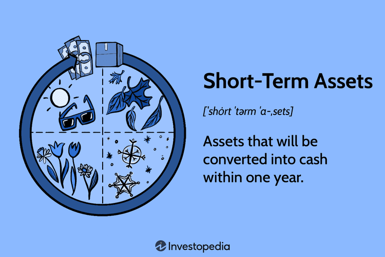

In the modern financial landscape, understanding the interplay between different types of financial assets, particularly short-term assets, is crucial for achieving effective asset management. Financial assets such as stocks, bonds, and commodities form the foundation of investment portfolios, while short-term assets, commonly referred to as current assets, include cash, marketable securities, and receivables that are expected to be converted into cash within a year. These short-term assets are vital for liquidity management, providing the necessary flexibility to meet immediate financial obligations and facilitating operational efficiency.

Asset management, coupled with the advancement of algorithmic trading, significantly influences how investors approach and manage these assets to optimize returns. Algorithmic trading, also known as algo trading, employs sophisticated computer algorithms to automate trading decisions based on predetermined criteria, thereby enhancing speed and precision in trade execution. Such technological innovations not only minimize human error but also allow for complex trading strategies, including arbitrage and trend-following, to be implemented with greater efficacy.



This article explores the connections between financial assets, short-term asset management, and algo trading, emphasizing the transformative role of technology in reshaping financial strategies. As investors seek to maximize value and manage risks, the integration of these elements provides a comprehensive framework for making informed decisions and optimizing portfolio performance. The continuous development of technology, coupled with strategic asset management practices, offers investors robust tools to navigate the complexities of the financial environment effectively.

## Table of Contents

## Understanding Financial and Short-Term Assets

Financial assets, including stocks, bonds, and commodities, are integral to investment portfolios due to their potential for capital appreciation, income generation, and diversification. These assets represent a claim on future cash flows, either in the form of dividends, interest, or the sale of the asset itself.

Short-term assets, also known as current assets, play an essential role in a company's financial structure by providing liquidity and operational flexibility. These assets include cash, marketable securities, accounts receivable, and inventories, all of which are expected to be converted into cash or consumed within a business's operating cycle, typically one year. The liquidity of short-term assets ensures that a company can meet its short-term obligations and continue operations without financial disruption.

Short-term assets are crucial in liquidity management, which is the ability of a company to meet its financial obligations as they come due without exploiting long-term funding sources. Effective liquidity management ensures that a company can satisfy both its near-term liabilities and unforeseen expenses, maintaining operational stability.

These assets are also vital in assessing a company's financial health through financial ratios. Some key ratios include the current ratio $(\text{Current Ratio} = \frac{\text{Current Assets}}{\text{Current Liabilities}})$ and the quick ratio $(\text{Quick Ratio} = \frac{\text{Current Assets} - \text{Inventories}}{\text{Current Liabilities}})$. These ratios evaluate a firm's ability to cover its short-term liabilities with its most liquid assets, offering insights into financial resilience and efficiency.

Overall, understanding the diverse roles of financial and short-term assets enables investors and companies to optimize their portfolios and operational strategies effectively. By managing these assets prudently, stakeholders can enhance [liquidity](/wiki/liquidity-risk-premium), foster growth, and ensure financial stability in fluctuating market environments.

## The Role of Asset Management in Financial Strategies

Asset management is fundamentally about strategically maximizing value through the optimal selection and oversight of investments within a portfolio. This process involves balancing multiple types of assets—including both long-term financial commodities such as stocks and bonds, and short-term assets like cash and marketable securities—to achieve a seamless blend that aligns with an investor's risk tolerance and financial goals.

Effective management of both financial and business assets is crucial for sustaining growth and ensuring liquidity. In financial strategies, maintaining growth is not just about expanding the asset base but optimizing returns while managing risks. This requires a comprehensive understanding of market trends, interest rates, and economic indicators that could impact asset performance. Liquidity management is similarly vital, especially for short-term assets. A successful strategy ensures that an organization can meet its financial obligations without having to liquidate long-term assets under unfavorable conditions.

Investment firms prioritize strategic asset allocation to manage risk and ensure optimal returns. This approach involves distributing investments across various asset classes to minimize risks related to specific markets or economic sectors. A diversified asset portfolio might include combinations of stocks, bonds, real estate, commodities, and cash among others. Each asset class reacts differently to economic changes, and by holding a diverse mix, firms can enhance returns for a given level of risk.

Furthermore, the integration of financial and short-term assets is emphasized in strategic asset allocation. Short-term assets, while providing liquidity and safety, often yield lower returns compared to long-term investments. Therefore, the challenge lies in gauging the right mix that not only caters to immediate liquidity needs but also contributes towards long-term growth. Mathematical models and algorithms are often employed to optimize this balance, considering correlations among asset classes, as well as expected returns and [volatility](/wiki/volatility-trading-strategies).

Overall, astute asset management surfaces through a synthesized understanding of financial trends, risk mitigation strategies, and the dynamic nature of asset classes. It involves scenario analysis, financial modeling, and continuous reassessment to align asset portfolio management with financial strategies that are adaptable to both current conditions and future expectations.

## Algo Trading: A Technological Revolution

Algorithmic trading, often referred to as algo trading, employs computer algorithms to automate trading decisions, streamlining processes based on pre-established criteria. This innovative technology revolutionizes the trading landscape by executing orders with remarkable speed and precision, significantly reducing the likelihood of human error. Additionally, algo trading enhances liquidity within markets by facilitating rapid and efficient transactions.

One of the primary advantages of [algorithmic trading](/wiki/algorithmic-trading) is its capability to execute complex strategies with ease. For instance, [arbitrage](/wiki/arbitrage)—which involves exploiting price discrepancies across different markets or instruments—can be seamlessly executed using algorithms. This strategy typically requires swift action to capitalize on fleeting opportunities, which is where the high-speed execution inherent to algo trading becomes particularly valuable.

Moreover, trend-following strategies benefit extensively from algorithmic trading. Such strategies rely on identifying and acting upon market trends, requiring the continuous analysis of market data. Algorithms can be designed to monitor these trends and execute trades automatically, responding to changes more rapidly than a human trader might. This capability ensures that traders can optimize their asset management processes and enhance portfolio performance.

Beyond these strategies, algorithmic trading introduces several other benefits. It allows for the consistent application of trading strategies, free from emotional bias. This consistency leads to more reliable trading outcomes and can contribute to overall market stability by providing liquidity even during periods of volatility.

In summary, algorithmic trading stands as a technological revolution that empowers traders with tools to execute sophisticated strategies effectively. By leveraging the speed and precision of algorithmic systems, traders can navigate complex market environments, ultimately optimizing their asset management approaches.

## Leveraging Algorithmic Trading for Asset Management

Algorithmic trading has become an essential component in asset management, enabling investors to navigate complex markets with precision and adaptability. By integrating algorithmic trading techniques, asset managers can dynamically adjust investment strategies in response to real-time market fluctuations, improving overall portfolio performance.

One of the primary benefits of algorithmic trading within asset management is the capability to harness sophisticated data analysis. Modern algorithms can process vast amounts of financial data, identifying patterns and opportunities that might be impossible to discern manually. For instance, [machine learning](/wiki/machine-learning) algorithms can analyze historical price data, news sentiment, and macroeconomic indicators to predict future price movements, thereby facilitating informed decision-making.

Traders also benefit from [backtesting](/wiki/backtesting) and optimization techniques to refine their strategies. Backtesting involves running algorithms on historical data to evaluate how a strategy would have performed in the past. This practice is crucial for validating the effectiveness of a trading strategy before applying it in live markets. Optimization helps in fine-tuning algorithm parameters to achieve the best possible risk-adjusted returns, considering various constraints and risk factors.

In practical terms, algorithmic trading enables asset managers to execute trades with [high frequency](/wiki/high-frequency-trading) and precision, capturing short-lived trading opportunities that arise from momentary inefficiencies in the market. This approach not only enhances liquidity but also reduces transaction costs by minimizing the bid-ask spread and slippage.

Python, a popular programming language in finance, is widely used for developing and testing trading algorithms due to its rich ecosystem of libraries such as pandas for data manipulation, NumPy for numerical computations, and scikit-learn for machine learning.

A simple example of a trading strategy utilizing Python might involve the implementation of a moving average crossover strategy, which signals buy and sell opportunities based on the intersection of short-term and long-term moving averages. Below is a basic illustration of this concept:

```python
import pandas as pd
import numpy as np
import matplotlib.pyplot as plt

# Load data
data = pd.read_csv('historical_stock_data.csv', parse_dates=True, index_col='Date')

# Calculate moving averages
short_window = 40
long_window = 100
data['Short_MA'] = data['Close'].rolling(window=short_window, min_periods=1).mean()
data['Long_MA'] = data['Close'].rolling(window=long_window, min_periods=1).mean()

# Generate trading signals
data['Signal'] = 0
data['Signal'][short_window:] = np.where(data['Short_MA'][short_window:] > data['Long_MA'][short_window:], 1, 0)
data['Position'] = data['Signal'].diff()

# Plot the results
plt.figure(figsize=(10, 5))
plt.plot(data['Close'], label='Price')
plt.plot(data['Short_MA'], label='40-Day MA')
plt.plot(data['Long_MA'], label='100-Day MA')
plt.plot(data[data['Position'] == 1].index, data['Short_MA'][data['Position'] == 1], '^', markersize=10, color='g', lw=0, label='Buy Signal')
plt.plot(data[data['Position'] == -1].index, data['Short_MA'][data['Position'] == -1], 'v', markersize=10, color='r', lw=0, label='Sell Signal')
plt.title('Moving Average Crossover Strategy')
plt.xlabel('Date')
plt.ylabel('Price')
plt.legend(loc='best')
plt.show()
```

By leveraging algorithmic trading, asset managers can achieve better risk management, execute trades swiftly, and optimize returns by responding adeptly to market signals. As technology continues to advance, the integration of algorithmic trading in asset management is expected to grow, further altering the financial landscape.

## Challenges and Considerations in Algorithmic Trading

Algorithmic trading provides numerous benefits, yet it also presents significant challenges that must be addressed to ensure its effectiveness and sustainability. One of the primary concerns associated with algorithmic trading is data dependency. Algorithms rely heavily on accurate and timely data to make informed trading decisions. Any delay, inaccuracy, or incompleteness in the data can lead to suboptimal trades and financial losses. Companies must invest in high-quality data feeds and ensure the robustness of data collection systems to mitigate this risk.

Another critical challenge is the risk of overfitting, where a trading algorithm is excessively tailored to historical data, thus failing to perform well in live market conditions. Overfitting can result in strategies that seem highly profitable during backtesting but are ineffective in real-time trading due to their lack of adaptability to changing market conditions. To counter this, traders and developers can utilize techniques such as cross-validation, where the data is divided into training and validation sets, to test the algorithm's robustness. Additionally, implementing regular performance evaluations and revising strategies in response to market shifts is essential for maintaining effective algorithms.

Regulatory compliance is an ever-present consideration in algorithmic trading. Financial markets are governed by complex and evolving regulations that aim to ensure fair trading practices and market stability. Traders and firms must stay informed about these regulations to avoid penalties and maintain ethical practices. Regulatory bodies may impose restrictions on certain trading strategies or require detailed reporting and auditing of trades, necessitating a thorough understanding and implementation of compliance measures.

Apart from regulatory concerns, maintaining robust and adaptable algorithms is crucial for managing market impact and minimizing risks. Market impact refers to the effect that a trade has on the market price of an asset. Large trades or poorly timed trades can significantly affect prices, leading to less favorable trading outcomes. Algorithm developers can use techniques such as order slicing, where a large order is divided into smaller parts, to minimize market impact. Continuous monitoring and adjustment of algorithms ensure they remain adaptable to varying market conditions.

Traders must be proactive about compliance with evolving market regulations. This requires a multidisciplinary approach involving legal, financial, and technological expertise to develop strategies that are both profitable and compliant. Regular training and updates for staff on new regulations and leveraging automated compliance-checking tools can help maintain adherence to legal standards.

In conclusion, while algorithmic trading offers significant advantages in terms of efficiency and profitability, the challenges it presents require careful consideration and strategic management. By prioritizing data quality, preventing overfitting, focusing on regulatory compliance, and ensuring algorithms are robust and adaptable, traders can navigate the complexities of algorithmic trading more effectively.

## Conclusion

The integration of financial assets, short-term asset management, and algorithmic trading is fundamentally altering asset management practices. Investors who leverage these modern tools are positioned to make well-informed decisions. With access to advanced data analytics and automation, they can optimize portfolio performance by swiftly adapting to dynamic market conditions. This optimization is facilitated through techniques such as real-time data processing and algorithm-driven strategy adjustments, ensuring that portfolios are aligned with both immediate market shifts and long-term objectives.

The ability to harness technological resources provides significant strategic advantages. Tools such as Python, with libraries like NumPy and pandas, allow for sophisticated data analysis and modeling. For instance, investors can employ Python scripts to simulate various market scenarios, backtest trading strategies, and continuously refine algorithms to enhance performance. Here is a basic example of a Python function for backtesting a simple moving average crossover strategy:

```python
import pandas as pd

def moving_average_crossover(data, short_window, long_window):
    data['Short_MA'] = data['Close'].rolling(window=short_window).mean()
    data['Long_MA'] = data['Close'].rolling(window=long_window).mean()

    data['Signal'] = 0
    data['Signal'][short_window:] = np.where(data['Short_MA'][short_window:] > data['Long_MA'][short_window:], 1, 0)
    data['Position'] = data['Signal'].diff()

    return data

# Example usage:
# df is a DataFrame with a 'Close' column for closing prices
# backtested_data = moving_average_crossover(df, short_window=40, long_window=100)
```

Continued learning and adaptation are crucial in keeping pace with new technologies and evolving market trends. As the financial landscape becomes increasingly complex, investors must remain agile, regularly updating their knowledge base and skill set to effectively navigate this environment. This ongoing education is vital for understanding emerging tools, refining automated strategies, and ensuring compliance with the latest regulatory standards. By maintaining a commitment to learning and adaptability, investors can sustain a competitive edge, maximizing their potential to harness the opportunities presented by financial innovation.

## References & Further Reading

[1]: Bergstra, J., Bardenet, R., Bengio, Y., & Kégl, B. (2011). ["Algorithms for Hyper-Parameter Optimization."](https://dl.acm.org/doi/10.5555/2986459.2986743) Advances in Neural Information Processing Systems 24.

[2]: ["Advances in Financial Machine Learning"](https://www.amazon.com/Advances-Financial-Machine-Learning-Marcos/dp/1119482089) by Marcos Lopez de Prado

[3]: ["Evidence-Based Technical Analysis: Applying the Scientific Method and Statistical Inference to Trading Signals"](https://www.amazon.com/Evidence-Based-Technical-Analysis-Scientific-Statistical/dp/0470008741) by David Aronson

[4]: ["Machine Learning for Algorithmic Trading"](https://github.com/stefan-jansen/machine-learning-for-trading) by Stefan Jansen

[5]: ["Quantitative Trading: How to Build Your Own Algorithmic Trading Business"](https://www.amazon.com/Quantitative-Trading-Build-Algorithmic-Business/dp/1119800064) by Ernest P. Chan