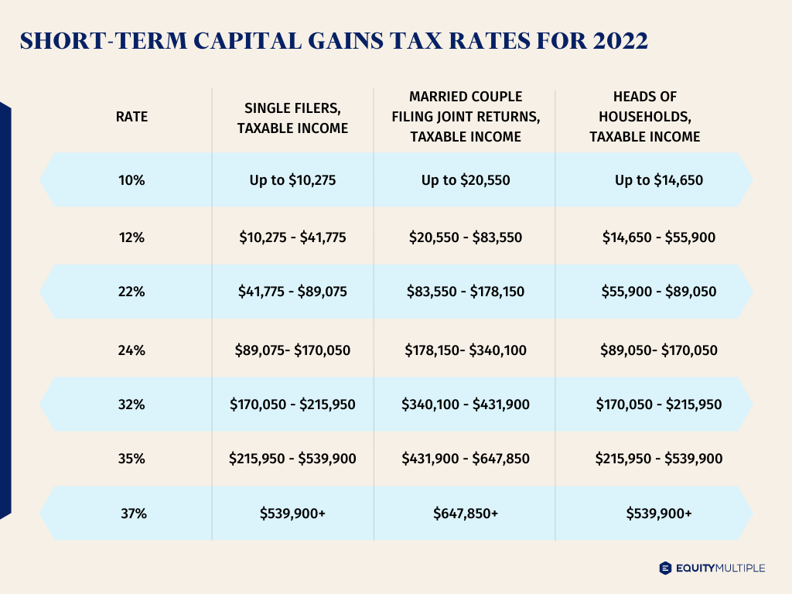

## Table of Contents

## What are short-term capital gains?

Short-term capital gains are the profits you make from selling an asset that you've held for one year or less. These assets can be things like stocks, bonds, or property. When you sell these assets for more than what you paid for them, the profit you make is called a short-term capital gain. The key thing to remember is that these gains are considered short-term because you didn't hold onto the asset for a long time before selling it.

The tax on short-term capital gains is important to know about. Unlike long-term capital gains, which are taxed at a lower rate, short-term gains are taxed as regular income. This means they are added to your other income for the year, and then taxed according to your income tax bracket. So, if you're in a higher tax bracket, your short-term capital gains will be taxed at a higher rate. It's good to keep this in mind when you're thinking about buying and selling assets quickly.

## How do short-term capital gains differ from long-term capital gains?

Short-term capital gains and long-term capital gains are different based on how long you own an asset before selling it. If you sell an asset you've held for one year or less, the profit you make is a short-term capital gain. But if you sell an asset you've held for more than one year, the profit is a long-term capital gain. So, the main difference is the time you keep the asset before selling it.

The way these gains are taxed also differs. Short-term capital gains are taxed as regular income, which means they get added to your other income for the year and are taxed according to your income tax bracket. This can be a higher rate if you're in a higher tax bracket. On the other hand, long-term capital gains are taxed at a lower rate. The tax rate for long-term gains depends on your income but is usually lower than the rate for short-term gains. This difference in tax rates can affect your decisions about when to buy and sell assets.

## What types of assets typically result in short-term capital gains?

Short-term capital gains usually come from selling things like stocks, bonds, or even property that you've owned for one year or less. If you buy a stock and then sell it a few months later for more money than you paid, the profit you make is a short-term capital gain. The same goes for bonds or a piece of land you might have bought and sold quickly.

These gains can also come from other types of investments, like mutual funds or exchange-traded funds (ETFs), as long as you sell them within a year of buying them. It's not just about big things like real estate; even smaller investments can lead to short-term capital gains if you don't hold onto them for long. The key is how quickly you buy and sell the asset.

## How do you calculate short-term capital gains?

To calculate short-term capital gains, you need to know how much you paid for the asset and how much you sold it for. The short-term capital gain is the difference between the selling price and the purchase price. For example, if you bought a stock for $100 and sold it for $150 within a year, your short-term capital gain would be $50.

You also need to consider any costs related to buying or selling the asset. These costs, like broker fees or commissions, can be subtracted from your gain. So, if you paid $5 in fees when you bought the stock and $5 when you sold it, you would subtract $10 from your $50 gain, leaving you with a short-term capital gain of $40. This final number is what you would report on your taxes as a short-term capital gain.

## What is the tax rate for short-term capital gains?

The tax rate for short-term capital gains is the same as your regular income tax rate. This means that when you sell an asset you've owned for a year or less and make a profit, that profit gets added to your other income for the year. Then, the total amount of your income, including the short-term capital gain, is taxed according to the tax bracket you fall into.

If you're in a higher tax bracket, your short-term capital gains will be taxed at a higher rate. For example, if your income puts you in the 24% tax bracket, your short-term capital gains will also be taxed at 24%. This is different from long-term capital gains, which have lower tax rates. So, it's important to know your income tax bracket when you're thinking about buying and selling assets quickly.

## How does one's income tax bracket affect the tax rate on short-term capital gains?

Your income tax bracket decides how much tax you pay on short-term capital gains. Short-term capital gains are profits from selling things like stocks or property that you've owned for less than a year. When you sell these items and make money, that profit gets added to your other income for the year. Then, you pay taxes on all your income, including the short-term capital gains, based on the tax bracket you're in.

If you're in a higher tax bracket, you'll pay more tax on your short-term capital gains. For example, if your total income puts you in the 24% tax bracket, your short-term capital gains will also be taxed at 24%. This is different from long-term capital gains, which have lower tax rates. Knowing your tax bracket can help you understand how much tax you'll have to pay on the money you make from selling things quickly.

## Are there any deductions or exemptions available for short-term capital gains?

There are a few ways to lower the amount of tax you have to pay on short-term capital gains. One way is by using capital losses to offset your gains. If you sell something at a loss, you can subtract that loss from your short-term capital gains. This can reduce the amount of profit you have to pay tax on. For example, if you made a $1,000 profit from selling a stock but also lost $500 on another investment, you can subtract the $500 loss from your $1,000 gain, leaving you with a taxable gain of $500.

Another way to reduce your tax on short-term capital gains is through certain deductions. You can deduct costs related to buying and selling the asset, like broker fees or commissions. These costs can be subtracted from your gain before you calculate the tax. Also, if you have other types of income, like business expenses or charitable contributions, these might help lower your overall taxable income, which in turn could affect the tax rate on your short-term capital gains. However, there are no specific exemptions just for short-term capital gains like there are for long-term gains, so it's important to use these strategies to minimize your tax bill.

## How can short-term capital losses offset short-term capital gains?

Short-term capital losses can help lower the amount of tax you have to pay on short-term capital gains. When you sell something you've owned for a year or less and lose money, that's a short-term capital loss. You can use this loss to reduce your short-term capital gains. For example, if you made a $1,000 profit from selling one stock but lost $500 on another, you can subtract the $500 loss from your $1,000 gain. This leaves you with a taxable gain of $500, which means you'll pay less tax.

If your short-term capital losses are more than your short-term capital gains, you can use the extra loss to reduce other types of income, like your salary. You can deduct up to $3,000 of this extra loss from your income each year. If you still have losses left after that, you can [carry](/wiki/carry-trading) them over to future years to keep reducing your taxes. This way, even if you lose money on some investments, you can still save on taxes.

## What are the reporting requirements for short-term capital gains on tax returns?

When you make money from selling things you've owned for less than a year, like stocks or property, you need to report those profits on your tax return. These profits are called short-term capital gains. You'll need to fill out a form called Schedule D, which is part of your Form 1040. On Schedule D, you list all the things you sold, how much you paid for them, and how much you sold them for. This helps you figure out your total short-term capital gains for the year.

If you have any short-term capital losses, you can also report them on Schedule D. You can use these losses to reduce your short-term capital gains. If your losses are more than your gains, you can use up to $3,000 of the extra loss to lower your other income, like your salary. Any leftover losses can be carried over to future years to keep saving on taxes. It's important to keep good records of all your buying and selling so you can report everything correctly on your tax return.

## How can investment strategies be adjusted to minimize short-term capital gains tax?

One way to lower the tax on short-term capital gains is by holding onto your investments for more than a year. If you do this, any profit you make becomes a long-term capital gain, which is taxed at a lower rate. So, instead of buying and selling quickly, you might want to think about keeping your investments for a longer time. This can help you save money on taxes and might also let your investments grow more over time.

Another strategy is to use tax-loss harvesting. This means selling investments that have lost value to offset the gains from other investments. If you have short-term capital gains, you can use short-term capital losses to reduce them. If your losses are more than your gains, you can use up to $3,000 of the extra loss to lower your other income, like your salary. This can help you pay less tax overall. It's a good idea to talk to a tax advisor to make sure you're doing this right and following all the rules.

## What are the potential impacts of recent tax law changes on short-term capital gains?

Recent changes in tax laws can affect how much tax you pay on short-term capital gains. These changes might adjust the tax brackets or the rates within those brackets. For example, if the tax brackets change, you might find yourself in a different bracket than before, which could mean paying more or less tax on your short-term capital gains. It's important to keep an eye on these changes because they can impact how much money you keep after selling your investments.

Another way recent tax law changes might affect short-term capital gains is through new rules or deductions. For instance, if there are new rules about how you can use capital losses to offset gains, this could change your tax strategy. Also, any new deductions or credits could help lower your overall taxable income, which in turn could affect the tax rate on your short-term capital gains. Staying informed about these changes can help you plan your investments better and possibly save on taxes.

## How do international investors handle short-term capital gains in the U.S.?

International investors who earn short-term capital gains in the U.S. need to understand how these gains are taxed. Just like U.S. citizens, international investors have to report their short-term capital gains on their U.S. tax returns if they are subject to U.S. taxation. Short-term capital gains are profits from selling assets like stocks or property that were held for one year or less. These gains are added to the investor's income and taxed at the same rate as their regular income, based on the U.S. tax brackets. However, international investors might also need to consider tax treaties between their home country and the U.S., which could affect how much tax they pay.

Navigating the tax rules can be tricky for international investors. They might need to file a U.S. tax return, usually Form 1040NR for non-resident aliens, to report their short-term capital gains. This form helps them calculate the tax they owe on these gains. Additionally, they might be able to use any short-term capital losses to offset their gains, just like U.S. citizens. It's important for international investors to keep good records of their investments and any tax treaties that might apply to them. Consulting with a tax professional who knows about international tax laws can help them handle their short-term capital gains correctly and possibly save on taxes.

## What are some strategies for managing short-term capital gains tax?

Strategies for managing short-term capital gains tax are crucial for investors looking to optimize their returns and minimize tax liabilities. Various techniques can be employed to achieve tax efficiency, with tax-loss harvesting and strategic portfolio structuring being among the most effective.

### Tax-Loss Harvesting

Tax-loss harvesting is a strategy where investors sell securities at a loss to offset capital gains realized from the sale of other assets. This approach can substantially reduce the amount of tax owed on short-term capital gains. For instance, if an investor has short-term capital gains of $10,000 and realizes a loss of $3,000 from other investments during the same tax year, the taxable gain would effectively be reduced to $7,000.

The formula for calculating the adjusted capital gains using tax-loss harvesting is:

$$
\text{Adjusted Capital Gains} = \text{Total Capital Gains} - \text{Capital Losses}
$$

### Structuring an Investment Portfolio

Strategically structuring an investment portfolio can also help mitigate the impact of short-term capital gains tax. This involves balancing short-term and long-term investments to make the most of the preferential tax rates on long-term gains. Strategies include:

1. **Invest in Tax-Efficient Funds:** Consider funds that have low turnover rates, which generate fewer short-term capital gains.

2. **Utilize Tax-Deferred Accounts:** Placing assets that might generate short-term gains into tax-advantaged accounts such as Individual Retirement Accounts (IRAs) or 401(k)s can defer taxes until withdrawal.

3. **Rebalancing at the Right Time:** Scheduling portfolio rebalancing to align with favorable tax treatment periods can minimize unnecessary short-term gains.

### Holding Period Advantages

The holding period of an investment significantly affects tax liability. Assets held for more than a year are typically subject to lower long-term capital gains tax rates compared to short-term rates. By extending the holding period of investments beyond one year, investors can take advantage of these lower rates, thus reducing their overall tax burden.

Python code to calculate potential tax savings by extending holding periods might look like this:

```python
def calculate_tax_savings(short_term_rate, long_term_rate, gain):
    # Calculate tax for short-term
    short_term_tax = gain * short_term_rate

    # Calculate tax for long-term
    long_term_tax = gain * long_term_rate

    # Calculate savings
    savings = short_term_tax - long_term_tax
    return savings

# Example: Suppose short-term rate is 35%, long-term rate is 15%, and gain is $10,000
short_term_rate = 0.35
long_term_rate = 0.15
gain = 10000

savings = calculate_tax_savings(short_term_rate, long_term_rate, gain)
print(f"Tax savings by holding the asset for the long-term: ${savings}")
```

Ultimately, understanding and implementing these strategies require continual learning and adaptation to ever-changing tax laws and regulations. Investors should consider consulting with tax professionals to tailor these strategies to individual financial circumstances, ensuring the alignment of investment goals with tax efficiency.

## References & Further Reading

[1]: ["IRS Publication 550: Investment Income and Expenses"](https://www.irs.gov/publications/p550) - A guide provided by the Internal Revenue Service outlining various types of investment income and expenses, relevant for understanding capital gains taxation in the United States.

[2]: ["Taxation of Investment Income"](https://www.nerdwallet.com/article/taxes/investment-taxes-basics-investors) by KPMG - An overview for the UK, including capital gains tax rates and tax efficiency strategies.

[3]: Ackerer, D., Filipović, D., & Pulido, S. (2021). ["Arbitrage-Free Smoothing of the Implied Volatility Surface."](https://dl.acm.org/doi/10.5555/3495724.3496693) Journal of Banking & Finance, 125. 

[4]: ["The Intelligent Investor"](https://www.amazon.com/Intelligent-Investor-Definitive-Investing-Essentials/dp/0060555661) by Benjamin Graham - Classic literature on value investing, encouraging long-term strategies which can optimize tax outcomes.

[5]: Poterba, J. M., & Samwick, A. A. (2003). ["Taxation and Household Portfolio Composition: US Evidence from the 1980s and 1990s."](https://economics.mit.edu/sites/default/files/publications/1-s2.0-S0047272701001682-main.pdf) Journal of Public Economics, 87(1). 

[6]: Aldridge, I. (2013). ["High-Frequency Trading: A Practical Guide to Algorithmic Strategies and Trading Systems"](https://www.ahmetbeyefendi.com/wp-content/uploads/2020/07/High-Frequency-Trading-Irene-Aldridge.pdf) - Insights on algorithmic strategies, including their tax implications.