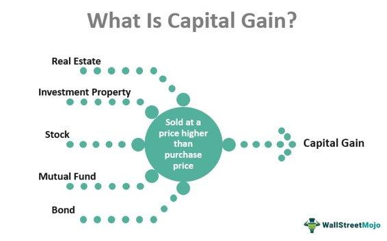

Capital gains tax is an integral part of the investment landscape, influencing decision-making and strategic planning for both individual investors and institutional participants. Capital gains are the profits realized from the sale of assets such as stocks, bonds, or real estate when the selling price exceeds the purchase price. These gains are categorized into two types: short-term and long-term, based on the holding period of the asset sold.

Short-term capital gains arise when assets are sold within a year of purchase. Conversely, long-term capital gains occur when assets are sold after being held for more than a year. This distinction is crucial as it directly influences the tax rates applicable to the gains, with short-term gains typically being taxed at higher rates than long-term gains. This difference in taxation is designed to encourage long-term investment over speculative, short-term trading.



In recent years, algorithmic trading has emerged as a prominent strategy in the investment community. Also known as algo trading, this approach involves using complex algorithms to drive trading decisions based on pre-defined criteria, allowing for high-frequency trading with minimal human intervention. Algorithmic trading has transformed financial markets by improving market liquidity and efficiency, but it also introduces complexities concerning the taxation of capital gains, particularly short-term gains.

The purpose of this article is to explore the taxation aspects of short-term capital gains, with particular emphasis on the implications for algorithmic trading. Understanding these elements is crucial for investors aiming to optimize their returns and develop tax-efficient trading strategies. By grasping the nuances of capital gains tax, investors can better maneuver through the investment landscape, making informed decisions that align with both their financial goals and tax obligations.

This article is structured to cover several key topics, beginning with a fundamental understanding of capital gains and capital gains tax. We will then focus on short-term capital gains, followed by an examination of how these gains are taxed in different jurisdictions. We will also explore the impact of algorithmic trading on investment taxation and conclude with strategies for managing the tax implications of short-term capital gains. This structured approach aims to equip investors with comprehensive insights into optimizing their investment strategies while considering tax liabilities.

## Table of Contents

## Understanding Capital Gains and Capital Gains Tax

Capital gains represent the profit realized from the sale of an asset exceeding its purchase price. These gains typically arise from the sale of stocks, bonds, real estate, or other investments. When an investor sells an asset for more than the original purchase price, a capital gain is realized, contributing to their taxable income. For example, if an investor purchases a stock for $1,000 and sells it for $1,500, the capital gain is $500.

Capital gains tax is levied on these profits, functioning as a means for governments to generate revenue and ensure equity in the taxation system. By taxing capital gains, governments aim to address income disparities, as these gains are predominantly realized by individuals in higher income brackets. The tax is typically applied at different rates depending on the duration for which the asset was held before its sale.

The difference between realized and unrealized gains is crucial in understanding capital gains tax. Realized gains occur when an asset is sold, and the profit is actualized, thereby subjecting it to taxation. Conversely, unrealized gains are potential profits that exist on paper if the asset were to be sold at its current market value, but since the asset hasn't been sold, these are not subject to immediate taxation.

There is a distinction between short-term and long-term capital gains based on the holding period of the asset. Short-term capital gains are those earned from assets held for a year or less. These gains are generally taxed at higher rates, often equivalent to ordinary income tax rates, because they are perceived as more speculative. Long-term capital gains, from assets held for more than a year, benefit from lower tax rates to encourage long-term investment and economic stability.

Internationally, the approach to capital gains tax varies widely. In the United States, long-term capital gains are taxed at rates of 0%, 15%, or 20%, depending on the taxpayer's income level, whereas short-term gains are taxed at regular income rates. In contrast, other countries like Canada include 50% of capital gains in taxable income, taxed at the individual's marginal rate. Meanwhile, countries like Belgium do not tax capital gains unless they are realized in a professional trading context.

Understanding these facets of capital gains and their taxation is essential for investors looking to optimize their after-tax returns. By differentiating between short-term and long-term gains and being aware of how different jurisdictions tax these profits, investors can better strategize their investment decisions and tax planning.

## Short-term Capital Gains

Short-term capital gains arise when an asset is sold at a profit after being held for a relatively brief period, typically defined as one year or less. This classification is crucial in determining the rate at which the gain is taxed, as short-term capital gains are usually subject to higher tax rates compared to long-term gains. The distinction between short-term and long-term is based on the holding period of the asset: if an asset is held for one year or less before being sold, the profit is considered a short-term capital gain.

Assets commonly associated with short-term capital gains include equities, options, futures, and other financial instruments that can be bought and sold within short periods. Traders and investors who engage in frequent buying and selling of such assets often realize short-term gains. Given the rapid turnover and potentially volatile nature of these assets, the gains are realized in a short timeframe, aligning with the criteria for short-term classification.

From a taxation standpoint, short-term capital gains are typically taxed as ordinary income, meaning they are added to an individual's total taxable income for the year. This can result in a higher tax rate compared to long-term capital gains, which often benefit from reduced tax rates due to incentives for longer-term investment. For instance, in the United States, short-term capital gains may be taxed at rates as high as 37% for high-income earners, while long-term capital gains are taxed at rates of 0%, 15%, or 20%, depending on the taxpayer's overall income level.

The implications of short-term holdings require careful consideration by investors, as the tax burden can significantly impact net returns. Investors engaging in frequent trades need to be aware of their tax liabilities and may need to adjust their investment strategies to optimize after-tax returns. For example, they might consider balancing short-term trades with longer-term investments or utilizing tax-loss harvesting techniques to offset gains with losses, thereby reducing the overall tax impact.

## Taxation on Short-term Capital Gains

Short-term capital gains are taxed differently than long-term gains, mainly due to the holding period of the assets sold. A short-term capital gain arises when an asset is sold within a year of its purchase, while long-term gains apply to assets held for more than a year. Generally, short-term capital gains are taxed at the individual's ordinary income tax rate, which is typically higher than the tax rates applied to long-term capital gains.

### Tax Rates in Different Jurisdictions

In the United States, short-term capital gains are taxed at the individual's federal income tax rate, which can range from 10% to 37% as of 2023. For example, if an individual's total taxable income places them in the 22% bracket, their short-term capital gains will also be taxed at 22%. In contrast, long-term capital gains are taxed at reduced rates, depending on the individual's income level—often at 0%, 15%, or 20%.

In the United Kingdom, short-term capital gains are included as part of the individual's overall income and subject to the income tax rates, which for the 2023/24 tax year range from 20% to 45%, depending on income bands.

Australia treats capital gains as part of assessable income but provides a discount for assets held longer than a year. For short-term capital gains, the full amount is included in the taxpayer's income and taxed at their marginal rate, which can be as high as 45%.

### Impact of Overall Income

In many jurisdictions, the tax rate on short-term capital gains is directly influenced by the taxpayer's overall income. This relationship implies that higher overall income results in higher tax rates on short-term gains, increasing the tax burden on these types of investments. For example, if a taxpayer's additional capital gains push them into a higher tax bracket, the additional portion of gains could be taxed at a higher rate.

### Case Studies and Examples

**Example 1: United States**

Consider an investor with a taxable income of $80,000, inclusive of a short-term capital gain of $5,000. Based on the 2023 tax brackets, this income falls into the 22% federal tax bracket. Consequently, the $5,000 gain would be taxed at 22%, resulting in a tax obligation of $1,100 on the capital gain.

**Example 2: United Kingdom**

Assume an individual in the UK with an income of £50,000, including £3,000 from short-term capital gains. Assuming this income falls into the higher rate tax band, the gains would be taxed at the base income tax rate of 40%, resulting in taxes amounting to £1,200 on the capital gain.

**Example 3: Australia**

An Australian with a total income of AUD 90,000, which includes AUD 10,000 in short-term capital gains, will be taxed at their marginal rate, potentially 37%. Thus, the tax on the short-term capital gain would be AUD 3,700.

Overall, being aware of how short-term capital gains are taxed in different jurisdictions and understanding the impact of an individual's total income is crucial for strategic financial planning and optimizing tax obligations.

## Algo Trading and its Impact on Investment Taxation

Algorithmic trading, often referred to as algo trading, involves using computer algorithms to manage trading decisions in financial markets. These algorithms are designed to execute orders based on predetermined criteria, including timing, price, and [volume](/wiki/volume-trading-strategy). This approach to trading has significantly grown in the investment world due to its efficiency in processing large amounts of data and executing trades swiftly.

The expansion of algo trading has brought about a notable increase in short-term capital gains for investors engaged in this practice. The reason lies in the very nature of [algorithmic trading](/wiki/algorithmic-trading), particularly strategies like high-frequency trading ([HFT](/wiki/high-frequency-trading-strategies)). These strategies focus on executing numerous trades within extremely short timeframes, often milliseconds, capitalizing on small price discrepancies. Consequently, the realization of capital gains is frequent, but these gains are typically short-term due to the brief holding periods.

Tax implications for high-frequency and algorithmic traders are significant. In many jurisdictions, short-term capital gains are taxed at higher rates compared to long-term gains, typically in line with ordinary income tax rates. For example, in the United States, short-term capital gains are taxed at rates comparable to an individual's regular income tax brackets, which can range from 10% to 37% depending on the overall income level. This can lead to a substantial tax liability for traders who frequently realize short-term gains through algorithmic trading.

Common types of short-term trades in algorithmic trading include:

1. **Market Making**: This strategy involves placing both buy and sell orders to earn the spread between them. Market makers employ algorithms to continuously buy and sell securities and maintain liquidity in the market.

2. **Arbitrage**: This approach seeks to exploit price differences of the same asset across different markets or forms. Algorithms can quickly identify and act on these discrepancies before they close, resulting in short-term gains.

3. **Momentum Trading**: This strategy focuses on buying stocks that are trending upward and selling those trending downward. Algorithms use data analysis to detect trends and execute trades, typically holding positions for short durations.

Given these complexities, algorithmic traders need to remain aware of the relevant tax landscapes and structure their trading strategies appropriately to mitigate high tax obligations. Understanding the taxation of short-term capital gains is essential for optimizing financial outcomes from algorithmic trading activities. Investing in tax-efficient strategies and considering the timing of trades can aid in reducing the overall tax impact.

## Strategies for Managing Short-term Capital Gains Tax

Strategies for managing short-term capital gains tax are crucial for investors looking to optimize their returns and minimize tax liabilities. Various techniques can be employed to achieve tax efficiency, with tax-loss harvesting and strategic portfolio structuring being among the most effective.

### Tax-Loss Harvesting

Tax-loss harvesting is a strategy where investors sell securities at a loss to offset capital gains realized from the sale of other assets. This approach can substantially reduce the amount of tax owed on short-term capital gains. For instance, if an investor has short-term capital gains of $10,000 and realizes a loss of $3,000 from other investments during the same tax year, the taxable gain would effectively be reduced to $7,000.

The formula for calculating the adjusted capital gains using tax-loss harvesting is:

$$
\text{Adjusted Capital Gains} = \text{Total Capital Gains} - \text{Capital Losses}
$$

### Structuring an Investment Portfolio

Strategically structuring an investment portfolio can also help mitigate the impact of short-term capital gains tax. This involves balancing short-term and long-term investments to make the most of the preferential tax rates on long-term gains. Strategies include:

1. **Invest in Tax-Efficient Funds:** Consider funds that have low turnover rates, which generate fewer short-term capital gains.

2. **Utilize Tax-Deferred Accounts:** Placing assets that might generate short-term gains into tax-advantaged accounts such as Individual Retirement Accounts (IRAs) or 401(k)s can defer taxes until withdrawal.

3. **Rebalancing at the Right Time:** Scheduling portfolio rebalancing to align with favorable tax treatment periods can minimize unnecessary short-term gains.

### Holding Period Advantages

The holding period of an investment significantly affects tax liability. Assets held for more than a year are typically subject to lower long-term capital gains tax rates compared to short-term rates. By extending the holding period of investments beyond one year, investors can take advantage of these lower rates, thus reducing their overall tax burden.

Python code to calculate potential tax savings by extending holding periods might look like this:

```python
def calculate_tax_savings(short_term_rate, long_term_rate, gain):
    # Calculate tax for short-term
    short_term_tax = gain * short_term_rate

    # Calculate tax for long-term
    long_term_tax = gain * long_term_rate

    # Calculate savings
    savings = short_term_tax - long_term_tax
    return savings

# Example: Suppose short-term rate is 35%, long-term rate is 15%, and gain is $10,000
short_term_rate = 0.35
long_term_rate = 0.15
gain = 10000

savings = calculate_tax_savings(short_term_rate, long_term_rate, gain)
print(f"Tax savings by holding the asset for the long-term: ${savings}")
```

Ultimately, understanding and implementing these strategies require continual learning and adaptation to ever-changing tax laws and regulations. Investors should consider consulting with tax professionals to tailor these strategies to individual financial circumstances, ensuring the alignment of investment goals with tax efficiency.

## Conclusion

Understanding short-term capital gains and their accompanying taxation is crucial for anyone involved in investments, particularly in an era marked by rapid technological advancements such as algorithmic trading. Short-term capital gains, which arise from the sale of assets held for less than a year, can significantly impact the profitability of investment strategies due to their typically higher tax rates compared to long-term gains. Therefore, strategic planning becomes a cornerstone for investors aiming to optimize the tax implications associated with trading activities.

Effective strategic planning involves not only recognizing the timing and nature of asset transactions but also integrating tax-efficient practices such as tax-loss harvesting. This tactic allows investors to offset capital gains with capital losses, thereby reducing taxable income. Moreover, understanding the intricate details of tax laws and regulations is imperative for investors to make informed decisions. As tax codes can be complex and are often subject to changes, staying informed ensures that investors can adapt their strategies to minimize tax liabilities effectively.

Investors should also be conscious of the balance between trading activity and tax efficiency. While frequent trading can increase potential profits through short-term gains, it can also lead to higher taxes and transaction costs. Thus, a careful assessment of the trade-off between potential returns and tax costs is necessary to maintain an optimal investment strategy.

In conclusion, knowledge of short-term capital gains taxation, together with strategic planning, equips investors to manage their investments more effectively. By staying informed and aligning their trading activities with tax-efficient strategies, investors can enhance their capacity to achieve better net returns. Encouragement lies in the adaptability and proactive management of investments within the ever-shifting landscape of tax regulations and market opportunities.

## References & Further Reading

[1]: ["IRS Publication 550: Investment Income and Expenses"](https://www.irs.gov/publications/p550) - A guide provided by the Internal Revenue Service outlining various types of investment income and expenses, relevant for understanding capital gains taxation in the United States.

[2]: ["Taxation of Investment Income"](https://www.nerdwallet.com/article/taxes/investment-taxes-basics-investors) by KPMG - An overview for the UK, including capital gains tax rates and tax efficiency strategies.

[3]: Ackerer, D., Filipović, D., & Pulido, S. (2021). ["Arbitrage-Free Smoothing of the Implied Volatility Surface."](https://dl.acm.org/doi/10.5555/3495724.3496693) Journal of Banking & Finance, 125. 

[4]: ["The Intelligent Investor"](https://www.amazon.com/Intelligent-Investor-Definitive-Investing-Essentials/dp/0060555661) by Benjamin Graham - Classic literature on value investing, encouraging long-term strategies which can optimize tax outcomes.

[5]: Poterba, J. M., & Samwick, A. A. (2003). ["Taxation and Household Portfolio Composition: US Evidence from the 1980s and 1990s."](https://economics.mit.edu/sites/default/files/publications/1-s2.0-S0047272701001682-main.pdf) Journal of Public Economics, 87(1). 

[6]: Aldridge, I. (2013). ["High-Frequency Trading: A Practical Guide to Algorithmic Strategies and Trading Systems"](https://www.ahmetbeyefendi.com/wp-content/uploads/2020/07/High-Frequency-Trading-Irene-Aldridge.pdf) - Insights on algorithmic strategies, including their tax implications.