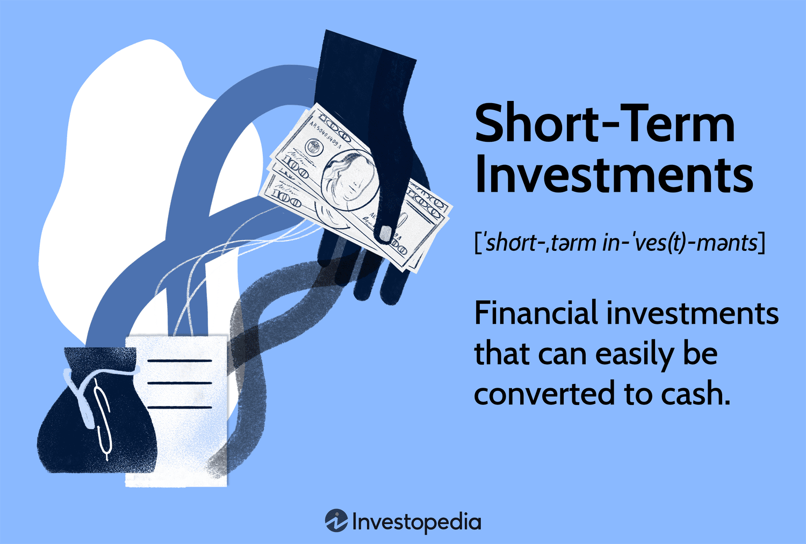

Financial fund investments present a rich tapestry of opportunities for both short-term and long-term growth, catering to a spectrum of investor needs and objectives. In the evolving landscape of modern finance, short-term investing has carved out a significant niche, primarily due to its emphasis on liquidity and reduced risk exposure. One of the critical developments redefining this space is the rise of algorithmic trading. By utilizing sophisticated algorithms, trades can be executed with enhanced speed and precision, leading to optimized returns and improved decision-making capabilities.

The focus of this article is to explore the intricate synergy between financial funds, short-term investment strategies, and algorithmic trading. Each of these components plays a crucial role in shaping investment outcomes and enhancing portfolio performance. Short-term investment funds (STIFs) offer investors a stable yet flexible vehicle to achieve modest returns while maintaining high liquidity. They are an attractive option for those who wish to park their funds temporarily, awaiting more favorable market conditions for higher-risk investments like equities.



Furthermore, algorithmic trading introduces a layer of automation and efficiency that was previously unattainable in traditional trading. By programming computers to execute trades based on predefined criteria, investors can mitigate emotional biases and capitalize on market inefficiencies. This approach incorporates strategies such as arbitrage, trend following, and mean reversion, each designed to respond swiftly to short-lived market movements.

Understanding the interplay of these elements requires not just knowledge but also adaptability to a rapidly shifting financial environment. As such, investors who can effectively integrate financial funds, short-term strategies, and algorithmic trading into their portfolios stand to benefit from enhanced returns. The insights gleaned from this exploration equip investors to navigate the complexities of contemporary finance, making more informed and strategic decisions.

## Table of Contents

## Understanding Financial Funds and Investment Strategies

Financial funds serve as collective investment schemes that aggregate capital from various investors to acquire a diversified portfolio of securities. This pooling approach not only provides individual investors with access to a broad array of assets but also facilitates professional fund management. These funds can be meticulously structured to adhere to specific investment strategies, whether they aim for short-term liquidity or long-term growth.

Short-term investment strategies are primarily concerned with maintaining high levels of liquidity while minimizing risk exposure. The emphasis on liquidity allows investors to quickly convert their assets into cash with minimal impact on their value, which is particularly useful for those looking to preserve capital or navigate market uncertainties. Such strategies often involve investments in highly liquid instruments like money market funds, short-term bonds, and Treasury bills. The goal is to achieve modest, incremental returns over a brief period, typically ranging from a few days to a couple of years, avoiding the [volatility](/wiki/volatility-trading-strategies) and risk associated with longer investment horizons.

For investors, comprehending the array of available investment funds and understanding their distinct strategies is essential for aligning their portfolios with personal financial objectives. Whether the focus is on short-term gains with [liquidity](/wiki/liquidity-risk-premium) or long-term growth with higher returns, selecting the right type of fund can significantly influence overall investment outcomes. Each fund type offers a varying risk-return profile, necessitating a thorough analysis of individual financial goals, risk tolerance, and market conditions. By grasping these aspects, investors can make informed decisions, optimizing their portfolios to suit their strategic aims and financial circumstances.

## The Role of Short-Term Investment Funds (STIFs)

Short-term investment funds (STIFs) serve as a strategic tool for investors seeking high liquidity and modest returns while minimizing risk. These funds primarily allocate their assets into short-term money market instruments, which are typically characterized by their low-risk and high-quality nature. Money market instruments include Treasury bills, commercial paper, certificates of deposit, and other similar financial products. These instruments are generally considered safe investments due to their short maturities and the creditworthiness of the issuers.

Investors often utilize STIFs as interim solutions for parking funds, particularly when they are transitioning from more volatile investments such as stocks. This approach allows investors to maintain liquidity and earn returns, even if modest, while deciding their next investment move. Comparable to a financial holding pattern, STIFs provide stability in times of market uncertainty.

The performance of STIFs is often benchmarked against Treasury bill indexes, which means their returns mirror the yields of these government securities. Consequently, investors benefit from a predictable and stable yield, although it may be modest compared to higher-risk investments. This predictability is valuable for those with short-term liquidity needs or conservative financial goals.

STIFs also offer added conveniences that enhance their appeal. Many of these funds provide features such as personal checks and online account access, simplifying transactions and fund management for investors. This user-friendly approach ensures ease of access and management, which is particularly attractive for investors who prioritize convenience alongside financial prudence.

Overall, STIFs fulfill a critical role in investment strategy by combining safety, liquidity, and modest returns, making them an excellent choice for short-term financial management and planning.

## Algorithmic Trading in Short-Term Investments

Algorithmic trading involves deploying computer programs to execute trades based on predefined rules. This method enhances efficiency and speed by making decisions without the influence of human emotion. In short-term investments, [algorithmic trading](/wiki/algorithmic-trading) allows investors to take advantage of trends and market inefficiencies that may exist for brief periods.

The primary strategies used in algorithmic trading include [arbitrage](/wiki/arbitrage), [trend following](/wiki/trend-following), and mean reversion. Arbitrage exploits price differences between markets or instruments by purchasing an asset at a lower price in one market and simultaneously selling it at a higher price in another. For example, if a stock is traded at $100 on the New York Stock Exchange (NYSE) and $101 on the London Stock Exchange (LSE), an algorithm can be programmed to buy on the NYSE and sell on the LSE, capturing the $1 difference, assuming transaction costs allow.

Trend following algorithms identify and capitalize on [momentum](/wiki/momentum) within an asset's price by entering trades when a significant price movement is detected. The assumption is that prices will continue to move in the detected direction for some time. This strategy may take the form of a moving average crossover, where a short-term moving average crosses above a long-term moving average, signaling a buy, and vice versa for a sell signal.

Mean reversion strategies are based on the idea that asset prices will return to their average over time. Algorithms detect deviations from an asset's typical price levels and execute trades assuming the price will revert to its mean. This can be mathematically expressed as:

$$
P_t - \overline{P} \approx 0
$$

where $P_t$ is the price at time $t$, and $\overline{P}$ is the average price over a certain period.

Understanding and executing these strategies effectively requires a robust system architecture and advanced programming skills. Investors often deploy [backtesting](/wiki/backtesting) methods to test the algorithms against historical data to evaluate potential effectiveness before live trading. This process can be implemented using Python with libraries such as [backtrader](/wiki/backtrader) or pyalgotrade, enabling users to simulate algorithmic trading and refine strategies. Here's a simple Python example showcasing a moving average crossover strategy:

```python
import backtrader as bt

class MovingAverageCrossStrategy(bt.SignalStrategy):
    def __init__(self):
        # Short moving average
        sma1 = bt.ind.SMA(period=10)
        # Long moving average
        sma2 = bt.ind.SMA(period=30)
        # Cross signal
        self.signal_add(bt.SIGNAL_LONG, bt.ind.CrossOver(sma1, sma2))

cerebro = bt.Cerebro()
cerebro.addstrategy(MovingAverageCrossStrategy)

# Data feed and execution
data = bt.feeds.YahooFinanceData(dataname='AAPL',
                                  fromdate=datetime(2020, 1, 1),
                                  todate=datetime(2021, 1, 1))
cerebro.adddata(data)
cerebro.run()
cerebro.plot()
```

The deployment of these strategies and their precise execution are crucial for maximizing returns through algorithmic trading in short-term investments. By effectively leveraging the speed and accuracy of algorithms, investors can optimize their approach to capturing fleeting market opportunities.

## Advantages and Disadvantages of Algorithmic Trading

Algorithmic trading, widely regarded as a significant innovation in modern finance, brings several advantages that enhance trading efficiency and precision. By automating the execution of trades, algorithmic systems can significantly reduce transaction costs. This reduction arises because algorithms can take advantage of the smallest price discrepancies and execute high-frequency trades, thereby lowering the bid-ask spread and associated costs. Furthermore, algorithms ensure precision in order execution, adhering stringently to the defined parameters and strategies devoid of manual intervention, which eliminates human errors and emotional biases. Algorithmic systems can process vast amounts of data, execute complex calculations, and respond to multiple market conditions simultaneously, thereby optimizing trading decisions.

Despite these advantages, algorithmic trading is not without its challenges. A primary concern is its dependence on technology. Any system failures, connectivity issues, or algorithm errors can lead to significant financial losses. Additionally, the speed and [volume](/wiki/volume-trading-strategy) of trades executed by algorithms can impact the market, potentially exacerbating volatile conditions, a phenomenon known as market impact. Regulatory compliance is another critical concern. Financial markets are subject to stringent regulations, and algorithmic trading strategies must comply with these rules to avoid legal complications.

Furthermore, the development and maintenance of sophisticated algorithmic trading systems require significant capital investment. The cost barrier includes acquiring advanced technology, securing reliable data feeds, and employing skilled personnel capable of developing and managing these systems. For many firms, especially smaller ones, these costs can be prohibitive.

Nevertheless, the potential for enhanced trading efficiency, improved accuracy, and greater capacity for simultaneous operations continues to make algorithmic trading attractive to many investors. As technology evolves, these systems are expected to become even more integral to the landscape of financial trading, promising both opportunities and challenges in equal measure.

## Implementing and Managing Algorithmic Strategies

Implementing and managing algorithmic trading strategies demands a synergy of technical expertise and robust infrastructure, crucial for navigating the fast-paced trading environment. This involves a foundational command of computer programming, often in languages such as Python or C++, which supports the development of sophisticated algorithms tailored to exploit specific market conditions. Comprehending intricate market dynamics is equally important, enabling the design of algorithms that effectively respond to diverse trading scenarios.

Before deployment, rigorous backtesting of trading strategies against historical data is indispensable. This process involves simulating trades using past market data to evaluate the potential performance and viability of the algorithm. By backtesting, investors can identify strengths and weaknesses, optimize parameters, and estimate metrics such as the Sharpe ratio or maximum drawdown.

Here's a simple backtesting example in Python:

```python
import pandas as pd
import numpy as np

def backtest(prices, strategy):
    balance = 10000  # Initial amount in dollars
    shares = 0

    for date, price in prices.iteritems():
        signal = strategy(price)
        if signal == 'buy' and balance >= price:
            shares += 1
            balance -= price
        elif signal == 'sell' and shares > 0:
            shares -= 1
            balance += price

    return balance + shares * prices[-1]

# Example strategy: buy if price is below x, sell if above y
def simple_strategy(price):
    if price < 100:
        return 'buy'
    elif price > 110:
        return 'sell'
    else:
        return 'hold'

# Sample price data
prices = pd.Series([105, 102, 98, 100, 115, 112, 110])
final_balance = backtest(prices, simple_strategy)
print(f"Final balance: ${final_balance}")
```

Access to real-time data feeds and reliable network connectivity is vital for the accurate execution of trades. Latency in data reception or transaction processing can result in missed opportunities and reduce the effectiveness of algorithms that depend on precise timing. Establishing a direct connection to exchanges and employing low-latency technologies can mitigate these risks.

Moreover, effective risk management is critical to the longevity and success of algorithmic trading systems. This involves setting clear stop-loss limits, applying position size rules, and utilizing diversification tactics. Continuous monitoring of algorithm performance is also necessary to swiftly detect and rectify any deviations from expected outcomes, ensuring alignment with strategic investment goals.

In essence, balancing technical skill with advanced infrastructure, rigorous testing, real-time data access, and strong risk management practices underpins the successful implementation and management of algorithmic trading strategies. These components are vital for reaping the benefits of automation while safeguarding investments.

## The Future of Financial Investments and Trading

With technological advancements reshaping the financial sector, algorithmic trading is set to experience significant growth and transformation. Central to this evolution is the increasing computational power and sophisticated data analytics which facilitate the development of more intricate trading strategies. High-frequency trading, for instance, relies on the ability to process and act on vast amounts of data in microseconds, a capability that has been enhanced by powerful computing resources.

The integration of [artificial intelligence](/wiki/ai-artificial-intelligence) (AI) and [machine learning](/wiki/machine-learning) into algorithmic trading represents another frontier for innovation. These technologies enable algorithms to improve their predictive capabilities by identifying patterns and insights that are not easily detectable by traditional means. Machine learning models can continuously learn from new data, refining trading strategies to adapt to ever-changing market conditions. For example, using Python, traders can employ libraries like scikit-learn for predictive modeling or TensorFlow for [deep learning](/wiki/deep-learning) applications. Here is a simple Python snippet demonstrating a regression model for predicting asset prices based on historical data:

```python
from sklearn.linear_model import LinearRegression
import numpy as np

# Example data: historical prices
X = np.array([[0], [1], [2], [3], [4], [5]])
y = np.array([0, 1, 2, 3, 4, 5])

# Create and train the model
model = LinearRegression()
model.fit(X, y)

# Predict future price
future_time = np.array([[6]])
predicted_price = model.predict(future_time)
print("Predicted future price:", predicted_price[0])
```

Financial institutions are continually exploring innovations to enhance investment return optimization while effectively managing risk. The drive towards automating complex decision-making processes is fueled by the increasing availability of real-time data and advanced analytics tools. This trend is likely to foster the creation of hybrid systems that combine discretionary and algorithmic strategies, allowing human expertise to complement automated processes in navigating complex market environments.

Understanding and adapting to these technological shifts will be crucial for investors seeking success in the contemporary financial landscape. Investors must stay abreast of developments in AI-driven trading systems and analytics technologies to engage effectively with modern financial markets. As the velocity and complexity of trading evolve, leveraging these advancements promises to offer significant competitive advantages, leading to better-informed investment decisions and optimized portfolio performance.

## Conclusion

Navigating the world of financial funds and investment strategies requires both knowledge and adaptability. Short-term investing and algorithmic trading are powerful tools that can significantly enhance portfolio performance. By understanding their nuances, investors can leverage these strategies to gain an edge in increasingly competitive markets.

Algorithmic trading, often powered by sophisticated algorithms and high-frequency trading platforms, offers the potential for precise execution and efficiency. Investors who can harness these technologies effectively are positioned to capitalize on short-term market fluctuations and inefficiencies. The combination of reduced transaction costs and the minimization of emotional biases provides a compelling case for the adoption of these strategies. However, it is crucial for investors to stay informed about the technological and regulatory developments that continue to shape these approaches.

Financial markets are constantly evolving, driven by advancements in technology and analytic capabilities. Staying informed and prepared is essential for investors aiming for success, as new innovations and market dynamics continuously emerge. By embracing an adaptive mindset and remaining vigilant, investors can respond proactively to changes and optimize their investment outcomes.

The synergy of financial funds, short-term strategies, and algorithmic trading presents a promising avenue for maximizing returns. As investors integrate these components into their strategies, they unlock opportunities for improved performance and risk management. A thorough understanding of these tools and their applications is vital in navigating the complexities of the modern financial landscape, ultimately positioning investors to achieve their financial goals effectively.

## References & Further Reading

[1]: Bergstra, J., Bardenet, R., Bengio, Y., & Kégl, B. (2011). ["Algorithms for Hyper-Parameter Optimization."](https://papers.nips.cc/paper/4443-algorithms-for-hyper-parameter-optimization) Advances in Neural Information Processing Systems 24.

[2]: ["Advances in Financial Machine Learning"](https://www.amazon.com/Advances-Financial-Machine-Learning-Marcos/dp/1119482089) by Marcos Lopez de Prado

[3]: ["Evidence-Based Technical Analysis: Applying the Scientific Method and Statistical Inference to Trading Signals"](https://www.amazon.com/Evidence-Based-Technical-Analysis-Scientific-Statistical/dp/0470008741) by David Aronson

[4]: ["Machine Learning for Algorithmic Trading"](https://github.com/stefan-jansen/machine-learning-for-trading) by Stefan Jansen

[5]: ["Quantitative Trading: How to Build Your Own Algorithmic Trading Business"](https://www.amazon.com/Quantitative-Trading-Build-Algorithmic-Business/dp/1119800064) by Ernest P. Chan