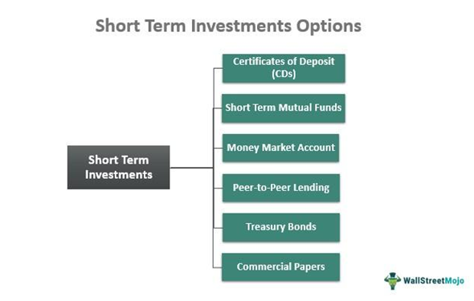

Financial planning is a crucial component in achieving both personal and corporate financial goals. It involves the strategic allocation of resources to maximize returns, minimize risks, and meet specific financial objectives. Short-term investments and algorithmic trading represent two vital strategies in financial planning. Short-term investments generally refer to investment vehicles that are typically held for one year or less. These investments are characterized by their liquidity and ability to quickly convert to cash, making them useful for addressing immediate or near-term financial needs.

Short-term investment vehicles include options such as money market accounts, treasury bills, and certificates of deposit (CDs). Each comes with its own set of benefits and challenges. These investment options provide opportunities to earn returns within a brief time frame, but they often come with lower risk and, hence, lower potential yields compared to long-term investments. Nevertheless, the appeal of quick liquidity makes short-term investments an attractive option for financial planners who prioritize capital preservation and immediate accessibility.



In contrast, algorithmic trading, commonly referred to as algo trading, leverages the power of technology and mathematical models to execute trades at optimal times and prices. Algo trading involves automated systems that follow pre-programmed rules to place orders at speeds and frequencies unattainable by human traders. This technology significantly enhances short-term investment strategies by improving trading efficiency and potentially boosting returns. The use of algorithms in trading can also help in minimizing human errors and emotional biases, often associated with manual trading.

The integration of these financial strategies becomes instrumental in meeting specific financial goals. Short-term investments can provide quick access to funds or generate steady returns, whereas algo trading can capitalize on market inefficiencies and volatility to offer enhanced returns. By effectively combining these strategies, investors and financial planners can work towards tailored financial outcomes, be it capital growth, liquidity preservation, or risk management.

This article seeks to provide insights into short-term investments and algorithmic trading, focusing on how they can be leveraged for effective financial planning. Key terms and concepts such as liquidity, algorithmic strategies, trading efficiency, and investment vehicles will be examined in detail, providing readers with a comprehensive understanding of how to employ these tools to meet their distinct financial objectives.

## Table of Contents

## Exploring Short-Term Investment Options

Short-term investments are financial instruments or strategies with an investment horizon typically of one year or less. These investments are characterized by their liquidity and relative stability, aiming to preserve capital while potentially earning modest returns. Investors often use short-term investments to manage cash flow needs or park funds temporarily before committing to longer-term strategies.

### Benefits and Challenges

The primary benefit of short-term investments lies in their [liquidity](/wiki/liquidity-risk-premium). They allow investors quick access to their funds, making these options suitable for emergency funds or immediate financial needs. Additionally, short-term investments typically [carry](/wiki/carry-trading) lower risk compared to long-term investments because they are less exposed to market [volatility](/wiki/volatility-trading-strategies). However, the main challenge associated with short-term investments is their lower yield, which may not keep pace with inflation in the long run. Therefore, while these investments provide capital preservation, their real return may be negative after adjusting for inflationary pressures.

### Common Short-Term Investment Vehicles

Several financial instruments are commonly used for short-term investing:

1. **Money Market Accounts (MMAs):** These are deposit accounts offered by banks and credit unions, providing a higher interest rate than regular savings accounts. MMAs invest in short-term, high-quality instruments like treasury securities and commercial paper. They offer liquidity and stability, although the interest rates might fluctuate based on market conditions.

2. **Treasury Bills (T-Bills):** Issued by the government, Treasury Bills are considered one of the safest investment options. They are sold at a discount and mature at their face value, with maturities ranging from a few days to 52 weeks. The interest earned is the difference between the purchase price and the maturity value, reflecting the security’s short-term risk profile and low return relative to other investments.

3. **Certificates of Deposit (CDs):** CDs are time deposits offered by banks with fixed terms ranging from a few months to several years. They provide a fixed interest rate, which is generally higher than savings accounts, but involve a penalty for early withdrawal. CDs are ideal for investors seeking predictable returns and willing to lock in their money for the term.

### Comparison with Long-Term Investment Strategies

Short-term and long-term investment strategies differ primarily in their time horizons and objectives. Long-term investments, such as stocks and bonds, are aimed at wealth growth over several years or decades, capitalizing on the power of compounding and potential higher returns. However, these investments typically come with higher volatility and risk.

In contrast, short-term strategies prioritize capital preservation and liquidity, often sacrificing higher returns for reduced risk. They might include a mix of money market accounts, government securities, and highly liquid financial instruments that can be quickly converted to cash with minimal loss. Investors often diversify their portfolio with a balance of both short-term and long-term strategies to align with different financial goals, risk tolerance, and time horizons.

## Deep Dive into Short-Term Investment Vehicles

Money Market Accounts (MMAs) are a type of deposit account offered by financial institutions, combining features of both savings and checking accounts. They typically offer higher interest rates compared to regular savings accounts due to requiring a higher minimum balance. The potential returns on MMAs vary depending on the prevailing interest rates and the account's terms set by the financial institution. These accounts also provide limited transaction privileges, making them suitable for investors seeking liquidity alongside modest returns.

Treasury Bills (T-Bills) are short-term government securities with maturities ranging from a few days to one year. They are considered a safe investment option due to their backing by the full faith and credit of the issuing government. T-Bills are sold at a discount to their face value, and investors earn the difference between the purchase price and the face value upon maturity. This financial instrument is particularly appealing to risk-averse investors seeking a secure short-term parking of funds while still [earning](/wiki/earning-announcement) interest income.

Certificates of Deposit (CDs) are time deposits offered by banks, providing a fixed [interest rate](/wiki/interest-rate-trading-strategies) over a specified term. The risk-return profile of CDs is generally favorable for short-term investors who prioritize capital preservation over high returns. Upon maturity, the principal and interest are paid to the investor. While early withdrawal could incur penalties, CDs are often considered safe due to their FDIC insurance up to prescribed limits in the United States.

Commercial Papers are unsecured, short-term debt instruments issued primarily by corporations to meet immediate funding needs. Maturing within 270 days, they are often issued at a discount and yield returns upon maturity. The evaluation of commercial papers involves assessing credit risk, as they are not typically backed by collateral but rely on the issuer’s creditworthiness. These instruments suit investors seeking higher returns than traditional bank products, albeit with increased risk.

Banker’s Acceptances are short-term debt instruments that either banks issue or guarantee, primarily used in international trade. They promise future payment and are negotiable, offering a reliable and liquid investment choice. The acceptance by a reputable bank reduces default risk, making them appealing to investors requiring low-risk, short-term investment options. However, the issuance of Banker’s Acceptances has declined with the advent of alternative financing methods in international trade.

These short-term investment vehicles offer varying risk-return profiles, liquidity, and maturities, catering to diverse investor needs and preferences.

## Algorithmic Trading in Financial Planning

Algorithmic trading, often referred to as algo trading, involves the use of complex algorithms to execute trades in financial markets with minimal human intervention. These algorithms are designed to buy or sell financial instruments based on predefined criteria, such as timing, price, or quantity, allowing traders to execute orders more efficiently than traditional human-based methods. Algo trading contributes significantly to the market by enhancing liquidity and narrowing price spreads. Its rise has transformed how investments, particularly short-term strategies, are executed.

### Enhancement of Investment Strategies

Algorithmic trading offers significant advantages for short-term investment strategies. Its primary benefit lies in its ability to process substantial amounts of data and execute trades at speeds unattainable by humans. This capability is crucial for short-term investments, where market conditions can change rapidly. By leveraging algorithms, traders can optimize entry and [exit](/wiki/exit-strategy) points, maximizing gains or minimizing losses based on real-time analysis. For example, strategies like statistical [arbitrage](/wiki/arbitrage) enable traders to identify and exploit price inefficiencies between correlated assets, thus securing profits in a short time frame.

### Technological Impact

The impact of technology on trading efficiency and returns cannot be overstated. Algorithms significantly reduce the latency in executing trades, thereby lowering the cost and risk associated with delays. With the advent of high-frequency trading ([HFT](/wiki/high-frequency-trading-strategies)), algorithms can now execute thousands of orders per second, capitalizing on fleeting opportunities that might last only milliseconds. Moreover, [machine learning](/wiki/machine-learning) techniques are increasingly being incorporated into algo trading, enabling systems to adapt and evolve based on historical data, thus refining their predictive capabilities.

### Technical and Strategic Implementation

Implementing [algorithmic trading](/wiki/algorithmic-trading) in personal finance requires a strategic understanding of both market dynamics and technology. The creation of a trading algorithm typically involves several steps: strategy formulation, coding, [backtesting](/wiki/backtesting), and continuous monitoring. Traders must first define a clear strategy based on historical data and market conditions. This strategy is then translated into a programmatic form, typically using languages such as Python, which offers numerous libraries for data analysis, such as Pandas and NumPy.

Backtesting allows traders to simulate the algorithm's performance using historical data to refine and validate the strategy before deploying it in live markets. The following is an example of a simple backtesting setup in Python using the Pandas library:

```python
import pandas as pd

# Sample price data
data = pd.read_csv('historical_prices.csv')

# Simple Moving Average Strategy
data['SMA_short'] = data['Close'].rolling(window=5).mean()
data['SMA_long'] = data['Close'].rolling(window=20).mean()

# Signal Generation
data['Signal'] = 0
data.loc[data['SMA_short'] > data['SMA_long'], 'Signal'] = 1
data.loc[data['SMA_short'] < data['SMA_long'], 'Signal'] = -1

# Returns Calculation
data['Returns'] = data['Close'].pct_change() * data['Signal'].shift(1)

# Strategy Performance Evaluation
cumulative_returns = (1 + data['Returns']).cumprod()
print(cumulative_returns.tail())  # Output the last few cumulative returns

# Plotting strategy performance
data[['Returns', 'SMA_short', 'SMA_long']].plot(title='Strategy Returns with SMAs')
```

Effective monitoring is crucial for the success of algo trading, enabling traders to make real-time adjustments in response to market conditions or strategy deviations. Moreover, successful implementation also involves risk management techniques, such as position sizing and diversification, to mitigate potential losses. 

Incorporating algorithmic strategies into personal finance can significantly optimize investment outcomes. However, it requires a sound technical grasp and strategic planning to harness its full potential, particularly in short-term investment horizons where quick decision-making and precise execution are paramount.

## Integrating Short-Term Investments with Algorithmic Trading

Short-term investment strategies, traditionally rooted in instruments like money market accounts and treasury bills, can significantly benefit from the incorporation of algorithmic trading. Algorithmic trading, characterized by its use of computer algorithms to execute trades at optimal speeds and efficiencies, can enhance portfolio performance through refined execution and risk management.

### Augmenting Short-Term Investment Strategies with Algorithmic Trading

Algorithmic trading optimizes investment strategies by enabling simultaneous analysis of multiple market variables and executing trades based on pre-defined conditions. Python, with its extensive libraries like NumPy and pandas, offers powerful tools for such applications. For instance, a simple moving average crossover strategy—a common algorithmic trading tactic—can be coded to automate trades when a short-term moving average crosses above a long-term moving average, indicating a bullish signal.

```python
import pandas as pd

def moving_average_strategy(prices, short_window, long_window):
    signals = pd.DataFrame(index=prices.index)
    signals['signal'] = 0.0
    signals['short_mavg'] = prices.rolling(window=short_window, min_periods=1).mean()
    signals['long_mavg'] = prices.rolling(window=long_window, min_periods=1).mean()
    signals['signal'][short_window:] = np.where(signals['short_mavg'][short_window:] > signals['long_mavg'][short_window:], 1.0, 0.0)
    signals['positions'] = signals['signal'].diff()
    return signals

# Example usage:
# prices = pd.Series([...])
# strategy = moving_average_strategy(prices, short_window=40, long_window=100)
```

### Successful Integration: Case Studies and Examples

Case studies have shown how hedge funds and institutional investors leverage algorithmic trading for significant gains. For example, Renaissance Technologies, renowned for its Medallion Fund, employs complex algorithms that systematically benefit from short-term market inefficiencies. Likewise, individual investors have successfully adopted simpler algorithms on platforms like QuantConnect, which allows backtesting of trading strategies on historical data to forecast efficacy.

### Risks and Rewards

Merging traditional investment approaches with algorithmic trading presents both opportunities and challenges. On the reward side, algorithms can process vast amounts of data rapidly, identifying profitable trades with a precision unattainable by human traders. Furthermore, algorithmic trading minimizes human errors and biases.

Risks, however, cannot be overlooked. High-frequency trading strategies, for example, might face latency issues or encounter systemic risks during market upheavals. Moreover, the reliance on historical data poses the risk of overfitting, where algorithms perform well with past data but poorly under new market conditions.

### Considerations for Investors

Investors contemplating the integration of algorithmic trading in their short-term investment portfolios should consider their technical expertise, risk appetite, and the transparency of their chosen trading models. Algorithmic trading demands a robust understanding of financial markets and coding skills to develop, test, and deploy efficient algorithms. Investors may also explore educational resources, such as Coursera or edX, offering courses on algorithmic trading.

Finally, regulatory compliance is essential. Markets like the U.S. offer guidelines through entities such as the Securities and Exchange Commission (SEC), which set clear standards for algorithmic traders to ensure market stability and integrity.

In conclusion, while algorithmic trading offers the potential to enhance short-term investment strategies, a careful evaluation of the risks, coupled with adequate technical preparation, equips investors to make informed decisions that align with their financial objectives.

## Conclusion and Final Thoughts

In this article, we have examined the nuances of short-term investments and the innovative impact of algorithmic trading in enhancing investment strategies. Short-term investments, characterized by their liquidity and lower risk profile, offer viable options for investors seeking immediate returns. Vehicles such as money market accounts, treasury bills, and certificates of deposit provide opportunities to grow capital with relatively low exposure to risk. These traditional vehicles require a clear understanding of their benefits and challenges as they form the core of short-term financial planning.

Algorithmic trading has emerged as a powerful tool in the financial markets, leveraging technology to execute trades based on pre-set criteria with precision and speed. Its ability to process large volumes of data and make real-time decisions can significantly enhance investment strategies, particularly for short-term objectives. By integrating algorithmic trading with short-term investments, investors are able to optimize their portfolios, maximizing returns while minimizing risks.

The importance of informed decision-making cannot be overstated in financial planning. Factors such as market volatility, interest rates, and technological advancements must be considered to ensure that investments align with an individual's financial goals. Investors should utilize both traditional and contemporary investment options to craft a diversified portfolio tailored to their specific needs.

Looking to the future, technology will continue to revolutionize investment strategies. As algorithmic trading systems become more sophisticated and accessible to a broader range of investors, the potential for enhanced performance increases. Innovations such as [artificial intelligence](/wiki/ai-artificial-intelligence) and machine learning will further refine algorithmic models, leading to even greater efficiency and accuracy in predicting market movements.

In conclusion, a balanced approach that combines both traditional short-term investment options with emerging technologies like algorithmic trading can provide investors with the flexibility and tools needed to achieve their financial targets. Encouraging investors to explore and adapt to both established and novel methods will foster a more resilient and responsive investment landscape, suited to the dynamic nature of global financial markets.

## References & Further Reading

[1]: Bergstra, J., Bardenet, R., Bengio, Y., & Kégl, B. (2011). ["Algorithms for Hyper-Parameter Optimization."](https://papers.nips.cc/paper/4443-algorithms-for-hyper-parameter-optimization) Advances in Neural Information Processing Systems 24.

[2]: ["Advances in Financial Machine Learning"](https://www.amazon.com/Advances-Financial-Machine-Learning-Marcos/dp/1119482089) by Marcos Lopez de Prado.

[3]: ["Evidence-Based Technical Analysis: Applying the Scientific Method and Statistical Inference to Trading Signals"](https://www.amazon.com/Evidence-Based-Technical-Analysis-Scientific-Statistical/dp/0470008741) by David Aronson.

[4]: ["Machine Learning for Algorithmic Trading"](https://github.com/PacktPublishing/Machine-Learning-for-Algorithmic-Trading-Second-Edition) by Stefan Jansen.

[5]: ["Quantitative Trading: How to Build Your Own Algorithmic Trading Business"](https://books.google.com/books/about/Quantitative_Trading.html?id=j70yEAAAQBAJ) by Ernest P. Chan.