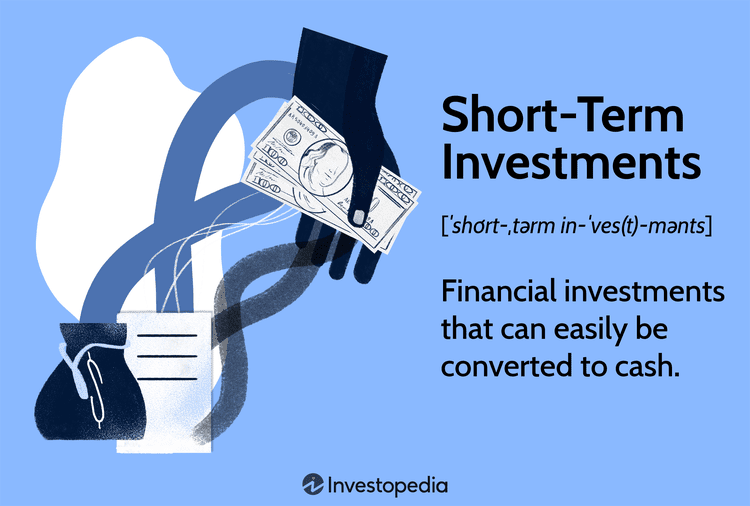

Investing plays a vital role in financial planning, providing both individuals and businesses with the means to grow wealth, preserve capital, and achieve specific financial goals. An understanding of different investment strategies is crucial to navigating today's dynamic financial landscape. Among these strategies, short-term investments stand out for their ability to offer unique opportunities and challenges. These investment vehicles are particularly attractive in rapidly evolving financial markets as they allow investors to capitalize on brief market movements and maintain liquidity. Short-term investments are generally aimed at generating returns within a period of a few months to five years, distinguishing them from long-term investments that typically focus on growth over extended periods.

In recent years, algorithmic trading, or algo trading, has gained prominence as an influential tool for executing complex investment strategies. By leveraging computer algorithms, investors can automate trading processes to enhance speed and precision, significantly impacting the execution of short-term investment strategies. Algo trading enables market participants to quickly identify and exploit market inefficiencies, thus optimizing returns while mitigating risks associated with human error and emotional decision-making.



This article aims to explore the nuances of short-term investments, investment strategies, and the integral role of algo trading in effective financial planning. By examining the intersection of these elements, investors can gain valuable insights into how to bolster their investment portfolios to achieve varied financial objectives.

## Table of Contents

## Understanding Short-Term Investments

Short-term investments, commonly referred to as marketable securities, are financial instruments that are intended to be liquidated within a short period, typically ranging from a few months to up to five years. These instruments are structured to maintain high liquidity and low risk, characteristics that make them a favorable choice for preserving capital while having quick access to funds.

Common examples of short-term investment vehicles include Certificates of Deposit (CDs), high-yield savings accounts, money market accounts, and Treasury bills. Each of these options serves specific financial needs and risk appetites:

1. **Certificates of Deposit (CDs)**: CDs are time-bound deposits offered by banks, providing a fixed return in exchange for a commitment of leaving the money untouched for a predetermined duration. They typically offer higher interest rates than regular savings accounts due to the locked-in nature of the deposit. 

2. **High-Yield Savings Accounts**: These accounts are similar to traditional savings accounts but offer higher interest rates, often due to being maintained by online banks with lower overhead costs. They provide accessibility and liquidity, making them suitable for funds that might be needed at short notice.

3. **Money Market Accounts**: Money market accounts blend features of savings and checking accounts, offering higher interest rates in return for maintaining a minimum balance. These accounts also offer check-writing capabilities and are insured by the Federal Deposit Insurance Corporation (FDIC) in the United States.

4. **Treasury Bills (T-Bills)**: Issued by the U.S. government, T-Bills are short-term government securities with maturities ranging from a few days to 52 weeks. Sold at a discount, they provide returns equivalent to the difference between purchase price and face value on maturity, offering a low-risk investment vehicle backed by the government's creditworthiness.

The appeal of short-term investments lies in their ability to offer stability and capital preservation, crucial for investors who might require [liquidity](/wiki/liquidity-risk-premium) for unforeseen expenses or those who anticipate needing to reallocate funds within a short timeframe. Because these investments [carry](/wiki/carry-trading) minimal risk compared to more volatile long-term securities, they typically yield lower returns, reflecting the risk-return trade-off intrinsic to investment decisions. The mathematical relationship between risk and return in these investments can be expressed generally as:

$$
E(r) = r_f + \beta (E(R_m) - r_f)
$$

where $E(r)$ is the expected return of the investment, $r_f$ represents the risk-free rate (often related to T-bills for short-term investments), $\beta$ is a measure of the investment's risk as compared to the market, and $E(R_m)$ denotes the expected market return. 

By aligning short-term investments with specific financial strategies, investors can achieve a stable and liquid portfolio segment that complements higher-risk, long-term investments for overall financial health and planning flexibility.

## Pros and Cons of Short-Term Investing

Short-term investing provides investors with the flexibility to convert investments to cash swiftly, ensuring capital is available when needed. These types of investments, which include instruments like certificates of deposit (CDs), high-yield savings accounts, money market accounts, and Treasury bills, are primarily chosen for their high liquidity and minimal risk exposure. This characteristic makes them particularly appealing for investors who prioritize capital preservation and require immediate access to their funds.

However, the primary drawback of short-term investing is the typically lower returns compared to long-term investment strategies. Long-term investments like stocks or real estate generally offer higher potential for growth due to the effects of compound interest and economic cycles over extended periods. For instance, the annualized return of the S&P 500 over several decades has significantly exceeded that of short-term securities, which tend to generate returns close to prevailing interest rates. This lower yield can have implications on overall investment growth, particularly when inflation is taken into account.

Assessing the balance between risk and reward is of paramount importance for investors. Short-term investments are usually less volatile, offering stability, but this comes at the cost of potentially reduced profitability. Therefore, investors must decide how much risk they are willing to tolerate and what their immediate liquidity needs are. A well-structured investment strategy may involve a blend of both short-term and long-term investments, optimizing for the individual’s risk tolerance and financial goals.

Moreover, prudent investors utilize tools and strategies to mitigate risks while maximizing potential returns. Techniques could include employing stop-loss orders to protect against market downturns or diversifying the portfolio to cushion against specific asset class [volatility](/wiki/volatility-trading-strategies). Ultimately, the chosen approach should align with both the investor’s temperament and their broader financial strategy.

## Investment Strategies: Diversification and Risk Management

Effective investment strategies play a crucial role in balancing returns and managing risk within a portfolio. A diversified portfolio spreads investments across various asset classes, industries, and geographies to minimize risk. Diversification has long been considered a cornerstone of prudent investment management. It aims to reduce the impact of volatility by ensuring that a downturn in one area of the market doesn't significantly affect the overall performance of the portfolio.

### Combining Short and Long-Term Investments

An effective diversification strategy incorporates a mix of both short and long-term investments. Short-term investments, such as certificates of deposit (CDs), Treasury bills, and money market accounts, offer liquidity and security, making them ideal for capital preservation and ready access to funds. Long-term investments, on the other hand, are typically associated with higher growth potential, albeit with increased risk. Stocks, real estate, and retirement accounts like 401(k)s usually fall into this category.

By integrating short-term investments with long-term ones, investors can benefit from both stability and growth. This combination allows for liquidity to meet immediate financial needs while also capitalizing on the potential for higher returns over a more extended period.

### Risk Management Tools

Risk management is essential to implementing effective investment strategies, and several tools can be employed to this end. Stop-loss orders, for example, are used to limit potential losses by automatically selling a security when it drops to a certain price. This mechanism acts as a safeguard, helping investors protect their capital from significant losses.

Asset allocation is another critical aspect of risk management. It refers to the process of deciding how to distribute an investment portfolio across different asset classes—such as equities, fixed income, and cash equivalents—based on an investor's risk tolerance, goals, and investment horizon. The goal of asset allocation is to optimize the risk-return trade-off according to an individual’s specific financial situation. 

Mathematically, one might model this using the standard deviation ($\sigma$) as a measure of risk:

$$
\sigma_p = \sqrt{\sum_{i=1}^{n} (w_i^2 \cdot \sigma_i^2) + \sum_{i=1}^{n}\sum_{j \neq i}(w_i \cdot w_j \cdot \sigma_{ij})}
$$

Where:
- $\sigma_p$ is the portfolio's standard deviation
- $w_i$ and $w_j$ are the weights of the assets in the portfolio
- $\sigma_i$ and $\sigma_{ij}$ are the standard deviation of individual assets and the covariance between different assets, respectively

Using such models and principles allows investors to strike a delicate balance between risk and potential return, thereby enhancing the portfolio's robustness against market unpredictability.

These strategies and tools form the foundation of a disciplined investment approach, ensuring that portfolios are structured to withstand varying market conditions while aiming to achieve long-term financial objectives.

## Algo Trading in Financial Planning

Algorithmic trading, commonly known as algo trading, involves the use of computer programs and algorithms to execute buy and sell orders automatically in financial markets. This form of trading is based on a set of predefined criteria, enabling rapid decision-making and execution, which can be particularly advantageous in short-term investment strategies.

The primary advantage of algo trading lies in its ability to identify and exploit market inefficiencies with speed and precision unmatched by human traders. These inefficiencies, often transient and subtle, can be capitalized on within fractions of a second. For example, algorithms can take advantage of [arbitrage](/wiki/arbitrage) opportunities, where the same asset has a different price on separate exchanges, buying low on one and selling high on another almost instantaneously.

Institutional investors, such as hedge funds and investment banks, have historically been the predominant users of [algorithmic trading](/wiki/algorithmic-trading) due to the significant technological infrastructure required. These institutions utilize algo trading to manage large volumes of assets, execute complex strategies, and reduce transaction costs. For instance, a common algorithmic strategy among institutional investors is [statistical arbitrage](/wiki/statistical-arbitrage), which involves using statistical methods to identify price predictability patterns across related financial instruments.

However, technological advancements and the proliferation of online trading platforms have made algo trading increasingly accessible to retail investors. Retail traders can now implement algorithmic strategies to enhance their own short-term investment efforts. Popular strategies among retail investors include [trend following](/wiki/trend-following), where algorithms identify and act on securities' price trends, and mean reversion, which bets on prices returning to their average levels over time.

The effectiveness of algo trading in short-term investments stems from its capacity to execute trades at optimal prices, manage multiple positions simultaneously, and remove emotional bias from trading decisions. By setting algorithms to follow specific indicators, such as moving averages or [momentum](/wiki/momentum) oscillators, investors can systematically approach market opportunities.

Here is a basic Python example illustrating a simple moving average crossover strategy in algo trading:

```python
import numpy as np

# Prices of a hypothetical stock
prices = np.array([101, 102, 103, 102, 100, 98, 99, 100, 101, 102])

# Define the moving average windows
short_window = 3
long_window = 5

# Calculate moving averages
short_mavg = np.convolve(prices, np.ones(short_window)/short_window, mode='valid')
long_mavg = np.convolve(prices, np.ones(long_window)/long_window, mode='valid')

# Generate signals: Buy when short_mavg crosses above long_mavg
signals = (short_mavg[long_window-short_window:] > long_mavg).astype(int)

print("Short Moving Averages:", short_mavg)
print("Long Moving Averages:", long_mavg)
print("Signals:", signals)
```

This code evaluates a moving average crossover strategy, a simple yet popular approach in algorithmic trading that identifies potential buy signals when a short-term moving average crosses above a long-term moving average. More sophisticated setups would involve data from actual trading platforms and more complex algorithms.

Overall, algo trading integrates into financial planning by offering a methodical, efficient, and scalable approach to executing short-term investment strategies. Its growing popularity among both institutional and retail investors underscores its pivotal role in modern trading and financial strategy execution.

## Key Considerations for Implementing Algo Trading

Algorithmic trading, or algo trading, offers numerous advantages for executing short-term investment strategies, but its successful implementation depends on several key considerations. Firstly, investors must ensure they have access to the necessary technological infrastructure. This includes high-speed internet connections, robust hardware, and access to trading data feeds. The ability to process large volumes of data swiftly and execute trades in milliseconds is crucial to gain competitive advantages in fast-paced markets.

Understanding and monitoring algorithm performance is also essential to prevent unintended losses. Algorithms should be meticulously backtested using historical data to verify their efficacy and predictive capability. Continuous monitoring allows traders to identify deviations from expected performance, which might indicate changes in market conditions or flaws in the trading model. Investors can employ performance metrics such as Sharpe ratio, maximum drawdown, and alpha to evaluate and fine-tune their strategies.

Market conditions play a significant role in the success of algo trading. Volatility, liquidity, and market depth can all impact the effectiveness of algorithmic strategies. For instance, high volatility might increase the potential for profit, but it also raises risk levels, so adjusting parameters like stop-loss limits and position sizes according to current market conditions is essential.

Compliance with regulatory standards is another critical consideration. Financial markets are governed by complex regulations designed to ensure fair trading practices and protect market integrity. Investors and firms engaged in algo trading must comply with these regulations, which often involve reporting requirements, restrictions on certain trading practices, and maintaining accurate records of all trading activities.

Data security measures are equally important in managing algo trading operations. With significant financial stakes involved, protecting proprietary algorithms and sensitive trading data from cyber threats is paramount. This involves implementing comprehensive cybersecurity protocols, such as encryption, secure access controls, and regular security audits.

In summary, successfully implementing algorithmic trading requires a combination of technological readiness, rigorous strategy evaluation, adaptability to market conditions, regulatory compliance, and robust data security measures. These elements ensure that algo trading operations are not only efficient but also aligned with investment goals and regulatory standards, mitigating potential risks in complex financial landscapes.

## Conclusion: Integrating Short-Term Investments with Algo Trading in Financial Planning

The integration of short-term investments and algorithmic trading (algo trading) presents a compelling framework for achieving diverse financial planning goals. Short-term investments, known for their liquidity and low risk, can provide the stability and capital preservation needed in a diversified portfolio. Meanwhile, algo trading introduces an element of precision and efficiency, which can enhance the execution of investment strategies across various market conditions.

Short-term investments, such as certificates of deposit (CDs), Treasury bills, and money market accounts, offer the advantage of quickly converting assets to cash, which is crucial for seizing time-sensitive opportunities. However, their potential for lower returns compared to long-term investments necessitates complementary strategies to optimize overall portfolio performance.

Algorithmic trading, by utilizing sophisticated computer programs to execute trades based on specified criteria, can efficiently capitalize on short-term market inefficiencies. This capability not only broadens the scope of investment opportunities but also allows for the implementation of complex strategies that can bolster short-term investment efforts. For example, algo trading can be programmed to execute trades at specific price points or according to trends in [volume](/wiki/volume-trading-strategy) or volatility, thereby maximizing returns while minimizing risk exposure.

The successful integration of these two approaches requires ongoing evaluation and adaptation. Financial markets are inherently dynamic, with variables such as interest rates, economic indicators, and geopolitical events affecting market behavior. Investors must be prepared to adjust their strategies as circumstances evolve, ensuring that their investment portfolio remains aligned with their financial objectives.

Moreover, maintaining a diversified investment strategy is paramount. By combining short-term investments with algo trading and other investment types, investors can achieve a balanced approach that mitigates risks while exploiting various market opportunities. This diversification can be managed through tools like asset allocation, which involves distributing investments across different asset classes to optimize returns relative to an acceptable level of risk.

In conclusion, the synergy between short-term investments and algo trading can provide a robust foundation for a diversified investment strategy. The unique advantages of each approach, when leveraged together, offer a comprehensive pathway for addressing a wide array of financial goals. Continual assessment and strategic adjustments are crucial to effectively navigating the complexities of today's financial markets and achieving long-term success.

## References & Further Reading

[1]: Bergstra, J., Bardenet, R., Bengio, Y., & Kégl, B. (2011). ["Algorithms for Hyper-Parameter Optimization."](https://dl.acm.org/doi/10.5555/2986459.2986743) Advances in Neural Information Processing Systems 24.

[2]: ["Advances in Financial Machine Learning"](https://github.com/FIONA-Youkyung/Financial_Engineering/blob/master/Advances_in_Financial_Machine_Learning_Marcos_Lopez_de_Prado.pdf) by Marcos Lopez de Prado

[3]: ["Evidence-Based Technical Analysis: Applying the Scientific Method and Statistical Inference to Trading Signals"](https://www.amazon.com/Evidence-Based-Technical-Analysis-Scientific-Statistical/dp/0470008741) by David Aronson

[4]: ["Machine Learning for Algorithmic Trading"](https://github.com/stefan-jansen/machine-learning-for-trading) by Stefan Jansen

[5]: ["Quantitative Trading: How to Build Your Own Algorithmic Trading Business"](https://www.amazon.com/Quantitative-Trading-Build-Algorithmic-Business/dp/1119800064) by Ernest P. Chan