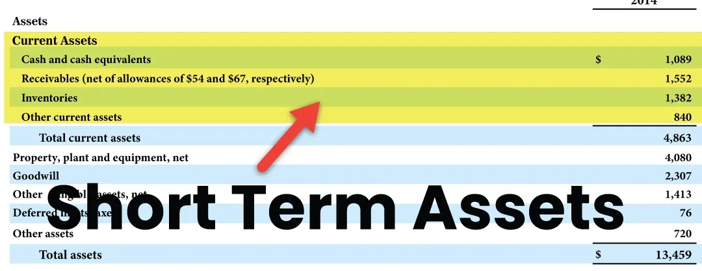

## Table of Contents

## What are short-term investments?

Short-term investments are financial assets that you plan to hold for a short period, usually less than one year. These investments are often used to park money temporarily while you decide on a longer-term investment strategy or to take advantage of quick opportunities in the market. Common examples include savings accounts, money market funds, and short-term government bonds. They are generally considered safer than long-term investments because they are less exposed to market fluctuations.

These investments are attractive to many people because they offer a way to earn a small return on money that might otherwise sit idle. For instance, putting money in a high-yield savings account can earn you more interest than a regular savings account. However, the returns from short-term investments are typically lower than those from long-term investments. This trade-off is often worth it for people who need quick access to their money or want to minimize risk.

## Why might someone choose short-term investments over long-term investments?

Someone might choose short-term investments over long-term investments because they need their money to be available quickly. Short-term investments, like savings accounts or money market funds, let you get your money back fast if you need it for something unexpected. This makes them a good choice if you're saving up for something specific in the near future, like a car or a vacation, and you don't want to risk losing your money in the stock market.

Another reason is that short-term investments are usually safer. They don't go up and down as much as long-term investments like stocks. This means you're less likely to lose money. If you're someone who doesn't like taking big risks with your money, short-term investments can be a good way to earn a little bit of interest without worrying too much about losing what you've saved.

## What are the common types of short-term investments?

One common type of short-term investment is a savings account. This is a safe place to keep your money at a bank, where it can earn a little bit of interest over time. Savings accounts are great for people who want to keep their money safe and be able to get it out quickly if they need to. Another popular short-term investment is a money market account. These accounts usually offer a bit higher interest rates than regular savings accounts and still let you take your money out when you need it.

Certificates of deposit, or CDs, are another type of short-term investment. When you put money into a CD, you agree to leave it there for a certain amount of time, like six months or a year. In return, the bank gives you a higher [interest rate](/wiki/interest-rate-trading-strategies) than a regular savings account. If you take your money out early, though, you might have to pay a penalty. Lastly, short-term government bonds, like Treasury bills, are also common. These are loans you give to the government, and they pay you back with interest after a short time, usually less than a year. They are very safe because they are backed by the government.

## How do short-term investments differ from savings accounts?

Short-term investments and savings accounts both let you keep your money safe and earn a little interest. But they are a bit different. Savings accounts are a type of short-term investment that you can find at a bank. You can put money in and take it out whenever you want. They are very safe and easy to use, but the interest you earn might be small. Savings accounts are good for people who want to keep their money handy for things like emergencies or short-term goals.

Other short-term investments, like money market accounts, certificates of deposit (CDs), and Treasury bills, work a bit differently. Money market accounts might give you a bit more interest than a regular savings account, but they still let you take your money out easily. CDs give you more interest, but you have to leave your money in for a set time, like six months or a year. If you take it out early, you might have to pay a fee. Treasury bills are loans to the government that you get back with interest after a short time, usually less than a year. These options can be a bit riskier than a savings account but can also give you a bit more interest.

## What are the risks associated with short-term investments?

Short-term investments are usually safer than long-term ones, but they still have some risks. One risk is that the interest rates can change. If you put your money in a savings account or a money market account, the bank might change the interest rate, and you might earn less money than you expected. Another risk is that you might need your money back sooner than you thought. If you put your money in a certificate of deposit (CD) and then need it before the CD is done, you might have to pay a fee to take it out early.

Another thing to watch out for is inflation. Inflation means that the prices of things go up over time. If the interest you earn from your short-term investment is less than the rate of inflation, your money won't be worth as much when you take it out. For example, if inflation is 3% and your savings account only gives you 1% interest, you're actually losing buying power. Even though short-term investments are safer, it's still important to think about these risks before you decide where to put your money.

## How can one assess the liquidity of a short-term investment?

To assess the liquidity of a short-term investment, you need to find out how quickly you can turn it into cash without losing much money. For example, a savings account is very liquid because you can take your money out anytime you want without any fees. On the other hand, a certificate of deposit (CD) might be less liquid because if you take your money out before the CD matures, you might have to pay a penalty.

Another way to think about liquidity is to consider how long it takes to get your money back. Money market funds and Treasury bills are pretty liquid because you can usually get your money back within a short time, often less than a year. But even with these, you might need to wait a few days to get your cash. So, when you're looking at short-term investments, think about how soon you need your money and whether you're okay with waiting a bit or paying a small fee to get it back faster.

## What are some examples of short-term investment vehicles?

Savings accounts are one example of a short-term investment vehicle. You can put your money in a savings account at a bank, and it will earn a little bit of interest over time. Savings accounts are very safe and let you take your money out whenever you need it. They are good for people who want to keep their money safe and be able to use it quickly if they need to.

Another example is money market accounts. These are similar to savings accounts but usually offer a bit more interest. Like savings accounts, you can take your money out of a money market account whenever you want. They are a bit riskier than regular savings accounts but still pretty safe. Money market accounts are good for people who want a bit more interest but still need to be able to get their money quickly.

Certificates of deposit (CDs) and Treasury bills are also short-term investment vehicles. When you put money into a CD, you agree to leave it there for a set time, like six months or a year, and the bank gives you more interest than a regular savings account. But if you take your money out early, you might have to pay a fee. Treasury bills are loans you give to the government, and they pay you back with interest after a short time, usually less than a year. They are very safe because they are backed by the government.

## How do interest rates affect short-term investments?

Interest rates have a big impact on short-term investments. When interest rates go up, the money you can earn from short-term investments like savings accounts, money market accounts, and certificates of deposit (CDs) also goes up. This is good news because it means you can make more money from your investments without taking on more risk. For example, if the interest rate on your savings account goes from 1% to 2%, you'll earn twice as much interest on the money you have in the account.

On the other hand, when interest rates go down, the money you can earn from these investments goes down too. This can be frustrating because it means your money isn't growing as fast. For instance, if the interest rate on your CD drops from 2% to 1%, you'll earn less interest over the time you have your money in the CD. So, keeping an eye on interest rates can help you decide when to put your money into short-term investments and when to look for other options.

## What strategies can be used to maximize returns on short-term investments?

One way to get more money from short-term investments is to shop around for the best interest rates. Different banks and financial institutions offer different rates on savings accounts, money market accounts, and certificates of deposit (CDs). By comparing these rates, you can find the one that gives you the most interest. Another strategy is to use a laddering approach with CDs. This means you buy CDs that mature at different times. When one CD matures, you can reinvest the money at the current interest rate, which might be higher than when you first bought the CD. This way, you can take advantage of rising interest rates and keep your money growing.

Another strategy is to keep some of your money in more liquid options like money market accounts or high-yield savings accounts. These accounts let you take your money out quickly if you need it, but they still give you a bit more interest than regular savings accounts. If you have money that you won't need for a while, you can put it into a CD or a Treasury bill to earn a bit more interest. By balancing your money between these different types of short-term investments, you can make sure you're [earning](/wiki/earning-announcement) as much interest as possible while still being able to get your money when you need it.

## How should one evaluate the performance of short-term investments?

To evaluate the performance of short-term investments, you need to look at how much interest you're earning compared to other options. For example, if you have money in a savings account, you should check the interest rate and see if it's higher or lower than what other banks are offering. You can also compare the interest you're earning to the rate of inflation. If the interest rate is lower than inflation, your money isn't growing as fast as prices are going up, which means you're losing buying power.

Another way to evaluate short-term investments is to think about how easy it is to get your money back when you need it. This is called liquidity. If you can take your money out of an investment quickly without losing much, it's a good sign. For example, money market accounts and savings accounts are very liquid, while certificates of deposit (CDs) might make you pay a fee if you take your money out early. By looking at both the interest you're earning and the liquidity of your investments, you can decide if they're working well for you or if you should try something different.

## What are the tax implications of short-term investments?

When you earn money from short-term investments, you have to pay taxes on that money. The interest you earn from things like savings accounts, money market accounts, and certificates of deposit (CDs) is usually taxed as regular income. This means it's added to your other income, like your salary, and you pay taxes on the total amount. The tax rate you pay depends on how much money you make in a year. If you make more money, you might have to pay a higher tax rate on the interest from your investments.

Some short-term investments, like Treasury bills, have a bit of a different tax situation. The interest from Treasury bills is also taxed as regular income, but it's not taxed by state or local governments. This can be a good thing if you live in a place with high state taxes. It's important to think about these tax rules when you're deciding where to put your money. By understanding how taxes work with short-term investments, you can make better choices and keep more of the money you earn.

## How can advanced investors use short-term investments as part of a larger financial strategy?

Advanced investors can use short-term investments as a way to keep their money safe and ready to use while they wait for the right time to make bigger investments. For example, if an investor is waiting for a good opportunity in the stock market, they might put their money in a money market account or a short-term government bond. These investments let them earn a little bit of interest while they wait, and they can get their money back quickly when they see a chance to buy stocks at a good price. This way, short-term investments act like a safe place to park money temporarily.

Another way advanced investors use short-term investments is to manage risk in their overall investment strategy. They might keep some of their money in short-term investments to balance out the riskier parts of their portfolio, like stocks or real estate. By having money in safer, short-term options, they can protect themselves from big losses if the market goes down. This approach helps them keep their financial plan stable and gives them the flexibility to move money around as needed.

## What is the understanding of short-term investments?

Short-term investments, commonly referred to as marketable securities, are financial instruments that are intended to be liquidated within a short period, typically ranging from a few months to up to five years. These instruments are structured to maintain high liquidity and low risk, characteristics that make them a favorable choice for preserving capital while having quick access to funds.

Common examples of short-term investment vehicles include Certificates of Deposit (CDs), high-yield savings accounts, money market accounts, and Treasury bills. Each of these options serves specific financial needs and risk appetites:

1. **Certificates of Deposit (CDs)**: CDs are time-bound deposits offered by banks, providing a fixed return in exchange for a commitment of leaving the money untouched for a predetermined duration. They typically offer higher interest rates than regular savings accounts due to the locked-in nature of the deposit. 

2. **High-Yield Savings Accounts**: These accounts are similar to traditional savings accounts but offer higher interest rates, often due to being maintained by online banks with lower overhead costs. They provide accessibility and liquidity, making them suitable for funds that might be needed at short notice.

3. **Money Market Accounts**: Money market accounts blend features of savings and checking accounts, offering higher interest rates in return for maintaining a minimum balance. These accounts also offer check-writing capabilities and are insured by the Federal Deposit Insurance Corporation (FDIC) in the United States.

4. **Treasury Bills (T-Bills)**: Issued by the U.S. government, T-Bills are short-term government securities with maturities ranging from a few days to 52 weeks. Sold at a discount, they provide returns equivalent to the difference between purchase price and face value on maturity, offering a low-risk investment vehicle backed by the government's creditworthiness.

The appeal of short-term investments lies in their ability to offer stability and capital preservation, crucial for investors who might require [liquidity](/wiki/liquidity-risk-premium) for unforeseen expenses or those who anticipate needing to reallocate funds within a short timeframe. Because these investments [carry](/wiki/carry-trading) minimal risk compared to more volatile long-term securities, they typically yield lower returns, reflecting the risk-return trade-off intrinsic to investment decisions. The mathematical relationship between risk and return in these investments can be expressed generally as:

$$
E(r) = r_f + \beta (E(R_m) - r_f)
$$

where $E(r)$ is the expected return of the investment, $r_f$ represents the risk-free rate (often related to T-bills for short-term investments), $\beta$ is a measure of the investment's risk as compared to the market, and $E(R_m)$ denotes the expected market return. 

By aligning short-term investments with specific financial strategies, investors can achieve a stable and liquid portfolio segment that complements higher-risk, long-term investments for overall financial health and planning flexibility.

## What are Investment Strategies: Diversification and Risk Management?

Effective investment strategies play a crucial role in balancing returns and managing risk within a portfolio. A diversified portfolio spreads investments across various asset classes, industries, and geographies to minimize risk. Diversification has long been considered a cornerstone of prudent investment management. It aims to reduce the impact of [volatility](/wiki/volatility-trading-strategies) by ensuring that a downturn in one area of the market doesn't significantly affect the overall performance of the portfolio.

### Combining Short and Long-Term Investments

An effective diversification strategy incorporates a mix of both short and long-term investments. Short-term investments, such as certificates of deposit (CDs), Treasury bills, and money market accounts, offer liquidity and security, making them ideal for capital preservation and ready access to funds. Long-term investments, on the other hand, are typically associated with higher growth potential, albeit with increased risk. Stocks, real estate, and retirement accounts like 401(k)s usually fall into this category.

By integrating short-term investments with long-term ones, investors can benefit from both stability and growth. This combination allows for liquidity to meet immediate financial needs while also capitalizing on the potential for higher returns over a more extended period.

### Risk Management Tools

Risk management is essential to implementing effective investment strategies, and several tools can be employed to this end. Stop-loss orders, for example, are used to limit potential losses by automatically selling a security when it drops to a certain price. This mechanism acts as a safeguard, helping investors protect their capital from significant losses.

Asset allocation is another critical aspect of risk management. It refers to the process of deciding how to distribute an investment portfolio across different asset classes—such as equities, fixed income, and cash equivalents—based on an investor's risk tolerance, goals, and investment horizon. The goal of asset allocation is to optimize the risk-return trade-off according to an individual’s specific financial situation. 

Mathematically, one might model this using the standard deviation ($\sigma$) as a measure of risk:

$$
\sigma_p = \sqrt{\sum_{i=1}^{n} (w_i^2 \cdot \sigma_i^2) + \sum_{i=1}^{n}\sum_{j \neq i}(w_i \cdot w_j \cdot \sigma_{ij})}
$$

Where:
- $\sigma_p$ is the portfolio's standard deviation
- $w_i$ and $w_j$ are the weights of the assets in the portfolio
- $\sigma_i$ and $\sigma_{ij}$ are the standard deviation of individual assets and the covariance between different assets, respectively

Using such models and principles allows investors to strike a delicate balance between risk and potential return, thereby enhancing the portfolio's robustness against market unpredictability.

These strategies and tools form the foundation of a disciplined investment approach, ensuring that portfolios are structured to withstand varying market conditions while aiming to achieve long-term financial objectives.

## References & Further Reading

[1]: Bergstra, J., Bardenet, R., Bengio, Y., & Kégl, B. (2011). ["Algorithms for Hyper-Parameter Optimization."](https://dl.acm.org/doi/10.5555/2986459.2986743) Advances in Neural Information Processing Systems 24.

[2]: ["Advances in Financial Machine Learning"](https://github.com/FIONA-Youkyung/Financial_Engineering/blob/master/Advances_in_Financial_Machine_Learning_Marcos_Lopez_de_Prado.pdf) by Marcos Lopez de Prado

[3]: ["Evidence-Based Technical Analysis: Applying the Scientific Method and Statistical Inference to Trading Signals"](https://www.amazon.com/Evidence-Based-Technical-Analysis-Scientific-Statistical/dp/0470008741) by David Aronson

[4]: ["Machine Learning for Algorithmic Trading"](https://github.com/stefan-jansen/machine-learning-for-trading) by Stefan Jansen

[5]: ["Quantitative Trading: How to Build Your Own Algorithmic Trading Business"](https://www.amazon.com/Quantitative-Trading-Build-Algorithmic-Business/dp/1119800064) by Ernest P. Chan